# 概述

Material Design是Android5.0提出的一个Android及其他平台上的应用的新的设计风格。

Material Design给我们带来了一些新的控件，比如：Floating Action Button。使用它们并且能够向后兼容是一个比较麻烦的过程。为了简化流程，通常需要第三方的jar包。

在2015年的Google IO大会上，谷歌推出了Android Design Support Library，它带来了一系列的Material Design风格的控件。它向后兼容到Google2.1,并且非常容易使用。这篇文件将通过一个应用给大家介绍这些控件。

# 开始

你可以下载最终的项目代码：[Github](https://github.com/sitepoint-editors/Design-Demo)

在开始之前我们先设置项目及一些样式。使用Android Studio创建一个`Design Demo`的项目，并且保证最低的编译版本为15.

在app模块下的build.gradle的文件中添加以下依赖：

```groovy
compile 'com.android.support:design:22.2.1'
compile 'com.android.support:cardview-v7:22.2.1'
```

第一行我们添加了`design support librar`，第二行我们添加了一个 `cardview`包，这个包后面会用到。同步gradle文件，然后下载相关的包。

在`res/values`下创建一个`colors.xml`文件，并添加以下内容：

```xml
<?xml version="1.0" encoding="utf-8"?>
<resources>
    <color name="primary">#3F51B5</color>
    <color name="primary_dark">#303F9F</color>
    <color name="accent">#FF4081</color>
</resources>
```

修改`strings.xml`文件为以下内容，这是我们最终的`srings.xml`:

```xml
<resources>
    <string name="app_name">Design Demo</string>
    <string name="hello_world">Hello world!</string>
    <string name="action_settings">Settings</string>
    <string name="nav_item_attachment">Attachment</string>
    <string name="nav_item_images">Images</string>
    <string name="nav_item_location">My Location</string>
    <string name="nav_sub_menu">Sub Menu</string>
    <string name="nav_sub_menu_item01">Sub Menu Item 1</string>
    <string name="nav_sub_menu_item02">Sub Menu Item 2</string>
    <string name="drawer_header_text">Drawer Header</string>
    <string name="second_activity_text">Lorem ipsum dolor sit amet, consectetur adipiscing elit. Proin consectetur diam id aliquam scelerisque. Donec ultrices lacus vel dignissim pharetra. Vivamus pharetra augue quis rhoncus placerat. Sed ultricies at risus non cursus. Nam rutrum leo nec placerat consectetur. Vestibulum feugiat eleifend diam, nec interdum augue tincidunt sit amet. Praesent feugiat est auctor lacus consectetur, vitae pellentesque dolor laoreet.</string>
    <string name="title_activity_second">SecondActivity</string>
</resources>
```

修改`res/values/styles.xml`为以下内容：

```xml
<resources>
    <!-- Base application theme. -->
    <style name="AppTheme" parent="Theme.AppCompat.Light.NoActionBar">
        <!-- Customize your theme here. -->
        <item name="colorPrimary">@color/primary</item>
        <item name="colorPrimaryDark">@color/primary_dark</item>
        <item name="colorAccent">@color/accent</item>
    </style>
</resources>
```

上面的代码，我们自定义了应用的 [Color Palette](https://developer.android.com/training/material/theme.html#ColorPalette)。

其他的主题设置在下面的图片中指明。

注意我们在上面的主题设置中并没用使用`android:`前缀(比如：`android:colorPrimaryDark`)，因为这是为了向后兼容性。`android:`需要最低21的api级别。parent theme设置为`NoActionBar`是因为我们项目中使用ToolBar而不是ActionBar做为标题栏。


为了使用Toolbar我们在`activity_main.xml`中添加以下内容：

```xml
<RelativeLayout xmlns:android="http://schemas.android.com/apk/res/android"
    xmlns:tools="http://schemas.android.com/tools"
    android:layout_width="match_parent"
    android:layout_height="match_parent"
    tools:context=".MainActivity">

    <android.support.v7.widget.Toolbar
        android:id="@+id/toolbar"
        android:layout_width="match_parent"
        android:layout_height="?attr/actionBarSize"
        android:background="?attr/colorPrimary"
        android:theme="@style/ThemeOverlay.AppCompat.Dark" />

</RelativeLayout>
```

上面的代码中我们删除了RelativeLayout默认的padding，并从库中添加了一个Toolbar。但是如果你的应用支持的api最低为21,那么可以直接定义一个Toolbar，而不是使用兼容支持库中的。

在`MainActivity.java`中我们做如下修改：

```java
@Override
protected void onCreate(Bundle savedInstanceState) {
    super.onCreate(savedInstanceState);
    setContentView(R.layout.activity_main);

    Toolbar toolbar = (Toolbar) findViewById(R.id.toolbar);
    setSupportActionBar(toolbar);
    ActionBar actionBar = getSupportActionBar();
    actionBar.setHomeAsUpIndicator(R.drawable.ic_menu);
    actionBar.setDisplayHomeAsUpEnabled(true);
}
```

从[github](https://github.com/sitepoint-editors/Design-Demo/tree/master/app/src/main/res)下载项目所需要的drawable资源文件夹，并复制到项目的res目录中，这样上面的代码就不会出错。

确认你导入的Toolbar是支持库的。

在上面的代码中我们得到了一个Toolbar的引用并把它赋给了ActionBar。然后我们得到ActionBar的引用，并设置它的Home Icon为 [infamous hamburger menu icon](http://www.bbc.com/news/magazine-31602745)。

运行应用你将看到Toolbar变成了app的ActionBar。

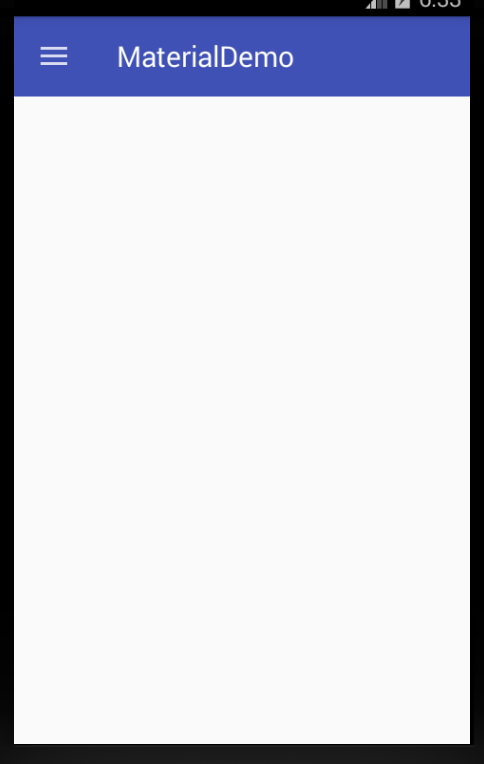

# NavigationView

NavigationView是Android中一个普通的控件，以前也有其他的解决方案，但实现过程和NavigationView相比都比较麻烦。

首先，修改`activity_main.xml`的内容如下：

```xml
<android.support.v4.widget.DrawerLayout
    xmlns:android="http://schemas.android.com/apk/res/android"
    xmlns:app="http://schemas.android.com/apk/res-auto"
    android:id="@+id/drawer_layout"
    android:layout_width="match_parent"
    android:layout_height="match_parent"
    android:fitsSystemWindows="true">

    <RelativeLayout
        android:layout_width="match_parent"
        android:layout_height="match_parent">

        <android.support.v7.widget.Toolbar
            android:id="@+id/toolbar"
            android:layout_width="match_parent"
            android:layout_height="?attr/actionBarSize"
            android:background="?attr/colorPrimary"
            android:theme="@style/ThemeOverlay.AppCompat.Dark" />

    </RelativeLayout>

    <android.support.design.widget.NavigationView
        android:id="@+id/navigation_view"
        android:layout_width="wrap_content"
        android:layout_height="match_parent"
        android:layout_gravity="start"
        app:headerLayout="@layout/drawer_header"
        app:menu="@menu/drawer"/>
</android.support.v4.widget.DrawerLayout>
```

在上边的代码中我们在DrawerLayout中添加了一个NavigationView。在NavigationView中有两个重要的属性：`app:headerLayout`指出了NavigationView的头部布局；而`app:menu`指出了NavigationView的列表布局(可在运行时修改)。

在res/layout下创建一个`drawer_header.xml`布局文件，内容如下：

```xml
<?xml version="1.0" encoding="utf-8"?>
<LinearLayout xmlns:android="http://schemas.android.com/apk/res/android"
    android:orientation="vertical"
    android:layout_width="match_parent"
    android:layout_height="150dp"
    android:background="?attr/colorPrimaryDark"
    android:padding="16dp"
    android:theme="@style/ThemeOverlay.AppCompat.Dark"
    android:gravity="bottom">

    <TextView
        android:layout_width="match_parent"
        android:layout_height="wrap_content"
        android:text="@string/drawer_header_text"
        android:textAppearance="@style/TextAppearance.AppCompat.Body1"/>

</LinearLayout>
```

这样就可以给NavigationView创建一个高为150的头部布局并且以我们设置的colorPrimaryDark颜色为背景。

下一步创建一个`drawer.xml`在res/menu目录中，内容如下：

```xml
<?xml version="1.0" encoding="utf-8"?>
<menu xmlns:android="http://schemas.android.com/apk/res/android">

    <group android:checkableBehavior="single">
        <item
            android:id="@+id/navigation_item_attachment"
            android:checked="true"
            android:icon="@drawable/ic_attachment"
            android:title="@string/nav_item_attachment" />
        <item
            android:id="@+id/navigation_item_images"
            android:icon="@drawable/ic_image"
            android:title="@string/nav_item_images" />
        <item
            android:id="@+id/navigation_item_location"
            android:icon="@drawable/ic_place"
            android:title="@string/nav_item_location" />
    </group>

    <item android:title="@string/nav_sub_menu">
        <menu>
            <item
                android:icon="@drawable/ic_emoticon"
                android:title="@string/nav_sub_menu_item01" />
            <item
                android:icon="@drawable/ic_emoticon"
                android:title="@string/nav_sub_menu_item02" />
        </menu>
    </item>

</menu>

```

在上面的代码中，我们给导航界面创建了一个选择列表。第一部分是一个可以单选的列表，单选后会有高亮显示。第二部分我们用一个子标题将其和第一部分分开。

在`MainActivity.java`中添加以下代码：

```java
private DrawerLayout mDrawerLayout;
```

然后在onCreate方法的最后添加如下代码：

```java
mDrawerLayout = (DrawerLayout) findViewById(R.id.drawer_layout);
```

修改`onOptionsItemSelected(MenuItem)`如下：

```java
@Override
public boolean onOptionsItemSelected(MenuItem item) {
    // Handle action bar item clicks here. The action bar will
    // automatically handle clicks on the Home/Up button, so long
    // as you specify a parent activity in AndroidManifest.xml.
    int id = item.getItemId();

    switch (id) {
        case android.R.id.home:
            mDrawerLayout.openDrawer(GravityCompat.START);
            return true;
    }

    return super.onOptionsItemSelected(item);
}
```

这样当点击Home按包的时候，就会显示导航界面。启动app你会看到以下界面：

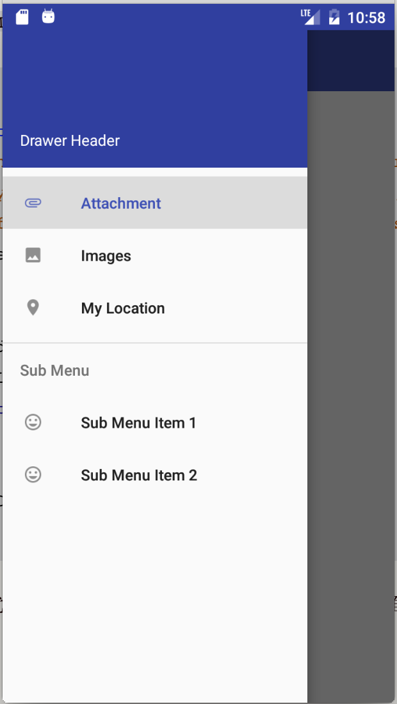

为了获取导航栏条目的点击事件，我们需要在`NavigationView`设置`OnNavigationItemSelectedListener`。将以下代码添加到`onCreate(Bundle)`方法的底部：

```java
NavigationView navigationView = (NavigationView) findViewById(R.id.navigation_view);
navigationView.setNavigationItemSelectedListener(new 		 NavigationView.OnNavigationItemSelectedListener() {
        @Override
        public boolean onNavigationItemSelected(MenuItem menuItem) {
            menuItem.setChecked(true);
            mDrawerLayout.closeDrawers();
            Toast.makeText(MainActivity.this, menuItem.getTitle(), Toast.LENGTH_LONG).show();
            return true;
        }
    });
```

上面的代码给NavigationView添加了一个列表点击监听事件，并且在点击的时候设置被点击Item为选中状态，然后导航界面关闭，并弹出一个Toast。

在真正的项目中，就不仅公是弹出一个Toast，而可能会跳到一个Fragment。如果你再次打开导航界面，你会看到相应的条目处于高亮状态。

# Floating Action Button (FAB)

FAB是一个圆形按钮用于在界面上进行重要的交互。FAB提供了一个持久的实现，默认它的颜色是应用主题设置的`colorAccent`。

为了更好的和界面中的其他控件协调，FAB除了支持正常尺寸(56dp)大小，还支持MINI尺寸(40dp)大小。

添加一个FAB，可以在activity_main.xml中添加以下代码：

```xml
<android.support.v4.widget.DrawerLayout
    xmlns:android="http://schemas.android.com/apk/res/android"
    xmlns:app="http://schemas.android.com/apk/res-auto"
    android:id="@+id/drawer_layout"
    android:layout_width="match_parent"
    android:layout_height="match_parent"
    android:fitsSystemWindows="true">

    <RelativeLayout
        android:layout_width="match_parent"
        android:layout_height="match_parent">

        <android.support.v7.widget.Toolbar
            android:id="@+id/toolbar"
            android:layout_width="match_parent"
            android:layout_height="?attr/actionBarSize"
            android:background="?attr/colorPrimary"
            android:theme="@style/ThemeOverlay.AppCompat.Dark" />

        <android.support.design.widget.FloatingActionButton
            android:id="@+id/fab"
            android:layout_width="wrap_content"
            android:layout_height="wrap_content"
            android:layout_alignParentBottom="true"
            android:layout_alignParentRight="true"
            android:layout_marginRight="@dimen/activity_horizontal_margin"
            android:layout_marginBottom="@dimen/activity_vertical_margin"
            android:src="@drawable/ic_done" />

    </RelativeLayout>

    <android.support.design.widget.NavigationView
        android:id="@+id/navigation_view"
        android:layout_width="wrap_content"
        android:layout_height="match_parent"
        android:layout_gravity="start"
        app:headerLayout="@layout/drawer_header"
        app:menu="@menu/drawer"/>
</android.support.v4.widget.DrawerLayout>
```

以上代码我们在主界面的右下角添加了一个FAB，并且通过`android:src`设置了FAB的显示图片。在代码中你可以通过 `setImageDrawable()`来设置显示图片。

运行APP你可以看到以下界面：

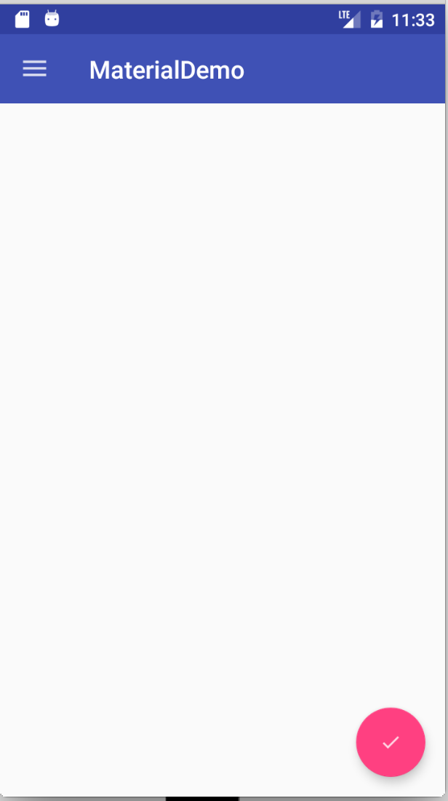

我们后面会在FAB上设置`onClickListener`。

# Snackbar

原来我们使用Toast对用户的操作进行快速的响应。现在有了一个新的选择：Snackbar。

Snackbar显示在界面的下面，并且有一个可选的单独的点击操作。在超时时间到达后，Snackbar会随着动画消失，用户也可以将它们滑动出界面。

因为Snackbar可以和用户进行交互和滑动隐藏，而且和Toast的api相似，所以它们被认为比Toast更加强大。

在MainActivity.java中，添加以下代码到`onCreate(Bundle)`方法的底部：

```java
FloatingActionButton fab = (FloatingActionButton)findViewById(R.id.fab);
fab.setOnClickListener(new View.OnClickListener() {
    @Override
    public void onClick(View v) {
        Snackbar.make(findViewById(R.id.drawer_layout), "I'm a Snackbar", Snackbar.LENGTH_LONG).setAction("Action", new View.OnClickListener() {
                @Override
                public void onClick(View v) {
                    Toast.makeText(MainActivity.this, "Snackbar Action", Toast.LENGTH_LONG).show();
                }
            }).show();
        }
    });
```

在上面的代码中，我们给FAB添加了一个点击事件，当它被点击的时候，一个Snackbar会弹出，并且它会有一个点击操作。当它被点击的时候，会弹出一个Toast。

注意make()方法的第一个参数，它是一个view，这个view就是用来定位Snackbar会显示在它的底部。运行应用：

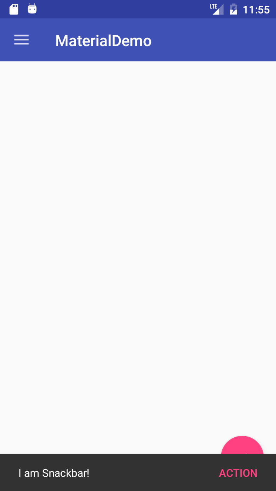

注意Snackbar是在FAB的上面，后面我们在讲`CoordinatorLayout`的时候会修正这个问题。

# TabLayout

在Android上有用Tabs来切换不同的Views的使用方式。Design库里的TabLayout给这种方式提供了一个简单的实现。TabLayout可以被实现成一个将界面的宽度等比分配的样式，或者一个可以横向滚动的不等比分配的样式。

在`activity_main.xml`中添加以下内容来添加一个TabLayout：

```xml
<android.support.v4.widget.DrawerLayout
    android:id="@+id/drawer_layout"
    xmlns:android="http://schemas.android.com/apk/res/android"
    xmlns:app="http://schemas.android.com/apk/res-auto"
    android:layout_width="match_parent"
    android:layout_height="match_parent"
    android:fitsSystemWindows="true">

    <RelativeLayout
        android:layout_width="match_parent"
        android:layout_height="match_parent">

        <LinearLayout
            android:layout_width="match_parent"
            android:layout_height="match_parent"
            android:orientation="vertical">

            <android.support.v7.widget.Toolbar
                android:id="@+id/toolbar"
                android:layout_width="match_parent"
                android:layout_height="?attr/actionBarSize"
                android:background="?attr/colorPrimary"
                android:theme="@style/ThemeOverlay.AppCompat.Dark" />

            <android.support.design.widget.TabLayout
                android:id="@+id/tablayout"
                android:layout_width="match_parent"
                android:layout_height="wrap_content"
                android:background="?attr/colorPrimary"
                app:tabGravity="fill"
                android:theme="@style/ThemeOverlay.AppCompat.Dark" />

            <android.support.v4.view.ViewPager
                android:id="@+id/viewpager"
                android:layout_width="match_parent"
                android:layout_height="0dp"
                android:layout_weight="1"/>

        </LinearLayout>

        <android.support.design.widget.FloatingActionButton
            android:id="@+id/fab"
            android:layout_width="wrap_content"
            android:layout_height="wrap_content"
            android:layout_alignParentBottom="true"
            android:layout_alignParentRight="true"
            android:layout_marginBottom="@dimen/activity_vertical_margin"
            android:layout_marginRight="@dimen/activity_horizontal_margin"
            android:src="@drawable/ic_done"/>

    </RelativeLayout>

    <android.support.design.widget.NavigationView
        android:id="@+id/navigation_view"
        android:layout_width="wrap_content"
        android:layout_height="match_parent"
        android:layout_gravity="start"
        app:headerLayout="@layout/drawer_header"
        app:menu="@menu/drawer"/>
</android.support.v4.widget.DrawerLayout>
```

上面我们添加一个TabLayout和一个ViewPager。ViewPager用来进行界面间的切换。

在`MainActivity.java`中添加以下子类：

```java
public static class DesignDemoFragment extends Fragment {
    private static final String TAB_POSITION = "tab_position";

    public DesignDemoFragment() {

    }

    public static DesignDemoFragment newInstance(int tabPosition) {
        DesignDemoFragment fragment = new DesignDemoFragment();
        Bundle args = new Bundle();
        args.putInt(TAB_POSITION, tabPosition);
        fragment.setArguments(args);
        return fragment;
    }

    @Nullable
    @Override
    public View onCreateView(LayoutInflater inflater, ViewGroup container, Bundle savedInstanceState) {
        Bundle args = getArguments();
        int tabPosition = args.getInt(TAB_POSITION);
        TextView tv = new TextView(getActivity());
        tv.setGravity(Gravity.CENTER);
        tv.setText("Text in Tab #" + tabPosition);
        return tv;
    }
}
```

```java
static class DesignDemoPagerAdapter extends FragmentStatePagerAdapter {

    public DesignDemoPagerAdapter(FragmentManager fm) {
        super(fm);
    }

    @Override
    public Fragment getItem(int position) {
        return DesignDemoFragment.newInstance(position);
    }

    @Override
    public int getCount() {
        return 3;
    }

    @Override
    public CharSequence getPageTitle(int position) {
        return "Tab " + position;
    }
}
```

在`onCreate(Bundle)`方法的最后添加以下代码：

```java
DesignDemoPagerAdapter adapter = new DesignDemoPagerAdapter(getSupportFragmentManager());
ViewPager viewPager = (ViewPager)findViewById(R.id.viewpager);
viewPager.setAdapter(adapter);
TabLayout tabLayout = (TabLayout)findViewById(R.id.tablayout);
tabLayout.setupWithViewPager(viewPager);
```

上面我们创建了一个简单的Fragment，它的内容只是一个TextView。然后我们创建了一个`FragmentStatePagerAdapter`，把它做为ViewPager的适配器。在`DesignDemoPagerAdapter`类中的getCount()方法返回有多少个标签页。`getItem(int)`返回将要被显示在ViewPager中的Fragment。`getPageTitle(int)`返回标签栏所返回的标题。我们使用`setupWithViewPager()`将TabLayout和ViewPager绑定，不管它们那个切换，另一个也会做出相应的切换。

运行应用你可以看到标签页，可以通过滑动ViewPager切换，或者点击TabLayout标签栏进行切换。

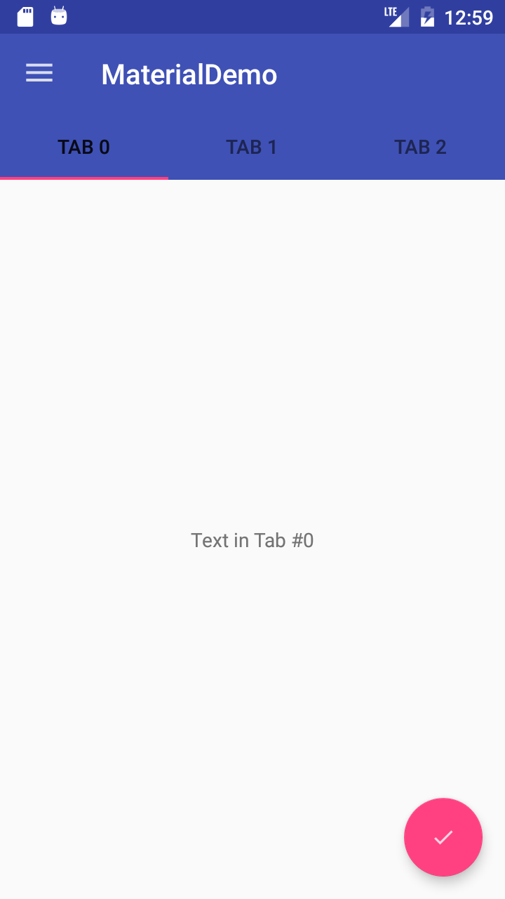

# CoordinatorLayout

`CoordinatorLayout`是一个设计支持库中的非常有用的控件，可以通过触摸事件控制子控件的响应。

一个例子就是把一个FAB当做一个子控件放到CoordinatorLayout中。然后我们传递CoordinatorLayout到Snackbar.make()中的第一个参数。

前面给大家演示了，Snackbar显示在FAB上面。当FAB在CoordinatorLayout中的时候，当Snackbar显示的时候FAB会自动的上移，当Snackbar消失的时候FAB会自动回到原来的位置。在Android3.0以上支持。

在activity_main.xml做以下修改来添加一个CoordinatorLayout：

```xml
<android.support.v4.widget.DrawerLayout
    android:id="@+id/drawer_layout"
    xmlns:android="http://schemas.android.com/apk/res/android"
    xmlns:app="http://schemas.android.com/apk/res-auto"
    android:layout_width="match_parent"
    android:layout_height="match_parent"
    android:fitsSystemWindows="true">

    <android.support.design.widget.CoordinatorLayout
        android:id="@+id/coordinator"
        android:layout_width="match_parent"
        android:layout_height="match_parent">

        <LinearLayout
            android:layout_width="match_parent"
            android:layout_height="match_parent"
            android:orientation="vertical">

            <android.support.v7.widget.Toolbar
                android:id="@+id/toolbar"
                android:layout_width="match_parent"
                android:layout_height="?attr/actionBarSize"
                android:background="?attr/colorPrimary"
                android:theme="@style/ThemeOverlay.AppCompat.Dark" />

            <android.support.design.widget.TabLayout
                android:id="@+id/tablayout"
                android:layout_width="match_parent"
                android:layout_height="wrap_content"
                android:background="?attr/colorPrimary"
                app:tabGravity="fill"
                android:theme="@style/ThemeOverlay.AppCompat.Dark" />

            <android.support.v4.view.ViewPager
                android:id="@+id/viewpager"
                android:layout_width="match_parent"
                android:layout_height="0dp"
                android:layout_weight="1"/>

        </LinearLayout>

        <android.support.design.widget.FloatingActionButton
            android:id="@+id/fab"
            android:layout_width="wrap_content"
            android:layout_height="wrap_content"
            android:layout_alignParentBottom="true"
            android:layout_gravity="bottom|right"
            android:layout_marginBottom="@dimen/activity_vertical_margin"
            android:layout_marginRight="@dimen/activity_horizontal_margin"
            android:src="@drawable/ic_done"/>

    </android.support.design.widget.CoordinatorLayout>

    <android.support.design.widget.NavigationView
        android:id="@+id/navigation_view"
        android:layout_width="wrap_content"
        android:layout_height="match_parent"
        android:layout_gravity="start"
        app:headerLayout="@layout/drawer_header"
        app:menu="@menu/drawer"/>
</android.support.v4.widget.DrawerLayout>
```

从上面中以看出FAB需要成为CoordinatorLayout的一个子控件，所以我们将上面的RelativeLayout替换成一个CoordinatorLayout。同时注意我们FAB的位置`android:layout_gravity="bottom|right"`以确保它在右下角。

然后在MainActivity.java中我们将CoordinatorLayout做为view参数传递给Snackbar。

```java
Snackbar.make(findViewById(R.id.coordinator), "I'm a Snackbar", Snackbar.LENGTH_LONG).setAction("Action", new View.OnClickListener() {
                @Override
                public void onClick(View v) {
                    Toast.makeText(MainActivity.this, "Snackbar Action", Toast.LENGTH_LONG).show();
                }
            }).show();
```

运行应用，我们点击FAB，这时Snackbar显示出来，但和以前不一样FAB会随着Snackbar向上移动；然后当Snackbar消失的时候，FAB也会回到原来的位置。

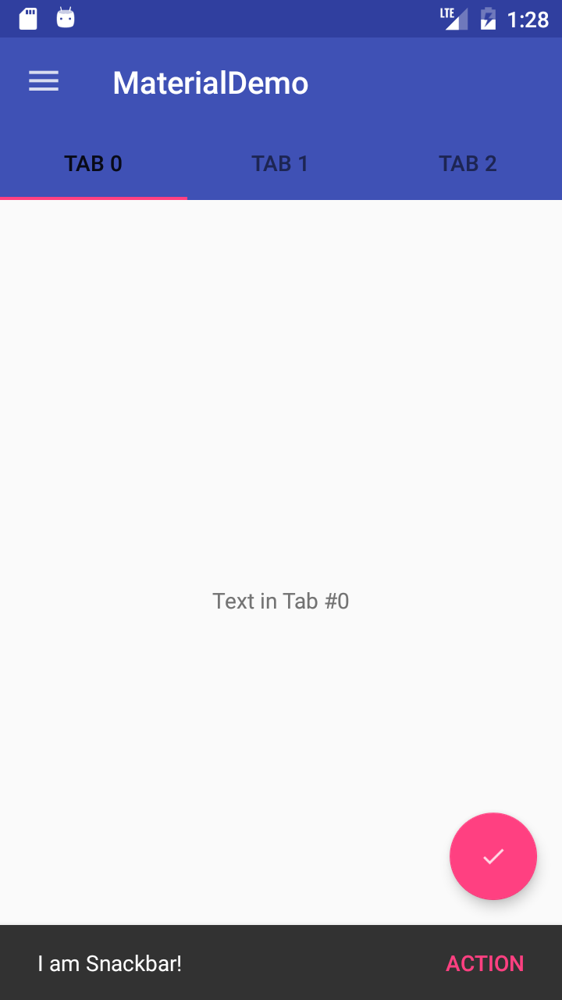

CoordinatorLayout的另一个主要的使用方式是应用的标题栏滚动的时候的响应。设计支持库提供了AppBarLayout，它允许Toolbar和其他view(例如：提供标签页的TabLayout)反馈滚动事件给一个被标记为ScrollingViewBehavior的兄弟级View中。

首先我们先创建一个可以滚动的控件。我们使用RecyclerView去创建一个滚动列表。

注意：我花了一个小时使用CoordinatorLayout和ListView来配合使用，但是滚动标记并不起作用。简单的搜索我查看了[这里](https://www.reddit.com/r/androiddev/comments/3808fi/coordinatorlayout_does_not_work_with/)、[这里](http://stackoverflow.com/questions/30612453/scrollingviewbehavior-for-listview)、[这里](http://stackoverflow.com/questions/30561037/coordinatorlayout-not-working)。如果你查看地了这些链接，似乎CoordinatorLayout和ListView并不友好(还有`GridViews` 和`ScrollViews`)。后面的两个链接提供了一个和ListView配合使用的方案，但是它不是向后兼容的。我这里提出来是希望你不要在同样的问题上卡住。ListViews的支持在后面的更新中可以会支持。

关于RecyclerView的使用我不做过多的解释，这不是这篇文章的内容。你可以在网上轻松的找到关于RecyclerView的使用说明。

在app模块的build.gradle文件中添加以下内容，然后同步：

```groovy
compile 'com.android.support:recyclerview-v7:22.2.1'
```

添加一个布局文件：*fragment_list_view.xml*，然后添加以下内容：

```xml
<?xml version="1.0" encoding="utf-8"?>
<android.support.v7.widget.RecyclerView
    xmlns:android="http://schemas.android.com/apk/res/android"
    android:id="@+id/recyclerview"
    android:layout_width="match_parent"
    android:layout_height="match_parent"/>
```

添加另一个布局文件： *list_row.xml*，并把内容修改为如下：

```xml
<?xml version="1.0" encoding="utf-8"?>
<LinearLayout xmlns:android="http://schemas.android.com/apk/res/android"
          android:orientation="vertical"
          android:padding="16dp"
          android:layout_width="match_parent"
          android:layout_height="56dp">

    <TextView
        android:id="@+id/list_item"
        android:layout_width="wrap_content"
        android:layout_height="wrap_content"/>

</LinearLayout>
```

新建一个 *DesignDemoRecyclerAdapter.java* 内容如下：

```java
package com.echessa.designdemo; // Rename as Appropriate

import android.support.v7.widget.RecyclerView;
import android.view.LayoutInflater;
import android.view.View;
import android.view.ViewGroup;
import android.widget.TextView;

import java.util.List;

/**
 * Created by echessa on 7/24/15.
 */
public class DesignDemoRecyclerAdapter extends RecyclerView.Adapter<DesignDemoRecyclerAdapter.ViewHolder> {

    private List<String> mItems;

    DesignDemoRecyclerAdapter(List<String> items) {
        mItems = items;
    }

    @Override
    public ViewHolder onCreateViewHolder(ViewGroup viewGroup, int i) {
        View v = LayoutInflater.from(viewGroup.getContext()).inflate(R.layout.list_row, viewGroup, false);

        return new ViewHolder(v);
    }

    @Override
    public void onBindViewHolder(ViewHolder viewHolder, int i) {
        String item = mItems.get(i);
        viewHolder.mTextView.setText(item);
    }

    @Override
    public int getItemCount() {
        return mItems.size();
    }

    public class ViewHolder extends RecyclerView.ViewHolder {

        private final TextView mTextView;

        ViewHolder(View v) {
            super(v);
            mTextView = (TextView)v.findViewById(R.id.list_item);
        }
    }

}
```

修改MainActivity.java中的`DesignDemoFragment.onCreateView()` 内容如下：

```java
@Nullable
    @Override
    public View onCreateView(LayoutInflater inflater, ViewGroup container, Bundle savedInstanceState) {
        Bundle args = getArguments();
        int tabPosition = args.getInt(TAB_POSITION);

        ArrayList<String> items = new ArrayList<String>();
        for (int i = 0; i < 50; i++) {
            items.add("Tab #" + tabPosition + " item #" + i);
        }

        View v =  inflater.inflate(R.layout.fragment_list_view, container, false);
        RecyclerView recyclerView = (RecyclerView)v.findViewById(R.id.recyclerview);
        recyclerView.setLayoutManager(new LinearLayoutManager(getActivity()));
        recyclerView.setAdapter(new DesignDemoRecyclerAdapter(items));

        return v;
    }
```

这样就可以显示前面的布局文件。现在fragment的界面就是一个列表。运行应用看下：

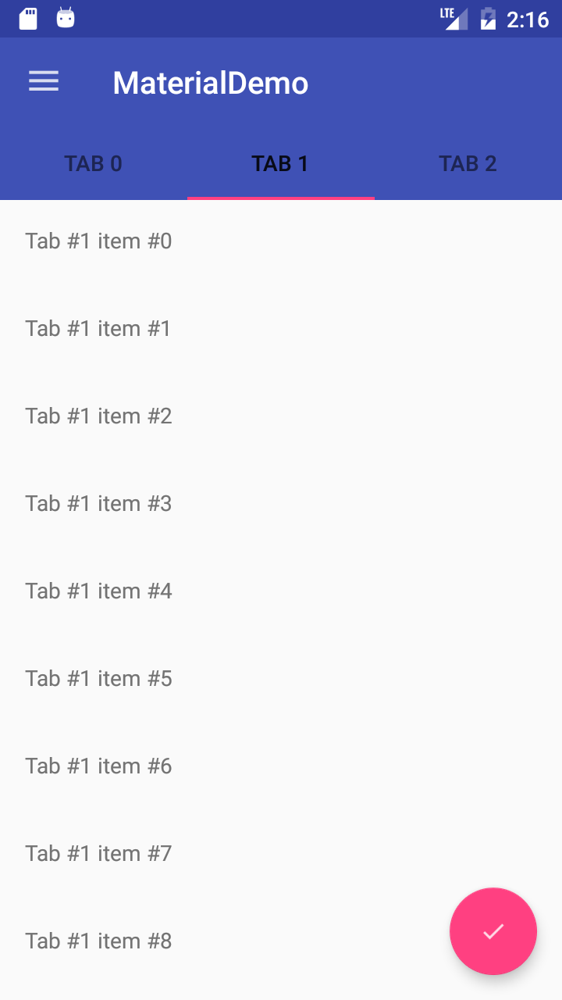

完成这些以后我们就可以看到CoordinatorLayout提供的滚动行为。

修改*activity_main.xml*如下：

```xml
<android.support.v4.widget.DrawerLayout
    android:id="@+id/drawer_layout"
    xmlns:android="http://schemas.android.com/apk/res/android"
    xmlns:app="http://schemas.android.com/apk/res-auto"
    android:layout_width="match_parent"
    android:layout_height="match_parent"
    android:fitsSystemWindows="true">

    <android.support.design.widget.CoordinatorLayout
        android:id="@+id/coordinator"
        android:layout_width="match_parent"
        android:layout_height="match_parent">

        <android.support.design.widget.AppBarLayout
            android:layout_width="match_parent"
            android:layout_height="wrap_content"
            android:theme="@style/ThemeOverlay.AppCompat.Dark">

            <android.support.v7.widget.Toolbar
                android:id="@+id/toolbar"
                android:layout_width="match_parent"
                android:layout_height="?attr/actionBarSize"
                android:background="?attr/colorPrimary"
                app:layout_scrollFlags="scroll|enterAlways"/>

            <android.support.design.widget.TabLayout
                android:id="@+id/tablayout"
                android:layout_width="match_parent"
                android:layout_height="wrap_content"
                android:background="?attr/colorPrimary"
                app:tabGravity="fill"/>

        </android.support.design.widget.AppBarLayout>

        <android.support.v4.view.ViewPager
            android:id="@+id/viewpager"
            android:layout_width="match_parent"
            android:layout_height="match_parent"
            app:layout_behavior="@string/appbar_scrolling_view_behavior"/>

        <android.support.design.widget.FloatingActionButton
            android:id="@+id/fab"
            android:layout_width="wrap_content"
            android:layout_height="wrap_content"
            android:layout_alignParentBottom="true"
            android:layout_gravity="bottom|right"
            android:layout_marginBottom="@dimen/activity_vertical_margin"
            android:layout_marginRight="@dimen/activity_horizontal_margin"
            android:src="@drawable/ic_done"/>

    </android.support.design.widget.CoordinatorLayout>

    <android.support.design.widget.NavigationView
        android:id="@+id/navigation_view"
        android:layout_width="wrap_content"
        android:layout_height="match_parent"
        android:layout_gravity="start"
        app:headerLayout="@layout/drawer_header"
        app:menu="@menu/drawer"/>
</android.support.v4.widget.DrawerLayout>
```

在上面的代码中，我们把Toolbar和TabLayout嵌入到AppBarLayout中。AppBarLayout允许Toolbar和其他Views(例如：TabLayout)对一个标记为ScrollingViewBehavior的兄弟级控件中的滚动行为做出反馈。

当用户滚动RecyclerView，AppBarLayout会通过子控件的滚动标记进行响应进入屏幕和退出屏幕的行为。

滚动标记如下：

* **scroll**：如果view想滚动出屏幕，可以使用这个标记。如果不使用这个标记，View将被固定在屏幕的顶部。
* **enterAlways**：如果控件使用了这个标记，在向下滚动的时候这个控件将变得可见，使"快速返回"模式可用。
* **enterAlwaysCollapsed**：如果某个View定义了这个标记，并且设置了`minHeight`属性，这个View只会在进入的时候先显示minHeight高度，只有当滚动到屏幕的顶部的时候才会全部显示。
* **exitUntilCollapsed**：这个标记将会使View在退出的时候会保留`minHeight`的高度。

注意：所有使用滚动标记的控件都必须在没有使用滚动标记的控件之前声明。这个可以确保有滚动标记的控件可以在退出的时候剩下固定的控件。

在我们的应用中我们给Toolbar设置了`scroll` and `enterAlways`滚动标记，这样当我们向下滚动的时候Toolbar会滚出屏幕，当我们向上滚动的时候Toolbar又出现。同时需要注意在ViewPager上的`app:layout_behavior="@string/appbar_scrolling_view_behavior`标记。设计支持库给我们提供了一个字符串资源`@string/appbar_scrolling_view_behavior`，它就是`AppBarLayout.ScrollingViewBehavior`，它会通知AppbarLayout当一个特殊的View在滚动的时候。当View触发滚动事件时，行为就必须确定。

运行应用看一下Appbar的滚动效果。

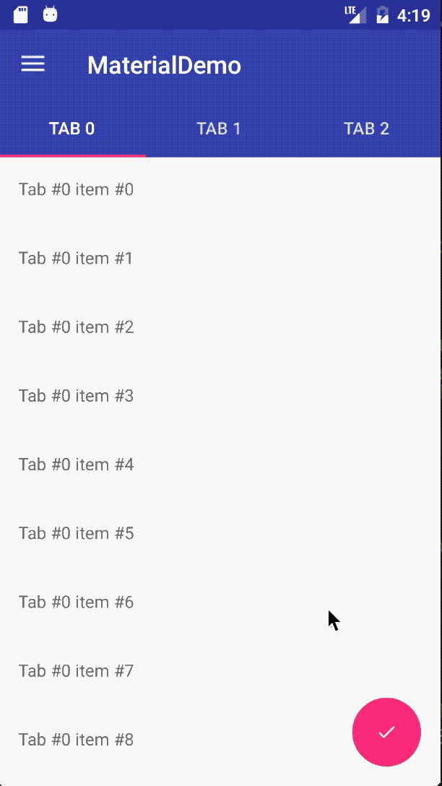

# CollapsingToolbarLayout


CollapsingToolbarLayour给Appbar提供了另外一种滚动行为。为了在项目中看到，我们首先建立一个Activity，有一个Toolbar但是没有TabLayout。

创建一个空白的Activity，名为：`SecondActivity`

修改*activity_second.xml* 如下：

```xml
<android.support.design.widget.CoordinatorLayout
    xmlns:android="http://schemas.android.com/apk/res/android"
    xmlns:app="http://schemas.android.com/apk/res-auto"
    android:layout_width="match_parent"
    android:layout_height="match_parent">

    <android.support.design.widget.AppBarLayout
        android:layout_width="match_parent"
        android:layout_height="250dp"
        android:theme="@style/ThemeOverlay.AppCompat.Dark.ActionBar">

        <android.support.design.widget.CollapsingToolbarLayout
            android:id="@+id/collapsing_toolbar"
            android:layout_width="match_parent"
            android:layout_height="match_parent"
            app:contentScrim="?attr/colorPrimary"
            app:layout_scrollFlags="scroll|exitUntilCollapsed">

            <ImageView
                android:layout_width="match_parent"
                android:layout_height="match_parent"
                android:scaleType="centerCrop"
                android:src="@drawable/image"
                app:layout_collapseMode="parallax"/>

            <android.support.v7.widget.Toolbar
                android:id="@+id/toolbar"
                android:layout_width="match_parent"
                android:layout_height="?attr/actionBarSize"
                app:layout_collapseMode="pin"/>

        </android.support.design.widget.CollapsingToolbarLayout>

    </android.support.design.widget.AppBarLayout>

    <android.support.v4.widget.NestedScrollView
        android:layout_width="match_parent"
        android:layout_height="match_parent"
        app:layout_behavior="@string/appbar_scrolling_view_behavior">

        <LinearLayout
            android:layout_width="match_parent"
            android:layout_height="match_parent"
            android:orientation="vertical"
            android:paddingTop="24dp">

            <android.support.v7.widget.CardView
                android:layout_width="match_parent"
                android:layout_height="wrap_content"
                android:layout_margin="16dp">

                <LinearLayout
                    android:layout_width="match_parent"
                    android:layout_height="wrap_content"
                    android:orientation="vertical"
                    android:padding="16dp">

                    <TextView
                        android:layout_width="match_parent"
                        android:layout_height="wrap_content"
                        android:text="Lorem ipsum"/>

                    <TextView
                        android:layout_width="match_parent"
                        android:layout_height="wrap_content"
                        android:text="@string/second_activity_text"/>

                </LinearLayout>

            </android.support.v7.widget.CardView>

            <android.support.v7.widget.CardView
                android:layout_width="match_parent"
                android:layout_height="wrap_content"
                android:layout_marginBottom="16dp"
                android:layout_marginLeft="16dp"
                android:layout_marginRight="16dp">

                <LinearLayout
                    android:layout_width="match_parent"
                    android:layout_height="wrap_content"
                    android:orientation="vertical"
                    android:padding="16dp">

                    <TextView
                        android:layout_width="match_parent"
                        android:layout_height="wrap_content"
                        android:text="Sed quam eros"/>

                    <TextView
                        android:layout_width="match_parent"
                        android:layout_height="wrap_content"
                        android:text="@string/second_activity_text"/>

                </LinearLayout>

            </android.support.v7.widget.CardView>

            <android.support.v7.widget.CardView
                android:layout_width="match_parent"
                android:layout_height="wrap_content"
                android:layout_marginBottom="16dp"
                android:layout_marginLeft="16dp"
                android:layout_marginRight="16dp">

                <LinearLayout
                    android:layout_width="match_parent"
                    android:layout_height="wrap_content"
                    android:orientation="vertical"
                    android:padding="16dp">

                    <TextView
                        android:layout_width="match_parent"
                        android:layout_height="wrap_content"
                        android:text="Sed a euismod dui"/>

                    <TextView
                        android:layout_width="match_parent"
                        android:layout_height="wrap_content"
                        android:text="@string/second_activity_text"/>

                </LinearLayout>

            </android.support.v7.widget.CardView>

            <android.support.v7.widget.CardView
                android:layout_width="match_parent"
                android:layout_height="wrap_content"
                android:layout_marginBottom="16dp"
                android:layout_marginLeft="16dp"
                android:layout_marginRight="16dp">

                <LinearLayout
                    android:layout_width="match_parent"
                    android:layout_height="wrap_content"
                    android:orientation="vertical"
                    android:padding="16dp">

                    <TextView
                        android:layout_width="match_parent"
                        android:layout_height="wrap_content"
                        android:text="Fusce nec lacinia mi"/>

                    <TextView
                        android:layout_width="match_parent"
                        android:layout_height="wrap_content"
                        android:text="@string/second_activity_text"/>

                </LinearLayout>

            </android.support.v7.widget.CardView>

            <android.support.v7.widget.CardView
                android:layout_width="match_parent"
                android:layout_height="wrap_content"
                android:layout_marginBottom="16dp"
                android:layout_marginLeft="16dp"
                android:layout_marginRight="16dp">

                <LinearLayout
                    android:layout_width="match_parent"
                    android:layout_height="wrap_content"
                    android:orientation="vertical"
                    android:padding="16dp">

                    <TextView
                        android:layout_width="match_parent"
                        android:layout_height="wrap_content"
                        android:text="Praesent hendrerit"/>

                    <TextView
                        android:layout_width="match_parent"
                        android:layout_height="wrap_content"
                        android:text="@string/second_activity_text"/>

                </LinearLayout>

            </android.support.v7.widget.CardView>

        </LinearLayout>

    </android.support.v4.widget.NestedScrollView>

</android.support.design.widget.CoordinatorLayout>
```

在上面的代码中我们使用了CollapsingToolbarLayout，并且设置了它的标记为`scroll`和 `exitUntilCollapsed`，这样它的子控件将会滚出屏幕。然而，我们设置Toolbar的app:layout_collapseMode="pin"，这样就使Toolbar在View收缩的时候能够保留在屏幕的顶部。另一个效果就是CollapsingToolbarLayout的标题会变的更大，当CollapsingToolbarLayout全部显示的时候，同时在CollapsingToolbarLayout收缩的时候变成默认大小。我们在代码中设置标题。剩下的布局包含NestedScrollView和一些卡片在里面。

修改*SecondActivity.java*的 `onCreate(Bundle)`方法如下：

```java
@Override
protected void onCreate(Bundle savedInstanceState) {
    super.onCreate(savedInstanceState);
    setContentView(R.layout.activity_second);

    Toolbar toolbar = (Toolbar) findViewById(R.id.toolbar);
    setSupportActionBar(toolbar);
    getSupportActionBar().setDisplayHomeAsUpEnabled(true);

    CollapsingToolbarLayout collapsingToolbar = (CollapsingToolbarLayout) findViewById(R.id.collapsing_toolbar);
    collapsingToolbar.setTitle("Second Activity");
}
```

这里我们设置了Toolbar的返回按钮，并且设置了CollapsingToolbarLayout的标题。

为了让返回按钮能够工作，在Manifest里的`SecondActivity`的配置中添加以下元数据：

```xml
<meta-data
            android:name="android.support.PARENT_ACTIVITY"
            android:value="com.echessa.designdemo.MainActivity" />
```

在*DesignDemoRecyclerAdapter.java*中修改onBindViewHolder()方法：

```java
@Override
public void onBindViewHolder(ViewHolder viewHolder, int i) {
    String item = mItems.get(i);
    viewHolder.mTextView.setText(item);

    viewHolder.mTextView.setOnClickListener(new View.OnClickListener() {
        @Override
        public void onClick(View view) {
            Context context = view.getContext();
            context.startActivity(new Intent(context, SecondActivity.class));
        }
    });
}
```

上面的代码中我们给RecyclerView的每一行的TextView设置了一个点击事件。这不是实现RecyclerView的Item的点击事件的最佳方式，我只是为了用最少的代码实现界面跳转。

运行app我们看到如下：


# Floating Labels for EditText

设计支持库的最后一个控件是一个看起来像是一个增强型的EditText。一般情况下，当我们在EditText中进行输入时，提示语会消失。现在你可以把EditText放在一个TextInputLayout中，这样提示语就会浮现在EditText的上面，这样用户就永远可以知道他们要输入什么内容。

我们修改*activity_second.xml*中某个CardViews的内容如下。

```xml
<android.support.design.widget.TextInputLayout
                    android:layout_width="match_parent"
                    android:layout_height="wrap_content">

                    <EditText
                        android:layout_width="match_parent"
                        android:layout_height="wrap_content"
                        android:inputType="textEmailAddress"
                        android:hint="Email" />

                </android.support.design.widget.TextInputLayout>
```

运行应用可以看到以下效果：

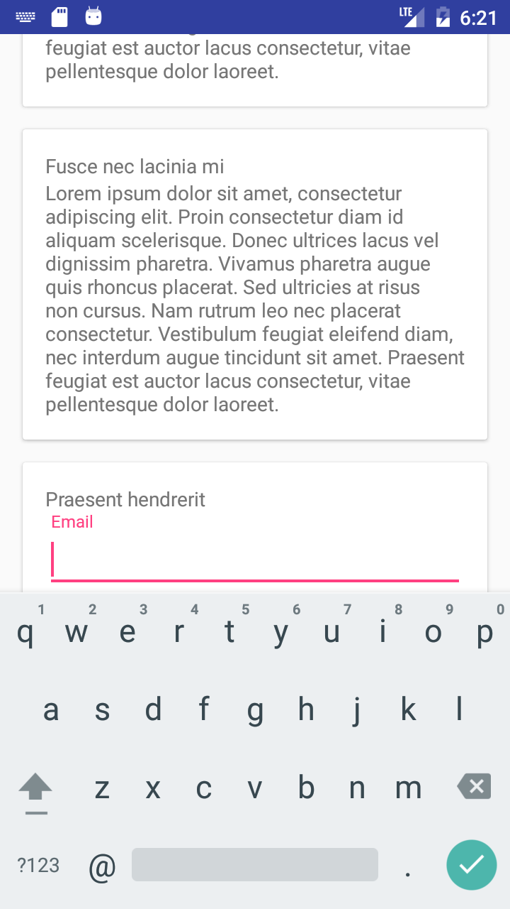

除了显示提示语，你还可以设置错误信息显示在EditText的下面，通过setError()方法调用。

# 结语：

到了本教程的结尾了，完整的代码可以在这里[下载](https://github.com/sitepoint-editors/Design-Demo)。更多的Android Design Support Library信息可以参考 [Android developers blog](http://android-developers.blogspot.co.ke/2015/05/android-design-support-library.html)。

我的代码在[这里](https://github.com/qjbagugit/MaterialDemo)。

# 附录：

## Material Design使用：

作为我们开发者，最关心的还是如何在项目中使用Material Design风格：

1. 设置应用的 `targetSdkVersion` 和 `targetSdkVersion` 为21
2. 在values目录下的style资源文件中创建一个style，让其继承自 `android:Theme.Material`
3. 在AndroidManifest中指定应用的主题或者Activity的主题为我们设定的样式

谷歌官方我们提供了三种配色风格的Material Design样式：

1. 黑色主题 `Theme.Material`
2. 明亮主题 `Theme.Material.Light`
3. 明亮主题黑色ActionBar `Theme.Material.Light.DarkActionBar`

主题属性：

1. `android:colorPrimaryDark` 应用的主要暗色调，statusBarColor默认使用该颜色
2. `android:statusBarColor` 状态栏颜色，默认使用colorPrimaryDark
3. `android:colorPrimary` 应用的主要色调，actionBar默认使用该颜色
4. `android:windowBackground` 窗口背景颜色
5. `android:navigationBarColor` 底部栏颜色
6. `android:colorForeground` 应用的前景色，ListView的分割线，switch滑动区默认使用该颜色
7. `android:colorBackground` 应用的背景色，popMenu的背景默认使用该颜色
8. `android:colorAccent` 一般控件的选种效果默认采用该颜色
9. `android:colorControlNormal` 控件的默认色调　
10. `android:colorControlHighlight` 控件按压时的色调
11. `android:colorControlActivated` 控件选中时的颜色，默认使用colorAccent
12. `android:colorButtonNormal` 默认按钮的背景颜色
13. `android:textColor` Button，textView的文字颜色
14. `android:textColorPrimaryDisableOnly` RadioButton checkbox等控件的文字
15. `android:textColorPrimary` 应用的主要文字颜色，actionBar的标题文字默认使用该颜色

主题不仅可以对`Application`和`Activity`使用，也可以对某一个控件单使用，或者是在xml布局中给一个根节点控件设置android:theme属性，来修改它和它所有子控件的主题。 如果我们要对特定控件实例做自定义修改，更建议大家可以通过控件自身的API进行设置修改。

## Material Design兼容性：

Material Design主题只有在API级别为21以上才可使用，在v7支持库中提供了部分控件的Material Design主题样式，如果想使应用在android的所有版本上都能统一风格，我们可以对控件效果做自定义或者使用一些第三方的兼容包。目前最有效的做法是针对21版本创建value－21资源目录，使用Material Design风格主题，在其他版本使用v7的Theme.AppCompat.Light风格主题。

## 注意事项：

1. 在使用CardView的时候，一定要注意，当CardView的宽和高填充父容器的时候，CardView的margin最好要比cardElevation大，不然就看不到立体的效果。
2. 我们知道ListView有一个onItemClick的事件，但是RecyclerView却没有，那么我们应该怎样去设置呢？其实很简单，关于RecyclerView设置item的点击事件，只需在创建ViewHolder的时候，给填充的View设置单击事件即可。
3. 在使用android.support.design.widget.AppBarLayout的时候内容区最好使用android.support.v4.widget.NestedScrollView。

## MD的主题色解析图：

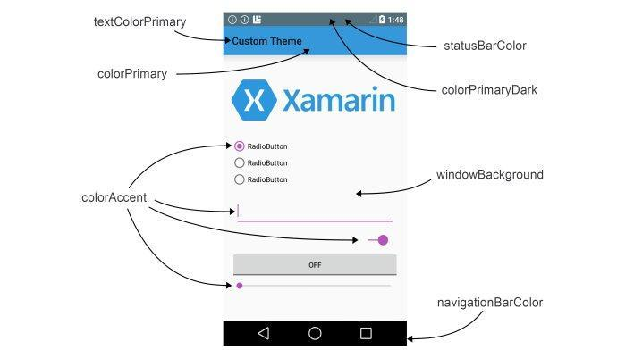

## 沉浸式状态栏：

`android:windowTranslucentStatus`：设置为true则状态栏变透明(4.4以上手机)，此时不做任何处理会出现如图的效果：


`android:fitsSystemWindows`：设置为true让Activity 中`setContentView`的布局不覆盖状态栏(即相当于给状态栏设置了padding)，这个属性要在根布局中使用。如果同时设置了

```xml
<item name="android:windowTranslucentStatus">true</item>
android:fitsSystemWindows="true"
```

将使状态栏透明，标题栏不覆盖状态栏：

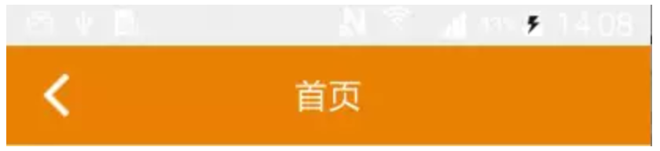

既然4.4以后加入了`windowTranslucentStatus`属性，那我们就可以使用状态栏的区域了。所以我们就可以设置一个和状态栏等高的View，背景颜色设置成需要的颜色的就可以了。具体代码使用鸿洋大神的[工具类](https://github.com/hongyangAndroid/ColorfulStatusBar/blob/master/colorfulstatusbar/src/main/java/com/zhy/colorfulstatusbar/StatusBarCompat.java)：

```java
public class StatusBarCompat {
    private static final int INVALID_VAL = -1;
    private static final int COLOR_DEFAULT = Color.parseColor("#20000000");

    @TargetApi(Build.VERSION_CODES.LOLLIPOP)
    public static void compat(Activity activity, int statusColor) {

        if (Build.VERSION.SDK_INT >= Build.VERSION_CODES.LOLLIPOP) {
            if (statusColor != INVALID_VAL) {
                activity.getWindow().setStatusBarColor(statusColor);
            }
            return;
        }

        if (Build.VERSION.SDK_INT >= Build.VERSION_CODES.KITKAT && Build.VERSION.SDK_INT < Build.VERSION_CODES.LOLLIPOP) {
            int color = COLOR_DEFAULT;
            ViewGroup contentView = (ViewGroup) activity.findViewById(android.R.id.content);
            if (statusColor != INVALID_VAL) {
                color = statusColor;
            }
            View statusBarView = contentView.getChildAt(0);
            //改变颜色时避免重复添加statusBarView
            if (statusBarView != null && statusBarView.getMeasuredHeight() == getStatusBarHeight(activity)) {
                statusBarView.setBackgroundColor(color);
                return;
            }
            statusBarView = new View(activity);
            ViewGroup.LayoutParams lp = new ViewGroup.LayoutParams(ViewGroup.LayoutParams.MATCH_PARENT,
                    getStatusBarHeight(activity));
            statusBarView.setBackgroundColor(color);
            contentView.addView(statusBarView, lp);
        }

    }

    public static void compat(Activity activity) {
        compat(activity, INVALID_VAL);
    }

    public static int getStatusBarHeight(Context context) {
        int result = 0;
        int resourceId = context.getResources().getIdentifier("status_bar_height", "dimen", "android");
        if (resourceId > 0) {
            result = context.getResources().getDimensionPixelSize(resourceId);
        }
        return result;
    }
}
```

如何使用：

```java
// 在onCreate()方法中：
StatusBarCompat.compat(this, getResources().getColor(R.color.primary_dark));
```

==注意：==

1. 创建`values-19`文件夹，并创建`styles.xml`，内容如下：

   ```xml
   <resources>
       <style name="AppTheme" parent="@style/BaseAppTheme">
           <item name="android:windowTranslucentStatus">true</item>
       </style>
   </resources>
   ```

   用来设置状态栏透明，并且可被用户使用，以使我们可以添加需要的View。

2. 因为5.0提供了setStatusBarColor去设置状态栏颜色，但是这个方法不能在主题中设置`windowTranslucentStatus`属性。所以我们创建`values-21`文件夹，并创建`styles.xml`，内容如下：

   ```xml
   <resources>
       <style name="AppTheme" parent="@style/BaseAppTheme">
       </style>
   </resources>
   ```

3. 同时需要注意`android:fitsSystemWindows="true"`的使用。如果要控件为`DrawerLayout`，我测试设置无效，需要在它的子控件中设置，并且`NavigationView`中的布局不用再设置。

4.4真机实现结果：

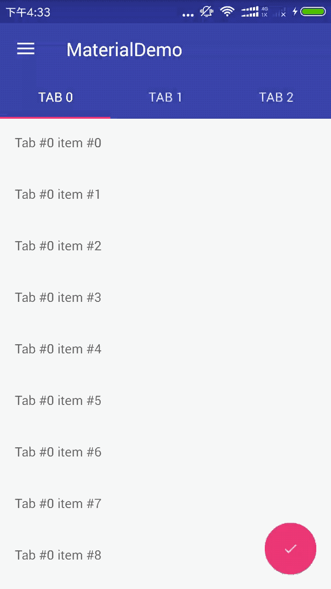

# 参考：

[Material Design with the Android Design Support Library](https://www.sitepoint.com/material-design-android-design-support-library/)

[超简单的实现沉浸式状态栏]()

[Android 沉浸式状态栏攻略 让你的状态栏变色吧](http://blog.csdn.net/lmj623565791/article/details/48649563)

[Android沉浸式(透明)状态栏适配](http://www.jianshu.com/p/a44c119d6ef7)