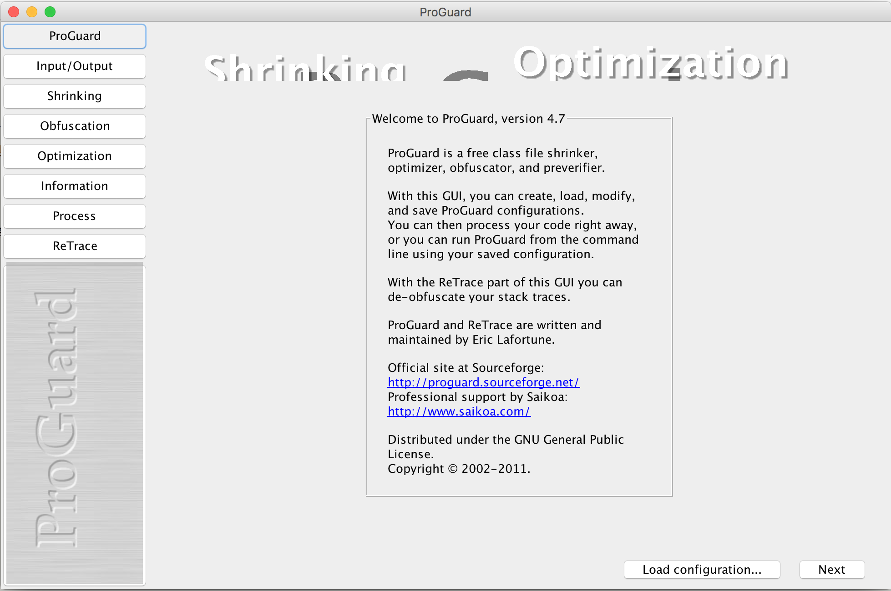

# 1、简介：

> * [Proguard官网](https://www.guardsquare.com/en/proguard)
>
> * 代码混淆(Obfuscated code)亦称花指令，是将计算机程序的代码，转换成一种功能上等价，但是难于阅读和理解的形式的行为。代码混淆可以用于程序[源代码](http://baike.baidu.com/view/60376.htm)，也可以用于程序编译而成的中间代码。执行代码混淆的程序被称作代码混淆器。目前已经存在许多种功能各异的代码混淆器。
>
>   将代码中的各种元素，如变量，函数，类的名字改写成无意义的名字。比如改写成单个字母，或是简短的无意义字母组合，甚至改写成“__”这样的符号，使得阅读的人无法根据名字猜测其用途。重写代码中的部分逻辑，将其变成功能上等价，但是更难理解的形式。比如将for循环改写成while循环，将循环改写成递归，精简中间变量，等等。打乱代码的格式。比如删除空格，将多行代码挤到一行中，或者将一行代码断成多行等等。
>
> * 代码混淆器也会带来一些问题。主要的问题包括：
>
>   被混淆的代码难于理解，因此调试以及除错也变得困难起来。开发人员通常需要保留原始的未混淆的代码用于调试。对于支持反射的语言，代码混淆有可能与反射发生冲突。代码混淆并不能真正阻止反向工程，只能增大其难度。因此，对于对安全性要求很高的场合，仅仅使用代码混淆并不能保证源代码的安全。
>
> * Java是一种跨平台的、[解释型语言](http://baike.baidu.com/view/1233576.htm)，Java[源代码](http://baike.baidu.com/view/60376.htm)编译成中间“[字节码](http://baike.baidu.com/view/560330.htm)”存储于class文件中。由于跨平台的需要，Java字节码中包括了很多源代码信息，如变量名、方法名，并且通过这些名称来访问变量和方法，这些符号带有许多语义信息，很容易被反编译成Java源代码。为了防止这种现象，我们可以使用Java[混淆器](http://baike.baidu.com/view/1906677.htm)对Java字节码进行混淆。
>
> * 混淆就是对发布出去的程序进行重新组织和处理，使得处理后的代码与处理前代码完成相同的功能，而混淆后的代码很难被反编译，即使反编译成功也很难得出程序的真正语义。被混淆过的程序代码，仍然遵照原来的档案格式和指令集，执行结果也与混淆前一样，只是混淆器将代码中的所有变量、函数、类的名称变为简短的英文字母代号，在缺乏相应的函数名和程序注释的情况下，即使被反编译，也将难以阅读。同时混淆是不可逆的，在混淆的过程中一些不影响正常运行的信息将永久丢失，这些信息的丢失使程序变得更加难以理解。
>
> * 混淆器的作用不仅仅是保护代码，它也有精简编译后程序大小的作用。由于以上介绍的缩短变量和函数名以及丢失部分信息的原因， 编译后jar文件体积大约能减少25% ，这对当前费用较贵的无线网络传输是有一定意义的。

# 2､Android代码混淆

## 2.1 开启代码混淆

```groovy
buildTypes {
    release {
    	// 开启混淆
        minifyEnabled true
      	// 开启资源压缩
      	shrinkResources true
      	// proguard-android.txt为android系统自带的混淆规则，proguard-rules.pro是项目需要自定义的混淆规则。
        proguardFiles getDefaultProguardFile('proguard-android.txt'), 'proguard-rules.pro'
    }
}
```

## 2.2 proguard-android.txt

在`AndroidSdk->tools->proguard->proguard-android.txt`中定义了Android系统规定的一些混淆规则。具体如下：

```groovy
# This is a configuration file for ProGuard.
# http://proguard.sourceforge.net/index.html#manual/usage.html
# 混淆时不会产生形形色色的类名
-dontusemixedcaseclassnames
# 指定不去忽略非公共的库的类
# 默认跳过，有些情况下编写的代码与类库中的类在同一个包下，并且持有包中内容的引用，此时就需要加入此条声明
-dontskipnonpubliclibraryclasses
# 混淆时是否记录日志
# 包含有类名->混淆后类名的映射关系
# 然后使用printmapping指定映射文件的名称
-verbose
# Optimization is turned off by default. Dex does not like code run
# through the ProGuard optimize and preverify steps (and performs some
# of these optimizations on its own).
# 不优化输入的类文件，proguard的四个步骤之一
-dontoptimize
# 不做预检验，preverify是proguard的四个步骤之一
# Android不需要preverify，去掉这一步可以加快混淆速度
-dontpreverify
# Note that if you want to enable optimization, you cannot just
# include optimization flags in your own project configuration file;
# instead you will need to point to the
# "proguard-android-optimize.txt" file instead of this one from your
# project.properties file.
# 保护代码中的Annotation不被混淆
-keepattributes *Annotation*
# 表示不混淆下面声明的两个类，这两个类我们基本也用不上，是接入Google原生的一些服务时使用的。
-keep public class com.google.vending.licensing.ILicensingService
-keep public class com.android.vending.licensing.ILicensingService
# For native methods, see http://proguard.sourceforge.net/manual/examples.html#native
# 表示不混淆任何包含native方法的类的类名以及native方法名
-keepclasseswithmembernames class * {
    native <methods>;
}
# keep setters in Views so that animations can still work.
# see http://proguard.sourceforge.net/manual/examples.html#beans
# 保持自定义View的get和set相关方法
-keepclassmembers public class * extends android.view.View {
   void set*(***);
   *** get*();
}
# We want to keep methods in Activity that could be used in the XML attribute onClick
# 保持Activity中View及其子类入参的方法
-keepclassmembers class * extends android.app.Activity {
   public void *(android.view.View);
}
# For enumeration classes, see http://proguard.sourceforge.net/manual/examples.html#enumerations
# 保持枚举 enum 不被混淆 
-keepclassmembers enum * {
    public static **[] values();
    public static ** valueOf(java.lang.String);
}
# 表示不混淆Parcelable实现类中的CREATOR字段
-keepclassmembers class * implements android.os.Parcelable {
  public static final android.os.Parcelable$Creator CREATOR;
}
# 表示不混淆R文件中的所有静态字段
-keepclassmembers class **.R$* {
    public static <fields>;
}
# The support library contains references to newer platform versions.
# Don't warn about those in case this app is linking against an older
# platform version.  We know about them, and they are safe.
# 表示对android.support包下的代码不警告，因为support包中有很多代码都是在高版本中使用的，如果我们的项目指定的版本比较低在打包时就会给予警告。
-dontwarn android.support.**
# Understand the @Keep support annotation.
# 保持Keep注解
-keep class android.support.annotation.Keep
-keep @android.support.annotation.Keep class * {*;}
-keepclasseswithmembers class * {
    @android.support.annotation.Keep <methods>;
}
-keepclasseswithmembers class * {
    @android.support.annotation.Keep <fields>;
}
-keepclasseswithmembers class * {
    @android.support.annotation.Keep <init>(...);
}
```

## 2.3 自定义混淆规则：

项目的自定义混淆规则文件在项目module的proguard-rules.pro文件中定义。以下为适用于大部分项目的混淆规则最佳实践，同时注意不要在其中再添加android自带的混淆规则：

```
# 代码混淆压缩比，在0~7之间，默认为5,一般不下需要修改
-optimizationpasses 5
# 不跳过非公共的库的类成员
-dontskipnonpubliclibraryclassmembers
# 混淆时采用的算法
-optimizations !code/simplification/arithmetic,!field/*,!class/merging/*
# 把混淆类中的方法名也混淆了
-useuniqueclassmembernames
# 优化时允许访问并修改有修饰符的类和类的成员 
-allowaccessmodification
# 将文件来源重命名为“SourceFile”字符串
-renamesourcefileattribute SourceFile
# 抛出异常时保留代码行号
-keepattributes SourceFile,LineNumberTable
# 保持所有实现 Serializable 接口的类成员
-keepclassmembers class * implements java.io.Serializable {
    static final long serialVersionUID;
    private static final java.io.ObjectStreamField[] serialPersistentFields;
    private void writeObject(java.io.ObjectOutputStream);
    private void readObject(java.io.ObjectInputStream);
    java.lang.Object writeReplace();
    java.lang.Object readResolve();
}
# Fragment不需要在AndroidManifest.xml中注册，需要额外保护下
-keep public class * extends android.support.v4.app.Fragment
-keep public class * extends android.app.Fragment
# 保持测试相关的代码
-dontnote junit.framework.**
-dontnote junit.runner.**
-dontwarn android.test.**
-dontwarn android.support.test.**
-dontwarn org.junit.**
```

真正通用的、需要添加的就是上面这些，除此之外，需要每个项目根据自身的需求添加一些==混淆规则==：

* 第三方库所需的混淆规则。正规的第三方库一般都会在接入文档中写好所需混淆规则，使用时注意添加。
* 在运行时动态改变的代码，例如反射。比较典型的例子就是会与 json 相互转换的实体类。假如项目命名规范要求实体类都要放在`model`包下的话，可以添加类似这样的代码把所有实体类都保持住：`-keep public class **.*Model*.** {*;}`
* `JNI`中调用的类。
* `WebView`中`JavaScript`调用的方法
* `Layout`布局使用的`View`构造函数、`android:onClick`等。

## 2.4 混淆结果：

进行混淆打包后在` <module-name>/build/outputs/mapping/release/`目录下会输出以下文件：

* dump.txt：描述APK文件中所有类的内部结构
* mapping.txt：提供混淆前后类、方法、类成员等的对照表
* seeds.txt：列出没有被混淆的类和成员
* usage.txt：列出被移除的代码

## 2.5 反解混淆结果：

* 混淆后的类、方法名等等难以阅读，这固然会增加逆向工程的难度，但对追踪线上 crash 也造成了阻碍。我们拿到 crash 的堆栈信息后会发现很难定位，这时需要将混淆反解。

* 在 `/tools/proguard/` 路径下有附带的的反解工具（Window 系统为 `proguardgui.bat`，Mac 或 Linux 系统为 `proguardgui.sh`）。

* 这里以 Window 平台为例。双击运行 `proguardgui.bat` 后，可以看到左侧的一行菜单。点击 `ReTrace`，选择该混淆包对应的 mapping 文件（混淆后在 `/build/outputs/mapping/release/` 路径下会生成 `mapping.txt` 文件，它的作用是提供混淆前后类、方法、类成员等的对照表），再将 crash 的 `stack trace` 黏贴进输入框中，点击右下角的 `ReTrace` ，混淆后的堆栈信息就显示出来了。

  

* 以上使用 GUI 程序进行操作，另一种方式是利用该路径下的 `retrace` 工具通过命令行进行反解，命令是

  ```
  retrace.bat|retrace.sh [-verbose] mapping.txt [<stacktrace_file>]
  ```

## 2.6 注意事项：

* 所有在 `AndroidManifest.xml` 涉及到的类已经自动被保持，因此不用特意去添加这块混淆规则。（很多老的混淆文件里会加，现在已经没必要）
* `proguard-android.txt` 已经存在一些默认混淆规则，没必要在 `proguard-rules.pro` 重复添加

## 2.7 混淆过程：

* 压缩：移除无效的类、类成员、方法、属性等；
* 优化：分析和优化方法的二进制代码；根据proguard-android-optimize.txt中的描述，优化可能会造成一些潜在风险，不能保证在所有版本的Dalvik上都正常运行；
* 混淆：把类名、属性名、方法名替换为简短且无意义的名称；
* 预校验：添加预校验信息。这个预校验是作用在Java平台上的，Android平台上不需要这项功能，去掉之后还可以加快混淆速度。

# 3､proguard代码混淆规则：

## 3.1 常见混淆命令：

- `optimizationpasses`	# 代码混淆压缩比，在0~7之间，默认为5,一般不下需要修改
- `dontoptimize`   # 不优化输入的类文件，proguard的四个步骤之一
- `dontusemixedcaseclassnames`   # 混淆时不会产生形形色色的类名
- `dontskipnonpubliclibraryclasses`    # 指定不去忽略非公共的库的类
- `dontpreverify`    # 不做预检验
- `dontwarn`    # 不警告
- `verbose`    # 混淆时是否记录日志
- `optimizations`    # 混淆时采用的算法
- `keep`    # 保留类和类中的成员，防止它们被混淆或移除。
- `keepnames`    # 保留类和类中的成员，防止它们被混淆，但当成员没有被引用时会被移除。
- `keepclassmembers`   # 只保留类中的成员，防止它们被混淆或移除。
- `keepclassmembernames`    # 只保留类中的成员，防止它们被混淆，但当成员没有被引用时会被移除。
- `keepclasseswithmembers`    # 保留类和类中的成员，防止它们被混淆或移除，前提是指名的类中的成员必须存在，如果不存在则还是会混淆。
- `keepclasseswithmembernames`    # 保留类和类中的成员，防止它们被混淆，但当成员没有被引用时会被移除，前提是指名的类中的成员必须存在，如果不存在则还是会混淆。

## 3.2 通配符：

|    通配符    | 描述                                       |
| :-------: | :--------------------------------------- |
| < field>  | 匹配类中的所有字段                                |
| < method> | 匹配类中的所有方法                                |
|  < init>  | 匹配类中的所有构造函数                              |
|   *****   | 匹配任意长度字符，但不含包名分隔符(.)。比如说我们的完整类名是com.example.test.MyActivity，使用com.*，或者com.exmaple.*都是无法匹配的，因为*无法匹配包名中的分隔符，正确的匹配方式是com.exmaple.*.*，或者com.exmaple.test.*，这些都是可以的。但如果你不写任何其它内容，只有一个*，那就表示匹配所有的东西。 |
|  ******   | 匹配任意长度字符，并且包含包名分隔符(.)。比如proguard-android.txt中使用的-dontwarn android.support.**就可以匹配android.support包下的所有内容，包括任意长度的子包。 |
|  *******  | 匹配任意参数类型。比如void set*(***)就能匹配任意传入的参数类型，*** get*()就能匹配任意返回值的类型。 |
|  **...**  | 匹配任意长度的任意类型参数。比如void test(…)就能匹配任意void test(String a)或者是void test(int a, String b)这些方法。 |

## 3.3 保持元素不混淆的规则：

```
// 形式
[保持命令] [类] {
    [成员] 
}
```

### 3.3.1 类：

“类”代表类相关的限定条件，它将最终定位到某些符合该限定条件的类。它的内容可以使用：

- 具体的类
- 访问修饰符（`public`、`protected`、`private`）
- 通配符`*`，匹配任意长度字符，但不含包名分隔符(.)
- 通配符`**`，匹配任意长度字符，并且包含包名分隔符(.)
- `extends`，即可以指定类的基类
- `implement`，匹配实现了某接口的类
- $，内部类

### 3.3.2 成员：

“成员”代表类成员相关的限定条件，它将最终定位到某些符合该限定条件的类成员。它的内容可以使用：

- 匹配所有构造器
- 匹配所有域
- 匹配所有方法
- 通配符`*`，匹配任意长度字符，但不含包名分隔符(.)
- 通配符`**`，匹配任意长度字符，并且包含包名分隔符(.)
- 通配符`***`，匹配任意参数类型
- `…`，匹配任意长度的任意类型参数。比如void test(…)就能匹配任意 `void test(String a)` 或者是 `void test(int a, String b)` 这些方法。
- 访问修饰符（`public`、`protected`、`private`）

举例：假如需要将`name.test`包下所有继承`Activity`的`public`类及其构造函数都保持住，可以这样写：

```
-keep public class name.test.** extends Android.app.Activity {
    <init>
}
```

## 3.4 常用的自定义混淆规则：

- 不混淆某个类

  ```
  -keep public class name.example.Test { *; }
  ```

- 不混淆某个包所有的类

  ```
  -keep class name.test.** { *; }
  ```

- 不混淆某个类的子类

  ```
  -keep public class * extends name.example.Test { *; }
  ```

- 不混淆所有类名中包含了“model”的类及其成员

  ```
  -keep public class **.*model*.** {*;}

  ```

- 不混淆某个接口的实现

  ```
  -keep class * implements name.example.TestInterface { *; }
  ```

- 不混淆某个类的构造方法

  ```
  -keepclassmembers class name.example.Test { 
      public <init>(); 
  }
  ```

- 不混淆某个类的特定的方法

  ```
  -keepclassmembers class name.example.Test { 
      public void test(java.lang.String); 
  }
  ```

- 不混淆某个类的内部类

  ```
  -keep class name.example.Test$* {
       *;
  }
  ```

# 附录：

## 自定义资源混淆规则：

### 1. keep.xml

用`shrinkResources true`开启资源压缩后，所有未被使用的资源默认被移除。假如你需要定义哪些资源必须被保留，在 `res/raw/` 路径下创建一个 xml 文件，例如 `keep.xml`。

通过一些属性的设置可以实现定义资源保持的需求，可配置的属性有：

- `tools:keep` 定义哪些资源需要被保留（资源之间用“,”隔开）
- `tools:discard` 定义哪些资源需要被移除（资源之间用“,”隔开）
- `tools:shrinkMode` 开启严格模式

当代码中通过 `Resources.getIdentifier()` 用动态的字符串来获取并使用资源时，普通的资源引用检查就可能会有问题。例如，如下代码会导致所有以“img_”开头的资源都被标记为已使用。

```java
String name = String.format("img_%1d", angle + 1);
res = getResources().getIdentifier(name, "drawable", getPackageName());
```

我们可以设置 `tools:shrinkMode` 为 `strict` 来开启严格模式，使只有确实被使用的资源被保留。

以上就是自定义资源保持规则相关的配置，举个例子：

```xml
<?xml version="1.0" encoding="utf-8"?>
<resources xmlns:tools="http://schemas.android.com/tools"
    tools:keep="@layout/l_used*_c,@layout/l_used_a,@layout/l_used_b*"
    tools:discard="@layout/unused2"
    tools:shrinkMode="strict"/>
```

### 2. 移除替代资源

一些替代资源，例如多语言支持的 `strings.xml`，多分辨率支持的 `layout.xml` 等，在我们不需要使用又不想删除掉时，可以使用资源压缩将它们移除。

我们使用 `resConfig` 属性来指定需要支持的属性，例如

```groovy
android {
    defaultConfig {
        ...
        resConfigs "en", "fr"
    }
}
```

其他未显式声明的语言资源将被移除。

# 参考：

1.[写给Android开发者的混淆使用手册](http://www.jianshu.com/p/158aa484da13)

2.[Android安全攻防战，反编译与混淆技术完全解析（下）](http://blog.csdn.net/guolin_blog/article/details/50451259)

3.[混淆的另一重境界](http://mp.weixin.qq.com/s/rpDFA-h5t2RA9Dih3gVqVA?utm_source=tuicool&utm_medium=referral)