##  配置构建

> Android 构建系统编译应用资源和源代码，然后将它们打包成可供您测试、部署、签署和分发的 APK。Android Studio 使用 [Gradle](http://www.gradle.org/) 这一高级构建工具包来自动化执行和管理构建流程，同时也允许您定义灵活的自定义构建配置。每个构建配置均可自行定义一组代码和资源，同时对所有应用版本共有的部分加以重复利用。Android Plugin for Gradle 与这个构建工具包协作，共同提供专用于构建和测试 Android 应用的流程和可配置设置。
>
> Gradle 和 Android 插件独立于 Android Studio 运行。这意味着，您可以在 Android Studio 内、使用计算机上的命令行工具或在未安装 Android Studio 的计算机（例如持续性集成服务器）上构建 Android 应用。如果您不使用 Android Studio，可以学习如何[从命令行构建和运行您的应用](https://developer.android.google.cn/studio/build/building-cmdline.html)。无论您是从命令行、在远程计算机上还是使用 Android Studio 构建项目，构建的输出都相同。
>
> **注：由于 Gradle 和 Android 插件独立于 Android Studio 运行，您需要单独更新构建工具。请阅读版本说明，了解如何[更新 Gradle 和 Android 插件](https://developer.android.google.cn/studio/releases/gradle-plugin.html#updating-plugin)。**
>
> Android 构建系统非常灵活，让您能够在不修改应用核心源文件的情况下执行自定义构建配置。本章帮助您了解 Android 构建系统的工作原理，以及它如何帮助您对多个构建配置进行自定义和自动化处理。如果您只想了解有关部署应用的更多信息，请参阅[在 Android Studio 中构建和运行项目](https://developer.android.google.cn/studio/run/index.html)。要立即开始使用 Android Studio 创建自定义构建配置，请参阅[配置构建变体](https://developer.android.google.cn/studio/build/build-variants.html)。

### 构建流程

> 构建流程涉及许多将您的项目转换成 Android 应用软件包 (APK) 的工具和流程。构建流程非常灵活，因此了解它的一些底层工作原理会很有帮助。


<center>**图1.**  典型 Android 应用模块的构建流程。</center>

> 如图 1 所示，典型 Android 应用模块的构建流程通常依循下列步骤：
>
> 1. 编译器将您的源代码转换成 DEX（Dalvik Executable) 文件（其中包括运行在 Android 设备上的字节码），将所有其他内容转换成已编译资源。
>
> 2. APK 打包器将 DEX 文件和已编译资源合并成单个 APK。不过，必须先签署 APK，才能将应用安装并部署到 Android 设备上。
>
> 3. APK 打包器使用调试或发布密钥库签署您的 APK：
>
>    a. 如果您构建的是调试版本的应用（即专用于测试和分析的应用），打包器会使用调试密钥库签署您的应用。Android Studio 自动使用调试密钥库配置新项目。
>
>    b. 如果您构建的是打算向外发布的发布版本应用，打包器会使用发布密钥库签署您的应用。要创建发布密钥库，请阅读[在 Android Studio 中签署您的应用](https://developer.android.google.cn/studio/publish/app-signing.html#studio)。
>
> 4. 在生成最终 APK 之前，打包器会使用 [zipalign](https://developer.android.google.cn/studio/command-line/zipalign.html) 工具对应用进行优化，减少其在设备上运行时的内存占用。
>
> 构建流程结束时，您将获得可用来进行部署、测试的调试 APK，或者可用来发布给外部用户的发布 APK。

### 自定义构建配置

> Gradle 和 Android 插件可帮助您完成以下方面的构建配置：
>
> *构建类型*
>
> ​	构建类型定义 Gradle 在构建和打包您的应用时使用的某些属性，通常针对开发生命周期的不同阶段进行配置。例如，调试构建类型支持调试选项，使用调试密钥签署 APK；而发布构建类型则可压缩、混淆 APK 以及使用发布密钥签署 APK 进行分发。您必须至少定义一个构建类型才能构建应用 - Android Studio 默认情况下会创建调试和发布构建类型。要开始为应用自定义打包设置，请学习如何[配置构建类型](https://developer.android.google.cn/studio/build/build-variants.html#build-types)。
>
> *产品风味* 
>
> ​	产品风味代表您可以发布给用户的不同应用版本，例如免费和付费的应用版本。您可以将产品风味自定义为使用不同的代码和资源，同时对所有应用版本共有的部分加以共享和重复利用。产品风味是可选项，并且您必须手动创建。要开始创建不同的应用版本，请学习如何[配置产品风味](https://developer.android.google.cn/studio/build/build-variants.html#product-flavors)。
>
> *构建变体*
>
> ​	构建变体是构建类型与产品风味的交叉产物，是 Gradle 在构建应用时使用的配置。您可以利用构建变体在开发时构建产品风味的调试版本，或者构建已签署的产品风味发布版本进行分发。您并不直接配置构建变体，而是配置组成变体的构建类型和产品风味。创建附加构建类型或产品风味也会创建附加构建变体。要了解如何创建和管理构建变体，请阅读[配置构建变体](https://developer.android.google.cn/studio/build/build-variants.html)概览。
>
> *清单条目*
>
> ​	您可以为构建变体配置中清单文件的一些属性指定值。这些构建值会替换清单文件中的现有值。如果您想为模块生成多个 APK，让每一个 APK 文件都具有不同的应用名称、最低 SDK 版本或目标 SDK 版本，便可运用这一技巧。存在多个清单时，Gradle 会[合并清单设置](https://developer.android.google.cn/studio/build/manifest-merge.html)。
>
> *依赖项*
>
> ​	构建系统管理来自您的本地文件系统以及来自远程存储区的项目依赖项。这样一来，您就不必手动搜索、下载依赖项的二进制文件包以及将它们复制到项目目录内。要了解更多信息，请学习如何[声明依赖项](https://developer.android.google.cn/studio/build/build-variants.html#dependencies)。
>
> *签署*
>
> ​	构建系统让您能够在构建配置中指定签署设置，并可在构建过程中自动签署您的 APK。构建系统通过使用已知凭据的默认密钥和证书签署调试版本，以避免在构建时提示密码。除非您为此构建显式定义签署配置，否则，构建系统不会签署发布版本。如果您没有发布密钥，可以按[签署您的应用](https://developer.android.google.cn/studio/publish/app-signing.html)中所述生成一个。
>
> *ProGuard*
>
> ​	构建系统让您能够为每个构建变体指定不同的 [ProGuard](https://developer.android.google.cn/studio/build/shrink-code.html) 规则文件。构建系统可在构建过程中运行 ProGuard 对类进行压缩和混淆处理。
>
> *APK 拆分*
>
> ​	构建系统让您能够自动构建不同的 APK，并且每个 APK 只包含特定屏幕密度或应用二进制界面 (ABI) 所需的代码和资源。如需了解详细信息，请参阅[配置 APK 拆分](https://developer.android.google.cn/studio/build/configure-apk-splits.html)。

### 构建配置文件

> 创建自定义构建配置需要您对一个或多个构建配置文件（或 `build.gradle` 文件）进行更改。这些纯文本文件使用域特定语言 (DSL) 以 [Groovy](http://groovy.codehaus.org/) 语言描述和操作构建逻辑，后者是一种适用于 Java 虚拟机 (JVM) 的动态语言。您无需了解 Groovy 便可开始配置构建，因为 Android Plugin for Gradle 引入了您需要的大多数 DSL 元素。如需了解有关 Android 插件 DSL 的更多信息，请阅读 [DSL 参考文档](http://google.github.io/android-gradle-dsl/current/index.html)。
>
> 开始新项目时，Android Studio 会自动为您创建其中的部分文件（如图 2 所示），并为它们填充*合理的默认值*。


<center>**图 2.** Android 应用模块的默认项目结构。</center>

> 有几个 Gradle 构建配置文件是 Android 应用标准项目结构的组成部分。您必须了解其中每一个文件的范围和用途及其应定义的基本 DSL 元素，才能着手配置构建。

### Gradle设置文件

>`settings.gradle` 文件位于项目根目录，用于指示 Gradle 在构建应用时应将哪些模块包括在内。对大多数项目而言，该文件很简单，只包括以下内容：

```groovy
include ‘:app’
```

> 不过，多模块项目需要指定应包括在最终构建之中的每个模块。

### 顶级构建文件

> 顶级 `build.gradle` 文件位于项目根目录，用于定义适用于项目中所有模块的构建配置。默认情况下，这个顶级构建文件使用 `buildscript {}` 代码块来定义项目中所有模块共用的 Gradle *存储区*和*依赖项*。以下代码示例描述的默认设置和 DSL 元素可在新建项目后的顶级 `build.gradle` 文件中找到。

```groovy
/**
 * buildscript {}闭包是Gradle本身配置仓库和依赖的地方，不能在这个地方包括模块需要的依赖。例如：
 * 这个模块用依赖将Gradle的Android插件包含进来，并且提供了额外的说明关于Gradle需要去编译的Android
 * app模块。
 */
buildscript {
	/**
	 * repositories {}闭包配置了Gradle去搜索或者下载依赖的仓库。Gradle预配置支持以下远程仓库：
	 * JCenter，Maven Central，Ivy。你可以使用本地仓库或者定义你自己的远程仓库。下面的代码
	 * 配置JCenter仓库作为Gradle去查找依赖的仓库。
	 */
    repositories {
        jcenter()
    }
	/**
	 * dependencies {}闭包配置用来编译项目的Gradle。下面的代码添加版本为3.0.1的Gradle的Android
	 * 插件做为依赖。
	 */
    dependencies {
        classpath 'com.android.tools.build:gradle:3.0.1'
    }
}
/**
 * allprojects {}闭包是你配置你的项目包括的所有的模块的依赖和仓库，例如第三方的插件或者libs。
 * 不是项目中所有的模块都需要的依赖需要在模块级别的build.gradle文件中配置。每个新的项目，Android
 * Studio配置JCenter做为默认仓库，但是并不配置任何依赖。
 */
allprojects {
   repositories {
       jcenter()
   }
}
```

### 模块级构建文件

> 模块级 `build.gradle` 文件位于每个 `<project>/<module>/` 目录，用于配置适用于其所在模块的构建设置。您可以通过配置这些构建设置来提供自定义打包选项（例如附加构建类型和产品风味），以及替换 `main/` 应用清单或顶级 `build.gradle` 文件中的设置。

* 以下这个示例 Android 应用模块 `build.gradle` 文件概述了您应该了解的部分基本 DSL 元素和设置。

```groovy
/**
 * 编译配置中的第一行代码使Gradle的Android插件应用于这个编译，同时使android {}闭包可用，并可配置
 * Android相关的配置。
 */
apply plugin: 'com.android.application'
/**
 * android {}闭包是用来配置针对Android相关的编译选项的。
 */
android {
  /**
   * compileSdkVersion指定的是Gradle用来编译的Android版本。也就是说你可以使用当前Android版本的
   * 特性及更低版本的特性。
   * buildToolsVersion指出Android的SDK的编译工具的版本，命令行工具，以及Gradle用来编译项目的编译器。
   * 你可以使用SDK Manager来下载编译工具。
   */
  compileSdkVersion 26
  buildToolsVersion "26.0.2"
  /**
   * defaultConfig {}闭包将一些默认的配置及针对所有的构建变体的配置，并且可以根据编译系统动态覆盖一些  
   * main/AndroidManifest.xml中的属性。你可以在产品风味根据不同的产品版本配置不同的值，这些值可以覆盖
   * 这里配置的值。
   */
  defaultConfig {
	/**
	 * applicationId唯一指定发布时的包名称。然而，你的代码仍然需要引用在main/AndroidManifest.xml
	 * 指定的包名称。
	 */
    applicationId 'com.example.myapp'
    // 指定app运行的最低版本。
    minSdkVersion 15
    // 指定测试app的API level
    targetSdkVersion 26
    // 指定应用版本号
    versionCode 1
    // 指定一个用户友好的版本名称
    versionName "1.0"
  }
  /**
   * buildTypes {}闭包是用来配置应用的多个构建类型的。默认，编译系统定义了两个构建类型：
   * debug和release。debug构建类型没有明确的在默认的编译配置中显示，但是它包括调试工具并且
   * 默认使用debug key签名。release构建类型使用Proguard设（混淆）置并且默认没有被签名。
   */
  buildTypes {
	/**
	 * 默认情况下，Android Studio配置release构建类型，并且使用minifyEnabled启用代码压缩，
	 * 同时指定代码混淆的配置文件。
	 */
    release {
        minifyEnabled true // Enables code shrinking for the release build type.
        proguardFiles getDefaultProguardFile('proguard-android.txt'), 'proguard-rules.pro'
    }
  }
  /**
   * productFlavors {}闭包是用来配置多个产品风味的。这里可以创建你的项目的不同的版本，并且可以
   * 使用它们自己的配置重写defaultConfig {}中配置的Android相关配置。产品风味是可选的，编译系统
   * 默认没有创建它们。下面的例子创建了一个free和一个paid产品风味。每一个产品风味指定了它们自己的
   * application ID，因此它们可以同时可以发布在Google Play Store，也可以在同一个设备中安装。
   */
  productFlavors {
    free {
      applicationId 'com.example.myapp.free'
    }

    paid {
      applicationId 'com.example.myapp.paid'
    }
  }
  /**
   * splits {}闭包可以有来根据手机所支持的不同的屏幕密度和ABI配置不同的APK编译版本。同时你需要配置
   * 你不同的APK有不同的版本号。
   */
  splits {
    // 屏幕密度split设置
    density {
      // 启用或者彬密度split机制
      enable false
      // 从splits中排除以下这些密度
      exclude "ldpi", "tvdpi", "xxxhdpi", "400dpi", "560dpi"
    }
  }
}
/**
 * 在项目模块级别中的dependencies {}闭包配置文件仅仅用来指出用来编译本模块的依赖。
 */
dependencies {
    compile project(":lib")
    compile 'com.android.support:appcompat-v7:27.0.2'
    compile fileTree(dir: 'libs', include: ['*.jar'])
}
```

### Gradle属性文件

> Gradle 还包括两个属性文件，位于项目根目录，可用于指定适用于 Gradle 构建工具包本身的设置：
>
> `gradle.properties`
>
> * 您可以在其中配置项目范围 Gradle 设置，例如 Gradle 后台进程的最大堆大小。如需了解详细信息，请参阅[构建环境](https://docs.gradle.org/current/userguide/build_environment.html)
>
> `local.properties`
>
> * 为构建系统配置本地环境属性，例如 SDK 安装路径。由于该文件的内容由 Android Studio 自动生成并且专用于本地开发者环境，因此您不应手动修改该文件，或将其纳入您的版本控制系统。

### 将项目与Gradle文件同步

> 当您在项目中对构建配置文件进行更改时，Android Studio 会要求您同步项目文件，以便其导入您的构建配置更改并执行一些检查来确保您的配置不会造成构建错误。
>
> 要同步项目文件，您可以点击做出更改后出现的通知栏中的 **Sync Now**（如图 3 所示），或者点击菜单栏中的 **Sync Project** 。如果 Android Studio 通知配置出现错误，例如：您的源代码使用了只有在 `compileSdkVersion` 以上的 API 级别中才会提供的 API 功能，会显示 **Messages** 窗口，具体描述该问题。

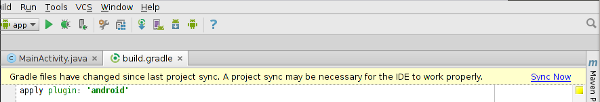

<center>**图 3.**  在 Android Studio 中将项目与构建配置文件同步。</center>

### 源集

> Android Studio 按逻辑关系将每个模块的源代码和资源分组为*源集*。模块的 `main/` 源集包括其所有构建变体共用的代码和资源。其他源集目录为可选项，在您配置新的构建变体时，Android Studio 不会自动为您创建这些目录。不过，创建类似于 `main/` 的源集有助于让 Gradle 只应在构建特定应用版本时使用的文件和资源井然有序：

* `src/main/`：此源集包括所有构建变体共用的代码和资源。


* `src/<buildType>/`：创建此源集可加入特定构建类型专用的代码和资源。
* `src/<productFlavor>/`：创建此源集可加入特定产品风味专用的代码和资源。
* `src/<productFlavorBuildType>/`：创建此源集可加入特定构建变体专用的代码和资源。

> 例如，要生成应用的“完整调试”版本，构建系统需要合并来自以下源集的代码、设置和资源：

* `src/fullDebug/`（构建变体源集）
* `src/debug/`（构建类型源集）
* `src/full/`（产品风味源集）
* `src/main/`（主源集）

> **注**：当您在 Android Studio 中使用 **File > New** 菜单选项新建文件或目录时，可以针对特定源集进行创建。可供您选择的源集取决于您的构建配置，如果所需目录尚不存在，Android Studio 会自动创建。
>
> 如果不同源集包含同一文件的不同版本，Gradle 将按以下优先顺序决定使用哪一个文件（左侧源集替换右侧源集的文件和设置）：
>
> **构建变体 > 构建类型 > 产品风味 > 主源集 > 库依赖项**
>
> 这样一来，Gradle 便可使用专用于您试图构建的构建变体的文件，同时对与其他应用版本共用的 Activity、应用逻辑和资源加以重复利用。在[合并多个清单](https://developer.android.google.cn/studio/build/manifest-merge.html)时，Gradle 使用同一优先顺序，这样每个构建变体都能在最终清单中定义不同的组件或权限。如需了解有关创建自定义源集的更多信息，请转至[创建用于构建变体的源集](https://developer.android.google.cn/studio/build/build-variants.html#sourcesets)。

## 设置应用ID

> 每个 Android 应用均有一个唯一的应用 ID，像 Java 软件包名称一样，如 *com.example.myapp*。 此 ID 可以在设备上和 Google Play 商店中对您的应用进行唯一标识。 如果您想要上传新版本的应用，应用 ID（以及[使用它签署的证书](https://developer.android.google.cn/studio/publish/app-signing.html)）必须与原始 APK 相同 - 如果您更改应用 ID，Google Play 商店会将 APK 视为完全不同的应用。所以您发布应用后，**绝不应更改应用 ID**。
>
> 您的应用 ID 通过模块的 `build.gradle` 文件中的 `applicationId` 属性定义，如下面所示：

```groovy
android {
    defaultConfig {
        applicationId "com.example.myapp"
        minSdkVersion 15
        targetSdkVersion 24
        versionCode 1
        versionName "1.0"
    }
    ...
}
```

> 当您在 Android Studio 中创建新项目时，`applicationId` 会完全匹配您在设置时选择的 Java 风格软件包名称。 不过，***除了这一点，应用 ID 和软件包名称彼此无关。***您可以更改代码的软件包名称（代码命名空间），这不会影响应用 ID，反之亦然（但同样，您发布应用后不应再更改应用 ID）。不过，您需要注意，更改软件包名称会产生其他影响，请参阅[修改软件包名称](https://developer.android.google.cn/studio/build/application-id.html#modify_the_package_name)的相关部分。
>
> 尽管应用 ID 看起来像传统的 Java 软件包名称，但应用 ID 的命名规则有更多限制：
>
> * 必须至少包含两段（一个或多个圆点）。
> * 每段必须以字母开头。
> * 所有字符必须为字母数字或下划线 [a-zA-Z0-9_]。
>
> **注：** 应用 ID 用于直接关联到代码的软件包名称；所以有些 Android API 会在其方法名称和参数名称中使用术语“软件包名称”，但这实际上是您的应用 ID。例如，[`Context.getPackageName()`](https://developer.android.google.cn/reference/android/content/Context.html#getPackageName()) 方法会返回您的应用 ID。 无论何时都不需要在应用代码以外分享代码真实的软件包名称。
>
> **注意：**如果您使用的是 [`WebView`](https://developer.android.google.cn/reference/android/webkit/WebView.html)，请考虑在您的应用 ID 中将您的软件包名称用作前缀；否则，您可能会遇到如[问题 211768](https://code.google.com/p/android/issues/detail?id=211768) 中所述的问题。

### 更改用于构建变体的应用 ID

> 当您为应用构建 APK 时，构建工具会使用 `build.gradle` 文件的 `defaultConfig` 块中定义的应用 ID 标记 APK（如下所示）。不过，如果您想要创建不同版本的应用以在 Google Play 商店上显示为单独详情，如“免费版”和“专业版”，您需要创建单独的[构建变体](https://developer.android.google.cn/studio/build/build-variants.html)，每个构建变体具有不同的应用 ID。
>
> 这种情况下，每个构建变体应定义为单独的[产品风味](https://developer.android.google.cn/studio/build/build-variants.html#product-flavors)。 对于 `productFlavors {}` 块中的每种风味，您可以重新定义 `applicationId` 属性，或者改用 `applicationIdSuffix` 在默认的应用 ID 上追加一段，如下所示：

```groovy
android {
    defaultConfig {
        applicationId "com.example.myapp"
    }
    productFlavors {
        free {
            applicationIdSuffix ".free"
        }
        pro {
            applicationIdSuffix ".pro"
        }
    }
}
```

> 这样，“免费”产品风味的应用 ID 就变为“com.example.myapp.free”。
>
> **注意：现在使用Gradle构建项目时会提示出错：**`All flavors must now belong to a named flavor dimension.`这是因为现在在productFlavors中定义的类型需要包含在flavor dimension中，关于flavor dimension后面会详细介绍。修改后的配置如下：

```groovy
productFlavors {
    flavorDimensions "paid"
    free {
        dimension "paid"
        applicationIdSuffix ".free"
    }
    pro {
        dimension "paid"
        applicationIdSuffix ".pro"
    }
}
```

> 您也可以根据自己的[构建类型](https://developer.android.google.cn/studio/build/build-variants.html#build-types)使用 `applicationIdSuffix` 追加一段，如下所示：

```groovy
android {
    ...
    buildTypes {
        debug {
            applicationIdSuffix ".debug"
        }
    }
}
```

> 因为 **Gradle 会在产品风味后面应用构建类型配置，“免费调试”构建变体的应用 ID 现在为“com.example.myapp.free.debug”。**如果您想要在同一个设备上创建调试和发布构建，这会十分有用，因为两个 APK 不会具有相同的应用 ID。
>
> 请记住，具有不同应用 ID 的 APK 在 Google Play 商店中会被视为不同的应用。 所以如果您想要改用相同的应用详情分发多个 APK，每个 APK 以不同设备配置（如 API 级别）为目标，那么您必须对每个构建变体使用相同的应用 ID，但为每个 APK 提供不同的 `versionCode`。如需了解详细信息，请参阅[多 APK 支持](https://developer.android.google.cn/google/play/publishing/multiple-apks.html)。
>
> **注意：**对于与之前的 SDK 工具的兼容性，如果您不在 `build.gradle` 文件中定义 `applicationId` 属性，构建工具会将 `AndroidManifest.xml` 文件中的软件包名称用作应用 ID。这种情况下，重构您的软件包名称也会更改您的应用 ID。
>
> **提示：**如果您需要在清单文件中引用应用 ID，可以在任何清单属性中使用 `${applicationId}` 占位符。构建时，Gradle 会将此标记替换为实际的应用 ID。 如需了解详细信息，请参阅[将构建变量注入清单](https://developer.android.google.cn/studio/build/manifest-build-variables.html)。

### 更改用于测试的应用ID

> 默认情况下，构建工具会将应用 ID 应用到您的[仪器测试](https://developer.android.google.cn/training/testing/unit-testing/instrumented-unit-tests.html) APK，该 APK 将应用 ID 用于给定的构建变体，同时追加 `.test`。例如，`com.example.myapp.free` 构建变体的测试 APK 的应用 ID 为 `com.example.myapp.free.test`。
>
> 尽管不必需，您也可以通过在 `defaultConfig` 或`productFlavor` 块中定义 `testApplicationId` 属性来更改应用 ID。
>
> 注：为了避免与受测应用的名称冲突，构建工具会根据测试应用 ID（而不是清单文件中定义的软件包名称）通过命名空间为您的测试 APK 生成 `R` 类。

### 更改软件包名称

> 默认情况下，您项目的软件包名称会匹配应用 ID，但您也可以更改软件包名称。 不过，如果您想要更改软件包名称，请注意软件包名称（由您的项目目录结构定义）应始终匹配 `AndroidManifest.xml` 文件中的 `package` 属性，如下所示：

```groovy
<?xml version="1.0" encoding="utf-8"?>
<manifest xmlns:android="http://schemas.android.com/apk/res/android"
    package="com.example.myapp"
    android:versionCode="1"
    android:versionName="1.0" >
```

> **Android 构建工具会将 `package` 属性用于下面两方面**：
>
> * 它会将此名称用作应用生成的 `R.java` 类的命名空间。
>   * 示例：对于上面的清单，`R` 类将为 `com.example.myapp.R`。
> * 它会使用此名称解析清单文件中声明的任何相关类名称。
>   * 示例：对于上面的清单，声明为 `<activity android:name=".MainActivity">` 的 Activity 将解析为 `com.example.myapp.MainActivity`。
>
> 同样，`package` 属性中的名称应始终匹配您项目的基础软件包名称，软件包中保存着您的 Activity 和其他应用代码。 当然，您的项目中可以包含子软件包，但是这些文件必须从 `package` 属性导入使用命名空间的 `R.java` 类，而且清单中声明的任何应用组件均必须添加缺失的子软件包名称（或者使用完全限定软件包名称）。
>
> 如果您想要完全重构您的软件包名称，请确保也更新 `package` 属性。 只要您使用 Android Studio 的工具重命名和重构您的软件包，那么这些属性就会自动保持同步。 （如果这些属性未保持同步，您的应用代码将无法解析 `R` 类，因为它不在相同的软件包内，且清单不会标识您的 Activity 或其他组件。）
>
> 您必须始终在项目的主 `AndroidManifest.xml` 文件中指定 `package` 属性。 如果您有附加的清单文件（例如用于产品风味或构建类型），请注意优先级最高的清单文件提供的软件包名称始终用于最终合并的清单中。 如需了解详细信息，请参阅[合并多个清单文件](https://developer.android.google.cn/studio/build/manifest-merge.html)。
>
> **您还需要了解以下内容：**尽管清单 `package` 和 Gradle `applicationId` 可以具有不同的名称，但构建工具会在构建结束时将应用 ID 复制到 APK 的最终清单文件中。所以，如果您在构建后检查 `AndroidManifest.xml` 文件，`package` 属性发生更改就不足为奇。实际上，Google Play 商店和 Android 平台会注意 `package` 属性来标识您的应用；所以构建利用原始值后（用作 `R` 类的命名空间并解析清单类名称），它将会舍弃此值并将其替换为应用 ID。

### 总结：

1. <u>**package属性：应用于R.java的引用包路径，以及在AndroidManifest.xml中被当做简写名称的组件的前缀。**</u>
2. <u>**applicationID：用来在手机或者应用商店中区分不同的APK，并且applicationID将替换最终合成的AndroidManifest.xml文件中的package属性的值。**</u>

## 添加构建依赖

> Android Studio中的Gradle编译系统可以很容易的将外部的库或者其他库模块添加到项目的依赖中。依赖包可以是本地的也可以是远程仓库的，同时任何的传递性的依赖也会被自动的包含进来。
>
> 本节描述了如何在你的Android项目中使用依赖，包含性能的详细信息以及针对Android的Gradle插件的配置。如果要更深的理解Gradle的依赖机制，可以查看[Gradle依赖指南](https://docs.gradle.org/current/userguide/dependency_management.html)—但是需要注意你的Android项目只可以使用本节定义的依赖配置。

### 依赖类型

> 可以通过在你的模块级别的build.gradle文件中的`dependencies` 闭包中添加比如：`compile` 等来添加依赖包。**<u>3.0版本的Gradle插件对这些关键字已经有了新的变化，具体变更请参阅如何升级到3.0版本。</u>**
>
> 例如：下面的app模块的build.gradle文件包含三个不同类型的依赖：

`````groovy
apply plugin: 'com.android.application'
android { ... }
dependencies {
    // 依赖一个本地的library模块
    compile project(":mylibrary")
    // 依赖本地的二进制文件
    compile fileTree(dir: 'libs', include: ['*.jar'])
    // 依赖一个远程的二进制文件
    compile 'com.example.android:app-magic:12.3'
}
`````

>  所有的依赖请求都是下面的依赖的一种：

* 本地库模块依赖

  ```groovy
  compile project(':mylibrary')
  ```

  这句代码声明项目依赖一个名为`mylibrary`的Android库文件(这个名字必须和项目的settings.gradle文件中所包含的库名字匹配)。

* 本地二进制文件依赖

  ```groovy
  compile fileTree(dir: 'libs', include: ['*.jar'])
  ```

  因为Gradle读取的路径是相对于module中的build.gradle文件的，所以上面的代码告诉编译系统添加项目的`module_name/libs/`文件夹中的所有JAR文件。

  或者，你也可以指定单独的依赖文件，如下：

  ```groovy
  compile files('libs/foo.jar', 'libs/bar.jar')
  ```

* 远程二进制文件依赖

  ```groovy
  compile 'com.example.android:app-magic:12.3'
  ```

  这是下面这种写法的简略形式：

  ```groovy
  compile group: 'com.example.android', name: 'app-magic', version: '12.3'
  ```

  这句代码声明module依赖一个名为`app-magic`，版本号为`12.3`，组织名为`code.example.android`的库文件.

  > **注意：**只有声明合适的远程仓库才可以从中查找你需要的远程库文件。当你第一次构建项目时，如果本地不存在相应的远程库文件，Gradle会从远程的仓库中下载它。

### 配置依赖库

> 在`dependencies` 闭包中，你可以使用以下的几个依赖关键字说明项目的依赖配置(例如上面提到的`compile` )。每一个依赖关键字都对应有不同的Gradle库依赖策略。下面的列表描述了所有你可以在Android项目中配置的库依赖。
>
> **注意：**Gradle的Java插件所提供的依赖配置关键字并不适合Android项目，只有下面的依赖关键字说明是和Gradle的Android插件兼容的。
>
> 如果你使用的是Gradle的Android插件的版本是3.0及以上的，你应该使用新的`implementation`, `api`, `compileOnly`, 和`runtimeOnly`依赖配置。它们和下面的配置是相似的，不过新的配置通过允许你去限制是否及时的输出一个依赖到其他模块，从而提高了多模块项目的编译速度。更多请点击：[使用新的依赖配置](https://developer.android.google.cn/studio/build/gradle-plugin-3-0-0-migration.html#new_configurations)。
>
> * `compile`
>
>   Gradle会把依赖添加到编译路径和APK中。
>
> * `apk`
>
>   Gradle只把依赖添加到APK中(并不会添加到编译路径中)。****
>
>   > **注意：**你只可以使用`apk`把JAR包添加到APK中，不支持添加library模块或者AAR文件。
>
> * `provided`
>
>   Gradle只添加依赖到编译路径(不添加到APK)。当你想创建一个Android library模块时并且只在编译的时候需要相关的依赖，但是在运行的时候是可选择的时候是有用的。因此，如果你使用这个配置，你的库模块必须包含一个运行时的条件检查，以判断是否包含这个依赖，然后在没有包含的时候友好的改变实现，这样库模块还可以正常的使用。这有助于通过不添加非关键的过滤依赖从而减少最终的APK大小。
>
>   如果你的依赖是一个JAR文件并且你只是在编译时需要它(因此你不需要复制它到你的APK中)而且可以在运行时安全的判断它是否可用，那你也可以在Android主项目中使用这个配置。或者，你想在在编译时使用`provided`指定的JAR，而在运行时使用一个用`apk`指定的具有相同APIs的JAR文件。
>
>   > **注意：**如果你在app的主模块中使用`provided`配置，那么它只能用来指定JAR文件，而不能用在AAR依赖上。而在Android library模块中可以同时用在JAR或AAR依赖上。
>
>   上面的配置适用于主项目source set，以及所有的构建变体。如果你想针对某一个构建变体source set或测试source set声明一个依赖，你必须以构建变体或者测试的source set的名字开始并且配置的首字母大写来指定一个特定的依赖。
>
>   例如，给项目的`"free`"产品风味添加一个`compile`依赖(使用一个远程的二进制依赖)，如下：
>
>   ```groovy
>   dependencies {
>       freeCompile 'com.google.firebase:firebase-ads:9.8.0'
>   }
>   ```
>
>   然后，如果你想给一个组合了产品风味和构建类型的变体添加依赖，那么你必须初始化配置的名字在`configurations`闭包中。下面的例子给“freeDebug”构建变体添加了一个`apk`依赖(使用一个本地的依赖)。
>
>   ```groovy
>   configurations {
>       // 给freeDebugApk依赖配置初始化一个占位符
>       freeDebugApk {}
>   }
>   dependencies {
>       freeDebugApk fileTree(dir: 'libs', include: ['*.jar'])
>   }
>   ```
>
>   给你的本地测试和设备化测试加一个`compile`依赖，如下：
>
>   ```groovy
>   dependencies {
>       // 给本地测试添加一个远程的二进制依赖
>       testCompile 'junit:junit:4.12'
>       // 添加一个远程的二进制依赖给设备化测试
>       androidTestCompile 'com.android.support.test.espresso:espresso-core:2.2.2'
>   }
>   ```
>
>   同时你的[library模块提供了多个变体](https://developer.android.google.cn/studio/projects/android-library.html#publish_multiple_variants)，你可以给不同的app变体添加不同的library变体。如下;
>
>   ```groovy
>   dependencies {
>     // 将library的'debug'变体添加到app的debug变体。
>     debugCompile project(path: ':my-library-module', configuration: 'debug')
>     // 将library的'release'变体添加到app的release变体。
>     releaseCompile project(path: ':my-library-module', configuration: 'release')
>   }
>   ```
>
>   > **如果你使用的是Android的Gradle3.0.0版本及以上**，插件会自动的匹配每个变体对应你的本地library模块依赖。因为你不需要再像上面那样指定不同的变体来对应不同的本地模块的依赖。更详细的说明，请查看[使用变体依赖管理]()。
>
>   更多信息，请查看[Java插件依赖管理](https://docs.gradle.org/current/userguide/java_plugin.html#sec:java_plugin_and_dependency_management)。

#### 远程仓库

> 如果你的依赖不是本地库或者文件依赖，Gradle查找它们在你的`build.gradle`文件的`repositories`闭包中指定的所有在线仓库中查找。
>
> 默认情况下，新的Android Studio工程在项目的根目录下的`build.gradle`中声明JCenter做为远程仓库的地址。如下：
>
> ```groovy
> allprojects {
>     repositories {
>         jcenter()
>     }
> }
> ```
>
> 如果你需要从Maven central仓库中查找依赖，则添加`mavenCentral()`，如果是本地仓库，则添加`mavenLocal()`:
>
> ```groovy
> allprojects {
>     repositories {
>         jcenter()
>         mavenCentral()
>         mavenLocal()
>     }
> }
> ```
>
> 或者你可以声明特殊的Maven或者Ivy仓库，如下：
>
> ```groovy
> allprojects {
>     repositories {
>         maven {
>             url "https://repo.example.com/maven2"
>         }
>         maven {
>             url "file://local/repo/"
>         }
>         ivy {
>             url "https://repo.example.com/ivy"
>         }
>     }
> }
> ```
>
> 更详细的说明，请查看[Gradle仓库指南](https://docs.gradle.org/current/userguide/dependency_management.html#sec:repositories)。

#### 谷歌的Maven仓库

> 下面这些Android库的最新版本可以从Google的Maven仓库中查找：
>
> * [Android Support Library](https://developer.android.google.cn/topic/libraries/support-library/index.html)
> * [Architecture Components Library](https://developer.android.google.cn/topic/libraries/architecture/index.html)
> * [Constraint Layout Library](https://developer.android.google.cn/training/constraint-layout/index.html)
> * [Android Test Support Library](https://developer.android.google.cn/topic/libraries/testing-support-library/index.html)
> * [Databinding Library](https://developer.android.google.cn/topic/libraries/data-binding/index.html)
> * [Android Instant App Library](https://developer.android.google.cn/topic/instant-apps/index.html)
> * [Android Wear](https://developer.android.google.cn/training/building-wearables.html)
> * [Google Play services](https://developers.google.cn/android/guides/setup)
> * [Firebase](https://firebase.google.cn/docs/android/setup)
>
> 你可以查看所有的可用的产品在[Google的Maven仓库索引](https://maven.google.com/)(查看下面的[编程访问](https://developer.android.google.cn/studio/build/dependencies.html#gmaven-access))。
>
> 给你的编译中添加任何一个库文件，请包含Google的Maven仓库在你的项目要目录下的`build.gradle`文件中：
>
> ```groovy
> allprojects {
>     repositories {
>         google()
> 		// 如果你使用的Gradle的版本低于4.1,你必须使用以下替换：
>         // maven {
>         //     url 'https://maven.google.com'
>         // }
>         // 另一个可选择的URL 'https://dl.google.com/dl/android/maven2/'
>     }
> }
> ```
>
> 然后添加想要的library到你的模块的`dependencies`闭包中。例如，添加`appcompat library`如下：
>
> ```groovy
> dependencies {
>     compile 'com.android.support:appcompat-v7:27.0.2'
> }
> ```
>
> 然而，如果你想要去使用一个上面库的旧版本并且编译出错了，那它在Maven仓库中就是不可用的，因此你必须从本地仓库中依赖那个库。

#### 编程访问

> 编程访问Google的Maven产品库，你可以从[maven.google.com/master-index.xml](https://maven.google.com/master-index.xml)获取一个关于工件组的XML列表。然后，对于每一组，你可以从查看它的library名字和版本：
>
> <u>*maven.google.com/group_path/group-index.xml*</u>
>
> 例如，在android.arch.lifecycle组中的库文件可以在[maven.google.com/android/arch/lifecycle/group-index.xml](https://maven.google.com/android/arch/lifecycle/group-index.xml)中查看。
>
> 你也可以在以下地址下载POM或者JAR文件：
>
> <u>*maven.google.com/group_path/library/version/library-version.ext*</u>
>
> 例如：[maven.google.com/android/arch/lifecycle/compiler/1.0.0/compiler-1.0.0.pom](https://maven.google.com/android/arch/lifecycle/compiler/1.0.0/compiler-1.0.0.pom).

#### SDK Manager中的离线仓库

> 那些在Google的Maven仓库中找不到的库(通常是一些老版本的库)，你必须从[SDK Manager](https://developer.android.google.cn/studio/intro/update.html#sdk-manager)下载离线的**Google Repository**.
>
> 然后你就可以像平常一样在`dependencies`中添加这些库。
>
> 离线的库文件保存在`android_sdk/extras/`。

#### 依赖顺序

> 你的依赖中的顺序为每一个依赖指出了优先级：第一个比第二个拥有更高的优先权，第二个比第三个拥有更高的优先权，等等。依赖顺序在你的项目的libraries的[资源合并](https://developer.android.google.cn/studio/write/add-resources.html#resource_merging)或者[清单元素合并](https://developer.android.google.cn/studio/build/manifest-merge.html)时是非常重要的。
>
> 例如：如果你的项目声明如下：
>
> * 依赖`LIB_A` 和 `LIB_B`(以此顺序)
> * 同时`LIB_A` 依赖 `LIB_C` 和`LIB_D`(以此顺序)
> * 同时 `LIB_B` 也依赖 `LIB_C`
>
> 那么，直接的依赖顺序如下：
>
> 1. `LIB_A`
> 2. `LIB_D`
> 3. `LIB_B`
> 4. `LIB_C`
>
> 这样就可以保证`LIB_A` 和`LIB_B` 可以复用`LIB_D` ；同时`LIB_D`仍然拥有比`LIB_B`更好的优先权，因为`LIB_A`(依赖`LIB_D` ) 拥有比`LIB_B`更高的优先权。   

#### 查看依赖树

> 一些直接的依赖可能拥有它们自己的依赖。这被称为<u>过滤依赖</u>。你不需要手动的去声明每一个过滤依赖，Gradle自动为你收集并且添加它们。为了形象化你的项目的直接的和过滤的依赖，Gradle的Android插件提供了一个Gradle任务去生成包括每一个构建变体和测试源集的依赖树。
>
> 生成这个报告的过程如下：
>
> 1. 选择 **View > Tool Windows > Gradle** (或者点击 **Gradle**  在工具栏中的).
> 2. 打开 **AppName > Tasks > android** 同时双击 **androidDependencies**.
> 3. 去查看报告，选择**View > Tool Windows > Gradle Console**.
>
> 下面的样例报告显示了debug构建变体的依赖树，同时包含了本地的库模块依赖及前面例子的远程依赖。
>
> ```groovy
> Executing tasks: [androidDependencies]
> :app:androidDependencies
> debug
> /**
>  * Both the library module dependency and remote binary dependency are listed
>  * with their transitive dependencies.
>  */
> +--- MyApp:mylibrary:unspecified
> |    \--- com.android.support:appcompat-v7:27.0.2
> |         +--- com.android.support:animated-vector-drawable:27.0.2
> |         |    \--- com.android.support:support-vector-drawable:27.0.2
> |         |         \--- com.android.support:support-v4:27.0.2
> |         |              \--- LOCAL: internal_impl-27.0.2.jar
> |         +--- com.android.support:support-v4:27.0.2
> |         |    \--- LOCAL: internal_impl-27.0.2.jar
> |         \--- com.android.support:support-vector-drawable:27.0.2
> |              \--- com.android.support:support-v4:27.0.2
> |                   \--- LOCAL: internal_impl-27.0.2.jar
> \--- com.android.support:appcompat-v7:27.0.2
>      +--- com.android.support:animated-vector-drawable:27.0.2
>      |    \--- com.android.support:support-vector-drawable:27.0.2
>      |         \--- com.android.support:support-v4:27.0.2
>      |              \--- LOCAL: internal_impl-27.0.2.jar
>      +--- com.android.support:support-v4:27.0.2
>      |    \--- LOCAL: internal_impl-27.0.2.jar
>      \--- com.android.support:support-vector-drawable:27.0.2
>           \--- com.android.support:support-v4:27.0.2
>                \--- LOCAL: internal_impl-27.0.2.jar
> ...
> ```
>
> 更多的关于Gradle的依赖管理，查看Gradle用户指南中的[依赖管理](https://docs.gradle.org/current/userguide/artifact_dependencies_tutorial.html)。

## 优化构建速度

> 长时间的编译过程减慢了你的开发过程，因此本节了一些技术去帮助你解决构建速度的瓶颈。
>
> 一般的促进构建速度的方法如下：
>
> 1. 通过几个步骤去[优化构建配置](https://developer.android.google.cn/studio/build/optimize-your-build.html#optimize)可以立刻使大多数Android Studio加速。
> 2. 通过[分析你的构建](https://developer.android.google.cn/studio/build/optimize-your-build.html#profile)去确定或者诊断一些狡猾瓶颈在你的工程中指定的。
>
> 不论何时，当你开发你的应用的时候，你应该部署你的app到Android7.0(API level 24)或者更高的设备上。较新的Android版本使用更好的机制去推送你的更新到你的app中，例如 [Android Runtime (ART)](https://source.android.google.cn/devices/tech/dalvik/) 和 [multiple DEX files](https://developer.android.google.cn/studio/build/multidex.html)的native支持。
>
> > **注意：**你第一次`clean`构建后，你也许注意到后续的编译-clean和其他任务-表现更快(甚至并没有使用任何一个在本节描述优化措施)。这是因为Gradle守护进程有一个"热启动"时期去增加性能-和其他的JVM进程相似。

#### 优化你的构建配置

> 按照以下这些技巧去增强你的Android Studio项目的编译速度。

##### 保证你的各种工具是最新的

>  Android工具在每次更新都会获取编译优化和新的特性，同时本节会给出一些技巧以保证你使用的是最新的版本。为了利用最新的优化，请确保以下是最新的：
>
>  * [Android Studio和SDK工具](https://developer.android.google.cn/studio/intro/update.html)
>  * [Gradle的Android插件](https://developer.android.google.cn/studio/releases/gradle-plugin.html)

##### 创建一个开发时的构建变体

> 许多[准备releast版本应用](https://developer.android.google.cn/studio/publish/preparing.html)时的配置在开发时是不需要的。确保不必要的编译过程减慢你的增加和`clean`构建，因此，配置一个构建变体以保证在开发时仅仅保留需要的构建配置。下面的例子创建了一个"dev"风味和一个"prod"风味(release版本配置)。
>
> ```groovy
> android {
>   ...
>   defaultConfig {...}
>   buildTypes {...}
>   productFlavors {
>     // 当构建一个使用这个风味的变体时，下面的配置会覆盖defaultConfig闭包中的配置。
>     dev {
>       // 将minSdkVersion设置为21或更高，可以避免在命令行时使用传统的multidex。当使用
>       // Android Studio 2.3或更高时，当部署到一个运行API 21或更高时，不管你是否设置minSdkVersion		 // 编译时会自动避免使用传统的multidex。
>       minSdkVersion 21
>       versionNameSuffix "-dev"
>       applicationIdSuffix '.dev'
>     }
>
>     prod {
>       // 如果你已经在defaultConfig闭包中配置了应用的发布版本，你可把这个闭包置空，Gradle将使用
>       // defaultConfig中的配置代替。你仍然需要创建这个风味。否则，所有的变体将使用"dev"风味配置。
>     }
>   }
> }
> ```
>
> 如果你的编译配置已经使用产品风味去创建应用的不同版本，你可以使用[风味维度](https://developer.android.google.cn/studio/build/build-variants.html#flavor-dimensions)联合"dev"和“prod”配置。例如，如果你已经配置了一个"demo"和“full”风味，你可以使用下面的例子去创建联合风味，例如"devDemo"和"prodFull"；
>
> ```groovy
> android {
>   ...
>   defaultConfig {...}
>   buildTypes {...}
>   // 指定你想去使用的风味维度。列表中的顺序决定了当Gradle合并变体源和配置时他们的从高到低的优先权。
>   // 你必须指定每一个产品风味一个风味维度中的值。
>   flavorDimensions "stage", "mode"
>   productFlavors {
>     dev {
>       dimension "stage"
>       minSdkVersion 21
>       versionNameSuffix "-dev"
>       applicationIdSuffix '.dev'
>       ...
>     }
>     prod {
>       dimension "stage"
>       ...
>     }
>     demo {
>       dimension "mode"
>       ...
>     }
>     full {
>       dimension "mode"
>       ...
>     }
>   }
> }
> ```

##### 避免编译不必要的资源

> 避免编译和打包不需要的资源(例如：其他不需要的语言和屏幕密度资源)。你可以给"dev"风味指定一个语言和屏幕密度资源以避免编译和打包不需要的资源，如下所示：
>
> ```groovy
> android {
>   ...
>   productFlavors {
>     dev {
>       ...
>       // 以下的配置限制"dev"风味去使用英语文字资源和xxhdpi屏幕密度的资源。
>       resConfigs "en", "xxhdpi"
>     }
>     ...
>   }
> }
> ```

##### 禁止在debug编译时使用Crashlytics

> 如果你不需要运行Crashlytics报告，通过禁用下面的插件以加速你的debug编译：
>
> ```groovy
> android {
>   ...
>   buildTypes {
>     debug {
>       ext.enableCrashlytics = false
>     }
> }
> ```
>
> 你可以通过改变初始化你的应用支持的Fabric去禁止debug编译的运行时Crashlytics 工具箱，如下所示：
>
> ```groovy
> // 初始化Fabric的编译，并使它在debug构建类型时禁止。
> Crashlytics crashlyticsKit = new Crashlytics.Builder()
>     .core(new CrashlyticsCore.Builder().disabled(BuildConfig.DEBUG).build())
>     .build();
>
> Fabric.with(this, crashlyticsKit);
> ```
>
> 如果你想在debug时仍然使用Crashlytics，你仍可以通过阻止Crashlytics每次都使用它唯一的构建ID更新应用资源从而加快增量构建。阻止Crashlytics不断的更新它的构建ID，在`build.gradle` 中添加如下：
>
> ```groovy
> android {
>   ...
>   buildTypes {
>     debug {
>       ext.alwaysUpdateBuildId = false
>     }
> }
> ```
>
> 更多的关于如何在使用Crashlytics时优化构建的信息，请参考[官方文档](https://docs.fabric.io/android/crashlytics/build-tools.html)。

##### 在debug构建时使用静态构建配置值

> 在debug构建类型时总是在manifest文件或资源文件中使用静态或硬编码值的属性。如果manifest文件或资源文件中的值需要每次构建都更新，那么Instant Run就不能进行代码替换-它必须构建并安装一个新的APK。
>
> 例如，使用动态的版本号，版本名字，资源，或者其他的每次都改变manifest文件的构建逻辑都需要一个完整的APK的编译---即使实际的改变也许只需要一个热更新。如果你的构建配置需要这些动态属性，那么在debug构建的时候静态值，而只在release构建中使用动态值，如下`build.gradle`所示：
>
> ```groovy
> int MILLIS_IN_MINUTE = 1000 * 60
> int minutesSinceEpoch = System.currentTimeMillis() / MILLIS_IN_MINUTE
> android {
>     ...
>     defaultConfig {
>         // 如果defaultConfig中的这两个值是动态的那会有一次完整的APK编译和一次重新安装，因为
>         // AndroidManifest.xml会更新(Instant Run并不支持)。
>         versionCode 1
>         versionName "1.0"
>         ...
>     }
>     // 上面的defaultConfig中的值已经被确定，所以增量构建不需要构建manifest(同时构建整个APK，减少
>     // 了构建时间)。但是对于release构建，没关系。因此下面的脚本遍历了所有的变体，找到所有的
>     // "release"构建变体，同时改变相关的值为动态的。
>     applicationVariants.all { variant ->
>         if (variant.buildType.name == "release") {
>             variant.mergedFlavor.versionCode = minutesSinceEpoch;
>             variant.mergedFlavor.versionName = minutesSinceEpoch + "-" + variant.flavorName;
>         }
>     }
> }
> ```

##### 使用静态的依赖版本

> 当你在`build.gradle`文件中声明依赖时，你应该避免使用后面有加号的版本号，例如：`'com.android.tools.build:gradle:2.+'`。使用动态版本号会导致非期望的版本更新，以及困难的解决版本差异，导致构建变慢，因为Gradle会去检查更新。你应该使用静态或硬编码的版本号代替。

##### 启用离线模式

> 如果你的网络连接情况较差，当Gradle试图去使用网络资源去决定依赖时你的编译时间会比较痛苦。你可以告诉Gralde仅仅使用本地缓存的组件。
>
> 在Android Studio中编译时使用Gradle的离线模式，具体步骤如下：
>
> 1. 点击**File > Settings**打开设置窗口(Mac中：**Android Studio > Preferences**)。
> 2. 在左边的面板中，点击**Build, Execution, Deployment > Gradle**。
> 3. 勾选**Offline work**。
> 4. 点击**Apply** 或 **OK**。
>
> 如果你是在命令行构建的，那么加上 `--offline` 选项。

##### 启用按需配置

> Gradle为了精确的知道怎么去构建你的应用，在每次构建之前构建系统配置项目的所有模块，以及它们的依赖(即使你只是构建和测试单个模块)。这会减慢大型的多模块项目的构建过程。告诉Gradle仅仅配置你想要编译的，可以通过以下步骤启动[按需配置](https://docs.gradle.org/current/userguide/multi_project_builds.html#sec:configuration_on_demand)：
>
> 1. 点击**File > Settings**打开设置窗口(Mac中：**Android Studio > Preferences**)。
> 2. 在左边面板，点击 **Build, Execution, Deployment > Compiler**。
> 3. 勾选**Configure on demand**。
> 4. 点击**Apply** 或 **OK**。

##### 创建库模块

> 查找你的应用中可以被转化为[Android库模块](https://developer.android.google.cn/studio/projects/android-library.html)的代码。这样模块化你的代码可以使编译系统只编译你更改的模块，并且缓存它们在以后的编译中。 这同样使[按需配置](https://docs.gradle.org/current/userguide/multi_project_builds.html#sec:configuration_on_demand)和[并行项目执行](https://docs.gradle.org/current/userguide/multi_project_builds.html#sec:parallel_execution)更加有效(当你启用这些功能时)。

##### 创建自定义的编译逻辑

> [创建一个构建分析文件](https://developer.android.google.cn/studio/build/optimize-your-build.html#profile)后，如果它显示在"Configuring Projects"阶段花费了相对较长的时间，重新检查`build.gradle` 文件，并查找其中可以放到一个自定义的Gradle任务的代码。通过移动一些逻辑到一个任务中，这个任务只会在需要的时候运行，而且结果会被缓存方便后续的构建，同时构建逻辑在并行的运行中是合格的(如果你启用了并行项目执行)。更多请参考[Gradle官方文档](https://docs.gradle.org/current/userguide/more_about_tasks.html)。
>
> > **技巧**：如果你的构建中包含大量的自定义任务，你可以通过[创建自定义任务类](https://docs.gradle.org/current/userguide/custom_tasks.html)整理你的`build.gradle` 文件。添加你的自定义的任务类到`project-root/buildSrc/src/main/groovy/`文件夹中，那么Gradle会自动为你的项目的所有的`build.gradle` 添加它们在类路径中。

##### 转换images到WebP

> [WebP](https://developers.google.cn/speed/webp/)是一个有损压缩(像JPEG)并且有透明度(像PNG)但是可以提供比JPEG和PNG更好的压缩性能。减少图像文件的大小，不需要执行构建时间压缩，可以加快构建，特别是如果您的应用程序使用了大量的图像资源。然后当你解压缩WebP图片的时候你可以注意到设备的CPU的使用会有一个小的增加。使用Android Studio，你可以很容易的[转变images到WebP](https://developer.android.google.cn/studio/write/convert-webp.html#convert_images_to_webp)。

##### 禁用PNG压缩

> 如果你不能(或者不想)转变PNG图片到Web图片，你可以通过禁用自动图片压缩，从而加速每次构建你的应用。如果你使用Gradle的Android插件3.0.0及以上版本，PNG压缩在"debug"构建类型默认是禁用的。如果想在其他的构建类型也禁用这个优化，在`build.gradle`文件中添加以下：
>
> ```groovy
> android {
>     buildTypes {
>         release {
>             // 在release构建类型禁用PNG压缩
>             crunchPngs false
>         }
>     }
> // 如果你使用的是较q旧的Gradle插件版本，使用以下禁用：
> //  aaptOptions {
> //      cruncherEnabled false
> //  }
> }
> ```
>
> 因为构建类型或产品风味没有定义这个属性，所以你当你构建release版本时需要手动的设置这个属性为`true`。

##### 启用Instant Run

> [Instant Run](https://developer.android.google.cn/studio/run/index.html#instant-run)显著的减少了通过更新确定的代码和资源去更新app时所花费的时间而不需要创建一个新的APK---甚至在某些情况下，都不需要重启当前的Activity。在你改变了你的app后，点击即可使用Instant Run，并且在以下条件满足时默认使用：
>
> * 使用debug构建变体编译应用
> * 使用Gradle的Android插件2.3.0或以上
> * 在应用的模块级别的 `build.gradle`中设置`minSdkVersion` 为15或更高
> * 通过点击将应用部署到Android5.0(API级别21)和更高的设备上
>
> 如果在你满足必要条件时还没有在工具栏看到按钮，请确认Instant Run没有在IDE中禁用，通过以下步骤确认是否启用：
>
> 1. 打开**Settings** 或 **Preferences** 对话框。
> 2. 跳到 **Build, Execution, Deployment** > **Instant Run**。
> 3. 确定 **Enable Instant Run**已经勾选。

##### 启用构建缓存

> 当Gradle的Android插件在构建项目时会缓存存储一些输出(例如未打包的ARR文件和pre-dexed的远程依赖)。你的`clean`构建时使用缓存会更高快速，因为构建系统会在后续的构建中重新使用缓存的文件，而不是重新创建它们。
>
> 使用Gradle的Android插件2.3.0及以上的新项目默认会启用(除非你明确的[禁用构建缓存](https://developer.android.google.cn/studio/build/build-cache.html#disable_build_cache))。更多信息，请参考[使用构建缓存加速`clean`构建](https://developer.android.google.cn/studio/build/build-cache.html)。

##### 禁用注解处理器

> 当使用注解处理器时[Java增量编译](https://docs.gradle.org/current/userguide/java_plugin.html#sec:incremental_compile)是被禁用的。尽可能的避免使用注解处理器，这样在构建时只会编译修改的类文件。

#### 构建概要分析

> 大的项目，或者那些实现了很多自定义构建逻辑的项目，也许需要你仔细的检查下是否会存在构建瓶颈。你可以通过分析Gradle在构建生命周期和每个构建任务的执行阶段所花费的时间。例如，如果你的构建分析显示在Gradle花费了太多的时间在项目的配置阶段，也就是说你需要从[配置阶段移出自定义的构建逻辑](https://developer.android.google.cn/studio/build/optimize-your-build.html#optimize_configuration)。另外，如果`mergeDevDebugResources` 任务花费了大量的构建时间，那么你需要转变图片的格式为WebP或禁止PNG压缩。
>
> 使用概要分析去提高构建速度通常需要你在运行构建的时候确保概要分析启用，对你的构建配置做一些调整，同时多分析一些去观察改变的结果。
>
> 生成和查看构建分析文件的过程如下：
>
> 1. 在Android Studio中打开文件，选择**View > Tool Windows > Terminal**打开项目根目录下的命令行。
>
> 2. 通过以下命令执行`clean`构建。当你分析你的构建过程时，你需要在每次构建分析前先执行一个`clean`构建，因为Gradle会跳过那么输入没有改变的任务(比如源码)。因此，第二次没有输入改变的构建总会运行更快，因为任务不会被重新执行。因此在分析构建前先运行下`clean`任务，以保证你分析的是一个完整的过程。
>
>    ```groovy
>    // 在Mac或Linux, 使用"./gradlew".
>    gradlew clean
>    ```
>
> 3. 使用下面的标志执行你的项目的一个产品风味debug构建，例如"dev"风味：
>
>    ```groovy
>    gradlew --profile --recompile-scripts --offline --rerun-tasks assembleFlavorDebug
>    ```
>
>    * `--profile`: 启用构建分析。
>    * `--recompile-scripts`: 强制脚本绕过缓存重新编译。
>    * `--offline`: 禁止Gradle从网上获取依赖。这样可以确保Gradle从网上更新依赖的时间干扰构建分析数据。因此你应该已经将你的项目成功构建过一次，以保证Gradle已经下载并缓存了项目的所有依赖。
>    * `--rerun-tasks`: 强制Gradle重新运行所有的任务，并且忽略任何的任务优化。
>
> 4. 在构建完成后，在**Project**窗口导航到 `project-root/build/reports/profile/`文件夹(如下图)。
>
>    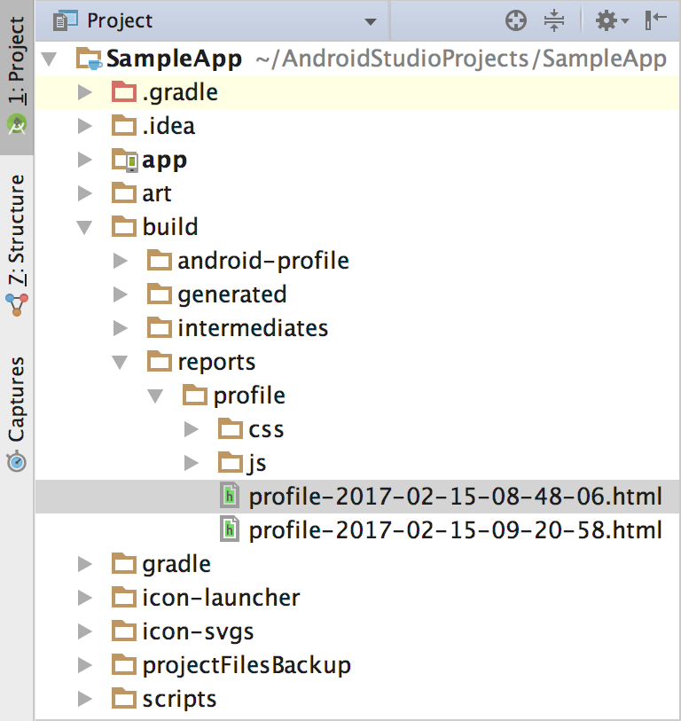
>
> 5. 右击`profile-timestamp.html`文件同时选择用浏览器打开。具体报告如下所示。你可以检查报告中的每一个标签去分析你的构建过程，例如**Task Execution** 会显示Gradle在每一个构建任务所花费的时间。
>
>    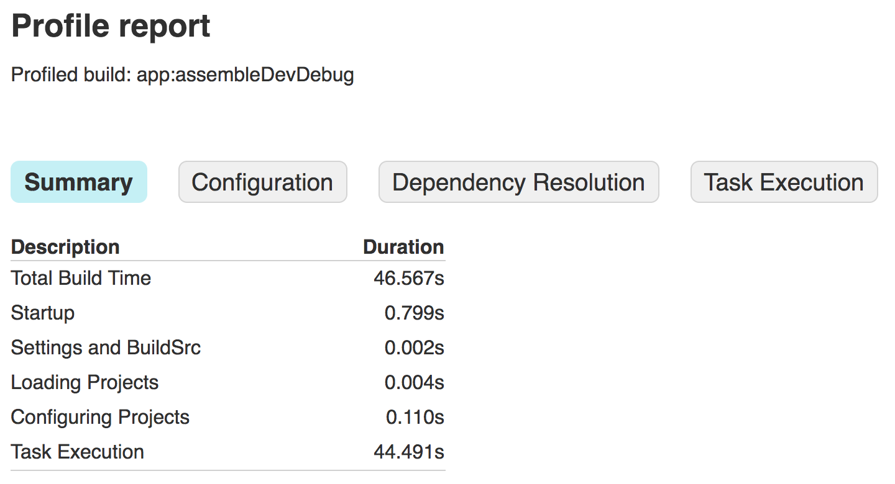
>
> 6. **可选的：**在你的项目或者构建配置做出修改之前，重新第3步的命令，但是省去`--rerun-tasks`标志。因为Gradle试图去节省时间，通过不执行那些输入没有改变的任务(这些在**Task Execution**标签页被指明为`UP-TO-DATE`，如下图)，你可以确定那些任务不应该执行时而执行。例如，如果`:app:processDevUniversalDebugManifest`没有被标记为`UP-TO-DATE`，也就是说你的每次构建配置是动态更新清单文件。然后，有些任务需要在每次构建时都运行，例如：`:app:checkDevDebugManifest`。
>
>    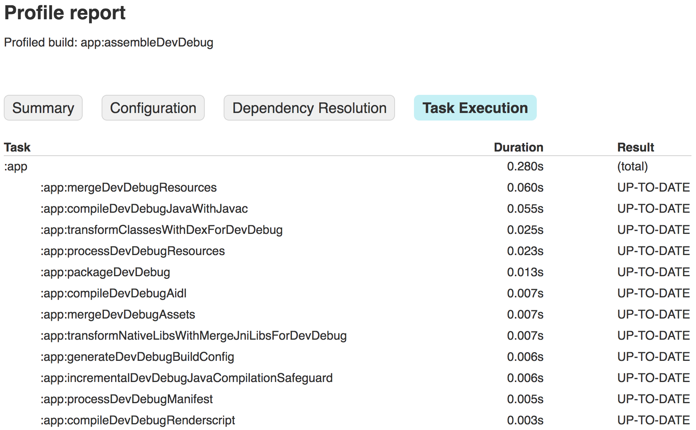
>
>    现在你已经创建了一个构建分析报告，你可以通过检查报告中每个标签的内容去检查那里可以再优化。一些构建设置需要实验，因为项目的不同工作状态之间可能存在不同的分析。例如，拥有大量的代码库的项目在[使用代码混淆](https://developer.android.google.cn/studio/build/shrink-code.html)移除不使用的代码和压缩APK大小时是非常有益的。然而，较小的项目在禁用`ProGuard` 会比较好。另外，增加Gradle的堆大小(使用 [`org.gradle.jvmargs`](https://docs.gradle.org/current/userguide/build_environment.html))在低内存的设备上会有强烈的负面表现。
>
>    在修改你的构建配置后，观察你改变后重新创建的构建分析文件。例如，下图显示了同样的应用在应用了本节的基本优化后的报告。
>
>    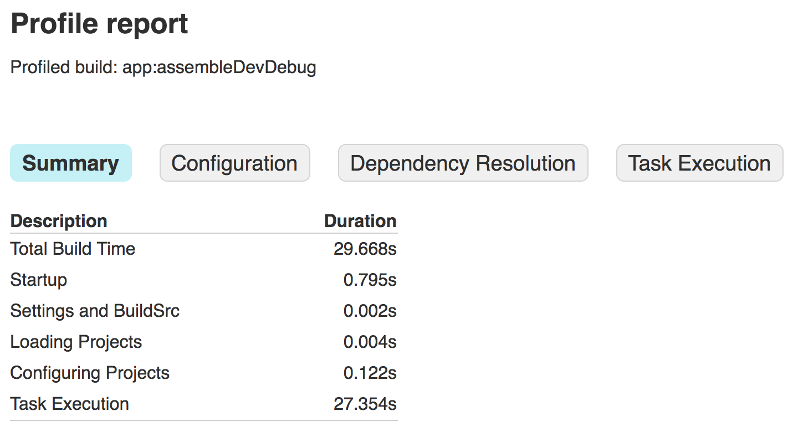
>
>    > **提示：**一个更强大的分析工具，请参考 [Gradle's open-source profiler](https://github.com/gradle/gradle-profiler)。

## 使用构建缓存

> 当Gradle的Android插件在构建项目时会缓存存储一些输出(例如未打包的ARR文件和pre-dexed的远程依赖)。你的`clean`构建时使用缓存会更高快速，因为构建系统会在后续的构建中重新使用缓存的文件，而不是重新创建它们。构建缓存同样会在持续集成服务器及在同一样机器上运行多个构建进程时运行。
>
> 使用Gradle的Android插件2.3.0及以上的新项目默认会启用(除非你明确的[禁用构建缓存](https://developer.android.google.cn/studio/build/build-cache.html#disable_build_cache))。然而，如果你设置下面的任一个构建属性的值不是下面显示的(这些是默认的属性，因此如果你不声明它们，`pre-dexed`远程依赖的缓存依然启用)，插件将禁用`pre-dexed`远程依赖的缓存。
>
> ```groovy
> android {
>   defaultConfig {
>     // 如果你启用multidex，那么你必须设置minSdkVersion为21或更高
>     multiDexEnabled false
>   }
>   buildTypes {
>     <build-type> {
>       minifyEnabled false
>     }
>   }
>   dexOptions {
>     preDexLibraries true
>   }
>   ...
> }
> ...
> ```
>
> > **注意：**如果你使用的Gradle的Android插件的版本是2.2.2或2.2.3，它使用的是构建缓存的实验版本。你应该[更新你的项目去使用最新版本的Android插件](https://developer.android.google.cn/studio/releases/gradle-plugin.html#updating-plugin)。
>
> 如果想学习更多的回忆构建的办法，查看[优化构建速度](https://developer.android.google.cn/studio/build/optimize-your-build.html)。

### 改变构建缓存的地址

> 默认情况下，Gradle的Android插件保存缓存在`<user-home>/.android/build-cache/`。如果你配置下面的任一个路径变量(优先权递减)，Android Studio使用将使用`<path-variable>/.android/build-cache/`代替：
>
> * `ANDROID_SDK_HOME`
> * `user.home`
> * `HOME`
>
> Gradle的Android插件使用一个默认的地址做为构建缓存的地址，因此它可以在所有的使用Android2.3.0或更高版本的项目之间分享缓存的文件(没有禁用构建缓存)。例如，在一个项目构建并缓存了一个`pre-dexed`的依赖后，其他的使用相同依赖的项目将跳过`pre-dexing`它，并直接从构建缓存中复制它。
>
> 如果你想让某个项目创建它自己的缓存(不和其他的项目分享缓存)，你可以在项目的`gradle.properties`文件中像下面那样指定一个唯一的地址：
>
> ```groovy
> // 你即可以指定一个绝对路径也可以是一个相对gradle.properties的相对路径
> android.buildCacheDir=<path-to-directory>
> ```
>
> 当你完成了编辑这个文件，点击**Sync Project** 去创建新的构建缓存文件夹。
>
> > **注意：**不要将地址指定为 `<project-root>/build/`或 `<project-root>/<module-root>/build/` 文件夹，因为Gradle将会在执行`clean`任务时删除这些文件夹。
>
> 如果你想和其他项目分享这些缓存，那么在想分享的项目的`gradle.properties`中指定相同的构建缓存文件夹。

### 清除构建缓存

> 类似于Gradle的Android插件的`clean`任务清除你的项目的`build/`文件夹，你可以运行`cleanBuildCache` 去清除项目的构建缓存。如果一个项目指定了一个非默认的构建缓存文件夹，那么这个任务将只会清除指定的缓存文件夹(并不是默认的共享缓存路径)。去执行这个任务，从菜单栏选择**View > Tool Windows > Terminal**，然后使用下面的命令：
>
> * Windows：
>
>   ```groovy
>   gradlew cleanBuildCache
>   ```
>
> * Mac或LInux：
>
>   ```groovy
>   ./gradlew cleanBuildCache
>   ```
>
> > **注意：**如果禁用了构建缓存功能那么`cleanBuildCache` 任务将不可用。

### 禁用构建缓存

> 因为构建缓存功能加速了构建速度，禁用这个功能是不推荐的。如果你仍然想禁用构建缓存这个功能，那么在 `gradle.properties`文件中添加以下代码：
>
> ```groovy
> // 删除下面这行或将其设为true就可以重新启用
> android.enableBuildCache=false
> ```
>
> 添加后点击同步项目就可以应用这些改变
>
> > **注意：**在你禁用了构建缓存后，Gradle的Android插件忽略了`android.buildCacheDir`属性，并且`cleanBuildCache` 也不可用。同时，禁用构建缓存不会自动清除缓存文件夹。这允许你在重新启用构建缓存后重新使用缓存的文件。

## 配置构建变体

> 此页面以[配置构建概览](https://developer.android.google.cn/studio/build/index.html)为基础，向您介绍如何配置构建变体，以便从同一个项目中创建应用的不同版本，以及如何正确地管理依赖项并签署配置。
>
> 每个*构建变体*都代表您可以为应用构建的一个不同版本。例如，您可能希望构建应用的免费版本（只提供有限的内容）和付费版本（提供更多内容）。您还可以针对不同的设备、根据 API 级别或其他设备变体构建应用的不同版本。然而，如果您希望根据设备 ABI 或屏幕密度构建不同的版本，则请改用 [APK 拆分](https://developer.android.google.cn/studio/build/configure-apk-splits.html)。
>
> 构建变体是 Gradle 按照[特定规则集](https://developer.android.google.cn/studio/build/build-variants.html#sourceset-build)合并在构建类型和产品风味中配置的设置、代码和资源所生成的结果。您并不直接配置构建变体，而是配置组成变体的构建类型和产品风味。
>
> 例如，一个“演示”*产品风味*可以指定不同的功能和设备要求，例如自定义源代码、资源和最低 API 级别，而“调试”*构建类型*则应用不同的构建和打包设置，例如调试选项和签署密钥。最终生成的构建变体是应用的“演示调试”版本，其既包含“演示”产品风味中包含的各种配置和资源，又包含“调试”构建类型和 `main/` 源集。

### 配置构建类型

> 您可以在模块级 `build.gradle` 文件的 `android {}` 代码块内部创建和配置构建类型。当您创建新模块时，Android Studio 会自动为您创建调试和发布这两种构建类型。尽管调试构建类型不会出现在构建配置文件中，Android Studio 会为其配置 [`debuggable true`](http://google.github.io/android-gradle-dsl/current/com.android.build.gradle.internal.dsl.BuildType.html#com.android.build.gradle.internal.dsl.BuildType:debuggable)。这样，您可以在安全的 Android 设备上调试应用并使用通用调试密钥库配置 APK 签署。
>
> 如果您希望添加或更改特定设置，您可以将调试构建类型添加到您的配置中。以下示例为调试构建类型指定了 [`applicationIdSuffix`](http://google.github.io/android-gradle-dsl/current/com.android.build.gradle.internal.dsl.BuildType.html#com.android.build.gradle.internal.dsl.BuildType:applicationIdSuffix)，并配置了一个使用调试构建类型中的设置进行初始化的“jnidebug”构建类型。
>
> ```groovy
> android {
>     ...
>     defaultConfig {...}
>     buildTypes {
>         release {
>             minifyEnabled true
>             proguardFiles getDefaultProguardFile('proguard-android.txt'), 'proguard-rules.pro'
>         }
>         debug {
>             applicationIdSuffix ".debug"
>         }
> 		// "initWith"属性允许你从其他的构建类型中复制配置，因此你不需要从开始就配置它。然后你可以
>         // 配置你需要改变的。下面的初始化"jnidebug"使用了"debug"构建类型，同时修改了
>         // applicationIdSuffix和versionNameSuffix设置。
>         jnidebug {
> 			// 这会复制debuggable属性，并且使用debug签名配置
>             initWith debug
>             applicationIdSuffix ".jnidebug"
>             jniDebuggable true
>         }
>     }
> }
> ```
>
> > **注：**当您对构建配置文件进行更改时，Android Studio 会要求您为项目同步新配置。要同步项目，您可以点击在做出更改后立即出现在通知栏中的 **Sync Now**，也可以点击工具栏中的 **Sync Project**  。如果 Android Studio 通知配置出现错误，会显示 **Messages** 窗口，具体描述该问题。
>
> 如需详细了解对于构建类型可以配置的所有属性，请阅读[构建类型 DSL 参考](http://google.github.io/android-gradle-dsl/current/com.android.build.gradle.internal.dsl.BuildType.html)。

### 配置产品风味

> 创建产品风味与创建构建类型类似：只需将它们添加到 `productFlavors {}` 代码块并配置您想要的设置。产品风味支持与 `defaultConfig` 相同的属性，这是因为 `defaultConfig` 实际上属于 [`ProductFlavor`](http://google.github.io/android-gradle-dsl/current/com.android.build.gradle.internal.dsl.ProductFlavor.html) 类。这意味着，您可以在 `defaultConfig {}` 代码块中提供所有风味的基本配置，每种风味均可更改任何这些默认值，例如 [`applicationId`](http://google.github.io/android-gradle-dsl/current/com.android.build.gradle.internal.dsl.ProductFlavor.html#com.android.build.gradle.internal.dsl.ProductFlavor:applicationId)。要详细了解应用 ID，请阅读[设置应用 ID](https://developer.android.google.cn/studio/build/application-id.html)。
>
> **注**：您仍需在 `main/` 清单文件中使用 [`package`](https://developer.android.google.cn/guide/topics/manifest/manifest-element.html#package) 属性指定程序包名称。您还必须在源代码中使用此程序包名称引用 R 类或者解析任何相关的 Activity 或服务注册。这样，您可以使用 `applicationId` 为每个产品风味分配一个唯一的 ID，以用于打包和分发，而不必更改您的源代码。
>
> 以下代码示例创建了一个“演示”和“完整”产品风味，以赋予其自己的 [`applicationIdSuffix`](http://google.github.io/android-gradle-dsl/current/com.android.build.gradle.internal.dsl.ProductFlavor.html#com.android.build.gradle.internal.dsl.ProductFlavor:applicationIdSuffix) 和 [`versionNameSuffix`](http://google.github.io/android-gradle-dsl/current/com.android.build.gradle.internal.dsl.ProductFlavor.html#com.android.build.gradle.internal.dsl.ProductFlavor:versionNameSuffix)：
>
> ```groovy
> android {
>     ...
>     defaultConfig {...}
>     buildTypes {...}
>     productFlavors {
>         demo {
>             applicationIdSuffix ".demo"
>             versionNameSuffix "-demo"
>         }
>         full {
>             applicationIdSuffix ".full"
>             versionNameSuffix "-full"
>         }
>     }
> }
> ```
>
> > **注**：要利用 Google Play 中的[多 APK 支持](https://developer.android.google.cn/google/play/publishing/multiple-apks.html)分发您的应用，请为所有变体分配相同的 `applicationId` 值并为每个变体分配一个不同的 [`versionCode`](http://google.github.io/android-gradle-dsl/current/com.android.build.gradle.internal.dsl.ProductFlavor.html#com.android.build.gradle.internal.dsl.ProductFlavor:versionCode)。要在 Google Play 中以独立应用的形式分发应用的不同变体，您需要为每个变体分配一个不同的 `applicationId`。
>
> 在创建和配置您的产品风味之后，在通知栏中点击 **Sync Now**。在同步完成后，Gradle 会根据您的构建类型和产品风味自动创建构建变体，并按照 `<product-flavor><Build-Type>` 的格式命名这些变体。例如，如果您创建了“演示”和“完整”这两种产品风味并保留默认的“调试”和“发布”构建类型，Gradle 将创建以下构建变体：
>
> * 演示调试
> * 演示发布
> * 完整调试
> * 完整发布
>
> 您可以将构建变体更改为您要构建并运行的任何变体，只需转到 **Build** > **Select Build Variant**，然后从下拉菜单中选择一个变体。然而，要开始自定义每个构建变体及其功能和资源，您需要了解如何创建和管理源集。

### 组合多个产品风味

> 某些情况下，您可能希望组合多个产品风味中的配置。例如，您可能希望基于 API 级别为“完整”和“演示”产品风味创建不同的配置。为此，您可以通过适用于 Gradle 的 Android 插件创建产品风味组，称为风味维度。构建您的应用时，Gradle 会将您定义的每个风味维度中的产品风味配置与构建类型配置组合来创建最终构建变体。Gradle 不会组合属于相同风味维度的产品风味。
>
> > **提示**：要根据 ABI 和屏幕密度创建不同版本的应用，您应[配置 APK 拆分](https://developer.android.google.cn/studio/build/configure-apk-splits.html)，而不是使用产品风味。
>
> 下面的代码示例使用 [`flavorDimensions`](http://google.github.io/android-gradle-dsl/current/com.android.build.gradle.AppExtension.html#com.android.build.gradle.AppExtension:flavorDimensions(java.lang.String[])) 属性创建一个“模式”风味维度以组织“完整”和“演示”产品风味，以及一个“api”风味维度以基于 API 级别组织产品风味配置：
>
> ```groovy
> android {
>   ...
>   buildTypes {
>     debug {...}
>     release {...}
>   }
>   // 指出你想使用的风味维度。当Gradle合并变体源和配置时，列表顺序决定了它们的优先权，从高到低。
>   // 你必须指定为每一个产品风味指定一个风味维度中的值。
>   flavorDimensions "api", "mode"
>   productFlavors {
>     demo {
>       // 指定这个产品风味的风味维度为"mode"
>       dimension "mode"
>       ...
>     }
>     full {
>       dimension "mode"
>       ...
>     }
>     // "api"产品风味覆盖了"mode"风味的配置和defaultConfig {}中的。Gradle根据风味维度的顺序
>     // 决定了风味维度之间优先权，第一个维度比第二个拥有更高的优先权，以此类推。
>     minApi24 {
>       dimension "api"
>       minSdkVersion '24'
>       // 为了保证目标设备获取到拥有兼容最高的API级别的app的版本，指定使用API级别增加值为版本号。
>       // 更多的关于指定版本号去支持app更新及上传到Google Play的知识，请查看Multiple APK Support
>       versionCode 30000 + android.defaultConfig.versionCode
>       versionNameSuffix "-minApi24"
>       ...
>     }
>     minApi23 {
>       dimension "api"
>       minSdkVersion '23'
>       versionCode 20000  + android.defaultConfig.versionCode
>       versionNameSuffix "-minApi23"
>       ...
>     }
>     minApi21 {
>       dimension "api"
>       minSdkVersion '21'
>       versionCode 10000  + android.defaultConfig.versionCode
>       versionNameSuffix "-minApi21"
>       ...
>     }
>   }
> }
> ...
> ```
>
> Gradle 创建的构建变体数量等于每个风味维度中的风味数量与您配置的构建类型数量的乘积。在 Gradle 为每个构建变体或对应 APK 命名时，属于较高优先级风味维度的产品风味首先显示，之后是较低优先级维度的产品风味，再之后是构建类型。以上面的构建配置为例，Gradle 可以使用以下命名方案创建总共 12 个构建变体：
>
> ​	构建变体：`[minApi24, minApi23, minApi21][Demo, Full][Debug, Release]`
>
> ​	对应 APK：`app-[minApi24, minApi23, minApi21]-[demo, full]-[debug, release].apk`
>
> 例如：
>
> ​	构建变体：`minApi24DemoDebug`
>
> ​	对应 APK：`app-minApi24-demo-debug.apk`
>
> 除了可以为各个产品风味和构建变体创建源集目录外，您也可以为每个产品风味*组合*创建源集目录。例如，您可以创建 Java 源并将其添加到 `src/demoMinApi24/java/` 目录中，Gradle 仅会在构建组合了这两种产品风味的变体时使用这些源。与属于各个产品风味的源集相比，您为产品风味组合创建的源集拥有更高的优先级。要详细了解源集和 Gradle 如何合并源，请阅读有关如何[创建源集](https://developer.android.google.cn/studio/build/build-variants.html#sourcesets)的部分。

### 过滤变体

> Gradle 会为您配置的产品风味与构建类型的每个可能的组合创建构建变体。不过，某些特定的构建变体在您的项目环境中并不必要，也可能没有意义。您可以在模块级 `build.gradle` 文件中创建一个变体过滤器，以移除某些构建变体配置。
>
> 以上一部分中的构建配置为例，假设您计划为演示版本的应用仅支持 API 级别 23 和更高级别。您可以使用 [`variantFilter {}`](http://google.github.io/android-gradle-dsl/current/com.android.build.api.variant.VariantFilter.html) 代码块过滤出组合了“minApi21”和“演示”产品风味的所有构建变体配置：
>
> ```groovy
> android {
>   ...
>   buildTypes {...}
>   flavorDimensions "api", "mode"
>   productFlavors {
>     demo {...}
>     full {...}
>     minApi24 {...}
>     minApi23 {...}
>     minApi21 {...}
>   }
>   variantFilter { variant ->
>       def names = variant.flavors*.name
>       // 检查一个确定的构建类型，使用variant.buildType.name == "<buildType>"
>       if (names.contains("minApi21") && names.contains("demo")) {
>           // Gradle忽略任何一个满足以上条件的变体
>           setIgnore(true)
>       }
>   }
> }
> ...
> ```
>
> 在您向构建配置添加变体过滤器并点击通知栏中的 **Sync Now** 后，Gradle 将忽略满足您指定的条件的任何构建变体，在您点击菜单栏中的 **Build > Select Build Variant**（或工具窗口栏中的 **Build Variants**）时，这些构建变体将不会再  显示在下拉菜单中。

### 创建源集

> 默认情况下，Android Studio 会创建 `main/`[ 源集](https://developer.android.google.cn/studio/build/index.html#sourcesets)和目录，用于存储您要在所有构建变体之间共享的一切资源。然而，您可以创建新的源集来控制 Gradle 要为特定的构建类型、产品风味（以及使用[风味维度](https://developer.android.google.cn/studio/build/build-variants.html#flavor-dimensions)时的产品风味组合）和构建变体编译和打包的确切文件。例如，您可以在 `main/` 源集中定义基本的功能，使用产品风味源集针对不同的客户更改应用的品牌，或者仅针对使用调试构建类型的构建变体包含特殊的权限和日志记录功能。
>
> Gradle 要求您按照与 `main/` 源集类似的特定方式组织源集文件和目录。例如，Gradle 要求您的“调试”构建类型所特定的 Java 类文件位于 `src/debug/java/` 目录中。
>
> 适用于 Gradle 的 Android 插件提供了一项有用的 Gradle 任务，可向您展示如何针对每种构建类型、产品风味和构建变体组织您的文件。例如，报告的以下部分描述了 Gradle 要求在何处能找到“调试”构建类型的特定文件：
>
> ```groovy
> ------------------------------------------------------------
> Project :app
> ------------------------------------------------------------
>
> ...
>
> debug
> ----
> Compile configuration: compile
> build.gradle name: android.sourceSets.debug
> Java sources: [app/src/debug/java]
> Manifest file: app/src/debug/AndroidManifest.xml
> Android resources: [app/src/debug/res]
> Assets: [app/src/debug/assets]
> AIDL sources: [app/src/debug/aidl]
> RenderScript sources: [app/src/debug/rs]
> JNI sources: [app/src/debug/jni]
> JNI libraries: [app/src/debug/jniLibs]
> Java-style resources: [app/src/debug/resources]
> ```
>
> 要为您的构建配置生成和查看此报告，请继续如下操作：
>
> 1. 点击 IDE 窗口右侧的 **Gradle**  。
> 2. 导航至 **MyApplication > Tasks > android** 并双击 **sourceSets**。
> 3. 要查看报告，请点击 IDE 窗口底部的 **Gradle Console**  。
>
> > **注**：此报告还向您展示了如何为您希望用来运行应用测试的文件组织源集，例如 `test/` 和 `androidTest/` [测试源集](https://developer.android.google.cn/studio/test/index.html#sourcesets)。
>
> 当您创建新的构建变体时，Android Studio 不会为您创建源集目录，但会为您提供几个选项，帮助您创建。例如，要为“调试”构建类型创建 `java/` 目录，请执行以下操作：
>
> 1. 打开 **Project** 窗格并从窗格顶端的下拉菜单中选择 **Project** 视图。
> 2. 导航至 `MyProject/app/src/`。
> 3. 右键点击 `src` 目录并选择 **New** > **Folder** > **Java Folder**。
> 4. 从 **Target Source Set** 旁边的下拉菜单中，选择 **debug**。
> 5. 点击 **Finish**。
>
> 由于“调试”构建类型被指定为目标源集，Android Studio 会在创建 XML 文件时自动创建必要的目录。最终的目录结构看上去应该类似于下图：
>
> 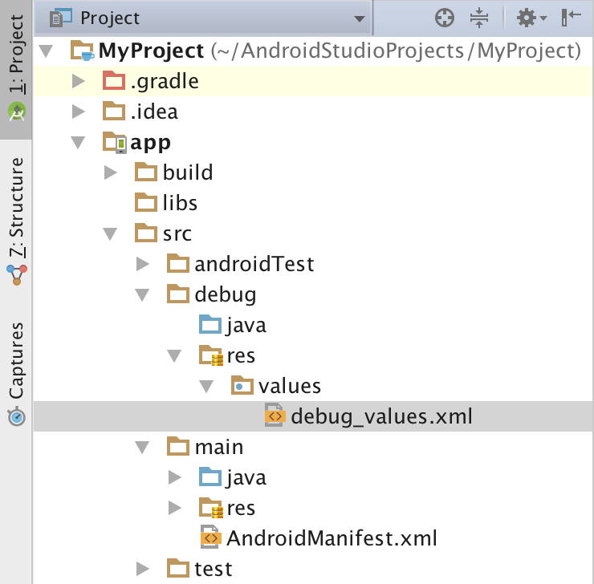
>
> 按照同样的方法，您还可以为产品风味创建源集目录（例如 `src/demo/`），为构建变体创建源集目录（例如 `src/demoDebug/`）。此外，您还可以创建针对特定构建变体的测试源集，例如 `src/androidTestDemoDebug/`。如需了解更多信息，请转至[测试源集](https://developer.android.google.cn/studio/test/index.html#sourcesets)。

### 更改默认源集配置

> 如果您的源未组织到 Gradle 期望的默认源集文件结构中（如上面的[创建源集](https://developer.android.google.cn/studio/build/build-variants.html#sourcesets)部分中所述），您可以使用 [`sourceSets {}`](http://google.github.io/android-gradle-dsl/current/com.android.build.gradle.api.AndroidSourceSet.html) 代码块更改 Gradle 希望为源集的每个组件收集文件的位置。您不需要重新定位文件；只需要为 Gradle 提供相对于模块级 `build.gradle` 文件的路径，Gradle 应当可以在此路径下为每个源集组件找到文件。要了解您可以配置哪些组件，以及是否可以将其映射到多个文件或目录，请阅读[适用于 Gradle 的 Android 插件参考](http://google.github.io/android-gradle-dsl/current/com.android.build.gradle.api.AndroidSourceSet.html)。
>
> 下面的代码示例可以将 `app/other/` 目录中的源映射到 `main` 源集的某些组件，并更改 `androidTest` 源集的根目录。
>
> ```groovy
> android {
>   ...
>   sourceSets {
>     // 主源集的精简配置
>     main {
>       // 改变java源的文件夹。默认的文件夹是'src/main/java'。
>       java.srcDirs = ['other/java']
>       // 如果你列出了多个文件夹，Gradle使用它们全部做为源集。因为这些源文件夹拥有相同的
>       // 优先权，所以当你合并的时候会报错。默认的文件夹是'src/main/res'。
>       res.srcDirs = ['other/res1', 'other/res2']
>       // 注意：你应用避免指定的源文件夹是你指定的其他源文件夹的父路径。例如，避免如下指定：
>       // res.srcDirs = ['other/res1', 'other/res1/layouts', 'other/res1/strings']
>       // 你应该指定'other/res1'文件夹或'other/res1/layouts' and 'other/res1/strings'
>       // 文件夹。
>       // 对每一个源集，你只能指定一个Android清单文件。默认Android Studio为主源集创建了
>       // 一个清单文件，在src/main/目录下。
>       manifest.srcFile 'other/AndroidManifest.xml'
>       ...
>     }
>     // 创建另外的闭包去配置其他的源集。
>     androidTest {
>       // 如果某个源集的所有文件在一个root目录下，你可以通过setRoot属性指定根目录。当收集这个源集
>       // 的源文件时，Gradle只在你指定的root目录的相对路径查找。例如，如下当给androidTest设置了
>       // root目录，Gradle只在src/tests/java/目录下查找Java源。
>       setRoot 'src/tests'
>       ...
>     }
>   }
> }
> ...
> ```

### 使用源集构建

> 您可以使用源集目录包含您希望仅针对某些配置打包的代码和资源。例如，如果您要构建“演示调试”构建变体（它是“演示”产品风味和“调试”构建类型的合体），Gradle 会查看这些目录并赋予以下优先级顺序：
>
> 1. `src/demoDebug/`*（构建变体源集）*
> 2. `src/debug/`*（构建类型源集）*
> 3. `src/demo/`*（产品风味源集）*
> 4. `src/main/`*（主源集）*
>
> > **注**：如果您[组合多个产品风味](https://developer.android.google.cn/studio/build/build-variants.html#flavor-dimensions)，产品风味之间的优先级将由它们所属的风味维度决定。在列示具有 [`android.flavorDimensions`](http://google.github.io/android-gradle-dsl/current/com.android.build.gradle.AppExtension.html#com.android.build.gradle.AppExtension:flavorDimensions(java.lang.String[])) 属性的风味维度时，所列示的第一个风味维度中的产品风味比第二个维度中的产品风味拥有更高的优先级，以此类推。此外，与属于各个产品风味的源集相比，您为产品风味组合创建的源集拥有更高的优先级。
>
> 上面列出的顺序决定了在 Gradle 合并代码和资源时哪个源集具有较高的优先级。由于 `demoDebug/` 源集目录很可能包含特定于该构建变体的文件，如果 `demoDebug/` 包含在 `debug/` 中也有定义的文件，Gradle 将使用 `demoDebug/` 源集中的文件。同样，Gradle 会为构建类型和产品风味源集中的文件赋予比 `main/` 中相同文件更高的优先级。Gradle 在应用以下构建规则时会考虑此优先级顺序：
>
> * 一起编译 `java/` 目录中的所有源代码以生成单一的输出。
>
>   > **注**：对于给定的构建变体，如果找到两个或两个以上定义同一 Java 类的源集目录，Gradle 就会引发一个构建错误。例如，在构建调试 APK 时，您不能同时定义 `src/debug/Utility.java` 和 `src/main/Utility.java`。这是因为 Gradle 会在构建过程中检查这两个目录并引发“duplicate class”错误。如果针对不同的构建类型需要不同版本的 `Utility.java`，您可以让每个构建类型定义其自己的文件版本，而不将其包含在 `main/` 源集中。
>
> * 所有清单合并为单个清单。将按照上述列表中的相同顺序指定优先级。也就是说，某个构建类型的清单设置会替换某个产品风味的清单设置，依此类推。如需了解更多信息，请阅读[合并清单](https://developer.android.google.cn/studio/build/manifest-merge.html)。
>
> * 同样，`values/` 目录中的文件也会合并在一起。如果两个文件同名，例如存在两个 `strings.xml` 文件，将按照上述列表中的相同顺序指定优先级。也就是说，在构建类型源集中的文件中定义的值将会替换产品风味中同一文件中定义的值，依此类推。
>
> * `res/` 和 `asset/` 目录中的资源将打包到一起。如果两个或两个以上的源集中定义有同名资源，将按照上述列表中的相同顺序指定优先级。
>
> * 最后，在构建 APK 时，Gradle 会为随库模块依赖项包含的资源和清单分配最低的优先级。

### 声明依赖项

> 下面的示例可以在 `app/` 模块的 `build.gradle` 文件中声明三种不同类型的直接依赖项：
>
> ```groovy
> android {...}
> ...
> dependencies {
> 	// 'compile'配置告诉Gradle添加依赖到类路径，并且包含它到最终的包中。
>     // 依赖这个项目中的"mylibrary"模块
>     compile project(":mylibrary")
>     // 远程的二进制依赖
>     compile 'com.android.support:appcompat-v7:27.0.2'
>   	// 本地的二进制依赖
>     compile fileTree(dir: 'libs', include: ['*.jar'])
> }
> ```
>
> 下面逐一介绍了每种直接依赖项。
>
> * **模块依赖项**
>
>   `compile project(':mylibrary')` 行声明了一个名为“mylibrary”的[本地 Android 库模块](https://developer.android.google.cn/studio/projects/android-library.html)作为依赖项，并	    要求构建系统在构建应用时编译并包含该本地模块。
>
> * **远程二进制依赖项**
>
>   `compile 'com.android.support:appcompat-v7:27.0.2'` 行会通过指定其 JCenter 坐标，针对 [Android 支持库](https://developer.android.google.cn/topic/libraries/support-library/index.html)的 27.0.2 版本声明一个依赖项。默认情况下，Android Studio 会将项目配置为使用顶级构建文件中的 JCenter 存储区。当您将项目与构建配置文件同步时，Gradle 会自动从 JCenter 中抽取依赖项。或者，您也可以通过[使用 SDK 管理器](https://developer.android.google.cn/studio/intro/update.html#sdk-manager)下载和安装特定的依赖项。
>
> * **本地二进制依赖项**
>
>   `compile fileTree(dir: 'libs', include: ['*.jar'])` 行告诉构建系统在编译类路径和最终的应用软件包中包含 `app/libs/` 目录内的任何 JAR 文件。如果您有模块需要本地二进制依赖项，请将这些依赖项的 JAR 文件复制到项目内部的 `<moduleName>/libs` 中。
>
> 该模块的某些直接依赖项可能会有其自己的依赖项，这称为该模块的*传递依赖项*。Gradle 将会自动为您收集并添加这些传递依赖项，而不必手动逐一加以声明。适用于 Gradle 的 Android 插件提供了一项有用的 Gradle 任务，可为每个构建变体和[测试源集](https://developer.android.google.cn/studio/test/index.html#sourcesets)生成依赖项树，因此，您可以轻松地可视化模块的直接和传递依赖项。要生成此报告，请继续如下操作：
>
> 1. 点击 IDE 窗口右侧的 **Gradle** 。
> 2. 导航至 **MyApplication > Tasks > android** 并双击 **androidDependencies**。
> 3. 要查看报告，请点击 IDE 窗口底部的 **Gradle Console**  。
>
> 以下示例报告显示了调试构建变体的依赖项树，并包含前一示例中的本地模块依赖项和远程依赖项。
>
> ```groovy
> Executing tasks: [androidDependencies]
> :app:androidDependencies
> debug
> /**
>  * Both the library module dependency and remote binary dependency are listed
>  * with their transitive dependencies.
>  */
> +--- MyApp:mylibrary:unspecified
> |    \--- com.android.support:appcompat-v7:27.0.2
> |         +--- com.android.support:animated-vector-drawable:27.0.2
> |         |    \--- com.android.support:support-vector-drawable:27.0.2
> |         |         \--- com.android.support:support-v4:27.0.2
> |         |              \--- LOCAL: internal_impl-27.0.2.jar
> |         +--- com.android.support:support-v4:27.0.2
> |         |    \--- LOCAL: internal_impl-27.0.2.jar
> |         \--- com.android.support:support-vector-drawable:27.0.2
> |              \--- com.android.support:support-v4:27.0.2
> |                   \--- LOCAL: internal_impl-27.0.2.jar
> \--- com.android.support:appcompat-v7:27.0.2
>      +--- com.android.support:animated-vector-drawable:27.0.2
>      |    \--- com.android.support:support-vector-drawable:27.0.2
>      |         \--- com.android.support:support-v4:27.0.2
>      |              \--- LOCAL: internal_impl-27.0.2.jar
>      +--- com.android.support:support-v4:27.0.2
>      |    \--- LOCAL: internal_impl-27.0.2.jar
>      \--- com.android.support:support-vector-drawable:27.0.2
>           \--- com.android.support:support-v4:27.0.2
>                \--- LOCAL: internal_impl-27.0.2.jar
> ...
> ```
>
> 如需了解在 Gradle 中管理依赖项的详细信息，请参阅《Gradle 用户指南》中的[依赖项管理基础知识](http://www.gradle.org/docs/current/userguide/artifact_dependencies_tutorial.html)。

### 配置依赖项

> 您可以使用特定的配置关键字告诉 Gradle 如何以及何时使用某个依赖项，例如前述示例中的 `compile` 关键字。下面介绍了您可以用来配置依赖项的一些关键字：
>
> * compile
>
>   指定编译时依赖项。Gradle 将此配置的依赖项添加到类路径和应用的 APK。这是默认配置。
>
> * apk
>
>   指定 Gradle 需要将其与应用的 APK 一起打包的仅运行时依赖项。您可以将此配置与 JAR 二进制依赖项一起使用，而不能与其他库模块依赖项或 AAR 二进制依赖项一起使用。
>
> * provided
>
>   指定 Gradle *不*与应用的 APK 一起打包的编译时依赖项。如果运行时无需此依赖项，这将有助于缩减 APK 的大小。您可以将此配置与 JAR 二进制依赖项一起使用，而不能与其他库模块依赖项或 AAR 二进制依赖项一起使用。
>
> 此外，您可以通过将构建变体或测试源集的名称应用于配置关键字，为特定的构建变体或[测试源集](https://developer.android.google.cn/studio/test/index.html#sourcesets)配置依赖项，如下例所示。
>
> ```groovy
> dependencies {
>     ...
>     // 给fullRelease 和 fullDebug构建变体添加指定的编译时库模块依赖
>     fullReleaseCompile project(path: ':library', configuration: 'release')
>     fullDebugCompile project(path: ':library', configuration: 'debug')
>   	// 给本地测试添加一个编译时依赖
>     testCompile 'junit:junit:4.12'
>   	// 给测试APK添加一个编译时依赖
>     androidTestCompile 'com.android.support.test.espresso:espresso-core:2.2.2'
> }
> ```

### 配置签名设置

> 除非您为发布构建显式定义签署配置，否则，Gradle 不会签署发布构建的 APK。您可以轻松创建发布密钥并[使用 Android Studio 签署发布构建类型](https://developer.android.google.cn/studio/publish/app-signing.html#release-mode)。
>
> 要使用 Gradle 构建配置为您的发布构建类型手动配置签署配置：
>
> 1. *创建密钥库。***密钥库**是一个二进制文件，它包含一组私钥。您必须将密钥库存放在安全可靠的地方。
> 2. *创建私钥。***私钥**代表将通过应用识别的实体，如某个人或某家公司。
> 3. 将签署配置添加到模块级 `build.gradle` 文件中：
>
> ```groovy
> ...
> android {
>     ...
>     defaultConfig {...}
>     signingConfigs {
>         release {
>             storeFile file("myreleasekey.keystore")
>             storePassword "password"
>             keyAlias "MyReleaseKey"
>             keyPassword "password"
>         }
>     }
>     buildTypes {
>         release {
>             ...
>             signingConfig signingConfigs.release
>         }
>     }
> }
> ```
>
> 要生成签署的 APK，请从菜单栏中选择 **Build > Generate Signed APK**。现在，`app/build/apk/app-release.apk` 中的软件包已使用您的发布密钥进行签署。
>
> > **注**：将发布密钥和密钥库的密码放在构建文件中并不安全。作为替代方案，您可以将此构建文件配置为通过环境变量获取这些密码，或让构建流程提示您输入这些密码。
>
> 要通过环境变量获取这些密码：
>
> ```groovy
> storePassword System.getenv("KSTOREPWD")
> keyPassword System.getenv("KEYPWD")
> ```
>
> 要让构建流程在您要从命令行调用此构建时提示您输入这些密码：
>
> ```groovy
> storePassword System.console().readLine("\nKeystore password: ")
> keyPassword System.console().readLine("\nKey password: ")
> ```
>
> 在完成此流程后，您可以分发您的应用并在 Google Play 上发布它。
>
> > **警告**：将密钥库和私钥存放在安全可靠的地方，并确保您为其创建了安全的备份。如果您将应用发布到 Google Play，随后丢失了您用于签署应用的密钥，那么，您将无法向您的应用发布任何更新，因为您必须始终使用相同的密钥签署应用的所有版本。

### 签署 Android Wear 应用

> 发布 Android Wear 应用时，请将穿戴式设备应用打包到手持类应用中，因为用户无法直接在穿戴式设备上浏览和安装应用。这两个应用均必须进行签署。如需有关打包和签署 Android Wear 应用的更多信息，请参阅[打包穿戴式设备应用](https://developer.android.google.cn/training/wearables/apps/packaging.html)。

## 构建多个APK

> 尽管你需要构建一个单独的APK去支持所有的设备，但是因为你要支持多个[屏幕密度](https://developer.android.google.cn/training/multiscreen/screendensities.html)或应用的[ABIs](https://developer.android.google.cn/ndk/guides/abis.html)，那样会导致你的APK会很大。一个减少APK大小的方法就是去创建[多个APKs](https://developer.android.google.cn/google/play/publishing/multiple-apks.html)包含分别针对不同的屏幕密度或ABIs。
>
> Gradle可以创建分离的APKs，它们只包含针对相应的屏幕密度或ABI的代码或资源。本节描述了如何去配置构建文件去生成多个APKs。如果你想创建应用针对不同的屏幕密度或ABI的不同版本，你可以代替使用[构建变体](https://developer.android.google.cn/studio/build/build-variants.html)。

### 配置多个APKs的构建

> 配置多个APKs的构建，在模块级别的`build.gradle`文件中添加一个 [`splits`](http://google.github.io/android-gradle-dsl/current/com.android.build.gradle.internal.dsl.Splits.html)闭包。在 [`splits`](http://google.github.io/android-gradle-dsl/current/com.android.build.gradle.internal.dsl.Splits.html)内，提供一个`density` 闭包指出Gradle怎样去生成每个密度的APKs，或`abi`闭包去指出Gradle怎样去生成每个ABI的APKs。你可以提供`density`和`ABI`闭包，那么构建系统将会为每个密度和ABI的组合都生成一个APK。
>
> > **注意：**生成每个语言的APKs仅仅在Android Instant App项目中支持。更多，请参考[启用配置APKs](https://developer.android.google.cn/topic/instant-apps/guides/config-splits.html)。

### 配置面向多屏幕密度APKs支持

> 为了生成面向不同的屏幕密度的多APKs支持，在`splits`闭包中添加一个`density`闭包。在`density`闭包中提供你需要的屏幕密度和兼容的屏幕尺寸。如果你在每个APK的清单文件中指定了[compatible-screens](https://developer.android.google.cn/guide/topics/manifest/compatible-screens-element.html)，那么兼容的屏幕尺寸列表中只应该使用这些值。
>
> 下面的Gradle DSL选项被用来配置面向多屏幕密度的APKs：
>
> * `enable`
>
>   如果你设置了这个属性为`true`，Gradle将会根据你定义的屏幕密度生成多个APKs。默认为`false`。
>
> * `exclude`
>
>   以逗号分隔指出Gradle不用生成的APKs。如果你想生成大多数的APKs，而不想去生成某些你的应用不支持的密度，可以使用`exclude`。
>
> * `reset()`
>
>   清空默认的屏幕密度列表。仅仅在联合使用`include`元素去指定你想要添加的密度时使用。下面的代码片断首先使用`reset()`列表，然后使用`include`设置面向`ldpi` 和`xxhdpi`屏幕密度。
>
>   ```groovy
>   reset()  // 清空包含了所有密度的列表，设置为没有密度。
>   include "ldpi", "xxhdpi" // 指出只有这两个密度可以生成不同的APKs。
>   ```
>
> * `include`
>
>   用一个以逗号隔开的列表描述Gradle需要生成的APKs的密度。仅仅在配合`reset()`时指出一个准确的密度列表。
>
> * `compatibleScreens`
>
>   指出一个逗号分隔的兼容屏幕尺寸列表。这样会在每个APK的清单文件中注入一个[<compatible-screens>](https://developer.android.google.cn/guide/topics/manifest/compatible-screens-element.html)节点。这个设置提供了一个方便的方式去管理同一个`build.gradle`文件中的屏幕密度和屏幕尺寸。但是，使用[<compatible-screens>](https://developer.android.google.cn/guide/topics/manifest/compatible-screens-element.html)会限制你的应用将要运行的设备。另一个方式去支持不同的屏幕尺寸，查看[支持多屏幕](https://developer.android.google.cn/guide/practices/screens_support.html)。
>
> 基于屏幕密度包含[<compatible-screens>](https://developer.android.google.cn/guide/topics/manifest/compatible-screens-element.html)标签指出APK所支持的屏幕类型的指定的限制每一个APK，即使你发布了多个APKs，一些新的设备仍然不会匹配你的多APK过滤。因此，Gradle总是会生成一个通用的APK，这个APK支持所有的屏幕密度并且不包含[<compatible-screens>](https://developer.android.google.cn/guide/topics/manifest/compatible-screens-element.html)标签。你应该和支持每一个密度且不包含[<compatible-screens>](https://developer.android.google.cn/guide/topics/manifest/compatible-screens-element.html)标签的APKs一块发布通用的APK，以防有不支持的屏幕密度的设备。
>
> 下面的例子给每个在[支持的屏幕范围](https://developer.android.google.cn/guide/practices/screens_support.html#range)中列出的屏幕密度生成一个APK，除了 `ldpi`, `xxhdpi`, 和`xhdpi`。可以通过`exclude`从默认的支持全部密度的列表中移除不需要支持的屏幕密度。
>
> ```groovy
> android {
>   ...
>   splits {
>     // 基于屏幕密度的多APKs配置
>     density {
>       // 启用
>       enable true
>       // 指出不需要生成单独APK的屏幕密度
>       exclude "ldpi", "xxhdpi", "xxxhdpi"
>       // 指出在manifest文件中兼容的屏幕尺寸
>       compatibleScreens 'small', 'normal', 'large', 'xlarge'
>     }
>   }
> }
> ```
>
> 所有的密度名称和屏幕尺寸名称，请查看[怎样支持多屏幕](https://developer.android.google.cn/guide/practices/screens_support.html#support)。更多的关于发布应用到指定的屏幕类型和设备，请查看[发布到指定的屏幕](https://developer.android.google.cn/guide/practices/screens-distribution.html)。

### 配置基于ABIs的多APKs

> 要创建不同的ABIs对应的APKS，需要在`splits`闭包中添加`abi`闭包。在`abi`闭包中提供需要支持的ABIs。下面的Gradle DSL选项可以用来配置不同的ABI的APK：
>
> * `enable`
>
>   如果你设置这个元素为`true`，Gradle会根据你定义的ABIs生成多个APKs。默认值为`false`。
>
> * `exclude`
>
>   指定一个以逗号分开的ABIs的列表，这个列表中的值Gradle将不会生成相应的APKs。使用`exclude`从大多数ABIs中排除你不需要生成的ABIs所对应的APKs。
>
> * `reset()`
>
>   清除默认的ABIs列表。只在和`include`联合使用时指出需要添加的ABIs。下面的代码片断，首先使用`reset()`清除默认的列表，然后在`include`中包含需要支持`x86`和`mips`ABIs。
>
>   ```groovy
>   reset()  // 清除默认的ABIs列表
>   include "x86", "mips" // 指出需要生成的ABIs
>   ```
>
> * `include`
>
>   以逗号分隔的列表指出Gradle需要生成所支持ABIs的APKs。仅在和`reset()`联合使用时指出一个精确的ABIs列表。
>
> * `universalApk`
>
>   如果设为`true`，Gradle除了会生成每个ABI对应的APKs，还会生成一个通用的APK。通用的APK会包含所有的ABIs的代码和资源。默认值为`false`。注意这个选项只在`splits.abi`中可用。当生成针对不同的屏幕密度的APK时，Gradle也会生成一个通用的APK，这个APK也包含了针对所有屏幕密度的代码和资源。
>
> 下面的例子针对`x86`, `armeabi-v7a`, 和 `mips`生成了不同的APK。首先`reset()`默认的ABIs列表，然后在`include`中指定需要生成的APK的ABIs列表。
>
> ```groovy
> android {
>   ...
>   splits {
>     // 配置基于ABI的多APKs
>     abi {
>       // 启用ABI支持
>       enable true
>       // 默认情况下所有的ABIs都包含，所以使用reset()和include指出我们需要支持的
>       // x86, armeabi-v7a, 和 mips的ABIs。
>       reset()
>       include "x86", "armeabi-v7a", "mips"
>       // 指出我们不需要生成包含所有ABIs的通用版本的APK。
>       universalApk false
>     }
>   }
> }
> ```
>
> 所有支持的ABIs，请查看[支持的ABIs](https://developer.android.google.cn/ndk/guides/abis.html#sa)。

### 版本管理配置

> 默认情况下，Gradle生成的所有的APKs都包含相同的版本信息，这些信息都在模块级别的`build.gradle`中指出。因为谷歌商店相同应用的多个APKs有相同的版本信息，所以在你上传到谷歌商店之前要确保每个APK拥有唯一的 [`versionCode`](https://developer.android.google.cn/studio/publish/versioning.html#appversioning) 。
>
> 你可以配置你的模块级别的`build.gradle`文件，重写每个apk的`versionCode`。通过给你面向ABI和密度的每个APK映射一个唯一的数值，你可以重写输出的版本号，这个版本号将联合在`defaultConfig`或`productFlavors`闭包中指定的versionCode以及在密度或ABI中指定的。
>
> 下面的例子中，`mips`ABI生成的APK的`versionCode`为2004，而`x86`ABI生成的APK的`versioinCode`为3004。把版本号指定为较大的增长，例如1000，允许你后面更新应用的时候指定唯一的版本号。例如， 如果`defaultConfig.versionCode`在后续的更新中迭代到5，Gradle将会指定`mips`APK的版本号为2005，`x86`APK版本号为3005。
>
> **提示：**如果你的构建包含一个通用APK，你需要指定一个比其他的APKs更低的`versionCode`。因为谷歌商店在两个相同兼容的APK中会选择安装版本更高的APK，而将通用版本的版本号设为最低，这样可以保证有兼容的设备可以使用最新的版本，并且不兼容的设备也可以正确的安装通用版本。下面的救命代码这样使用，并且没有重写默认的`versionCode` 。
>
> ```groovy
> android {
>   ...
>   defaultConfig {
>     ...
>     versionCode 4
>   }
>   splits {
>     ...
>   }
> }
>
> // 给每一个ABI映射一个版本号
> ext.abiCodes = ['armeabi-v7a':1, mips:2, x86:3]
>
> // 对每个屏幕密度的APK，创建一个相似的映射：
> // ext.densityCodes = ['mdpi': 1, 'hdpi': 2, 'xhdpi': 3]
>
> import com.android.build.OutputFile
>
> // 对每个变体输出的APK，使用ext.abiCodes * 1000 + variant.versionCode的组合重写版本号。
> // 在本例中，variant.versionCode和defaultConfig.versionCode是相等的。如果你配置了产吕
> // 风味，并且它们定义了自己的版本号，那么variant.versionCode就会使用定义好的值。
> android.applicationVariants.all { variant ->
>
>   // 除了通用的APK，给每一个输出的APK不同的版本号
>   variant.outputs.each { output ->
>
>     // 存储和这个变体的ABI相应的ext.abiCodes值
>     def baseAbiVersionCode =
>       		// 确定该变体的ABI，并返回相应的映射值
>             project.ext.abiCodes.get(output.getFilter(OutputFile.ABI))
>     
>     // 当ext.abiCodes没有相应的ABI，那么abiCodes.get()将会返回null，那么下面的代码不会重写
>     // 通用版本APK的版本号。然而，因为我们需要通用版本的APK的版本号最低，所以这个结果是满足的。
>     if (baseAbiVersionCode != null) {
>
>       // 给versionCodeOverride指定一个新的版本号，这只会改变输出的APK的版本号，并不是变体自身的。
>       // 要跳过这个步骤，只需要使Gradle使用APK的variant.versionCode值。
>       output.versionCodeOverride =
>               baseAbiVersionCode * 1000 + variant.versionCode
>     }
>   }
> }
> ```
>
> 更多的关于版本号的方案，请查看[指定版本号](https://developer.android.google.cn/google/play/publishing/multiple-apks.html#VersionCodes) 。

### 构建多个APKs

> 如果你配置了模块级别的`build.gradle`文件去构建多个APKs，点击**Build > Build APK**将会生成在**Project**窗口中当前选择的模块的所有的APKs。Gradle将会在`build/outputs/apk/` 生成面向屏幕密度或ABI的甩的APKs。
>
> Gradle将会生成一个APK面向一个密度或ABI你配置的。如果你启用了密度和ABIs的多APKs支持，Gradle将会为第一个密度和ABI的组合都生成一个APK。例如，下面的`build.gradle`片断启用了多APKs支持，它包含mdpi和hdpi密度，以及x86和mipsABIs。
>
> ```groovy
> ...
>   splits {
>     density {
>       enable true
>       reset()
>       include "mdpi", "hdpi"
>     }
>     abi {
>       enable true
>       reset()
>       include "x86", "mips"
>     }
>   }
> ```
>
> 上面的例子配置将会输出下面的4个APK：
>
> * `app-hdpiX86-release.apk`: 仅包含针对hdpi密度和x86 ABI的代码和资源。
> * `app-hdpiMips-release.apk`:仅包含针对hdpi密度和mips ABI的代码和资源。
> * `app-mdpiX86-release.apk`:仅包含针对mdpi密度和x86 ABI的代码和资源。
> * `app-mdpiMips-release.apk`:仅包含针对mdpi密度和mips ABI的代码和资源。
>
> 当你面向多屏幕密度生成多个APKs时，除了针对不同的密度的APK，Gradle默认会生成一个包含所有的代码和资源的通用APK。当你面向不同的ABIs生成多个APKs时，Gradle只会在你在`splits.abi`闭包中指定 `universalApk true` 时才会生成一个包含所有ABIs的APK。

### APK文件命名格式

> 当生成多APKs时，Gradle使用以下规定来命名APK的文件名：
>
> `modulename-screendensityABI-buildvariant.apk`
>
> 以上规定说明：
>
> * `modulename`
>
>   构建的模块名
>
> * `screendensity`
>
>   如果面向屏幕密度的多APKs启用，指定APK的屏幕密度，例如：`mdpi`。
>
> * `ABI`
>
>   如果面向ABI的多APKs启用，指定APK的ABI，例如：`x86`。如果面向屏幕密度和ABI的多APKs都启用了，Gradle将会组合密度名和ABI名，例如：“mdpiX86”。如果面向每个ABI的APKs的`universalApk`设为`true`，那么Gradle在ABI通用的APK中使用"universal" 作为ABI部分的名字。
>
> * `buildvariant`
>
>   指定APK的构建变体，例如：“debug”。
>
> 例如，当构建“myApp”的debug版本的mdpi密度的APK时，那么APK文件名为`myApp-mdpi-debug.apk`。“myApp”的发布版本如果配置了多APKs支持，包含屏幕密度和x86 ABI，那么APK文件名为： `myApp-mdpiX86-release.apk`。

## 合并多个清单

> APK 文件只能包含一个 `AndroidManifest.xml` 文件，但 Android Studio 项目可以包含多个清单文件（通过主源集、构建变体和导入的库提供）。因此，在构建应用时，Gradle 构建会将所有清单文件合并到一个封装到 APK 的清单文件中。
>
> 清单合并工具通过遵循某些合并启发式算法，并遵守您通过特殊 XML 属性定义的合并首选项，来合并各个文件中的所有 XML 元素 。 本页介绍清单合并的工作方式以及如何应用合并首选项来解决合并冲突。
>
> > **提示：** 使用 [**Merged Manifest** 视图](https://developer.android.google.cn/studio/build/manifest-merge.html#inspect_the_merged_manifest_and_find_conflicts)预览合并清单的效果并找出冲突 错误。

### 合并优先级

> 合并工具根据每个清单文件的优先级将所有清单文件按顺序合并到一个文件中。 例如，如果您有 3 个清单文件，则会先将优先级最低的清单合并到优先级第 2 高的清单中，然后再将合并后的清单合并到优先级最高的清单中（如图所示）。
>
> 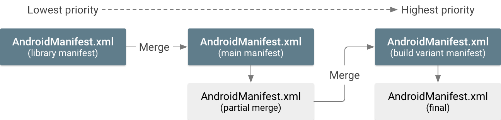
>
> <center>合并 3 个清单 文件（从优先级最低的文件（左）合并至优先级最高的文件（右））的流程<center>
>
> 有 3 种基本的清单文件可以互相合并，它们的合并优先级如下（按优先级由高到低的顺序）：
>
> 1. **清单文件构建变体**
>
>    如果您的变体有多个源集，则其清单优先级如下：
>
>    1. 构建变体清单（如 `src/demoDebug/`）
>
>    2. 构建类型清单（如 `src/debug/`）
>
>    3. 产品定制清单（如 `src/demo/`）
>
>       如果您使用的是定制维度，清单优先级将与每个维度在 `flavorDimensions` 属性中的列示顺序（按优先级由高到低的顺序排列）对应。
>
> 2. **应用模块的主清单文件**
>
> 3. **所包括库中的清单文件**
>
>    如果您有多个库，则其清单优先级与依赖顺序（库出现在 Gradle `dependencies` 块中的顺序）匹配。
>
> 例如，库清单合并至主清单，然后主清单合并至构建变体清单。
>
> **注：**这些是对所有源集都相同的合并优先级，如[使用源集构建](https://developer.android.google.cn/studio/build/build-variants.html#sourceset-build) 中所述。
>
> > **重要说明：** `build.gradle` 文件中的构建配置将替换合并清单文件中的任何对应属性。 例如，`build.gradle` 文件中的[minSdkVersion](http://google.github.io/android-gradle-dsl/current/com.android.build.gradle.internal.dsl.ProductFlavor.html#com.android.build.gradle.internal.dsl.ProductFlavor:minSdkVersion(int)) 将替换[``](https://developer.android.google.cn/guide/topics/manifest/uses-sdk-element.html) 清单元素中的匹配属性。 为了避免混淆，您只需省去 `<uses-sdk>` 元素并在 `build.gradle` 文件中定义这些属性。 更多信息，请查看 [构建配置](https://developer.android.google.cn/studio/build/index.html).

### 合并冲突启发式算法

> 合并工具可以在逻辑上将一个清单中的每个 XML 元素与另一个清单中的对应元素相匹配。 （有关匹配如何进行的详细信息，请参阅有关[合并策略](https://developer.android.google.cn/studio/build/manifest-merge.html#appendix_merge_policies)的附录）。
>
> 如果优先级较低的清单中的元素与优先级较高的清单中的任何元素均不匹配，则该元素将被添加至合并清单。 但是，如果*有*匹配元素，则合并工具会尝试将其中的所有属性合并到相同元素中。如果工具发现两个清单包含相同属性，但值不相同，则会出现合并冲突。
>
> 表 1 描述合并工具尝试将所有属性合并到同一元素时可能出现的结果。
>
> **表 1.** 属性值的默认合并行为
>
> 
>
> 但是，在某些情况下，合并工具会采取其他行为方式以避免合并冲突：
>
> * `<manifest>` 标签元素中的属性绝不合并—仅使用优先级最高的清单中的属性。
> * [android:required 属性 <uses-feature>](https://developer.android.google.cn/guide/topics/manifest/uses-feature-element.html) and [<uses-library>](https://developer.android.google.cn/guide/topics/manifest/uses-library-element.html) 元素使用 *OR* 合并，因此如果出现冲突，系统将应用 `"true"` 并始终包括某个清单所需的功能或库。
> * [<uses-sdk>](https://developer.android.google.cn/guide/topics/manifest/uses-sdk-element.html) 元素始终使用优先级较高的清单中的值，但以下情况除外：
>   * 如果低优先级清单的 `minSdkVersion` 值*较高*，除非您应用 [`overrideLibrary`](https://developer.android.google.cn/studio/build/manifest-merge.html#override_wzxhzdk35uses-sdk_for_imported_libraries) 合并规则。
>   * 如果低优先级清单的 `targetSdkVersion` 值*较低*，合并工具将使用高优先级清单中的值，但也会添加任何必要的系统权限，以确保所导入的库继续正常工作（适用于较高的 Android 版本具有更多权限限制的情况）。 如需了解有关此行为的详细信息，请参阅有关[隐式系统权限](https://developer.android.google.cn/studio/build/manifest-merge.html#implicit_system_permissions)的部分。
> * 绝不会在清单之间匹配 `<intent-filter>` 元素。 每个元素都被视为唯一元素，并添加至合并清单中的常用父元素。
>
> 对于属性之间的所有其他冲突，您将收到一则错误，并且必须通过在高优先级清单文件中添加特殊属性来指示合并工具如何解决此错误（请参阅下一节，其中介绍了有关[合并规则标记](https://developer.android.google.cn/studio/build/manifest-merge.html#merge_rule_markers)的内容）。
>
> > **不依赖于默认属性值。**由于所有唯一属性都合并到相同元素中，如果高优先级清单实际上依赖于属性的默认值而不需要声明，则可能会导致意外结果。例如，如果高优先级清单*不*声明`android:launchMode` 属性，则会使用 `"standard"` 的默认值；但如果低优先级清单声明此属性具有其他值，该值将应用于合并清单（替代默认值）。因此，您应该按期望明确定义每个属性。（每个属性的默认值都会记录在 [Manifest reference](https://developer.android.google.cn/guide/topics/manifest/manifest-intro.html) 中）。

### 合并规则标记

> 合并规则标记是一个 XML 属性，可用于表达您对关于如何解决合并冲突或删除不需要的元素和属性的首选项。 您可以对整个元素或只对元素中的特定属性应用标记。
>
> 合并两个清单文件时，合并工具会在高优先级清单文件中寻找这些标记。
>
> 所有标记均属于 Android `tools` 命名空间，因此您必须先在 `<manifest>` 元素中声明此命名空间，如下文所示：
>
> ```groovy
> <manifest xmlns:android="http://schemas.android.com/apk/res/android"
>     package="com.example.myapp"
>     xmlns:tools="http://schemas.android.com/tools">
> ```

### 节点标记

> 要向整个 XML 元素（给定清单元素中的所有元素及其所有子标记）应用合并规则，请使用以下属性：
>
> * `tools:node="merge"`
>
>   低优先级清单：
>
>   ```xml
>   <activity android:name="com.example.ActivityOne"
>       android:windowSoftInputMode="stateUnchanged">
>       <intent-filter>
>           <action android:name="android.intent.action.SEND" />
>           <category android:name="android.intent.category.DEFAULT" />
>       </intent-filter>
>   </activity>
>   ```
>
>   高优先级清单：
>
>   ```xml
>   <activity android:name="com.example.ActivityOne"
>       android:screenOrientation="portrait"
>       tools:node="merge”>
>   </activity>
>   ```
>
>   合并的清单结果：
>
>   ```xml
>   <activity android:name="com.example.ActivityOne"
>       android:screenOrientation="portrait"
>       android:windowSoftInputMode="stateUnchanged">
>       <intent-filter>
>           <action android:name="android.intent.action.SEND" />
>           <category android:name="android.intent.category.DEFAULT" />
>       </intent-filter>
>   </activity>
>   ```
>
> * `tools:node="merge-only-attributes"`
>
>   仅合并此标记中的属性，不合并嵌套元素。
>
>   低优先级清单：
>
>   ```xml
>   <activity android:name=”com.example.ActivityOne”
>       android:windowSoftInputMode=”stateUnchanged”>
>       <intent-filter>
>           <action android:name="android.intent.action.SEND" />
>           <data android:type="image/*" />
>           <category android:name="android.intent.category.DEFAULT" />
>       </intent-filter>
>   </activity>
>   ```
>
>   高优先级清单：
>
>   ```xml
>   <activity android:name=”com.example.ActivityOne”
>       android:screenOrientation=”portrait”
>       android:windowSoftInputMode=”stateUnchanged”>
>   </activity>
>   ```
>
> * `tools:node="remove"`
>
>   从合并清单中删除此元素。 尽管您似乎应该仅删除此元素，但如果您发现合并清单中有不需要的元素，则必须使用此选项。该选项由不受您控制的低优先级清单（如导入的库）提供。
>
>   低优先级清单：
>
>   ```xml
>   <activity-alias android:name=”com.example.alias”>
>     <meta-data android:name=”cow”
>         android:value=”@string/moo”/>
>     <meta-data android:name=”duck”
>         android:value=”@string/quack”/>
>   </activity-alias>
>   ```
>
>   高优先级清单：
>
>   ```xml
>   <activity-alias android:name=”com.example.alias”>
>     <meta-data android:name=”cow”
>         tools:node=”remove”/>
>   </activity-alias>
>   ```
>
>   合并的清单结果：
>
>   ```xml
>   <activity-alias android:name=”com.example.alias”>
>     <meta-data android:name=”duck”
>         android:value=”@string/quack”/>
>   </activity-alias>
>   ```
>
> * `tools:node="removeAll"`
>
>   与 `tools:node="remove"` 类似，但它会删除与此元素类型相匹配的所有元素（同一父元素内）。
>
>   低优先级清单：
>
>   ```xml
>   <activity-alias android:name=”com.example.alias”>
>     <meta-data android:name=”cow”
>         android:value=”@string/moo”/>
>     <meta-data android:name=”duck”
>         android:value=”@string/quack”/>
>   </activity-alias>
>   ```
>
>   高优先级清单：
>
>   ```xml
>   <activity-alias android:name=”com.example.alias”>
>     <meta-data tools:node=”removeAll”/>
>   </activity-alias>
>   ```
>
>   合并的清单结果：
>
>   ```xml
>   <activity-alias android:name=”com.example.alias”>
>   </activity-alias>
>   ```
>
> * `tools:node="replace"`
>
>   完全替换低优先级元素。 也就是说，如果低优先级清单中有匹配元素，请将其忽略并完全按照其在此清单中显示样子来使用该元素。
>
>   低优先级清单：
>
>   ```xml
>   <activity-alias android:name=”com.example.alias”>
>     <meta-data android:name=”cow”
>         android:value=”@string/moo”/>
>     <meta-data android:name=”duck”
>         android:value=”@string/quack”/>
>   </activity-alias>
>   ```
>
>   高优先级清单：
>
>   ```xml
>   <activity-alias android:name=”com.example.alias”
>       tools:node=”replace”>
>     <meta-data android:name=”fox”
>         android:value=”@string/dingeringeding”/>
>   </activity-alias>
>   ```
>
>   合并的清单结果：
>
>   ```xml
>   <activity-alias android:name=”com.example.alias”>
>     <meta-data android:name=”fox”
>         android:value=”@string/dingeringeding”/>
>   </activity-alias>
>   ```
>
> * `tools:node="strict"`
>
>   当此元素在低优先级清单中的情况与在高优先级清单中的情况不完全匹配时生成构建故障（除非已通过其他合并规则标记解决）。 这将替换[合并冲突启发式算法](https://developer.android.google.cn/studio/build/manifest-merge.html#merge_conflict_heuristics)。 例如，如果低优先级清单仅包括额外属性，则构建将会失败（而默认行为会向合并清单添加额外属性）。
>
>   低优先级清单：
>
>   ```xml
>   <activity android:name=”com.example.ActivityOne”
>       android:windowSoftInputMode=”stateUnchanged”>
>       <intent-filter>
>           <action android:name="android.intent.action.SEND" />
>           <category android:name="android.intent.category.DEFAULT" />
>       </intent-filter>
>   </activity>
>   ```
>
>   高优先级清单：
>
>   ```xml
>   <activity android:name=”com.example.ActivityOne”
>       android:screenOrientation=”portrait”
>       tools:node="strict”>
>   </activity>
>   ```
>
>   **这会生成清单合并错误。**两个清单元素在严格模式下也完全无法区分。 因此，您必须应用其他合并规则标记来解决这些差异。 （通常，这两个元素会完全地合并在一起，如以上 `tools:node="merge"` 示例所示）。

### 属性标记

> 要改为仅向清单标记中的特定属性应用合并规则，请使用以下属性。每个属性接受一个或多个属性名称（包括属性命名空间），并以逗号分隔。
>
> * `tools:remove="attr, ..."`
>
>   从合并清单中删除指定属性。 尽管 您似乎可以仅删除这些属性，但如果 低优先级清单文件*不包括*这些 属性，而且您希望确保它们不纳入合并 清单，则必须使用此选项。
>
>   低优先级清单：
>
>   ```xml
>   <activity android:name=”com.example.ActivityOne”
>       android:windowSoftInputMode=”stateUnchanged”>
>   ```
>
>   高优先级清单：
>
>   ```xml
>   <activity android:name=”com.example.ActivityOne”
>       android:screenOrientation=”portrait”
>       tools:remove=”android:windowSoftInputMode”>
>   ```
>
>   合并的清单结果：
>
>   ```xml
>   <activity android:name=”com.example.ActivityOne”
>       android:screenOrientation=”portrait”>
>   ```
>
> * `tools:replace="attr, ..."`
>
>   将低优先级清单中的指定属性替换为 此清单中的属性。 换言之，始终保持 高优先级清单的值。
>
>   低优先级清单：
>
>   ```xml
>   <activity android:name=”com.example.ActivityOne”
>       android:theme=”@oldtheme”
>       android:exported=”false”
>       android:windowSoftInputMode=”stateUnchanged”>
>   ```
>
>   高优先级清单：
>
>   ```xml
>   <activity android:name=”com.example.ActivityOne”
>       android:theme=”@newtheme”
>       android:exported=”true”
>       android:screenOrientation=”portrait”
>       tools:replace=”android:theme,android:exported”>
>   ```
>
>   合并的清单结果：
>
>   ```xml
>   <activity android:name=”com.example.ActivityOne”
>       android:theme=”@newtheme”
>       android:exported=”true”
>       android:screenOrientation=”portrait”
>       android:windowSoftInputMode=”stateUnchanged”>
>   ```
>
> * `tools:strict="attr, ..."`
>
>   当这些属性在低优先级清单中的情况与 在高优先级 清单中的不完全匹配时生成构建故障。 **这是所有属性的默认行为**，具有 [合并冲突启发式算法](https://developer.android.google.cn/studio/build/manifest-merge.html#merge_conflict_heuristics)中介绍的特殊行为的属性除外。
>
>   低优先级清单：
>
>   ```xml
>   <activity android:name=”com.example.ActivityOne”
>       android:screenOrientation=”landscape”>
>   </activity>
>   ```
>
>   高优先级清单：
>
>   ```xml
>   <activity android:name=”com.example.ActivityOne”
>       android:screenOrientation=”portrait”
>       tools:strict="android:screenOrientation">
>   </activity>
>   ```
>
>   **这会生成清单合并错误。** 您必须应用其他合并规则标记来解决冲突。 （请谨记：这是默认行为，因此如果您删除`tools:strict="screenOrientation”`，上面的示例将具有相同的结果。）
>
> 您也可以对一个元素应用多个标记，如下所示。
>
> 低优先级清单：
>
> ```xml
> <activity android:name=”com.example.ActivityOne”
>     android:theme=”@oldtheme”
>     android:exported=”false”
>     android:allowTaskReparenting="true"
>     android:windowSoftInputMode=”stateUnchanged”>
> ```
>
> 高优先级清单：
>
> ```xml
> <activity android:name=”com.example.ActivityOne”
>     android:theme=”@newtheme”
>     android:exported=”true”
>     android:screenOrientation=”portrait”
>     tools:replace=”android:theme,android:exported”
>     tools:remove=”android:windowSoftInputMode”>
> ```
>
> 合并的清单结果：
>
> ```xml
> <activity android:name=”com.example.ActivityOne”
>     android:theme=”@newtheme”
>     android:exported=”true”
>     android:allowTaskReparenting="true"
>     android:screenOrientation=”portrait”>
> ```

### 标记选择器

> 如果您想仅对某个特定的导入库应用合并规则标记，请添加具有库包名称的 `tools:selector` 属性。
>
> 例如，对于下面的清单，仅在低优先级清单文件来自 `com.example.lib1` 库时应用 `remove` 合并规则。
>
> ```xml
> <permission android:name="permissionOne"
>     tools:node="remove"
>     tools:selector="com.example.lib1">
> ```
>
> 如果低优先级清单来自其他源，系统将会忽略 `remove` 合并规则。
>
> > **注：** 如果您将此功能与其中一个属性标记配合使用，它将应用至标记中指定的所有选项。

### 对于所导入库，将替换 `<uses-sdk>`

> 默认情况下，导入 `minSdkVersion` 值*高于*主清单文件的库时会出错，而且无法导入该库。 要使用合并工具忽略此冲突并导入库，同时保持应用的低 `minSdkVersion` 值，请将 `overrideLibrary` 属性添加至 `<uses-sdk>` 标记。属性值可以是一个或多个库包名称（以逗号分隔），指明可能替换主清单的`minSdkVersion` 的库。
>
> 例如，如果应用的主清单按如下所示应用 `overrideLibrary`：
>
> ```xml
> <manifest xmlns:android="http://schemas.android.com/apk/res/android"
>           package="com.example.app"
>           xmlns:tools="http://schemas.android.com/tools">
>   <uses-sdk android:targetSdkVersion="22" android:minSdkVersion="2"
>             tools:overrideLibrary="com.example.lib1, com.example.lib2"/>
> ...
> ```
>
> 则一下清单可以合并，并且不会出现与 `&lt;uses-sdk>` 标记相关的错误，合并清单将保留应用清单中的 `minSdkVersion="2"`。
>
> ```xml
> <manifest xmlns:android="http://schemas.android.com/apk/res/android"
>           package="com.example.lib1">
>    <uses-sdk android:minSdkVersion="4" />
> ...
> ```

### 隐式系统权限

> 在最近的 Android 版本中，应用曾经可以自由访问的某些 Android API 已受 [系统 权限](https://developer.android.google.cn/guide/topics/security/permissions.html)限制。 为了避免中断预期会访问这些 API 的应用，最近的 Android 版本允许应用在无权限的情况下继续访问这些 API，前提是它们已将 `targetSdkVersion` 设置为低于添加限制的版本的值。此行为有效地向应用授予了*隐式 权限*，以允许访问 API。 因此，这可能会对具有不同 `targetSdkVersion` 值的合并清单产生以下影响。
>
> 如果低优先级清单文件提供隐式权限的 `targetSdkVersion` 值较低，而且高优先级清单*没有*相同的隐式权限（由于其 `targetSdkVersion` 等于或高于添加限制的版本），合并工具将向合并清单*显式*添加系统权限。
>
> 例如，如果您的应用将 `targetSdkVersion` 设置为 4 或更高值，并且导入了将 `targetSdkVersion` 设置为 3 或更低值的库，合并工具会将[`WRITE_EXTERNAL_STORAGE`](https://developer.android.google.cn/reference/android/Manifest.permission.html#WRITE_EXTERNAL_STORAGE) 权限添加至合并清单。 表 2 列出了可以添加至合并清单的所有可能权限。
>
> 注：如果您将应用的 `targetSdkVersion` 设置为 23 或更高值，则必须在应用尝试访问受这些权限保护的 API 时为任何危险权限执行运行时权限请求。 如需获得更多指导，请参阅[使用系统权限](https://developer.android.google.cn/training/permissions/index.html)。
>
> 合并工具可添加至合并清单的权限列表：
>
> | 低优先级清单声明                                 | 添加至合并清单的权限                               |
> | ---------------------------------------- | ---------------------------------------- |
> | `targetSdkVersion` 是 3 或更低值              | `WRITE_EXTERNAL_STORAGE`, `READ_PHONE_STATE` |
> | `targetSdkVersion` 是 15 或更低值，并且使用 `READ_CONTACTS` | `READ_CALL_LOG`                          |
> | `targetSdkVersion` 是 15 或更低值，并且使用 `WRITE_CONTACTS` | `WRITE_CALL_LOG`                         |

### 会检查合并清单并查找冲突

> 即使在构建 APK 之前，也可以预览合并清单，具体方法是：在 Android Studio 中打开您的 `AndroidManifest.xml` 文件，然后单击编辑器底部的 **Merged Manifest** 选项卡。
>
> Merged Manifest 视图在左侧显示合并清单的结果，在右侧显示每个合并清单文件的相关信息，如下图所示。从低优先级文件中合并的元素在左侧以不同颜色突出显示。 每种颜色的关键字在右侧的 **Manifest Sources** 下方指定。
>
> 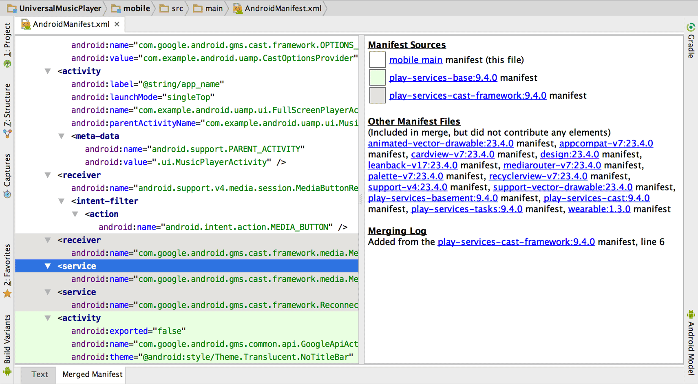
>
> 属于构建的一部分但不构成元素或属性的清单文件列在右侧的 **Other Manifest Files** 下方。
>
> 要查看有关元素来源的信息，请在左侧单击元素，详细信息将显示在右侧的 **Merging Log** 下方。
>
> 如果发生任何冲突，它们将显示在右侧的 **Merging Errors** 下方，并且包含有关如何使用 [合并规则标记](https://developer.android.google.cn/studio/build/manifest-merge.html#merge_rule_markers)解决冲突的建议。 错误也会 打印在 **Event Log** 窗口（请选择 **View > Tool Windows > Event Log**）中。
>
> 如果您想要查看合并决策树的完整日志，则可以在模块的 `build/outputs/logs/` 目录（名为 `manifest-merger-buildVariant-report.txt`）中查找该日志文件。

### 附录：合并策略

> 清单合并工具可以在逻辑上将某个清单中的每个 XML 元素与其他清单中的对应元素相匹配。 合并工具会使用“匹配关键字”匹配每个元素，匹配关键字可以是唯一的属性值（如 `android:name`或标记本身的天然唯一性例如，只能有一个 `<supports-screen>` 元素）。 如果两个清单具有相同的 XML 元素，工具将采用三种合并策略中的一种来合并这两个元素：
>
> * 合并：
>
>   将所有非冲突属性合并到同一标记中， 然后按其各自的合并策略合并子元素。 如果任何属性 相互冲突，请使用[合并规则标记](https://developer.android.google.cn/studio/build/manifest-merge.html#merge_rule_markers)将它们合并在一起。
>
> * 仅合并子项：
>
>   不整合或合并属性（仅保留 优先级最高的清单文件提供的属性）并按照其合并策略 合并子项。
>
> * 保留：
>
>   将元素“按原样”保留，然后将其添加至 合并文件中的常用父元素。 此策略仅在可接受相同元素的多个 声明时使用。
>
> 本节第一个表列出了每种元素类型、使用的合并策略类型以及用于确定两个清单之间的元素匹配的关键字。
>
> 清单元素合并策略和合并关键字：
>
> | 元素                       | 合并策略 | 合并关键字                                    |
> | ------------------------ | ---- | ---------------------------------------- |
> | `<action>`               | 合并   | `android:name` 属性                        |
> | `<activity>`             | 合并   | `android:name` 属性                        |
> | `<application>`          | 合并   | 每个 `<manifest>` 仅一个                      |
> | `<category>`             | 合并   | `android:name` 属性                        |
> | `<data>`                 | 合并   | 每个 `<intent-filter>` 仅 1 个               |
> | `<grant-uri-permission>` | 合并   | 每个 `<provider>` 仅 1 个                    |
> | `<instrumentation>`      | 合并   | `android:name` 属性                        |
> | `<intent-filter>`        | 保留   | 不匹配；允许父元素内的多个声明                          |
> | `<manifest>`             | 合并   | 每个文件仅 1 个                                |
> | `<meta-data>`            | 合并   | `android:name` 属性                        |
> | `<path-permission>`      | 合并   | 每个 `<provider>` 仅 1 个                    |
> | `<permission-group>`     | 合并   | `android:name` 属性                        |
> | `<permission>`           | 合并   | `android:name` 属性                        |
> | `<permission-tree>`      | 合并   | `android:name` 属性                        |
> | `<provider>`             | 合并   | `android:name` 属性                        |
> | `<receiver>`             | 合并   | `android:name` 属性                        |
> | `<screen>`               | 合并   | `android:screenSize` 属性                  |
> | `<service>`              | 合并   | `android:name` 属性                        |
> | `<supports-gl-texture>`  | 合并   | `android:name` 属性                        |
> | `<supports-screen>`      | 合并   | 每个 `<manifest>` 仅 1 个                    |
> | `<uses-configuration>`   | 合并   | 每个 `<manifest>` 仅 1 个                    |
> | `<uses-feature>`         | 合并   | `android:name` 属性（如果不存在，则使用 `android:glEsVersion` 属性） |
> | `<uses-library>`         | 合并   | `android:name` 属性                        |
> | `<uses-permission>`      | 合并   | `android:name` 属性                        |
> | `<uses-sdk>`             | 合并   | 每个 `<manifest>` 仅 1 个                    |
> | 自定义元素                    | 合并   | 无匹配；合并工具不了解这些信息，因此它们始终 包括在合并清单中          |

## 给Manifest注入构建变量

> 如果你想从`build.gradle`文件中给 `AndroidManifest.xml` 文件中注入变量，那么你可以使用[`manifestPlaceholders`](http://google.github.io/android-gradle-dsl/current/com.android.build.gradle.internal.dsl.ProductFlavor.html#com.android.build.gradle.internal.dsl.ProductFlavor:manifestPlaceholders) 属性。这个属性拥有一个键-值映射关系，如下：
>
> ```groovy
> android {
>     defaultConfig {
>         manifestPlaceholders = [hostName:"www.example.com"]
>     }
>     ...
> }
> ```
>
> 然后你可以给清单文件的一个属性中注入一个点位符，如下：
>
> ```groovy
> <intent-filter ... >
>     <data android:scheme="http" android:host="${hostName}" ... />
>     ...
> </intent-filter>
> ```
>
> 默认情况下，构建工具同样会给你的app提供一个 `${applicationId}` 占位符来保存应用ID。这个值总是匹配当前构建最终的应用ID([包括在构建变体中改变后的值]( https://developer.android.google.cn/studio/build/application-id.html#change_the_application_id_for_build_variants))。这样就可以在你的构建变体之间使用唯一的标识命名空间。
>
> 例如：如果你的`build.gradle`文件看起来如下：
>
> ```groovy
> android {
>     defaultConfig {
>         applicationId "com.example.myapp"
>     }
>     productFlavors {
>         free {
>             applicationIdSuffix ".free"
>         }
>         pro {
>             applicationIdSuffix ".pro"
>         }
>     }
> }
> ```
>
> 然后你可以在你的清单文件中注入应用ID，如下：
>
> ```xml
> <intent-filter ... >
>     <action android:name="${applicationId}.TRANSMOGRIFY" />
>     ...
> </intent-filter>
> ```
>
> 当你构建“free”产品风味那么最终的清单中的结果如下：
>
> ```xml
> <intent-filter ... >
>    <action android:name="com.example.myapp.free.TRANSMOGRIFY" />
>     ...
> </intent-filter>
> ```
>
> 更多的信息，请查看[设置应用ID](https://developer.android.google.cn/studio/build/application-id.html) 。

## 压缩代码和资源

> 要尽可能减小 APK 文件，您应该启用压缩来移除发布构建中未使用的代码和资源。此页面介绍如何执行该操作，以及如何指定要在构建时保留或舍弃的代码和资源。
>
> 代码压缩通过 ProGuard 提供，ProGuard 会检测和移除封装应用中未使用的类、字段、方法和属性，包括自带代码库中的未使用项（这使其成为以变通方式解决 [64k 引用限制](https://developer.android.google.cn/studio/build/multidex.html)的有用工具）。ProGuard 还可优化字节码，移除未使用的代码指令，以及用短名称混淆其余的类、字段和方法。混淆过的代码可令您的 APK 难以被逆向工程，这在应用使用[许可验证](https://developer.android.google.cn/google/play/licensing/overview.html)等安全敏感性功能时特别有用。
>
> 资源压缩通过适用于 Gradle 的 Android 插件提供，该插件会移除封装应用中未使用的资源，包括代码库中未使用的资源。它可与代码压缩发挥协同效应，使得在移除未使用的代码后，任何不再被引用的资源也能安全地移除。
>
> 本文介绍的功能依赖下列组件：
>
> * [SDK Tools](https://developer.android.google.cn/studio/releases/sdk-tools.html) 25.0.10 或更高版本
> * [适用于 Gradle 的 Android 插件](https://developer.android.google.cn/studio/releases/gradle-plugin.html) 2.0.0 或更高版本

### 压缩代码

> 要通过 ProGuard 启用代码压缩，请在 `build.gradle` 文件内相应的构建类型中添加 `minifyEnabled true`。
>
> 请注意，代码压缩会拖慢构建速度，因此您应该尽可能避免在调试构建中使用。不过，重要的是您一定要为用于测试的最终 APK 启用代码压缩，因为如果您不能充分地[自定义要保留的代码](https://developer.android.google.cn/studio/build/shrink-code.html#keep-code)，可能会引入错误。
>
> 例如，下面这段来自 `build.gradle` 文件的代码用于为发布构建启用代码压缩：
>
> ```groovy
> android {
>     buildTypes {
>         release {
>             minifyEnabled true
>             proguardFiles getDefaultProguardFile('proguard-android.txt'),
>                     'proguard-rules.pro'
>         }
>     }
>     ...
> }
> ```
>
> > **注**：Android Studio 会在使用 [Instant Run](https://developer.android.google.cn/studio/run/index.html#instant-run) 时停用 ProGuard。如果您需要为增量式构建压缩代码，请尝试[试用 Gradle 压缩器](https://developer.android.google.cn/studio/build/shrink-code.html#gradle-shrinker)。
>
> 除了 `minifyEnabled` 属性外，还有用于定义 ProGuard 规则的 `proguardFiles` 属性：
>
> * `getDefaultProguardFile('proguard-android.txt')` 方法可从 Android SDK `tools/proguard/` 文件夹获取默认的 ProGuard 设置。
>
>   **提示**：要想做进一步的代码压缩，请尝试使用位于同一位置的 `proguard-android-optimize.txt` 文件。它包括相同的 ProGuard 规则，但还包括其他在字节码一级（方法内和方法间）执行分析的优化，以进一步减小 APK 大小和帮助提高其运行速度。
>
> * `proguard-rules.pro` 文件用于添加自定义 ProGuard 规则。默认情况下，该文件位于模块根目录（和`build.gradle` 文件同级）。
>
> 要添加更多各构建变体专用的 ProGuard 规则，请在相应的 `productFlavor` 代码块中再添加一个 `proguardFiles` 属性。例如，以下 Gradle 文件会向 `flavor2` 产品定制添加 `flavor2-rules.pro`。现在 `flavor2` 使用所有三个 ProGuard 规则，因为还应用了来自 `release` 代码块的规则。
>
> ```groovy
> android {
>     ...
>     buildTypes {
>         release {
>             minifyEnabled true
>             proguardFiles getDefaultProguardFile('proguard-android.txt'),
>                    'proguard-rules.pro'
>         }
>     }
>     productFlavors {
>         flavor1 {
>         }
>         flavor2 {
>             proguardFile 'flavor2-rules.pro'
>         }
>     }
> }
> ```
>
> 每次构建时 ProGuard 都会输出下列文件：
>
> * `dump.txt`
>
>   说明 APK 中所有类文件的内部结构。
>
> * `mapping.txt`
>
>   提供原始与混淆过的类、方法和字段名称之间的转换。
>
> * `seeds.txt`
>
>   列出未进行混淆的类和成员。
>
> * `usage.txt`
>
>   列出从 APK 移除的代码。
>
> 这些文件保存在 `<module-name>/build/outputs/mapping/release/` 中。

### 自定义要保留的代码

> 对于某些情况，默认 ProGuard 配置文件 (`proguard-android.txt`) 足以满足需要，ProGuard 会移除所有（并且只会移除）未使用的代码。不过，ProGuard 难以对所有情况进行正确分析，可能会移除应用真正需要的代码。举例来说，它可能错误移除代码的情况包括：
>
> * 当应用引用的类只来自 `AndroidManifest.xml` 文件时
> * 当应用调用的方法来自 Java 原生接口 (JNI) 时
> * 当应用在运行时（例如使用反射或自检）操作代码时
>
> 测试应用应该能够发现因不当移除的代码而导致的错误，但您也可以通过查看 `<module-name>/build/outputs/mapping/release/` 中保存的 `usage.txt` 输出文件来检查移除了哪些代码。
>
> 要修正错误并强制 ProGuard 保留特定代码，请在 ProGuard 配置文件中添加一行 `-keep` 代码。例如：
>
> ```groovy
> -keep public class MyClass
> ```
>
> 或者，您可以向您想保留的代码添加 `@Keep` 注解。在类上添加 `@Keep` 可原样保留整个类。在方法或字段上添加它可完整保留方法/字段（及其名称）以及类名称。请注意，只有在使用[注解支持库](https://developer.android.google.cn/studio/write/annotations.html)时，才能使用此注解。
>
> 在使用 `-keep` 选项时，有许多事项需要考虑；如需了解有关自定义配置文件的详细信息，请阅读 [ProGuard 手册](http://stuff.mit.edu/afs/sipb/project/android/sdk/android-sdk-linux/tools/proguard/docs/index.html#manual/introduction.html)。[问题排查](http://stuff.mit.edu/afs/sipb/project/android/sdk/android-sdk-linux/tools/proguard/docs/index.html#manual/troubleshooting.html)一章概述了您可能会在混淆代码时遇到的其他常见问题。

### 解码混淆过的堆叠追踪

> 在 ProGuard 压缩代码后，读取堆叠追踪变得困难（即使并非不可行），因为方法名称经过了混淆处理。幸运的是，ProGuard 每次运行时都会创建一个 `mapping.txt` 文件，其中显示了与混淆过的名称对应的原始类名称、方法名称和字段名称。ProGuard 将该文件保存在应用的 `<module-name>/build/outputs/mapping/release/` 目录中。
>
> 请注意，您每次使用 ProGuard 创建发布构建时都会覆盖 `mapping.txt` 文件，因此您每次发布新版本时都必须小心地保存一个副本。通过为每个发布构建保留一个 `mapping.txt` 文件副本，您就可以在用户提交的已混淆堆叠追踪来自旧版本应用时对问题进行调试。
>
> 在 Google Play 上发布应用时，您可以上传每个 APK 版本的 `mapping.txt` 文件。Google Play 将根据用户报告的问题对收到的堆叠追踪进行去混淆处理，以便您在 Google Play Developer Console 中进行检查。如需了解详细信息，请参阅帮助中心有关如何[对崩溃堆叠追踪进行去混淆处理](https://support.google.com/googleplay/android-developer/answer/6295281)的文章。
>
> 要自行将混淆过的堆叠追踪转换成可读的堆叠追踪，请使用 `retrace` 脚本（在 Windows 上为 `retrace.bat`；在 Mac/Linux 上为 `retrace.sh`）。它位于 `<sdk-root>/tools/proguard/` 目录中。该脚本利用 `mapping.txt` 文件和您的堆叠追踪生成新的可读堆叠追踪。使用 retrace 工具的语法如下：
>
> ```shell
> retrace.bat|retrace.sh [-verbose] mapping.txt [<stacktrace_file>]
> ```
>
> 例如：
>
> ```shell
> retrace.bat -verbose mapping.txt obfuscated_trace.txt
> ```
>
> 如果您不指定堆叠追踪文件，retrace 工具会从标准输入读取。

### 通过 Instant Run 启用代码压缩

> 如果代码压缩在您增量构建应用时非常重要，请尝试[适用于 Gradle 的 Android 插件](https://developer.android.google.cn/studio/releases/gradle-plugin.html)内置的试用代码压缩器。与 ProGuard 不同，此压缩器支持 [Instant Run](https://developer.android.google.cn/studio/run/index.html#instant-run)。
>
> 您也可以使用与 ProGuard 相同的配置文件来配置 Android 插件压缩器。但是，**Android 插件压缩器不会对您的代码进行混淆处理或优化**，它只会删除未使用的代码。因此，您应该仅将其用于调试构建，并为发布构建启用 ProGuard，以便对发布 APK 的代码进行混淆处理和优化。
>
> 要启用 Android 插件压缩器，只需在 "debug" 构建类型中将 `useProguard` 设置为 `false`（并保留 `minifyEnabled` 设置 `true`）：
>
> ```groovy
> android {
>     buildTypes {
>         debug {
>             minifyEnabled true
>             useProguard false
>             proguardFiles getDefaultProguardFile('proguard-android.txt'),
>                     'proguard-rules.pro'
>         }
>         release {
>             minifyEnabled true
>             proguardFiles getDefaultProguardFile('proguard-android.txt'),
>                     'proguard-rules.pro'
>         }
>     }
> }
> ```
>
> > **注**：如果 Android 插件压缩器最初删除了某个方法，但您之后更改了代码，使该方法可访问，Instant Run 会将其视为[结构代码更改](https://developer.android.google.cn/studio/run/index.html#ir-table)并执行冷交换。

### 压缩资源

> 资源压缩只与代码压缩协同工作。代码压缩器移除所有未使用的代码后，资源压缩器便可确定应用仍然使用的资源。这在您添加包含资源的代码库时体现得尤为明显 - 您必须移除未使用的库代码，使库资源变为未引用资源，才能通过资源压缩器将它们移除。
>
> 要启用资源压缩，请在 `build.gradle` 文件中将 `shrinkResources` 属性设置为 `true`（和用于代码压缩的 `minifyEnabled` 同级）。例如：
>
> ```groovy
> android {
>     ...
>     buildTypes {
>         release {
>             shrinkResources true
>             minifyEnabled true
>             proguardFiles getDefaultProguardFile('proguard-android.txt'),
>                     'proguard-rules.pro'
>         }
>     }
> }
> ```
>
> 如果您尚未使用代码压缩用途的 `minifyEnabled` 构建应用，请先尝试使用它，然后再启用 `shrinkResources`，因为您可能需要编辑 `proguard-rules.pro`文件以保留动态创建或调用的类或方法，然后再开始移除资源。
>
> > **注**：资源压缩器目前不会移除 `values/` 文件夹中定义的资源（例如字符串、尺寸、样式和颜色）。这是因为 Android 资源打包工具 (AAPT) 不允许 Gradle 插件为资源指定预定义版本。有关详情，请参阅[问题 70869](https://code.google.com/p/android/issues/detail?id=70869)。

### 自定义要保留的资源

> 如果您有想要保留或舍弃的特定资源，请在您的项目中创建一个包含 `<resources>` 标记的 XML 文件，并在 `tools:keep` 属性中指定每个要保留的资源，在 `tools:discard` 属性中指定每个要舍弃的资源。这两个属性都接受逗号分隔的资源名称列表。您可以使用星号字符作为通配符。
>
> 例如：
>
> ```xml
> <?xml version="1.0" encoding="utf-8"?>
> <resources xmlns:tools="http://schemas.android.com/tools"
>     tools:keep="@layout/l_used*_c,@layout/l_used_a,@layout/l_used_b*"
>     tools:discard="@layout/unused2" />
> ```
>
> 将该文件保存在项目资源中，例如，保存在 `res/raw/keep.xml`。构建不会将该文件打包到 APK 之中。
>
> 指定要舍弃的资源可能看似愚蠢，因为您本可将它们删除，但在使用构建变体时，这样做可能很有用。例如，如果您明知给定资源表面上会在代码中使用（并因此不会被压缩器移除），但实际不会用于给定构建变体，就可以将所有资源放入公用项目目录，然后为每个构建变体创建一个不同的 `keep.xml` 文件。构建工具也可能无法根据需要正确识别资源，这是因为编译器会添加内联资源 ID，而资源分析器可能不知道真正引用的资源和恰巧具有相同值的代码中的整数值之间的差别。

### 启用严格引用检查

> 正常情况下，资源压缩器可准确判定系统是否使用了资源。不过，如果您的代码调用 `Resources.getIdentifier()`（或您的任何库进行了这一调用 - [AppCompat](https://developer.android.google.cn/topic/libraries/support-library/features.html#v7-appcompat) 库会执行该调用），这就表示您的代码将根据动态生成的字符串查询资源名称。当您执行这一调用时，默认情况下资源压缩器会采取防御性行为，将所有具有匹配名称格式的资源标记为可能已使用，无法移除。
>
> 例如，以下代码会使所有带 `img_` 前缀的资源标记为已使用。
>
> ```java
> String name = String.format("img_%1d", angle + 1);
> res = getResources().getIdentifier(name, "drawable", getPackageName());
> ```
>
> 资源压缩器还会浏览代码以及各种 `res/raw/` 资源中的所有字符串常量，寻找格式类似于 `file:///android_res/drawable//ic_plus_anim_016.png` 的资源网址。如果它找到与其类似的字符串，或找到其他看似可用来构建与其类似的网址的字符串，则不会将它们移除。
>
> 这些是默认情况下启用的安全压缩模式的示例。但您可以停用这一“有备无患”处理方式，并指定资源压缩器只保留其确定已使用的资源。要执行此操作，请在 `keep.xml` 文件中将 `shrinkMode` 设置为 `strict`，如下所示：
>
> ```xml
> <?xml version="1.0" encoding="utf-8"?>
> <resources xmlns:tools="http://schemas.android.com/tools"
>     tools:shrinkMode="strict" />
> ```
>
> 如果您确已启用严格压缩模式，并且代码也引用了包含动态生成字符串的资源（如上所示），则必须利用 `tools:keep` 属性手动保留这些资源。

### 移除未使用的备用资源

> Gradle 资源压缩器只会移除未被您的应用代码引用的资源，这意味着它不会移除用于不同设备配置的[备用资源](https://developer.android.google.cn/guide/topics/resources/providing-resources.html#AlternativeResources)。必要时，您可以使用 Android Gradle 插件的 `resConfigs` 属性来移除您的应用不需要的备用资源文件。
>
> 例如，如果您使用的库包含语言资源（例如使用的是 AppCompat 或 Google Play 服务），则 APK 将包括这些库中消息的所有已翻译语言字符串，无论应用的其余部分是否翻译为同一语言。如果您想只保留应用正式支持的语言，则可以利用 `resConfig` 属性指定这些语言。系统会移除未指定语言的所有资源。
>
> 下面这段代码展示了如何将语言资源限定为仅支持英语和法语：
>
> ```groovy
> android {
>     defaultConfig {
>         ...
>         resConfigs "en", "fr"
>     }
> }
> ```
>
> 同理，您也可以利用 [APK 拆分](https://developer.android.google.cn/studio/build/configure-apk-splits.html)为不同设备构建不同的 APK，自定义在 APK 中包括的屏幕密度或 ABI 资源。

### 合并重复资源

> 默认情况下，Gradle 还会合并同名资源，例如可能位于不同资源文件夹中的同名可绘制对象。这一行为不受 `shrinkResources` 属性控制，也无法停用，因为在有多个资源匹配代码查询的名称时，有必要利用这一行为来避免错误。
>
> 只有在两个或更多个文件具有完全相同的资源名称、类型和限定符时，才会进行资源合并。Gradle 会在重复项中选择其视为最佳选择的文件（根据下述优先顺序），并只将这一个资源传递给 AAPT，以供在 APK 文件中分发。
>
> Gradle 会在下列位置寻找重复资源：
>
> * 与主源集关联的主资源，一般位于 `src/main/res/` 中。
> * 变体叠加，来自构建类型和构建风味。
> * 库项目依赖项。
>
> Gradle 会按以下级联优先顺序合并重复资源：
>
> `依赖项 → 主资源 → 构建风味 → 构建类型`
>
> 例如，如果某个重复资源同时出现在主资源和构建风味中，Gradle 会选择构建风味中的重复资源。
>
> 如果完全相同的资源出现在同一源集中，Gradle 无法合并它们，并且会发出资源合并错误。如果您在 `build.gradle` 文件的 `sourceSet` 属性中定义了多个源集，则可能会发生这种情况，例如，如果 `src/main/res/` 和 `src/main/res2/` 包含完全相同的资源，就可能会发生这种情况。

### 排查资源压缩问题

> 当您压缩资源时，Gradle Console 会显示它从应用软件包中移除的资源的摘要。例如：
>
> ```groovy
> :android:shrinkDebugResources
> Removed unused resources: Binary resource data reduced from 2570KB to 1711KB: Removed 33%
> :android:validateDebugSigning
> ```
>
> Gradle 还会在 `<module-name>/build/outputs/mapping/release/`（ProGuard 输出文件所在的文件夹）中创建一个名为 `resources.txt `的诊断文件。该文件包括诸如哪些资源引用了其他资源以及使用或移除了哪些资源等详情。
>
> 例如，要了解您的 APK 为何仍包含 `@drawable/ic_plus_anim_016`，请打开 `resources.txt` 文件并搜索该文件名。您可能会发现，有其他资源引用了它，如下所示：
>
> ```groovy
> 16:25:48.005 [QUIET] [system.out] @drawable/add_schedule_fab_icon_anim : reachable=true
> 16:25:48.009 [QUIET] [system.out]     @drawable/ic_plus_anim_016
> ```
>
> 现在您需要了解为何 `@drawable/add_schedule_fab_icon_anim` 可以访问 - 如果您向上搜索，就会发现“The root reachable resources are:”之下列有该资源。这意味着存在对 `add_schedule_fab_icon_anim` 的代码引用（即在可访问代码中找到了其 R.drawable ID）。
>
> 如果您使用的不是严格检查，则存在看似可用于为动态加载资源构建资源名称的字符串常量时，可将资源 ID 标记为可访问。在这种情况下，如果您在构建输出中搜索资源名称，可能会找到类似下面这样的消息：
>
> ```groovy
> 10:32:50.590 [QUIET] [system.out] Marking drawable:ic_plus_anim_016:2130837506
>     used because it format-string matches string pool constant ic_plus_anim_%1$d.
> ```
>
> 如果您看到一个这样的字符串，并且您能确定该字符串未用于动态加载给定资源，就可以按照有关如何[自定义要保留的资源](https://developer.android.google.cn/studio/build/shrink-code.html#keep-resources)部分中所述利用 `tools:discard` 属性通知构建系统将它移除。

## 配置方法数超过64K的应用

> 随着 Android 平台的持续成长，Android 应用的大小也在增加。当您的应用及其引用的库达到特定大小时，您会遇到构建错误，指明您的应用已达到 Android 应用构建架构的极限。早期版本的构建系统按如下方式报告这一错误：
>
> ```java
> Conversion to Dalvik format failed:
> Unable to execute dex: method ID not in [0, 0xffff]: 65536
> ```
>
> 较新版本的 Android 构建系统虽然显示的错误不同，但指示的是同一问题：
>
> ```java
> trouble writing output:
> Too many field references: 131000; max is 65536.
> You may try using --multi-dex option.
> ```
>
> 这些错误状况都会显示下面这个数字：65,536。这个数字很重要，因为它代表的是单个 Dalvik Executable (DEX) 字节码文件内的代码可调用的引用总数。本页介绍如何通过启用被称为 *Dalvik 可执行文件分包*的应用配置来越过这一限制，使您的应用能够构建并读取 Dalvik 可执行文件分包 DEX 文件。

### 关于 64K 引用限制

> Android 应用 (APK) 文件包含 [Dalvik](https://source.android.google.cn/devices/tech/dalvik/) Executable (DEX) 文件形式的可执行字节码文件，其中包含用来运行您的应用的已编译代码。Dalvik Executable 规范将可在单个 DEX 文件内可引用的方法总数限制在 65,536，其中包括 Android 框架方法、库方法以及您自己代码中的方法。在计算机科学领域内，术语[*千（简称 K）*](https://en.wikipedia.org/wiki/Kilo-)表示 1024（或 2^10）。由于 65,536 等于 64 X 1024，因此这一限制也称为“64K 引用限制”。

#### Android 5.0 之前版本的 Dalvik 可执行文件分包支持

> Android 5.0（API 级别 21）之前的平台版本使用 Dalvik 运行时来执行应用代码。默认情况下，Dalvik 限制应用的每个 APK 只能使用单个 `classes.dex` 字节码文件。要想绕过这一限制，您可以使用 [Dalvik 可执行文件分包支持库](https://developer.android.google.cn/tools/support-library/features.html#multidex)，它会成为您的应用主要 DEX 文件的一部分，然后管理对其他 DEX 文件及其所包含代码的访问。
>
> > **注**：如果您的项目配置时所面向的 Dalvik 可执行文件分包使用的是 `minSdkVersion 20` 或更低版本，并且您将其部署到运行 Android 4.4（API 级别 20）或更低版本的目标设备上，则 Android Studio 会停用 [Instant Run](https://developer.android.google.cn/tools/building/building-studio.html#instant-run)。

#### Android 5.0 及更高版本的 Dalvik 可执行文件分包支持

> Android 5.0（API 级别 21）及更高版本使用名为 ART 的运行时，后者原生支持从 APK 文件加载多个 DEX 文件。ART 在应用安装时执行预编译，扫描 `classesN.dex` 文件，并将它们编译成单个 `.oat` 文件，供 Android 设备执行。因此，如果您的 `minSdkVersion` 为 21 或更高值，则不需要 Dalvik 可执行文件分包支持库。
>
> 如需了解有关 Android 5.0 运行时的详细信息，请参阅 [ART 和 Dalvik](https://source.android.google.cn/devices/tech/dalvik/art.html)。
>
> > **注**：如果将应用的 `minSdkVersion` 设置为 21 或更高值，使用 [Instant Run](https://developer.android.google.cn/tools/building/building-studio.html#instant-run) 时，Android Studio 会自动将应用配置为进行 Dalvik 可执行文件分包。由于 Instant Run 仅适用于调试版本的应用，您仍需配置发布构建进行 Dalvik 可执行文件分包，以规避 64K 限制。

### 规避 64K 限制

> 在将您的应用配置为支持使用 64K 或更多方法引用之前，您应该采取措施减少应用代码调用的方法引用总数，包括由您的应用代码或包含的库定义的方法。下列策略可帮助您避免达到 DEX 引用限制：
>
> * **检查您的应用的直接和传递依赖项**确保您在应用中使用任何庞大依赖库所带来的好处大于为应用添加大量代码所带来的弊端。一种常见的反面模式是，仅仅为了使用几个实用方法就在应用中加入非常庞大的库。减少您的应用代码依赖项往往能够帮助您规避 dex 引用限制。
> * **通过 ProGuard 移除未使用的代码** - 为您的版本构建[启用代码压缩](https://developer.android.google.cn/studio/build/shrink-code.html)以运行 ProGuard。启用压缩可确保您交付的 APK 不含有未使用的代码。
>
> 使用这些技巧使您不必在应用中启用 Dalvik 可执行文件分包，同时还会减小 APK 的总体大小。

### 配置您的应用进行 Dalvik 可执行文件分包

> 将您的应用项目设置为使用 Dalvik 可执行文件分包配置需要对您的应用项目进行以下修改，具体取决于应用支持的最低 Android 版本。
>
> 如果您的 `minSdkVersion` 设置为 21 或更高值，您只需在模块级 `build.gradle` 文件中将 `multiDexEnabled` 设置为 `true`，如此处所示：
>
> ```groovy
> android {
>     defaultConfig {
>         ...
>         minSdkVersion 21 
>         targetSdkVersion 26
>         multiDexEnabled true
>     }
>     ...
> }
> ```
>
> 但是，如果您的 `minSdkVersion` 设置为 20 或更低值，则您必须按如下方式使用 [Dalvik 可执行文件分包支持库](https://developer.android.google.cn/tools/support-library/features.html#multidex)：
>
> * 修改模块级 `build.gradle` 文件以启用 Dalvik 可执行文件分包，并将 Dalvik 可执行文件分包库添加为依赖项，如此处所示：
>
>   ```groovy
>   android {
>       defaultConfig {
>           ...
>           minSdkVersion 15 
>           targetSdkVersion 26
>           multiDexEnabled true
>       }
>       ...
>   }
>
>   dependencies {
>     compile 'com.android.support:multidex:1.0.1'
>   }
>   ```
>
> * 根据是否要替换 [`Application`](https://developer.android.google.cn/reference/android/app/Application.html) 类，执行以下操作之一：
>
>   * 如果您*没有*替换 [`Application`](https://developer.android.google.cn/reference/android/app/Application.html) 类，请编辑清单文件，按如下方式设置 `<application>` 标记中的 `android:name`：
>
>     ```xml
>     <?xml version="1.0" encoding="utf-8"?>
>     <manifest xmlns:android="http://schemas.android.com/apk/res/android"
>         package="com.example.myapp">
>         <application
>                 android:name="android.support.multidex.MultiDexApplication" >
>             ...
>         </application>
>     </manifest>
>     ```
>
>   * 如果您替换了 [`Application`](https://developer.android.google.cn/reference/android/app/Application.html) 类，请按如下方式对其进行更改以扩展 `MultiDexApplication`（如果可能）：
>
>     ```java
>     public class MyApplication extends MultiDexApplication { ... }
>     ```
>
>   * 或者，如果您替换了 [`Application`](https://developer.android.google.cn/reference/android/app/Application.html) 类，但无法更改基本类，则可以改为替换 [`attachBaseContext()`](https://developer.android.google.cn/reference/android/content/ContextWrapper.html#attachBaseContext(android.content.Context)) 方法并调用 [`MultiDex.install(this)`](https://developer.android.google.cn/reference/android/support/multidex/MultiDex.html#install(android.content.Context)) 来启用 Dalvik 可执行文件分包：
>
>     ```java
>     public class MyApplication extends SomeOtherApplication {
>       @Override
>       protected void attachBaseContext(Context base) {
>          super.attachBaseContext(context);
>          Multidex.install(this);
>       }
>     }
>     ```
>
>   构建应用后，Android 构建工具会根据需要构建主 DEX 文件 (`classes.dex`) 和辅助 DEX 文件（`classes2.dex` 和 `classes3.dex` 等）。然后，构建系统会将所有 DEX 文件打包到您的 APK 中。
>
>   运行时，Dalvik 可执行文件分包 API 使用特殊的类加载器来搜索适用于您的方法的所有 DEX 文件（而不是仅在主 `classes.dex` 文件中搜索）。

#### Dalvik 可执行文件分包支持库的局限性

> Dalvik 可执行文件分包支持库具有一些已知的局限性，将其纳入您的应用构建配置之中时，您应该注意这些局限性并进行针对性的测试：
>
> * 启动期间在设备数据分区中安装 DEX 文件的过程相当复杂，如果辅助 DEX 文件较大，可能会导致应用无响应 (ANR) 错误。在此情况下，您应该[通过 ProGuard 应用代码压缩](https://developer.android.google.cn/studio/build/shrink-code.html)以尽量减小 DEX 文件的大小，并移除未使用的那部分代码。
> * 由于存在 Dalvik linearAlloc 错误（问题 [22586](http://b.android.com/22586)），使用 Dalvik 可执行文件分包的应用可能无法在运行的平台版本早于 Android 4.0（API 级别 14）的设备上启动。如果您的目标 API 级别低于 14，请务必针对这些版本的平台进行测试，因为您的应用可能会在启动时或加载特定类群时出现问题。代码压缩可以减少甚至有可能消除这些潜在问题。
> * 由于存在 Dalvik linearAlloc 限制（问题 [78035](http://b.android.com/78035)），因此，如果使用 Dalvik 可执行文件分包配置的应用发出非常庞大的内存分配请求，则可能会在运行期间发生崩溃。尽管 Android 4.0（API 级别 14）提高了分配限制，但在 Android 5.0（API 级别 21）之前的 Android 版本上，应用仍有可能遭遇这一限制。

### 声明主 DEX 文件中需要的类

> 为 Dalvik 可执行文件分包构建每个 DEX 文件时，构建工具会执行复杂的决策制定来确定主要 DEX 文件中需要的类，以便应用能够成功启动。如果启动期间需要的任何类未在主 DEX 文件中提供，那么您的应用将崩溃并出现错误 `java.lang.NoClassDefFoundError`。
>
> 该情况不应出现在直接从应用代码访问的代码上，因为构建工具能识别这些代码路径，但可能在代码路径可见性较低（如使用的库具有复杂的依赖项）时出现。例如，如果代码使用自检机制或从原生代码调用 Java 方法，那么这些类可能不会被识别为主 DEX 文件中的必需项。
>
> 因此，如果您收到 `java.lang.NoClassDefFoundError`，则必须使用构建类型中的 [`multiDexKeepFile`](http://google.github.io/android-gradle-dsl/current/com.android.build.gradle.internal.dsl.BuildType.html#com.android.build.gradle.internal.dsl.BuildType:multiDexKeepFile) 或 [`multiDexKeepProguard`](http://google.github.io/android-gradle-dsl/2.2/com.android.build.gradle.internal.dsl.BuildType.html#com.android.build.gradle.internal.dsl.BuildType:multiDexKeepProguard) 属性声明它们，以手动将这些其他类指定为主 DEX 文件中的必需项。如果类在 `multiDexKeepFile` 或 `multiDexKeepProguard` 文件中匹配，则该类会添加至主DEX 文件。

#### multiDexKeepFile 属性

> 您在 `multiDexKeepFile` 中指定的文件应该每行包含一个类，并且采用 `com/example/MyClass.class` 的格式。例如，您可以创建一个名为 `multidex-config.txt` 的文件，如下所示：
>
> ```
> com/example/MyClass.class
> com/example/MyOtherClass.class
> ```
>
> 然后，您可以按以下方式针对构建类型声明该文件：
>
> ```groovy
> android {
>     buildTypes {
>         release {
>             multiDexKeepFile file 'multidex-config.txt'
>             ...
>         }
>     }
> }
> ```
>
> 请记住，Gradle 会读取相对于 `build.gradle` 文件的路径，因此如果 `multidex-config.txt` 与 `build.gradle` 文件在同一目录中，以上示例将有效。

#### multiDexKeepProguard 属性

> `multiDexKeepProguard` 文件使用与 Proguard 相同的格式，并且支持整个 Proguard 语法。如需了解有关 Proguard 格式和语法的详细信息，请参阅 Proguard 手册中的 [Keep Options](http://proguard.sourceforge.net/manual/usage.html#keepoptions) 一节。
>
> 您在 `multiDexKeepProguard` 中指定的文件应该在任何有效的 ProGuard 语法中包含 `-keep` 选项。例如，`-keep com.example.MyClass.class`。您可以创建一个名为 `multidex-config.pro` 的文件，如下所示：
>
> ```
> -keep class com.example.MyClass
> -keep class com.example.MyClassToo
> ```
>
> 如果您想要指定包中的所有类，文件将如下所示：
>
> ```
> -keep class com.example.** { *; } // com.example包中的所有类
> ```
>
> 然后，您可以按以下方式针对构建类型声明该文件：
>
> ```groovy
> android {
>     buildTypes {
>         release {
>             multiDexKeepProguard 'multidex-config.pro'
>             ...
>         }
>     }
> }
> ```

### 优化开发构建中的 Dalvik 可执行文件分包

> Dalvik 可执行文件分包配置会大幅增加构建处理时间，因为构建系统必须就哪些类必须包括在主 DEX 文件中以及哪些类可以包括在辅助 DEX 文件中作出复杂的决策。这意味着使用 Dalvik 可执行文件分包的增量式构建通常耗时更长，可能会拖慢您的开发进度。
>
> 为了缩短耗时更长的 Dalvik 可执行文件分包输出构建时间，请利用 [`productFlavors`](http://tools.android.com/tech-docs/new-build-system/user-guide#TOC-Product-flavors)（一个开发定制和一个发布定制，具有不同的 `minSdkVersion` 值）创建两个构建变型。
>
> 对于开发定制，将 `minSdkVersion` 设置为 21。该设置将启用一个名为 *pre-dexing* 的构建功能，此功能使用仅适用于 Android 5.0（API 级别 21）和更高版本的 ART 格式更快生成 Dalvik 可执行文件分包输出。对于发布定制，将 `minSdkVersion` 设置为适于您的实际最低支持级别。此设置生成的 Dalvik 可执行文件分包 APK 可兼容更多设备，但构建时间更长。
>
> 以下构建配置示例展示了如何在 Gradle 构建文件中设置这些定制：
>
> ```groovy
> android {
>     defaultConfig {
>         ...
>         multiDexEnabled true
>     }
>     productFlavors {
>         dev {
>           	// 启用pre-dexing生成一个可以在Android 5.0+运行的APK，这样可以避免
>           	// DEX 构建过程的时间消耗
>             minSdkVersion 21
>         }
>         prod {
>           	// 发布版本的实际minSdkVersion
>             minSdkVersion 14
>         }
>     }
>     buildTypes {
>         release {
>             minifyEnabled true
>             proguardFiles getDefaultProguardFile('proguard-android.txt'),
>                                                  'proguard-rules.pro'
>         }
>     }
> }
> dependencies {
>     compile 'com.android.support:multidex:1.0.1'
> }
> ```
>
> 您完成此配置变更后，可以为增量式构建使用应用的 `devDebug` 变体，后者集 `dev` 产品定制与 `debug` 构建类型的属性于一身。这将创建已启用 Dalvik 可执行文件分包且禁用 proguard 的可调试应用（因为 `minifyEnabled` 默认为 `false`）。这些设置会使适用于 Gradle 的 Android 插件执行以下操作：
>
> 1. 执行 pre-dexing：将每个应用模块和每个依赖项构建为单独的 DEX 文件。
> 2. 将每个 DEX 文件加入 APK，并且不做任何修改（不执行代码压缩）。
> 3. 最重要的是，模块 DEX 文件不执行合并操作，因此可以避免为确定主 DEX 文件的内容而进行长时间的计算。
>
> 这些设置的好处是，可以进行快速的增量式构建，因为只有修改过的模块的 DEX 文件才会在后续构建期间重新计算并重新打包。但是，这些构建的 APK 只能用于在 Android 5.0 设备上进行测试。不过，由于是以定制形式实现配置，您保留了使用与发布相适的最低 API 级别和 ProGuard 代码压缩执行正常构建的能力。
>
> 您还可以构建其他变体，包括 `prodDebug` 变体构建，该变体虽然构建时间更长，但可用于开发以外的测试。在所示配置内，`prodRelease` 变体将是最终测试和发布版本。如需了解有关使用构建变体的详细信息，请参阅[配置构建变体](https://developer.android.google.cn/studio/build/build-variants.html)。
>
> > **提示**：由于您有适用于不同 Dalvik 可执行文件分包需求的不同构建变体，因此也可以为不同变体提供不同清单文件（这样，只有适用于 API 级别 20 和更低版本的清单文件会更改 `<application>` 标记名称），或者为每个变体创建不同的 `Application` 子类（这样，只有适用于 API 级别 20 和更低版本的清单文件会扩展 [`MultiDexApplication`](https://developer.android.google.cn/reference/android/support/multidex/MultiDexApplication.html) 类或调用 [`MultiDex.install(this)`](https://developer.android.google.cn/reference/android/support/multidex/MultiDex.html#install(android.content.Context))）。

### 测试 Dalvik 可执行文件分包应用

> 编写面向 Dalvik 可执行文件分包应用的仪器测试时，无需进行其他配置。`AndroidJUnitRunner` 直接支持 Dalvik 可执行文件分包，前提是您使用 `MultiDexApplication` 或替换您的自定义 `Application` 对象中的 [`attachBaseContext() 方法，并调用 `](https://developer.android.google.cn/reference/android/content/ContextWrapper.html#attachBaseContext(android.content.Context))`MultiDex.install(this)` 以启用 Dalvik 可执行文件分包。
>
> 或者，您可以替换 AndroidJUnitRunner 中的 `onCreate()` 方法：
>
> ```java
> public void onCreate(Bundle arguments) {
>     MultiDex.install(getTargetContext());
>     super.onCreate(arguments);
>     ...
> }
> ```
>
> > **注**：目前不支持使用 Dalvik 可执行文件分包来创建测试 APK。

## 使用APK Analyzer分析构建

> Android Studio提供了一个APK分析器，它可以在构建过程完成后立即显示APK的组成。使用APK分析器可以减少在应用程序中使用DEX文件和资源进行调试的时间，同时也可以帮你减少APK的大小。同样也可以在命令行通过 [`apkanalyzer`](https://developer.android.google.cn/studio/command-line/apkanalyzer.html)打开。
>
> 使用APK分析器，您可以完成以下工作:
>
> * 查看APK文件中文件的绝对大小和相对大小，如DEX和Android资源文件。
> * 了解DEX文件的组成。
> * 在APK中快速查看文件的最终版本，比如AndroidManifest。xml文件。
> * 对两个APKs进行并行比较。
>
> 当一个项目打开时，有三种方法可以访问APK分析器:
>
> * 将APK拖放到Android Studio的编辑器窗口中。
> * 切换到项目窗口中的项目视图，然后双击默认的 `build/output/apks/` 目录中的APK。
> * 在菜单栏中选择 **Build > Analyze APK**，然后选择APK。
>
> > **重要：**当分析debug构建时，使用从 **Build > Build APK** 或从Gradle命令中生成的APK。在工具栏中点击Run时会产生启用 [Instant Run](https://developer.android.google.cn/studio/run/index.html#instant-run)的APKs，对于优化任务，不应该使用APK Analyzer，因为它们只用于开发，并且动态地加载大部分资源。你可以鉴别一个Instant Run APK通过APK文件中是否存在 `instant-run.zip` 文件。

### 查看文件和大小信息

> APK文件是遵循ZIP文件格式的文件。APK分析器将每个文件或文件夹显示为具有扩展功能的实体，以便导航到文件夹。实体的层次结构反映了APK文件中的文件和文件夹的结构。
>
> APK Analyzer显示了每一个裸体的raw文件的大小和下载文件的大小，如下图所示。**Raw**文件大小表示磁盘上实体的解压大小，而**Download **大小表示该实体的估计压缩大小，就像Google Play所提供的那样。
>
> 

### 查看AndroidManifest.xml

> 如果你的项目包含多个 `AndroidManifest.xml` 文件(比如产品风味)或包含一个包含清单文件的库，它们将被合并到您的APK中的单个文件中。这个清单文件通常是APK中的二进制文件，但是当在APK分析器中选择时，这个实体的XML形式会被重新构造和呈现。这个查看器允许您了解在构建过程中可能对您的应用程序所做的任何更改。例如，你可以查看应用依赖的库中 `AndroidManifest.xml` 如何合并到最终的 `AndroidManifest.xml` 文件中。
>
> 此外，这个查看器提供了一些lint功能，警告或错误出现在右上角。下图显示了被选中的清单文件所报告的错误。
>
> 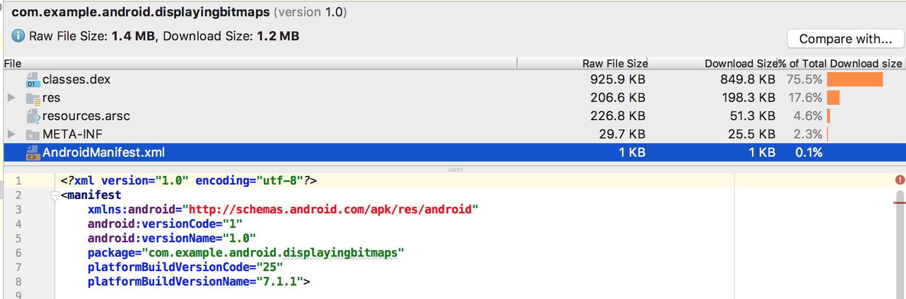

### 查看DEX文件

> APK分析器的DEX文件查看器可以让您直接访问应用程序中的DEX文件(s)中的底层信息。在查看器中提供了类、包、总引用和声明计数，这可以帮助决定是否使用多DEX或如何删除依赖项以低于64k的限制。
>
> 下图描述了一个中等大小的应用程序，它位于64k DEX的限制范围内。DEX文件中的每个包、类和方法都有在定义的方法和引用方法列中列出的计数。被引用的方法列统计了由DEX文件引用的所有方法。这通常包括在代码中定义的方法、依赖库和在标准Java和Android包中定义的方法-这些方法在每个DEX文件中都被统计在64k方法限制内。**Defined Methods**列只计算在您的一个DEX文件中定义的方法，因此这个数字是总引用计数的一个子集。注意，当您在APK中打包一个依赖项时，依赖项中定义的方法同样会增加总方法计数。还要注意的是，在编译源代码之后，缩小和/或 [Proguard shrinking](https://developer.android.google.cn/studio/build/shrink-code.html) 也会极大地改变一个DEX文件的内容。
>
> 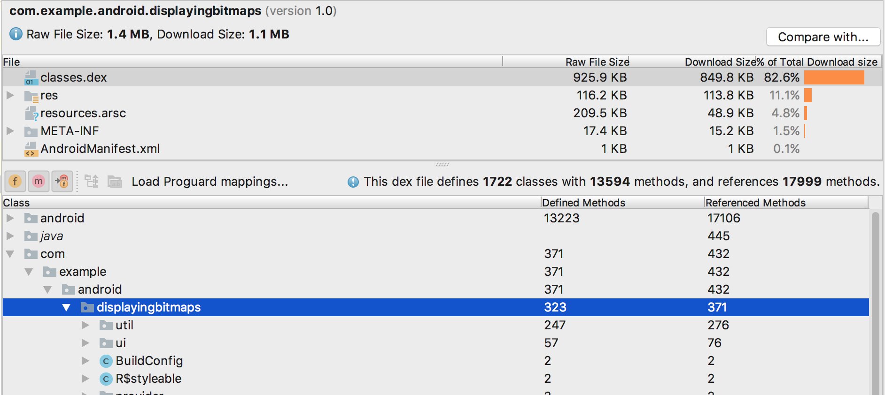

### 过滤DEX文件树视图

> 在类列表之上，APK Analyzer提供了用于查看所选的DEX文件的内容的过滤器。
>
> 
>
> 要使用过滤器来显示类中的所有方法和字段，请执行以下操作:
>
> 1. 在文件列表中，选择class.dex文件。
>
> 2. 在类列表中，导航到并选择一个类。
>
> 3. 展开您选择的类。
>
> 4. 切换显示字段以显示或隐藏类字段。
>
> 5. 切换显示方法来显示或隐藏类方法。
>
> 6. 切换显示所有引用的方法或字段，以显示或隐藏引用的包、类、方法和字段。在树形视图中，斜体的节点是在选择的DEX文件中没有定义引用的节点。
>
>    一个DEX文件可以引用在不同文件中定义的方法和字段。例如，`system.out.println()`是在Android框架中对`println()`方法的引用。

### 加载混淆映射

> 在过滤图标旁边是Proguard映射图标。它们是灰色的，直到您加载了一组Proguard映射文件，这些文件为DEX查看器添加了功能，比如反混淆命名(`mapping.txt`)，显示删除了的节点(`usage.txt`)，同时指出不能删除的节点(`seeds.txt`)。Proguard映射文件适用于Proguard所构建的APKs，而且必须来自与APK相同的构建版本。
>
> 
>
> 要加载Proguard映射文件，请执行以下操作:
>
> 1.  点击**Load Proguard Mappings**。
>
> 2. 导航到包含映射文件的项目文件夹，并加载所有的文件，任何文件的组合，或者包含文件的文件夹。
>
>    映射文件通常在 `project/app/build/outputs/mappings/release/`。如果文件选择器检测到这个项目结构，那么这个文件选择器就会默认为release文件夹。首先，文件选择器检查完全匹配的文件名 `mapping.txt`, `seeds.txt`, 和 `usage.txt`。接下来，文件选择器检查包含文本`mapping`, `usage`, 或`seeds`，并以.txt结束的文件名。例如， `release-seeds-1.10.15.txt` 是匹配的。
>
> 下面的列表描述了映射文件：
>
> * `seeds.txt`:  在shrinking期间，Proguard配置防止被删除的节点以粗体显示。
> * `mapping.txt`: 启用**Deobfuscate names** 因此，你可以恢复Proguard后的混淆的节点的名字。例如，您可以恢复混淆的节点名，比如`a、b、c`到`MyClass、MainActivity、myMethod()`。
> * `usage.txt`: 启用**Show removed nodes** 因此，你可以展示Proguard在压缩期间被移除的类、方法和字段。恢复的节点以加删除线的方式显示。关于使用Proguard来混淆代码和最小化代码的更多信息，请查看[压缩代码和资源](https://developer.android.google.cn/studio/build/shrink-code.html)。

### 显示bytecode, find usages, 和 generate Keep rule

> 类列表视图中的节点有一个上下文菜单，其中有以下选项，可以让您看到字节码、找到用法，并显示一个对话框，其中显示了可以复制和粘贴所选节点的Proguard规则。右键单击类列表视图中的任何节点，以显示其上下文菜单。
>
> **Show bytecode**: 对所选的类、方法或字段进行解压缩，并在对话框中显示smali(而不是Java代码)字节码表示，如下所述:
>
> 
>
> **Find usages**: 显示了DEX代码的其他部分对所选的类或方法的引用(如下图)。如果你加载了 `seeds.txt` ，加粗显示指出了混淆配置在压缩期间防止删除的结点：
>
> 
>
> **Generate Proguard Keep rule**: 显示了Proguard规则，您可以复制并粘贴到您的项目Proguard配置文件中，以保留一个给定的包、类、方法或字段，以便在保护期缩减期间被移除(如下图)。更多信息，请查看[自定义保存代码](https://developer.android.google.cn/studio/build/shrink-code.html#keep-code)。
>
> 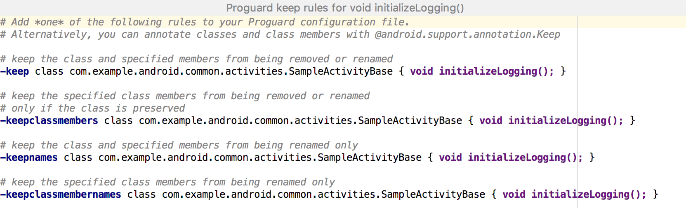

### 查看代码和资源实体

> 不同的构建任务会改变APK文件中最终的实体。例如，代码混淆规则会更改最终的代码，图片资源也可能在[产品风味](https://developer.android.google.cn/studio/build/build-variants.html#product-flavors)被替换。使用APK分析器可以很方便的查看各文件的最终版本：点击实体，一个文字或图片的预览就会在下面显示，如下：
>
> 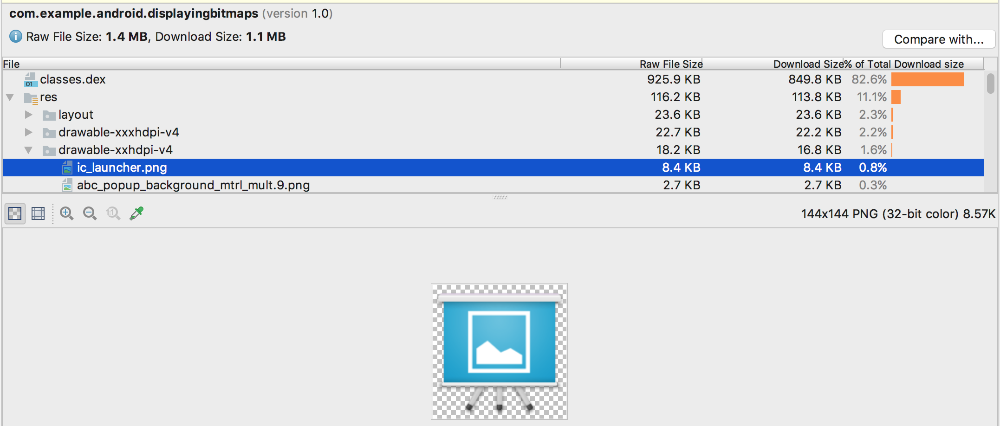
>
> APK分析器还可以显示不同的文本和二进制文件。例如, `resources.arsc` 实体查看器允许您查看特定于配置的值，例如字符串资源的翻译语言。下图，您可以看到每个字符串资源的翻译。
>
> 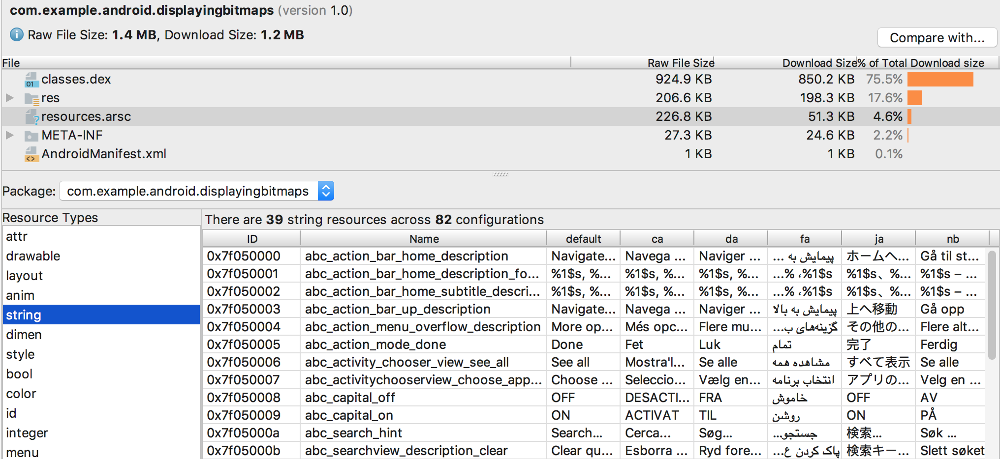

### 比较APK文件

> APK分析器可以比较两个不同APK文件中的实体的大小。当你需要理解为什么你的应用比之前的发布版本更大时，这是很有帮助的。在发布一个更新APK之前，请执行以下操作：
>
> 1. 加载您将要发布到APK分析器中的APK的版本。
>
> 2. 在APK分析器的右上角，点击 **Compare With**。
>
> 3. 在选择对话框中，找到上次发布给用户的APK，然后点击 **OK**。
>
>    类似于下图中的对话框，可以帮助您评估更新可能对用户造成的影响：
>
> 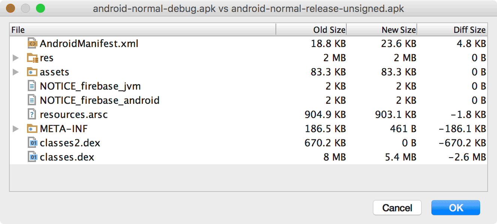
>
> <center>上图显示了特定应用程序的调试和发布版本之间的差异。不同的构建选项在这些构建类型之间使用，它们会以不同的方式改变底层实体。</center>

## Gradle提示和方法

> Gradle和Gradle的Android插件提供了一种灵活的方式来编译、构建和打包你的Android应用程序或library。这个页面收集了一些有用的技巧和配置，帮助您从每一个构建中获得最大的收益。如果您想了解如何更快地构建您的构建，请阅读[优化您的构建速度](https://developer.android.google.cn/studio/build/optimize-your-build.html)。
>
> 如果您是新手，可以通过阅读[配置您的构建](https://developer.android.google.cn/studio/build/index.html)来学习基础知识。您还可以查看Android插件的[DSL参考文档](http://google.github.io/android-gradle-dsl/current/)，以了解本页面中使用的属性。

### 管理项目和源

> 这里有一些配置来管理您的项目的模块和它们的源。要了解更多关于创建和管理项目和模块的知识，请阅读[项目概述](https://developer.android.google.cn/studio/projects/index.html)。

#### 更改默认的源集配置

> 您可以在模块级别的 `build.gradle` 文件中使用[sourceSets](http://google.github.io/android-gradle-dsl/current/com.android.build.gradle.api.AndroidSourceSet.html)闭包，以改变Gradle为一个[源集](https://developer.android.google.cn/studio/build/build-variants.html#sourcesets)的每个组件收集文件的路径。
>
> ```groovy
> android {
>   ...
>   sourceSets {
>     // 封装了主要源集的配置。
>     main {
>       // 改变Java源目录。默认的目录是'src/main/java'。
>       java.srcDirs = ['other/java']
>       // 当您列出多个目录时，Gradle从它们全部收集源。你需要避免它们中的一个是其他目录的父级。
>       res.srcDirs = ['other/res1', 'other/res2']
>       // 每一个源集，你只能指定一个Android清单文件。下面指出Gradle的当前源集的清单文件到一个不同的
>       // 目录。
>       manifest.srcFile 'other/AndroidManifest.xml'
>       ...
>     }
>     // 创建额外的其他闭包配置其他的源集。
>     androidTest {
>       // 如果某个源集的所有文件都在同一个根目录下，你可以使用setRoot属性指定这个共同的根目录。
>       // 当收集当前源集的源时，Gradle会在这个根目录下的相对目录查找。例如，下面的代码配置了
>       // androidTest的源集根目录后，Gradle只会在src/tests/java/下查找Java源。
>       setRoot 'src/tests'
>       ...
>     }
>   }
> }
> ...
> ```

#### 配置项目范围的属性

> 对于包含多个模块的项目，可以在项目级别定义属性，并在所有模块之间共享它们。你可以通过在[顶级的build.gradle](https://developer.android.google.cn/studio/build/index.html#top-level)文件中添加[额外的属性](https://docs.gradle.org/current/userguide/writing_build_scripts.html#sec:extra_properties)到`ext`闭包中来实现。
>
> ```groovy
> buildscript {...}
> allprojects {...}
> // 这个闭包包含了自定义的属性，并且让它们在项目的所有模块中都可以使用。
> ext {
>   	// 下面只是一些你可以定义的属性的例子。
>     compileSdkVersion = 26
>   	// 你可以使用这些去指定依赖的版本。在各模块间使用使用统一的版本可以避免功能冲突。
>     supportLibVersion = "27.0.2"
>     ...
> }
> ..
> ```
>
> 要在相同项目的某个模块中访问这些属性，可以在[模块级的build.gradle](https://developer.android.google.cn/studio/build/index.html#module-level)文件中使用以下语法获得。
>
> ```groovy
> android {
>   // 使用下面的语法可以访问你在项目级别的文件中定义的属性：rootProject.ext.property_name
>   compileSdkVersion rootProject.ext.compileSdkVersion
>   ...
> }
> ...
> dependencies {
>     compile "com.android.support:appcompat-v7:${rootProject.ext.supportLibVersion}"
>     ...
> }
> ```

### 管理库和依赖关系

> Gradle提供了一个强健的机制去[管理依赖](https://developer.android.google.cn/studio/build/dependencies.html)，不管它们是远程依赖还是本地的[库模块](https://developer.android.google.cn/studio/projects/android-library.html)。

#### 针对特殊构建的依赖配置

> 如果你只想给某个特殊的构建变体源集或测试源集添加依赖，大写依赖配置的首字母，然后在其前面添加构建变体或测试源集的名字。
>
> > **如果你使用Gradle的Android插件的版本3.0.0或以上**，你需要使用 `implementation`, `api`, `compileOnly`, 和 `runtimeOnly`这些新的依赖配置。它们和旧插件版本的配置(例如`compile`)工作原理相似，但是，它们通过允许您限制是否传递对其他模块的依赖，从而提高了多模块项目的构建速度。你同样可以在它们的名称前添加构建变体的名字从而针对某个构建变体添加一个依赖(例如， `freeDebugImplementation`。更多信息，请参考[使用新的依赖配置](https://developer.android.google.cn/studio/build/gradle-plugin-3-0-0-migration.html#new_configurations))。
>
> ```groovy
> android {...}
> // 创建在依赖闭包中使用的Gradle依赖配置。
> configurations {
>   // 一个使用产品风味和构建类型的变体，你需要给依赖配置初始化一个点位符。
>   freeDebugApk {}
>   ...
> }
> dependencies {
>   	// 只给"free"产品风味添加一个compile依赖
>     freeCompile 'com.google.firebase:firebase-ads:9.8.0'
>   	// 只给"freeDebug"构建变体添加一个apk依赖
>     freeDebugApk fileTree(dir: 'libs', include: ['*.jar'])
>   	// 只给本地测试添加一个远程库依赖
>     testCompile 'junit:junit:4.12'
>   	// 只给仪器测试添加一个远程库依赖
>     androidTestCompile 'com.android.support.test.espresso:espresso-core:2.2.2'
> }
> ```

#### 发布你的库的非默认变体

> > **如果你使用Gradle的Android插件的版本3.0.0或以上**，插件自动发布你的本地库模块依赖的所有版本，同时将它们与相应的应用程序相匹配。因此，与其遵循本节描述的说明，请阅读[使用变量感知的依赖关系管理](https://developer.android.google.cn/studio/build/gradle-plugin-3-0-0-migration.html#variant_aware)。
>
> 你可以通过在库`build.gradle`文件中添加以下代码以修改Gradle发布给其他模块的默认库变体：
>
> ```groovy
> android {
>   ...
>   // 如果库配置了产品风味，你必须根据它的全配置名指定一个构建变体。下面的代码指定了"demoDebug"
>   // 构建变体作为Gradle发布的默认的库版本。
>   defaultPublishConfig "demoDebug"
> }
> ```
>
> 你同样可以告诉Gradle发布所有可用的库变体。
>
> ```groovy
> android {
>   ...
>   // 注意这可能会增加构建时间，因为Gradle必须构建多个AARs文件，而不是一个。
>   publishNonDefault true
> }
> ```
>
> 通过设置 `publishNonDefault true`，您可以配置应用程序模块的`build.gradle`文件，它的每一个变体只使用它所需要的库的版本。
>
> ```groovy
> android {...}
> ...
> // 创建在依赖配置闭包中使用的Gradle依赖配置。
> configurations {
>   // 初始化在依赖配置中使用的demoDebugCompile和fullReleaseCompile点位符。
>   demoDebugCompile {}
>   fullReleaseCompile {}
>   ...
> }
> dependencies {
>   // 如果库使用产品风味配置了多个构建变体，你必须使用它的全配置名指定某个库的变体。
>   demoDebugCompile project(path: ':my-library-module', configuration: 'demoDebug')
>   fullReleaseCompile project(path: ':my-library-module', configuration: 'fullRelease')
>   ...
> }
> ```

### 创建应用的不同版本

> Gradle和Android插件允许你通过配置构建变体创建某个应用的不同版本。

#### 配置多APK支持

> 使用Android插件，你可以构建多个APKs，每个APK以ABI或屏幕密度划分，并利用Google Play的多个APK支持。

##### 每个屏幕密度配置不同的APK

> 要为不同的屏幕密度创建不同的APK，需要在你的模块的 `build.gradle`文件中添加 [`android.splits.density`](http://google.github.io/android-gradle-dsl/current/com.android.build.gradle.internal.dsl.DensitySplitOptions.html) 闭包.
>
> ```groovy
> android {
>   ...
>   splits {
>     // 配置基于屏幕密度的多APKs支持
>     density {
>       // 启用构建多APKs
>       enable true
>       // 排除不需要APK的屏幕密度
>       exclude "ldpi", "mdpi"
>      
>       // 或者，你可以使用下面的方式清除默认的屏幕密度列表，并且指出你需要构建APKs的屏幕密度列表
>       // reset()
>       // include "hdpi", "xhdpi", "xxhdpi", "xxxhdpi"
> 	  
>       // 指出兼容的屏幕尺寸设置列表。这个属性配置了清单文件的<compatible-screens>元素。
>       // 你通常不需要配置这个清单属性，但是在构建基于屏幕密度的多APKs支持时这是重要的。
>       compatibleScreens 'normal', 'large', 'xlarge'
>     }
>   }
> }
> ```

##### 每个ABI配置不同的APK

> 要给不同的ABI生成不同的APK，在模块文件的`build.gradle`文件中添加 [`android.splits.abi`](http://google.github.io/android-gradle-dsl/current/com.android.build.gradle.internal.dsl.AbiSplitOptions.html) 闭包。
>
> ```groovy
> android {
>   ...
>   splits {
>     // 配置基于ABI的多APKs支持
>     abi {
>       // 启用构建多APKs
>       enable true
>       // 默认所有的ABIs都包含在内，因此可以使用 reset()和include指出我们需要为x86,armeabi-v7a, 
>       // 和mips的ABI生成APK。
>       reset()
>       // 指定一个需要生成APK的ABI列表
>       include "x86", "armeabi-v7a", "mips"
>       // 指出我们同时需要生成一个适配所有ABI的通用版本的APK
>       universalApk true
>     }
>   }
> }
> ```

#### 配置动态版本号

> 在默认情况下，当Gradle为你的项目生成APKs时，每个APK都有相同的版本信息，按照在模块级的 `build.gradle`文件中指定的。谷歌商店不允许同一款app的多个APK都有相同的版本信息，你必须保证在你上传APK到谷歌商店时它们拥有唯一的[版本号](https://developer.android.google.cn/studio/publish/versioning.html#appversioning)。
>
> 您可以使用自定义构建逻辑，在构建时为每个APK分配不同的版本代码。例如，在为每个ABI创建单独的APKs时，自动的APK版本管理看起来如下:
>
> ```groovy
> android {
>   ...
>   defaultConfig {
>     ...
>     versionCode 4
>   }
>   splits {
>     ...
>   }
> }
> // 为每个ABI提供值的版本代码映射。
> ext.abiCodes = ['armeabi-v7a':1, mips:2, x86:3]
> // 可以为每个屏幕密度的APK创建一个相似的映射列表：
> // ext.densityCodes = ['hdpi': 1, 'xhdpi': 2, 'xxhdpi': 3, 'xxxhdpi': 4]
> import com.android.build.OutputFile
> // 为每一个输出的APK变体，使用ext.abiCodes * 1000 + variant.versionCode重写版本号。
> // 在本例中，variant.versionCode等于defaultConfig.versionCode。如果你在产品风味中定义
> // 了它们自己的versionCode，variant.versionCode就是产品风味中定义的那个值。
> android.applicationVariants.all { variant ->
>   // 为每一个输出的APK指定一个不同的版本号，除了通用版本。
>   variant.outputs.each { output ->
>     // 把和这个变体相关联的ABI的ext.abiCodes值存储起来
>     def baseAbiVersionCode = 
>       		// 确定该变量的ABI，并返回映射值
>             project.ext.abiCodes.get(output.getFilter(OutputFile.ABI))
>     // 如果ABIs没有在ext.abiCodes的映射，那么abiCodes.get()返回null，下面的代码没有重写通用
>     // 版本的版本号。然而，因为我们想要通用版本的APK的版本号是最低的，这个结果是满足的。
>     if (baseAbiVersionCode != null) {
>       // 给versionCodeOverride指定一个新的版本号，这样只会改变output的APK，而不会改变变体本身。
>       // 跳过这个步骤会简单的导致Gradle使用variant.versionCode值做为APK的版本号。
>       output.versionCodeOverride =
>               baseAbiVersionCode * 1000 + variant.versionCode
>     }
>   }
> }
> ```

#### 组合多个产品风味

> 在某些情况下，你也许想从多个产品风味中组合配置。要这样做，Gradle的Android插件允许你去创建产品风味组，叫做风味维度。
>
> 下面的代码例子，使用[`flavorDimensions`](http://google.github.io/android-gradle-dsl/current/com.android.build.gradle.AppExtension.html#com.android.build.gradle.AppExtension:flavorDimensions(java.lang.String[])) 属性创建了一个"mode"风味维度去组合"full" 和 "demo"产品风味，同时使用“api”风味维度去组合配置基于API的产品风味。然后Gradle组合从"mode"维度和"api"维度的产品风味。
>
> ```groovy
> android {
>   ...
>   buildTypes {
>     debug {...}
>     release {...}
>   }
>
>   flavorDimensions "api", "mode"
>
>   productFlavors {
>     demo {
>       dimension "mode"
>       ...
>     }
>
>     full {
>       dimension "mode"
>       ...
>     }
>
>     minApi24 {
>       dimension "api"
>       minSdkVersion '24'
>       versionCode 30000 + android.defaultConfig.versionCode
>       versionNameSuffix "-minApi24"
>       ...
>     }
>
>     minApi23 {
>       dimension "api"
>       minSdkVersion '23'
>       versionCode 20000  + android.defaultConfig.versionCode
>       versionNameSuffix "-minApi23"
>       ...
>     }
>
>     minApi21 {
>       dimension "api"
>       minSdkVersion '21'
>       versionCode 10000  + android.defaultConfig.versionCode
>       versionNameSuffix "-minApi21"
>       ...
>     }
>   }
> }
> ...
> ```

#### 过滤器变体

> 你可以过滤你不想在模块的`build.gradle`文件的 [`variantFilter`](http://google.github.io/android-gradle-dsl/current/com.android.build.api.variant.VariantFilter.html) 闭包中使用的构建变体。下面例子的代码使Gradle不去构建任何组合了 "minApi21" 和 "demo" 产品风味的变体。
>
> ```groovy
> android {
>  ...
>  buildTypes {...}
>
>  flavorDimensions "api", "mode"
>  productFlavors {
>     demo {...}
>     full {...}
>     minApi24 {...}
>     minApi23 {...}
>     minApi21 {...}
>   }
>
>   variantFilter { variant ->
>     def names = variant.flavors*.name
>     if (names.contains("minApi21") && names.contains("demo")) {
>       setIgnore(true)
>     }
>   }
> }
> ...
> ```

### 测试应用

> 要学习更多的关于本地和集成的单元测试，查看 [Test Your App](https://developer.android.google.cn/studio/test/index.html)。

#### 配置lint选项

> 你可以在你的模块级别的`build.gradle`文件中使用[`lintOptions`](http://google.github.io/android-gradle-dsl/current/com.android.build.gradle.internal.dsl.LintOptions.html#com.android.build.gradle.internal.dsl.LintOptions) 配置某些lint选项。要学习更多的关于在你的项目中使用lint的知识，请参考 [Improve Your Code with Lint](https://developer.android.google.cn/studio/write/lint.html)。
>
> ```groovy
> android {
>   ...
>   lintOptions {
>     // 关闭你指定的问题IDs的检查
>     disable 'TypographyFractions','TypographyQuotes'
>     // 打开你指定的问题IDs的检查。这些检查是除了默认的检查之外的。
>     enable 'RtlHardcoded', 'RtlCompat', 'RtlEnabled'
>     // 只打开检查某个问题IDs的子集，同时忽略所有其他的，使用'check'属性代替列出问题IDs。
>     // 这个属性重写了任何的问题IDs你在前面打开或者关闭的。
>     check 'NewApi', 'InlinedApi'
>     // 如果设为true，关闭lint的分析过程报告
>     quiet true
>     // 如果设为true(默认值),如果发现errors就停止构建
>     abortOnError false
>     // 若设为true，只报告errors
>     ignoreWarnings true
>   }
> }
> ...
> ```

#### 配置仪表清单设置

> 当Gradle构建你的测试APK时，它会自动的生成 [`AndroidManifest.xml`](https://developer.android.google.cn/guide/topics/manifest/manifest-intro.html)文件，同时配置它使用 [instrumentation](https://developer.android.google.cn/guide/topics/manifest/instrumentation-element.html)节点。你可以改变这个节点的某些设置，或者通过在[测试源集](https://developer.android.google.cn/studio/test/index.html#test_types_and_location)创建另一个清单文件,或者在你的模块级的`build.gradle`文件中按如下代码配置：
>
> ```groovy
> android {
>   ...
>   // 你在产品风味中配置的属性会重写在defaultConfig闭包中的配置。更多的，请查看配置产品风味。
>   defaultConfig {
>     ...
>     // 指定测试APK的应用ID
>     testApplicationId "com.test.foo"
>     // 指定仪器测试的全限定类名
>     testInstrumentationRunner "android.test.InstrumentationTestRunner"
>     // 如果设置为“true”，则允许仪器测试类启动和停止分析。
>     // 如果设置为false(默认)，则会在整个仪器测试运行时间内进行概要分析
>     testHandleProfiling true
>     // 如果设置为“true”，指出Android系统应该把运行仪器做为一个功能测试。默认值为“false”
>     testFunctionalTest true
>   }
> }
> ...
> ```

#### 改变测试构建类型

> 默认情况下，所有测试都是针对调试构建类型运行的。你可以在模块级的`build.gradle`文件中设置`testBuildType` 的值来改变默认的构建类型。例如，你想针对 "staging"构建类型运行测试，可以编辑模块级的`build.gradle`如下：
>
> ```groovy
> android {
>     ...
>     testBuildType "staging"
> }
> ```

#### 配置Gradle的测试选项

> 指定选项可以改变Gradle运行测试，配置在模块级别的`build.gradle`的 [`testOptions`](http://google.github.io/android-gradle-dsl/current/com.android.build.gradle.internal.dsl.TestOptions.html) 闭包。
>
> ```groovy
> android {
>   ...
>   // 封装了运行测试的选项。
>   testOptions {
>     // 改变Gradle保存测试报告的目录。默认，Gradle会把测试报告保存在
>     // path_to_your_project/module_name/build/outputs/reports/ 目录下
>     // '$rootDir' 设置相对于当前项目的根目录的路径
>     reportDir "$rootDir/test-reports"
>     resultsDir "$rootDir/test-results"
>   }
> }
> ```
>
> 如果只想指定本地测试的选项，在 [`testOptions.unitTests`](http://google.github.io/android-gradle-dsl/current/com.android.build.gradle.internal.dsl.TestOptions.UnitTestOptions.html) 闭包中配置。
>
> ```groovy
> android {
>   ...
>   testOptions {
>     ...
>     // 封装本地测试选项
>     unitTests {
>       // 默认，本地测试会在你的测试试图去访问Android平台的APIs的时候抛出异常(除非你模仿了
>       // Android依赖或使用了像Mockito的测试框架)。然后你可以启用以下属性，这样当本地测试访问
>       // Android平台的APIs的时候会返回空或0，而不是抛出异常。
>       returnDefaultValues true
>       // 封装控制Gradle执行本地单元测试的选项。要查看所有你可以指定的选项，请参考
>       // Gradle的官方文档。
>       all {
>         // 设置测试JVM(s)的JVM参数
>         jvmArgs '-XX:MaxPermSize=256m'
>         // 你也可以通过检查任务名给指定的测试添加选项
>         if (it.name == 'testDebugUnitTest') {
>           systemProperty 'debug', 'true'
>         }
>       }
>     }
>   }
> }
> ```

### 优化构建

> 这一节提供一些配置，以帮助加速您的完整和增量构建。更多信息，请查看[优化构建速度](https://developer.android.google.cn/studio/build/optimize-your-build.html)。

#### 压缩代码

> Android Studio使用`ProGuard`[压缩代码](https://developer.android.google.cn/studio/build/shrink-code.html#shrink-code)。对于新的项目，Android Studio使用Android SDK的 `tools/proguard/folder`下的默认设置文件(`proguard-android.txt`)。要有更好的代码压缩，使用同一目录下的 `proguard-android-optimize.txt` 文件。
>
> ```groovy
> android {
>   buildTypes {
>     release {
>       minifyEnabled true
>       proguardFiles getDefaultProguardFile('proguard-android-optimize.txt'),
>                                            'proguard-rules.pro'
>     }
>   }
>   ...
> }
> ...
> ```
>
> 要给每一个构建变体添加ProGuard规则，可以给每个风味添加额外的 [`proguardFiles`](http://google.github.io/android-gradle-dsl/current/com.android.build.gradle.internal.dsl.ProductFlavor.html#com.android.build.gradle.internal.dsl.ProductFlavor:proguardFiles)属性。例如，下面的代码给“flavor2”指定了 `flavor2-rules.pro`规则。现在 "flavor2" 的发布版本使用所有三个ProGuard规则，因为release闭包中的混淆规则同样也适用。
>
> ```groovy
> android {
>   ...
>   buildTypes {
>     release {
>       minifyEnabled true
>       proguardFiles getDefaultProguardFile('proguard-android.txt'),
>              'proguard-rules.pro'
>     }
>   }
>   productFlavors {
>     flavor1 {
>       ...
>     }
>     flavor2 {
>       proguardFile 'flavor2-rules.pro'
>     }
>   }
> }
> ...
> ```

#### Instant Run时启用代码压缩

> 要在Instant Run时启用代码压缩，只需设置`useProguard` 为`false` (同时保持 `minifyEnabled` 为 `true`)。这使用了一个实验性的代码收缩器，它不会混淆或优化你的代码(因此你应该只在“debug”构建类型时启用这个压缩器)。
>
> ```groovy
> android {
>   buildTypes {
>     debug {
>       minifyEnabled true
>       useProguard false
>       proguardFiles getDefaultProguardFile('proguard-android.txt'),
>               'proguard-rules.pro'
>     }
>     release {
>       minifyEnabled true
>       proguardFiles getDefaultProguardFile('proguard-android.txt'),
>               'proguard-rules.pro'
>     }
>   }
> }
> ```

### 发布应用

> 更多的关于发布应用到谷歌商店，请阅读[发布应用](https://developer.android.google.cn/studio/publish/index.html)。

#### 应用签名

> 尽管Android Studio提供了一个方便的从UI界面[配置发布版本签名](https://developer.android.google.cn/studio/publish/app-signing.html#release-mode)的方式，但是你也可以在模块级的`build.gradle`文件的 `signingConfigs` 闭包中手动配置。
>
> ```groovy
> android {
>   ...
>   defaultConfig { ... }
>   // 封装签名配置
>   signingConfigs {
>     // 创建“release”的签名配置
>     release {
>       // 指定keystore文件的路径
>       storeFile file("my-release-key.jks")
>       // 指定keystore文件的密码
>       storePassword "password"
>       // 指定你的key的标识名
>       keyAlias "my-alias"
>       // 指定key的密码
>       keyPassword "password"
>     }
>   }
>   buildTypes {
>     release {
>       // 在release的构建类型中添加“release”的签名配置
>       signingConfig signingConfigs.release
>       ...
>     }
>   }
> }
> ...
> ```

#### 从项目中删除私有签名信息

> 默认，签名配置是在模块级的`build.gradle`文件中明文记录的。如果您正在与一个团队或一个开放源码项目合作，您可以通过以下的方式将这些敏感信息从构建文件中移出。
>
> 1. 在项目的根目录下创建一个名为 `keystore.properties`的文件，并且在该文件中包含以下信息：
>
>    ```groovy
>    storePassword=myStorePassword
>    keyPassword=myKeyPassword
>    keyAlias=myKeyAlias
>    storeFile=myStoreFileLocation
>    ```
>
> 2. 在`build.gradle`文件中，通过以下方式加载 `keystore.properties` 文件(这必须在android闭包之前)：
>
>    ```groovy
>    // 创建一个名为keystorePropertiesFile的变量，并初始化它为keystore.properties文件
>    def keystorePropertiesFile = rootProject.file("keystore.properties")
>    // 初始化一个名为keystoreProperties的Properties()对象
>    def keystoreProperties = new Properties()
>    // 把keystore.properties加载到keystoreProperties对象中
>    keystoreProperties.load(new FileInputStream(keystorePropertiesFile))
>    android {
>      ...
>    }
>    ...
>    ```
>
> 3. 输入存储中`keystoreProperties` 对象中的签名信息：
>
>    ```groovy
>    android {
>      signingConfigs {
>        config {
>          keyAlias keystoreProperties['keyAlias']
>          keyPassword keystoreProperties['keyPassword']
>          storeFile file(keystoreProperties['storeFile'])
>          storePassword keystoreProperties['storePassword']
>        }
>      }
>      ...
>    }
>    ...
>    ```
>
> 4. 点击通知栏中的 **Sync Now**。
>
> 关于签名的更多信息，参考[签名应用](https://developer.android.google.cn/studio/publish/app-signing.html)。

### 简化应用开发

> 下面的技巧帮助你使开发Android应用更简单。

##### 使用应用程序的代码分享自定义字段和资源值

> 在构建时，Gradle生成了BuildConfig类，这样你的应用程序代码就可以检查当前构建的信息。您还可以使用buildConfigField()方法从您的Gradle构建配置文件中添加自定义字段，并在应用程序的运行时代码中访问这些值。同样，您可以使用resValue()添加应用程序资源值。
>
> ```groovy
> android {
>   ...
>   buildTypes {
>     release {
>       // 这些值只是定义在release构建中，通常用于完整的构建和持续的构建。。
>       buildConfigField("String", "BUILD_TIME", "\"${minutesSinceEpoch}\"")
>       resValue("string", "build_time", "${minutesSinceEpoch}")
>       ...
>     }
>     debug {
>       // 使用静态值以保证在增量构建中资源文件和BuildConfig不会在每次运行时都重新构建
>       // 如果它们是动态的，它们会阻止Instant Run的好处，以及Gradle的UP-TO-DATE检查。
>       buildConfigField("String", "BUILD_TIME", "\"0\"")
>       resValue("string", "build_time", "0")
>     }
>   }
> }
> ...
> ```
>
> 在你的应用代码中，你可以通过以下代码访问这些属性：
>
> ```java
> ...
> Log.i(TAG, BuildConfig.BUILD_TIME);
> Log.i(TAG, getString(R.string.build_time));
> ```

#### 与清单文件共享属性

> 在某些情况下，您可能需要在您的清单和代码中声明相同的属性(例如，当你声明一个[FileProvider](https://developer.android.google.cn/reference/android/support/v4/content/FileProvider.html)的权限时)。与其在多个位置更新相同的属性以应用更改，不如在模块的 `build.gradle`文件中定义一个属性使清单和您的代码都可以使用，如下面的示例所示。更多信息，请参考[给清单文件中注入构建变量](https://developer.android.google.cn/studio/build/manifest-build-variables.html)。
>
> ```groovy
> android {
>   // 对于特定于产品口味的设置，在productFlavors的每一个风味配置这些属性
>   defaultConfig {
>     // 给FileProvider权限创建一个属性
>     def filesAuthorityValue = applicationId + ".files"
>     // 创建一个在清单文件中使用的点位符属性
>     manifestPlaceholders =
>       [filesAuthority: filesAuthorityValue]
>       // 在BuildConfig类中添加一个权限的字段
>       buildConfigField("String",
>                        "FILES_AUTHORITY",
>                        "\"${filesAuthorityValue}\"")
>   }
>   ...
> }
> ...
> ```
>
> 在清单文件中，通过以下方式访问占位符：
>
> ```xml
> <manifest>
>   ...
>   <application>
>     ...
>     <provider
>       android:name="android.support.v4.content.FileProvider"
>       android:authorities="${filesAuthority}"
>       android:exported="false"
>       android:grantUriPermissions="true">
>       ...
>     </provider>
>   </application>
> </manifest>
> ```
>
> 在代码中可以像下面这样访问`FILES_AUTHORITY`字段：
>
> ```java
> ...
> Uri contentUri = FileProvider.getUriForFile(getContext(),
>   BuildConfig.FILES_AUTHORITY,
>   myFile);
> ```

## 升级到Gradle3.0版本Android插件

> 3.0.0版本的Gradle的Android插件是一个重大的升级，它给大型多模块项目带来了显著的性能提升。为了带来这些改进，在插件行为、DSL、及APIs中有一些改变。
>
> 对大多数项目来说，在你[更新了Gradle](https://developer.android.google.cn/studio/build/gradle-plugin-3-0-0-migration.html#apply_plugin)并且[使用了最新版本的Android插件](https://developer.android.google.cn/studio/build/gradle-plugin-3-0-0-migration.html#update_gradle)之后，你会没有体验到变体或者只有一些本节描述构建错误。如果在你更新插件后，你碰到了一个构建错误，在本节查找这个错误或导航到相关的主题，并且按照说明解决问题。同时根据下面的视频概要的了解下合并步骤。
>
> <iframe width="470" height="264" src="https://www.youtube.com/embed/oBsbI8ICYKg" frameborder="0" allow="autoplay; encrypted-media" allowfullscreen></iframe>
>
> 在您升级项目之后，您可以从以下性能改进中获益:
>
> * 通过细粒度的任务图更好地实现多模块项目的并行性。
> * [变体感知的](https://developer.android.google.cn/studio/build/gradle-plugin-3-0-0-migration.html#variant_aware)依赖管理。当你构建某个模块的一个确定的变体时，该插件现在自动将本地库模块依赖项的变体与您正在构建的模块的变体相匹配。
> * 当对依赖项进行更改时，Gradle通过不重新编译那些无法访问依赖项API的模块来执行更快的构建。通过[使用Gradle的新依赖配置](https://developer.android.google.cn/studio/build/gradle-plugin-3-0-0-migration.html#new_configurations): `implementation`, `api`, `compileOnly`, 和 `runtimeOnly`，你可以限制哪些依赖项向其他模块泄露了他们的APIs。
> * 由于预编译类加快了增量构建速度。现在每个类被编译成分离的DEX文件，并且只有改变的类会被重新编译。你同样应该期望那些 `minSdkVersion` 为20或更低的应用增加构建速度，并且使用[兼容的文件分包](https://developer.android.google.cn/studio/build/multidex.html#mdex-pre-l)。
>
> 要获得更完整的关于更新和更改列表，参考Android3.0.0版本插件的发布说明。

### 更新Gradle版本

> Android3.0.0版本插件要求的Gradle的版本为4.1及以上。如果你用Android Studio3.0及以上打开一个存在的项目，按照以下的提示自动的更新存在的项目到Gradle的兼容版本。
>
> 要手动更新Gradle，请把`gradle-wrapper.properties` 中的URL编辑为如下：
>
> ```groovy
> distributionUrl=\
>   https\://services.gradle.org/distributions/gradle-4.1-all.zip
> ```

### 应用插件

> 如果你用Android Studio3.0及以上打开一个存在的项目，根据以下提示，自动将Android插件更新到最新版本。要手动更新项目，要添加maven仓库并且根据以下改变项目级别的`build.gradle`文件中的插件版本：
>
> ```groovy
> buildscript {
>     repositories {
>         ...
>         // 你需要添加下面的仓库去下载新的插件
>         google()
>     }
>
>     dependencies {
>         classpath 'com.android.tools.build:gradle:3.0.1'
>     }
> }
> ```
>
> > **注意**：对于多模块和复合构建，如果Android插件每次加载超过一次，您可能会得到一个构建错误。更多信息，请参考[已经问题](https://developer.android.google.cn/studio/build/gradle-plugin-3-0-0.html#known_issues)。

### 使用变体感知的依赖管理 

> Android插件3.0.0和更高版本包含了一种新的依赖机制，在使用库时自动匹配变体。这就意味着，app的`debug`变体自动使用库的`debug`变体，以此类推。这同样适用于风味-app的`freeDebug`变体将会使用库的`freeDebug`变体。
>
> 为了使插件能够精确匹配变体，您需要为所有产品口味[声明风味维度](https://developer.android.google.cn/studio/build/gradle-plugin-3-0-0-migration.html#flavor_dimensions)，并为直接匹配不可能的实例提供匹配的候选。

#### 声明风味维度

> 新版本的插件要求所有的风味都属于一个名为[风味维度](https://developer.android.google.cn/studio/build/gradle-plugin-3-0-0-migration.html#flavor_dimensions)-既使你只使用一个维度。要不然，在构建的时候会出现以下错误：
>
> ```java
> Error:All flavors must now belong to a named flavor dimension.
> The flavor 'flavor_name' is not assigned to a flavor dimension.
> ```
>
> 要解决这个错误，你首先需要使用 `flavorDimensions` 属性声明一个或多个维度。然后，指定每个风味为你定义的维度中的一个，如下面的例子所示。因为插件自动为你匹配依赖，所以你应该**谨慎的命名风味维度**。这样做可以让您更好地控制本地依赖关系中的哪些代码和资源与您的应用程序的每个版本相匹配。
>
> ```groovy
> flavorDimensions "tier", "minApi"
> productFlavors {
>      free {
>       dimension "tier"
>       ...
>     }
>     paid {
>       dimension "tier"
>       ...
>     }
>     minApi23 {
>         dimension "minApi"
>         ...
>     }
>     minApi18 {
>         dimension "minApi"
>         ...
>     }
> }
> ```

#### 解决和依赖匹配相关的构建错误

> 考虑这种情况，如果你的app配置了一个名为"staging"构建类型，但是你的某个依赖库并没有。当你的插件试着去构建你的应用的"staging"版本，它会找不到相匹配的库版本，然后你就会看到一个类似下面信息的错误：
>
> ```java
> Error:Failed to resolve: Could not resolve project :mylibrary.
> Required by:
>     project :app
> ```
>
> 该插件包含了DSL元素，可以帮助您控制Gradle如何解决应用程序和依赖项之间的不能直接匹配的情况。请参阅下面的表，以确定应该使用哪种DSL属性来解决某些与变体相关的依赖匹配相关的构建错误。
>
> <table>
>   <tr>
> ​    <th width=50%, bgcolor=gray><font color="#FFFFFF">构建错误原因</font></th>
> ​    <th width="50%", bgcolor=gray><font color="#FFFFFF">解决方式</font></th>
>   </tr>
>   <tr>
>   <td>
>
> **应用包含一个依赖库没有的构建类型**
>
> 例如，你的应用包含一个"staging"构建类型，但是某个依赖只包含"debug"和一个"release"构建类型。
>
> 注意，如果你的依赖库包含一个你的应用没有构建类型是没有关系的。这是因为插件不会请求依赖的构建类型。
>
>  </td>
> ​    <td> 
>
> 使用 `matchingFallbacks` 如给指定的构建类型指定一个可选择的匹配：
>
> ```groovy
> // 在app的build.gradle文件中
> android {
>     buildTypes {
>         debug {}
>         release {}
>         staging {
>             // 指定一个已排序的后备构建类型列表，当一个依赖不包含一个"staging"构建类型时，
>             // Gradle插件可以去使用这个后备列表中的一个。你可以指定尽可能多的后备选项，
>             // Gradle会选择列表中第一个可用的构建类型。
>             matchingFallbacks = ['debug', 'qa', 'release']
>         }
>     }
> }
> ```
>
> ​    </td>
>   </tr>
>   <tr>
>   <td> 
>
> 对于一个存在于app和它的依赖库中的风味维度，**你的app包含库没有的风味**。
>
> 例如，你的app和它的依赖库都包含一个"tier"风味维度。然而，app的"tier"维度包含"free"和"paid"风味，但是一个依赖库的相同的维度只包含"demo"和"paid"风味。
>
> 注意，对于在app和它的依赖库中同时存在的风味维度，如果依赖库中包含app中没有的产品风味，这是没有问题的。这是因为插件不会从依赖库请求风味。
>
>  </td>
> <td>
>
> 使用 `matchingFallbacks` 如给app的“free”产品风味指定一个可选择的匹配：
>
> ```groovy
> // 在app的build.gradle文件中
> android {
>     defaultConfig{
>     // 不要在defaultConfig闭包中配置matchingFallbacks。相反，你必须在productFlavors
>     // 对指定的产品风味指定备选，如下：
>   }
>     flavorDimensions 'tier'
>     productFlavors {
>         paid {
>             dimension 'tier'
>             // 因为依赖库已经在"tier"维度中已经包含了一个"paid"风味，你不需要为"paid"风味
>             // 提供一个备选列表。
>         }
>         free {
>             dimension 'tier'
>             // 指定一个有序的备选风味列表，插件会在依赖库维度中没有包含"free"风味时会使用这个
>             // 列表中的值。你可以指定尽可能多的备选，插件会选择列表中的第一个在依赖库的"tier"维度
>             // 中可用的风味。
>             matchingFallbacks = ['demo', 'trial']
>         }
>     }
> }
> ```
>
> </td>
>   <tr>
>  <td> 
>
> **依赖库包含app没有的风味维度**
>
> 例如：一个依赖库包含一个“minApi”维度，但是你的app只包含一个“tier”维度。因此，当你构建“freeDebug”版本的app时，插件不知道是使用依赖库的“minApi23Debug”还是“minApi18Debug”版本。
>
> 注意，如果你的app包含一个依赖库没有的风味维度是没有问题的。这是因为插件只匹配存在于依赖库的风味维度。例如，如果一个依赖库不包含针对ABIs的维度，你的app的“freeX86Debug”版本会匹配依赖库的"freeDebug"版本。
>
> </td>
>
> <td>
>
> 如下所示，在 `defaultConfig` 闭包中使用`missingDimensionStrategy` 配置指定插件在没有匹配到相应的维度时的默认风味。你也可以在`productFlavors` 中覆盖你的选择，因此可以给每个风味指定一个当没有相应维度时不同的匹配规则。
>
> ```groovy
> // 在app的build.gradle文件中
> android {
>     defaultConfig{
>     missingDimensionStrategy 'minApi', 'minApi18', 'minApi23'
>     missingDimensionStrategy 'abi', 'x86', 'arm64'
>     }
>     flavorDimensions 'tier'
>     productFlavors {
>         free {
>             dimension 'tier'
>             missingDimensionStrategy 'minApi', 'minApi23', 'minApi18'
>         }
>         paid {}
>     }
> }
> ```
>
> </td>
>   </tr>
> </table>

#### 为本地模块迁移依赖配置

> 使用变体感知的依赖解决方法，就不再需要使用变体指定的配置，例如针对本地依赖模块的 `freeDebugImplementation`-插件会为你处理这些。
>
> 使用变体指定的配置是可选的，并且不会中止你的构建。但是，针对本地模块依赖的特定变体会导致以下错误：
>
> ```groovy
> Error:Unable to resolve dependency for ':app@debug/compileClasspath':
>   Could not resolve project :library.
> Error:Unable to resolve dependency for ':app@release/compileClasspath':
>   Could not resolve project :library.
> ```
>
> 您应该将依赖项配置为如下:
>
> ```groovy
> dependencies {
> 	// 这是旧的方法并且对于本地库模块不再使用：
>   	// debugImplementation project(path: ':library', configuration: 'debug')
>   	// releaseImplementation project(path: ':library', configuration: 'release')
>   	// 相应的，只需使用变体感知依赖就可以解决以上问题。你可以获得更多的关于
>   	// 'implementation'配置的说明在关于新依赖章节中。
>     implementation project(':library')
> 	// 然而，当针对外部依赖时你还可以继续使用变体指定配置。下面一行配置只给"debug"版本
>   	// 添加'app-magic'依赖。
>     debugImplementation 'com.example.android:app-magic:12.3'
> }
> ```
>
> **注意：**尽管手动匹配依赖项的Gradle API仍然可用，但不建议您使用它。向项目`project()` DSL提供的配置现在需要和构建类型和风味(包括其他属性)的消费都想匹配。例如，不可能通过这个机制使"debug"变体消费"release"变体，因为创建者和消费者的变体将不匹配(在这种情况下，“debug”的名称是指在[发布依赖](https://developer.android.google.cn/studio/build/gradle-plugin-3-0-0-migration.html#publishing-deps)的部分中提到的已发布的配置对象)。因为这个插件现在发布了两种配置，一种用于编译，另一种用于运行时，这种选择一种配置的旧方法不再起作用。

### 使用新的依赖配置

> Gradle3.4推出了新的[Java库插件配置](https://docs.gradle.org/current/userguide/java_library_plugin.html#sec:java_library_configurations_graph)，这允许您控制是否将依赖项发布到使用该库的项目的编译和运行时类路径。Android插件正在采用这些新的依赖配置，并且迁移大型项目来使用它们可以大大减少构建时间。下面的表格帮助你理解如何使用新的配置。
>
> | 新的配置             | 弃用的配置      | 作用                                       |
> | ---------------- | ---------- | ---------------------------------------- |
> | `implementation` | `compile`  | 当你的模块配置了一个`implementation`依赖时，这意味着Gradle不会在编译时把这个依赖暴露给其他模块。也就是说，这个依赖只有在运行时其他模块才可以使用。<br />使用这个依赖配置代替`api`或`compile`会导致重大的构建时间提升，因这会降低构建系统需要去重新编译的项目数量。例如，如果一个 `implementation` 依赖改变了它的API，Gradle只会重新编译这个依赖项和直接依赖它的模块。大多数的app和测试模块都应用使用这个配置。 |
> | `api`            | `compile`  | 当一个模块包含一个`api`依赖，那么Gradle将会把这个依赖项传递性的暴露给其他模块，因此，在运行时和编译时这个依赖项对直接依赖它的模块及间接依赖的模块都是可用的。这个配置的作用和原来的`compile`(现在已弃用)配置作用一样，同时你通常应该在library模块中使用它。这是因为，如果一个`api`依赖项改变了它的外部API，那么Gradle会在编译时重新编译所有访问这个依赖项的模块。因此，如果拥有大量的`api`依赖会明显的增加构建时间。除非你想反一个依赖项的API暴露给一个单独的测试模块，相反的，app模块应用使用  `implementation`依赖。 |
> | `compileOnly`    | `provided` | Gradle只会在编译路径中添加这个依赖(它不会被添加到构建的输出中)。这在你创建一个只在编译期需要的Android库模块时是非常有用的，但它在运行时是可选的。也就是说，当你使用这个配置时，你需要在运行时检查这个依赖是否可用，并且在不可用时优雅的改变项目的行为，这样项目的功能不受影响。 这有助于减少最终APK的大小，因为不用在项目中添加不重要的临时依赖项。这个配置和原来的`provided`(已被弃用)类似。 |
> | `runtimeOnly`    | `apk`      | Gradle只会添加这个依赖项到构建输出，并只在运行时使用。因此，它不会添加到编译路径。这个配置和原来的`apk`(已被弃用)类似。 |
>
> 和[Android插件的前个版本的依赖配置](https://developer.android.google.cn/studio/build/dependencies.html#library_dependency_configurations)类似，上面的配置可以用于特定风格或特定于构建类型的依赖项。例如，你可以使用 `implementation`配置使依赖项在所有的变体中都可用，或者你可以使用`debugImplementation` 只使它在模块的 `debug` 变体可用。
>
> > **注意：**`compile`, `provided`, 和 `apk` 现在仍然可用。然而，它们会在下一次的Android插件大版本更新时被删除。

#### 发布依赖

> 下面的配置保持了一个库的传递依赖关系，供其使用者使用：
>
> * `variant_nameApiElements`
> * `variant_nameRuntimeElements`
>
> 在插件的以前版本中，每个变体都有一个单独的配置，叫做: `variant_name` 。因为一个库现在可以使用在前节中描述的新依赖配置去控制它的使用者在编译时可以访问的依赖项，所以，现在有两种配置：一种在编译时使用，一种在运行时使用。
>
> 想了解更多关于不同配置之间的关系，请查看[Java库插件配置](https://docs.gradle.org/current/userguide/java_library_plugin.html#sec:java_library_configurations_graph)。

#### 迁移自定义依赖解析策略

> 该插件使用以下配置来解析一个变体的所有依赖项:
>
> * `variant_nameCompileClasspath` (`_variant_nameCompile` **不再使用**)
> * `variant_nameRuntimeClasspath` (`_variant_nameApk` **不再使用**)
>
> 如果你仍然使用原来的配置，你将获得一个如下的构建错误：
>
> ```java
> Error:Configuration with old name _debugCompile found.
> Use new name debugCompileClasspath instead.
> ```
>
> 解决方案的配置要在插件和构建文件中需要使用新的名字设置解决策略。因为新的构建模型延迟了依赖判断，现在可以使用变体API去设置解决策略，如下所示(现在Android插件包含`getter`方法去访问变体的配置对象)。
>
> ```groovy
> // 以前，你需要在配置阶段使用自定义的解决策略，而不是在执行阶段。这是因为，在变体创建后和变体API
> // 调用后，依赖关系已经判断了。
> // 但是现在，这些配置在3.0.0版本的Gradle插件中已经不再使用了。
> // configurations {
> //     _debugCompile
> //     _debugApk
> // }
> //
> // configurations._debugCompile.resolutionStrategy {
> //     ...
> // }
> //
> // configurations.all {
> //     resolutionStrategy {
> //     ...
> //     }
> // }
>
> // 相反，因为新的构建模型延迟了依赖判断，所以你应该使用变体API查询和修改解决策略。
> android {
>     applicationVariants.all { variant ->
>         variant.getCompileConfiguration().resolutionStrategy {
>             ...
>         }
>         variant.runtimeConfiguration.resolutionStrategy {
>             ...
>         }
>         variant.getAnnotationProcessorConfiguration().resolutionStrategy {
>             ...
>         }
>     }
> }
> ```

#### 从测试配置中排除app的依赖

> 在Android插件的以前版本中，你可以使用`exclude`关键字排除app的确定的依赖传递。然而，下面的代码在新的依赖配置不再起作用：
>
> ```groovy
> dependencies {
>     implementation "com.jakewharton.threetenabp:threetenabp:1.0.5"
>   	// 注意：你仍然可以使用exclude关键字删除你仅在测试配置中添加的确定的依赖组件
>     androidTestImplementation("org.threeten:threetenbp:1.3.3") {
>         exclude group: 'com.jakewharton.threetenabp', module: 'threetenabp'
>     }
> }
> ```
>
> 这是因为`androidTestImplementation`和`androidTestApi`扩展了模块的 `implementation`和`api` 配置。也就是说，当Gradle解析配置时，它们继承了应用程序的 `implementation`和`api`依赖关系。要从测试配置中排除确定的app依赖，你必须在执行阶段使用变体API：
>
> ```groovy
> android.testVariants.all { variant ->
>     variant.getCompileConfiguration().exclude group: 'com.jakewharton.threetenabp', module: 'threetenabp'
>     variant.getRuntimeConfiguration().exclude group: 'com.jakewharton.threetenabp', module: 'threetenabp'
> }
> ```

### API变化

> Gradle的3.0.0版本的Android插件引入了移除了某些功能的API变化，这可能会使你的现在的构建中止。以后版本的插件可能会引入新的替换使功能中止的公开APIs。

#### 在构建时修改变体输出可能无法工作

> 使用新插件的变体API去操作变体输出会导致崩溃。但它仍然适用于简单的任务，例如在构建时更改APK名称，如下所示:
>
> ```groovy
> // 如果你使用eash()去遍历某个变体对象，你现在需要开始使用all()。这是因为each()只会遍历在配置时期
> // 存在的对象，而不会遍历新模型中在配置时期不存在的对象。然而，all()通过在执行过程中添加对象来适应
> // 新模型
> android.applicationVariants.all { variant ->
>     variant.outputs.all {
>         outputFileName = "${variant.name}-${variant.versionName}.apk"
>     }
> }
> ```
>
> 然而，更多在访问 `outputFile`对象时所涉及的复杂对象不再有用。这是因为变体指定任务在配置阶段不再创建。这导致插件不能预先知道所有的输出，但是它也意味着更快的配置时间。

#### manifestOutputFile不再可用

>  `processManifest.manifestOutputFile()`方法不再可用，当你调用它时会得到以下错误：
>
>  ```java
>  A problem occurred configuring project ':myapp'.
>    Could not get unknown property 'manifestOutputFile' for task ':myapp:processDebugManifest'
>    of type com.android.build.gradle.tasks.ProcessManifest.
>  ```
>
>  不再使用`manifestOutputFile()`来获得每个变体的清单文件，相反你可以使用`processManifest.manifestOutputDirectory()` 来返回包含所有生成的清单文件的文件夹路径。然后你可以定位这个清单文件并添加相应的逻辑。下面的代码动态的改变了清单文件中的版本号：
>
>  ```groovy
>  android.applicationVariants.all { variant ->
>     variant.outputs.all { output ->
>         output.processManifest.doLast {
>           	// 存储路径到manifestPath中
>             String manifestPath = "$manifestOutputDirectory/AndroidManifest.xml"
>           	// 存储清单文件的内容
>             def manifestContent = file(manifestPath).getText()
>           	// 改变存储的文件内容中的版本号
>             manifestContent = manifestContent.replace('android:versionCode="1"',
>                     String.format('android:versionCode="%s"', generatedCode))
>           	// 使用修改后的文本重写清单文件
>             file(manifestPath).write(manifestContent)
>         }
>     }
>  }
>  ```

### 配置Wear应用的依赖

> 为了支持Android Wear应用程序的变体感知依赖解决方案，在解析它们之前，该插件现在将所有的可能组合在一起，类似于它处理其他依赖项的方式。
>
> ```groovy
> dependencies {
>   	// 这是旧的配置Wear App依赖的方式
>     wearApp project(':wear1')
>     freeWearApp project(':wear2')
> }
> ```
>
> 在新的插件中上面的配置不再有用。对于简单的拥有不超过一个`Wear app`的模块，如果你的`Wear app`模块使用和主app相同的变体，那么你不再需要使用 `flavorWearApp`配置。简单的指定`wearApp`配置，那么主app的每个变体将使用和Wear app模块想匹配的变体。
>
> ```groovy
> dependencies {
>   	// 如果主的和Wear app模块使用相同的变体，下面的配置将使用自动依赖匹配。
>     wearApp  project(':wearable')
> }
> ```
>
> 如果你有多个Wear app模块，并且你想对每个app风味指定一个不同的Wear app，那仍然可以使用 如下`flavorWearApp`配置(然而，你不能再和 `wearApp`组合配置使用)：
>
> ```groovy
> dependencies {
>     paidWearApp project(':wear1')
>     demoWearApp project(':wear1')
>     freeWearApp project(':wear2')
> }
> ```

### 使用注解进程依赖配置

> 在插件的以前版本中，在编译类路径中的依赖会自动的添加到进程的类路径中。因此，你可以添加一个注解进程到编译类路径中，并且它能按预期的工作。然而，如果在进程中添加大量的不必要的依赖将会引起重大的性能冲击。
>
> 当使用3.0.0版本的Android插件时，你必须使用`annotationProcessor` 依赖配置添加注解进程到注解的类路径中，如下所示：
>
> ```groovy
> dependencies {
>     ...
>     annotationProcessor 'com.google.dagger:dagger-compiler:<version-number>'
> }
> ```
>
> 如果一个JAR文件包含以下文件： `META-INF/services/javax.annotation.processing.Processor`，那么插件就会假设这个依赖是一个注解进程。如果插件检测到编译类路径上的注释处理程序，那么您的构建就会失败，您会得到一个错误消息，该消息将在编译类路径上列出每个注释处理程序。要解决这个错误，只需要使用 `annotationProcessor`配置这些依赖。如果一个依赖包含一个同样需要在编译类路径的组件，那么使用`compile`再一次声明这个依赖配置。
>
> > **android-apt plugin 使用者：**这种行为改变目前并没有影响到`android-apt`插件。然而，这个插件和未来的Gradle的Android插件不会兼容。

#### 禁止注解进程错误检查

> 如果你在编译的类路径中的依赖包含你不需要的注解进程，你可以通过在`build.gradle`文件中添加下面的配置来禁用错误检查。记住，你在编译类路径中添加的注解进程并没有添加到注解进程的类路径中。
>
> ```groovy
> android {
>     ...
>     defaultConfig {
>         ...
>         javaCompileOptions {
>             annotationProcessorOptions {
>                 includeCompileClasspath false
>             }
>         }
>     }
> }
> ```
>
> 如果你在迁移到新的依赖解决策略时遇到问题，你可以通过设置`includeCompileClasspath true`恢复到Android2.3.0的功能。然而，恢复到Android2.3.0的功能是不推荐的，而且在未来的更新中这个可选的操作会被删除。为了帮助我们提高与您所使用的依赖项的兼容性，请[提出bug](https://issuetracker.google.com/issues/new?component=192708&template=840533)。

### 使用分离的测试模块

> 分离的测试模块现在是[变体感知](https://developer.android.google.cn/studio/build/gradle-plugin-3-0-0-migration.html#variant_aware)的。这意味着指定 `targetVariant`是不再必要的。
>
> 测试模块中的每个变体将尝试在目标项目中测试一个匹配的变体。默认，测试模块只包含一个`debug`变体，但是你可以创建新的构建类型和新的风味去创建新的变体去匹配要测试的app项目。每个变体都会创建一个`connectedCheck`任务。
>
> 要让测试模块只测试一个不同的构建类型，并不是debug构建类型，如下可以使用 `VariantFilter`去禁用测试项目中`debug`变体：
>
> ```groovy
> android {
>     variantFilter { variant ->
>         if (variant.buildType.name.equals('debug')) {
>             variant.setIgnore(true);
>         }
>     }
> }
> ```
>
> 如果你想要一个测试模块只针对某个app的某些特定的口味或者构建类型，你可以使用 [`matchingFallbacks`](https://developer.android.google.cn/studio/build/gradle-plugin-3-0-0-migration.html#resolve_matching_errors) 属性只针对你想测试的变体。这也使得测试模块不用给自己配置这些变体。

### 库中的本地jar现在是可传递的

> 以前，库模块将以非标准的方式处理本地jar的依赖，并将它们打包到AAR中。即使在多项目构建中，AAR的使用者可以通过打包的版本看到这些JAR文件。
>
> Android3.0.0及以上版本插件使用新的Gradle APIs允许正在使用的项目像常规的依赖传递一样的查看本地的JARs，类似于maven的坐标依赖。为了适应新的Gradle APIs，这个插件改变了它处理本地JAR文件的几个方面。
>
> **内部项目发布**
>
> * 库模块不再处理本JARs。这是为了加速库模块代码改变所引起的增量构建。
> * 现在对库模块的改变只会影响项目范围。使用 `PROJECT_LOCAL_DEPS` 去应用改变将会失败，因为这个范围已被废弃。
> * 对于那些本地JARs是`EXTERNAL`流的一部分的app模块， `PROJECT_LOCAL_DEPS` 和`SUB_PROJECT_LOCAL_DEPS` 流现在总是空的。
> * 启用本地库模块的ProGuard不再对库的代码起作用。相反，你现在应该在app模块运行ProGuard，这对库模块也会起作用。
> * 以前，库模块和它的本地JAR依赖之间的Java资源冲突必须在库模块中解决。因为本地JARs不再通过库模块处理，你必须在使用这个库的app模块中解决这些冲突。
>
> **发布到Maven仓库**
>
> * 关于发布到Maven仓库并没有什么变化。本地JARs文件被打包，同时它们的非类资源将会被合并到AAR文件的主JAR文件里。如果模块启用了ProGuard那么所有的JARs被合并到主JAR文件里。

### 使用AAPT2的功能变体

> 为了提高增量的资源处理过程，Android3.0.0版本的插件默认启用了AAPT2。尽管AAPT2应该立即在旧的项目中使用，但是本节描述了一些需要注意的行为变化。

#### Android清单文件中的元素层级

> 在AAPT的以前版本中，Android清单元素中内嵌的不正确的节点或者被忽略或者导致一个警告。例如，下面的代码：
>
> ```xml
> <manifest xmlns:android="http://schemas.android.com/apk/res/android"
>    package="com.example.myname.myapplication">
>    <application
>        ...
>        <activity android:name=".MainActivity">
>            <intent-filter>
>                <action android:name="android.intent.action.MAIN" />
>                <category android:name="android.intent.category.LAUNCHER" />
>            </intent-filter>
>            <action android:name="android.intent.action.CUSTOM" />
>        </activity>
>    </application>
> </manifest>
> ```
>
> 以前版本的AAPT会简单的忽略错位的`<action>`标签。然而，使用AAPT2，你会得到以下错误：
>
> ```java
> AndroidManifest.xml:15: error: unknown element <action> found.
> ```
>
> 为了解决这个问题，确保你的清单中的元素是正确的。更多信息，请参考[Manifest文件结构](https://developer.android.google.cn/guide/topics/manifest/manifest-intro.html#filestruct)。

#### 资源声明

> 您不能再用name属性表示资源的类型。例如，下面的例子错误的声明了一个`attr`资源：
>
> ```xml
> <style name="foo" parent="bar">
>     <item name="attr/my_attr">@color/pink</item>
> </style>
> ```
>
> 通过这种方式声明资源类型会导致下面的构建错误：
>
> ```java
> Error: style attribute 'attr/attr/my_attr (aka my.package:attr/attr/my_attr)' not found.
> ```
>
> 要解决p个错误，使用`type="attr"`明确的声明类型：
>
> ```xml
> <style name="foo" parent="bar">
>   <item type="attr" name="my_attr">@color/pink</item>
> </style>
> ```
>
> 另外，当声明一个`<style>`元素，它的父类型也必须是`style`资源类型。要不然，你将得到一个类似下面的错误 ：
>
> ```java
> Error: (...) invalid resource type 'attr' for parent of style
> ```

#### ForegroundLinearLayout的Android命名空间

> `ForegroundLinearLayout`包含三个命名空间：`foregroundInsidePadding`, `android:foreground`, 和 `android:foregroundGravity`。注意，`foregroundInsidePadding` 不像其他的两个属性，它并不包含在Android的命名空间里。
>
> 在AAPT的以前版本中，当你使用`android`命名空间定义`foregroundInsidePadding` 时编译器会静默的忽略`foregroundInsidePadding` 属性。当你使用AAPT2时，编译器会较早的发现并抛出下面的构建错误：
>
> ```java
> Error: (...) resource android:attr/foregroundInsidePadding is private
> ```
>
> 为了解决这个问题，简单的使用 `android:foregroundInsidePadding`替换 `android:foregroundInsidePadding` 。

#### 不正确的使用@资源引用符号

> AAPT2当你省略或不正确的替换资源引用符号(@)时会抛出构建错误。例如，当你在指定一个样式属性时省略了`@`符号，如下所示：
>
> ```xml
> <style name="AppTheme" parent="Theme.AppCompat.Light.DarkActionBar">
>   ...
>   <!-- 注意当指定资源类型时丢失了"@"符号 -->
>   <item name="colorPrimary">color/colorPrimary</item>
> </style>
> ```
>
> 当构建模块时，AAPT2现在抛出下面的构建错误：
>
> ```java
> ERROR: expected color but got (raw string) color/colorPrimary
> ```
>
> 另外，当你从`android`命名空间访问一个资源时不正确的包含了`@`符号，如下所示：
>
> ```xml
> ...
> <!-- 当你从“android”命名空间引用资源时，省略"@"符号 -->
> <item name="@android:windowEnterAnimation"/>
> ```
>
> 当使用AAPT2构建模块时，现在会抛出下面的错误：
>
> ```java
> Error: style attribute '@android:attr/windowEnterAnimation' not found
> ```

### 已知问题

> * 在单个构建中多次加载Android插件会导致项目同步错误。这种情况在你有多个子项目，并且每个子项目在它们的构建脚本中都包含Android插件。这是Gradle的新变体感知依赖管理的一个限制，它还不能处理来自不同类加载器的匹配属性。要解决**多模块构建**的这个问题，确保你只在顶部的`build.gradle`文件的构建类路径中添加Android插件，如下所示：
>
>   ```groovy
>   // 另外，确保你没有在子项目中添加
>   buildscript {
>       ...
>       dependencies {
>           classpath 'com.android.tools.build:gradle:3.0.0'
>       }
>   }
>   ```
>
>   为了解决复合构建的这个问题，您还需要确保，对于主要项目和包含的使用Android插件的项目，构建脚本类路径是相同的。这也要求你添加到 `buildscript` 闭包的类路径的顺序也是一样的。例如，考虑以下在主项目的`build.gradle`包含的类路径依赖：
>
>   ```groovy
>   buildscript {
>       ...
>       dependencies {
>           classpath "com.android.tools.build:gradle:3.0.1"
>           classpath "me.tatarka:gradle-retrolambda:3.7.0"
>       }
>   }
>   ```
>
>   现在如果如下的复合构建中的另一个项目的`build.gradle`文件：
>
>   ```groovy
>   buildscript {
>       dependencies {
>         	// 注意插件的顺序和主项目的build.gradle文件中的不一样。这会导致构建错误，因为Gradle
>         	// 会认为这是一个不同的类加载器。
>           classpath "me.tatarka:gradle-retrolambda:3.7.0"
>           classpath "com.android.tools.build:gradle:3.0.1"
>       }
>   }
>   ```
>
>   重新访问这个页面去检查是否有一个新的Gradle版本已经解决了这个问题。
>
> * Firebase插件的1.1.0版本会造成Guava的依赖的非匹配，导致如下错误：
>
>   ```java
>   Error:Execution failed for task ':app:packageInstantRunResourcesDebug'.
>   com.google.common.util.concurrent.MoreExecutors.directExecutor()Ljava/util/concurrent/Executor;
>   ```
>
>   要解决这个构建错误，在你的项目级的`build.gradle`的`dependencies`闭包中添加如下：
>
>   ```groovy
>   dependencies {
>       classpath ('com.google.firebase:firebase-plugins:1.1.0') {
>                   exclude group: 'com.google.guava', module: 'guava-jdk5'
>       }
>       ...
>   }
>   ```
>
>   更多信息，请查看[问题 #63180002](https://issuetracker.google.com/issues/63180002)。
>
> * 要使用`Protobufs`，你必须更新`Protobufs`插件到0.8.2及以上。
>
> * 第三方的 `android-apt` 插件不再支持。你必须转到[内建的注解处理器支持](https://developer.android.google.cn/studio/build/gradle-plugin-3-0-0-migration.html#annotationProcessor_config)，它已经被改进了，可以延迟的处理依赖。
>
> * JAR签名(v1 scheme)不再支持文件名包含 Carriage Return (CR) 字符。(查看 [问题 #63885809](https://issuetracker.google.com/issues/63885809))

## 自定义Gradle插件

> 自定义Gradle插件的[官方文档](https://docs.gradle.org/current/userguide/custom_tasks.html)。

## Gradle项目配置实例


## 参考：

1. [Gradle官网](https://gradle.org/)
2. Android官方[配置构建](https://developer.android.google.cn/studio/build/index.html)说明
3. [Android Plugin DSL Reference](http://google.github.io/android-gradle-dsl/current/)
4. [Gradle DSL Reference](https://docs.gradle.org/current/dsl/)
5. [Gradle User Guide](https://docs.gradle.org/current/userguide/userguide.html)
6. [Gradle API](https://docs.gradle.org/current/javadoc/org/gradle/api/Project.html)
7. [Groovy相关文档](http://docs.groovy-lang.org/)


