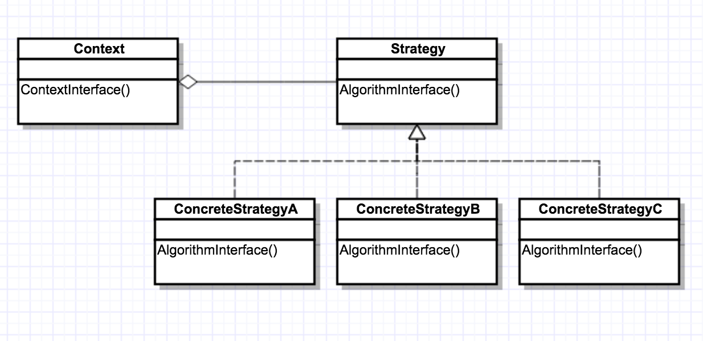
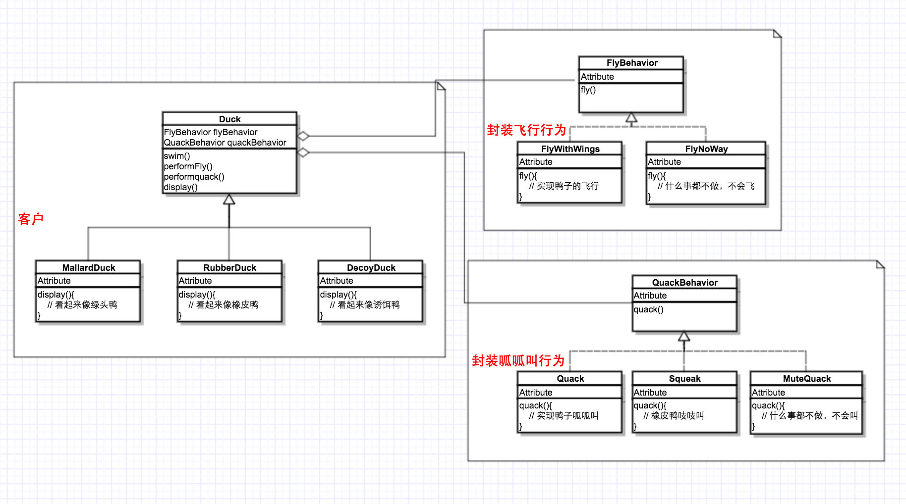
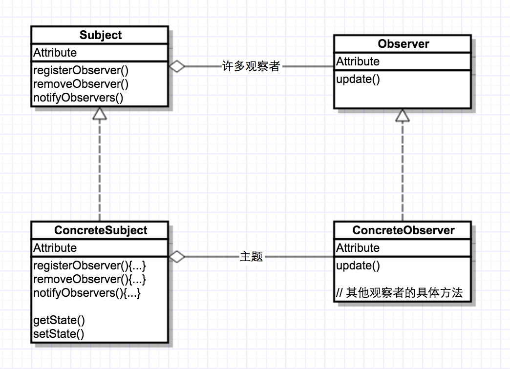
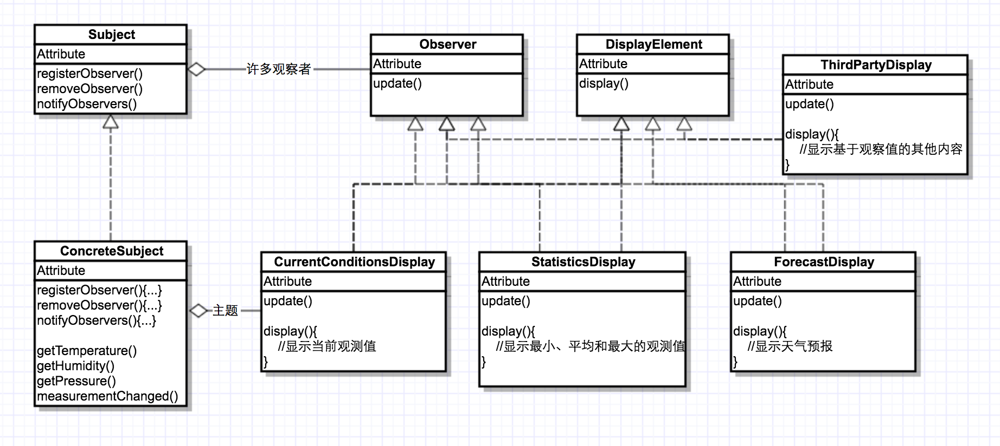
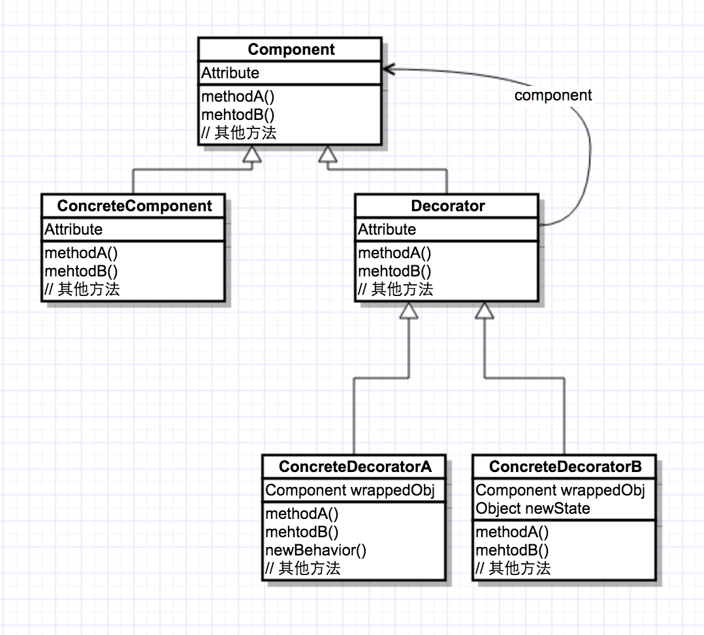
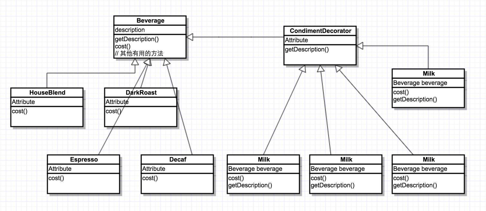

# 1､设计模式

## 1.1 使用设计模式的最好方式：

> * 把模式装进脑子里，然后在你的设计和已有的应用中，寻找何处可以使用它们。

## 1.2 设计原则

> * 1.找出应用中可能需要变化之处，把它们独立出来，不和要和那些不需要变化的代码混在一起。
> * 2.针对接口编程而不是针对实现编程。
> * 3.多用组合，少用继承。
> * 4.为了交互对象之间的松耦合设计而努力。
> * 5.类应该对扩展开放，对修改关闭。

# 2､策略模式：

## 2.1 背景：

> * 在软件开发中也常常遇到类似的情况，实现某一个功能有多种[算法](http://lib.csdn.net/base/datastructure)或者策略，我们可以根据环境或者条件的不同选择不同的算法或者策略来完成该功能。如果采用硬编码方式解决，则该类代码将较复杂，维护较为困难。如果我们将这些策略包含在客户端，这种做法更不可取，将导致客户端程序庞大而且难以维护，如果存在大量可供选择的算法时问题将变得更加严重。

## 2.2 解决方案：

> * 定义一系列的算法，把每一个算法封装起来，并且使它们可以相互替换。本模式使得算法可独立于使用它的客户而变化。

## 2.3 类图结构：

## 2.4 实例关系类图：

# 3､观察者模式：

## 3.1 背景：

> * 当一个对象的状态发生改变时，你如何通知其他对象？是否需要一个动态方案――一个就像允许脚本的执行一样，允许自由连接的方案？

## 3.2 解决方案：

> * 定义了对象之间的一对多依赖，这样一来，当一个对象改变状态时，它的所有依赖都会收到通知并自动更新。

## 3.3 类结构图：

## 3.4 实例关系类图：

## 3.5 Java内置的观察者模式

> * java.util.Observer(观察者)：只有一个方法：void update(Observable o, Object arg)，第一个参数是被观察者，第二个参数是传递给观察者的变化的对象。
> * java.util.Observable(被观察者)：类里的方法大部分使用了线程同步操作，所以减少了并发异常。同时，如果需要给观察者通知，需要先调用一个setChanged()方法，这样才可以通知到观察者。

# 4､ 装饰者模式：

## 4.1 背景：

> *  通过继承一个现有类可以使得子类在拥有自身方法的同时还拥有父类的方法。但是这种方法是静态的，用户不能控制增加行为的方式和时机。如果 你希望改变一个已经初始化的对象的行为，你怎么办？或者，你希望继承许多类的行为，该怎么办?前一个，只能在于运行时完成，后者显然是可能的，但是可能会导致产生大量的不同的类。

## 4.2 解决方案：

> * 动态地将责任附加到对象上。若要扩展功能，装饰者提供了比继承更有弹性的替代方案。

## 4.3 类结构图：

## 4.4 实例关系类图：

## 4.5 Java世界中的装饰者：Java I/O

# 参考：

[1]、http://blog.csdn.net/hguisu/article/category/1133340

[2]、http://blog.csdn.net/lovelion/article/details/17517213