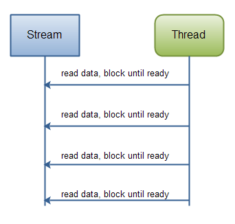

## 1.IO：

### 1.1 java.io包类结构图


### 1.2 IO分类：

* 流式部分――IO的主体部分
* 非流式部分――主要包含一些辅助流式部分的类，如：File类、RandomAccessFile类和FileDescriptor等类
* 文件读取部分的与安全相关的类

> 流式部分可以概括为：两个对应一个桥梁。
>
> * 两个对应指：
>   * 1.字节流（Byte Stream）和字符流（Char Stream）的对应；
>   * 2.输入和输出的对应。
> * 一个桥梁指：
>   * 从字节流到字符流的桥梁。对应于输入和输出为InputStreamReader和OutputStreamWriter

* 在流的具体类中又可以具体分为：
  * 介质流（Media Stream或者称为原始流Raw Stream）――主要指一些基本的流，他们主要是从具体的介质上，如：文件、内存缓冲区（Byte数组、Char数组、StringBuffer对象）等，读取数据
  * 过滤流（Filter Stream）――主要指所有FilterInputStream/FilterOutputStream和FilterReader/FilterWriter的子类，主要是对其包装的类进行某些特定的处理，如：缓存等。

### 1.3 IO输入流介绍：

* 基本输入字节流:

| **类**                       | **功能**                                   | **如何构造**                                 | **怎样使用**                             |
| --------------------------- | ---------------------------------------- | ---------------------------------------- | ------------------------------------ |
| **ByteArrayInputStream**    | 将内存中的Byte数组适配为一个InputStream。             | 从内存中的Byte数组创建该对象（2种方法）                   | 一般作为数据源，会使用其它装饰流提供额外的功能，一般都建议加个缓冲功能。 |
| **StringBufferInputStream** | 将内存中的字符串适配为一个InputStream。                | 从一个String对象创建该对象。底层的实现使用StringBuffer。该类被Deprecated。主要原因是StringBuffer不应该属于字节流，所以推荐使用StringReader。 | 一般作为数据源，同样会使用其它装饰器提供额外的功能。           |
| **FileInputStream**         | 最基本的文件输入流。主要用于从文件中读取信息。                  | 通过一个代表文件路径的 String、File对象或者 FileDescriptor对象创建。 | 一般作为数据源，同样会使用其它装饰器提供额外的功能。           |
| **PipedInputStream**        | 读取从对应PipedOutputStream写入的数据。在流中实现了管道的概念。 | 利用对应的PipedOutputStream创建。                | 在多线程程序中作为数据源，同样会使用其它装饰器提供额外的功能。      |
| **SequenceInputStream**     | 将2个或者多个InputStream 对象转变为一个InputStream。   | 使用两个InputStream 或者内部对象为InputStream 的Enumeration对象创建该对象。 | 一般作为数据源，同样会使用其它装饰器提供额外的功能。           |
| **FilterInputStream**       | 给其他被装饰对象提供额外功能的抽象类                       | 主要子类见下表                                  |                                      |

* 装饰输入字节流:

| **类**                     | **功能**                                   | **如何构造**                            | **怎样使用**                                 |
| :------------------------ | ---------------------------------------- | ----------------------------------- | ---------------------------------------- |
| **DataInputStream**       | ****一般和DataOutputStream配对使用,完成基本数据类型的读写。 | 利用一个InputStream构造。                  | 提供了大量的读取基本数据类新的读取方法。                     |
| **BufferedInputStream**   | 使用该对象阻止每次读取一个字节都会频繁操作IO。将字节读取一个缓存区，从缓存区读取。 | 利用一个InputStream、或者带上一个自定义的缓存区的大小构造。 | 使用InputStream的方法读取，只是背后多一个缓存的功能。设计模式中透明装饰器的应用。 |
| **LineNumberInputStream** | 跟踪输入流中的行号。可以调用getLineNumber( )和 setLineNumber(int)方法得到和设置行号。 | 利用一个InputStream构造。                  | 紧紧增加一个行号。可以象使用其它InputStream一样使用。         |
| **PushbackInputStream**   | 可以在读取最后一个byte后将其放回到缓存中。                  | 利用一个InputStream构造。                  | 一般仅仅会在设计compiler的scanner 时会用到这个类。在我们的java语言的编译器中使用它。很多程序员可能一辈子都不需要。 |

### 1.4 IO输出流介绍

* 基本输出字节流：

| **类**                     | **功能**                                   | **如何构造**                                 | **怎样使用**                                 |
| ------------------------- | ---------------------------------------- | ---------------------------------------- | ---------------------------------------- |
| **ByteArrayOutputStream** | 在内存中创建一个buffer。所有写入此流中的数据都被放入到此buffer中。  | 无参或者使用一个可选的初始化buffer的大小的参数构造。            | 一般将其和FilterOutputStream套接得到额外的功能。建议首先和BufferedOutputStream套接实现缓冲功能。通过toByteArray方法可以得到流中的数据。（不通明装饰器的用法） |
| **FileOutputStream**      | 将信息写入文件中。                                | 使用代表文件路径的String、File对象或者 FileDescriptor对象创建。还可以加一个代表写入的方式是否为append的标记。 | 一般将其和FilterOutputStream套接得到额外的功能。        |
| **PipedOutputStream**     | 任何写入此对象的信息都被放入对应PipedInputStream 对象的缓存中，从而完成线程的通信，实现了“管道”的概念。具体在后面详细讲解。 | 利用PipedInputStream构造                     | 在多线程程序中数据的目的地的。一般将其和FilterOutputStream套接得到额外的功能。 |
| **FilterOutputStream**    | 实现装饰器功能的抽象类。为其他的OutputStream增加额外的功能。     | 见下表                                      | 见下表                                      |

* 装饰输出字节流：

| **类**                    | **功能**                                   | **如何构造**                                 | **怎样使用**                              |
| ------------------------ | ---------------------------------------- | ---------------------------------------- | ------------------------------------- |
| **DataOutputStream**     | 通常和DataInputStream配合使用，使用它可以写入基本数据类新。    | 使用OutputStream构造                         | 包含大量的写入基本数据类型的方法。                     |
| **PrintStream**          | 产生具有格式的输出信息。（一般地在java程序中DataOutputStream用于数据的存储，即J2EE中持久层完成的功能，PrintStream完成显示的功能，类似于J2EE中表现层的功能） | 使用OutputStream和一个可选的表示缓存是否在每次换行时是否flush的标记构造。还提供很多和文件相关的构造方法。 | 一般是一个终极（“final”）的包装器，很多时候我们都使用它！      |
| **BufferedOutputStream** | 使用它可以避免频繁地向IO写入数据，数据一般都写入一个缓存区，在调用flush方法后会清空缓存、一次完成数据的写入。 | 从一个OutputStream或者和一个代表缓存区大小的可选参数构造。      | 提供和其它OutputStream一致的接口，只是内部提供一个缓存的功能。 |

### 1.5 字节流和字符流总结：

* 区别：
  * 字节流在操作的时候本身是不会用到缓冲区（内存）的，是与文件本身直接操作的，而字符流在操作的时候是使用到缓冲区的
  * 字节流在操作文件时，即使不关闭资源（close方法），文件也能输出，但是如果字符流不使用close方法的话，则不会输出任何内容，说明字符流用的是缓冲区，并且可以使用flush方法强制进行刷新缓冲区，这时才能在不close的情况下输出内容
* 使用：
  * 字节流在操作文件时，即使不关闭资源（close方法），文件也能输出，但是如果字符流不使用close方法的话，则不会输出任何内容，说明字符流用的是缓冲区，并且可以使用flush方法强制进行刷新缓冲区，这时才能在不close的情况下输出内容
  * 如果要java程序实现一个拷贝功能，应该选用字节流进行操作（可能拷贝的是图片），并且采用边读边写的方式(节省内存)

## 2.NIO：

### 2.1 概念说明：

* Java NIO: Channels and Buffers
  * 标准的IO基于字节流和字符流进行操作的，而NIO是基于通道（Channel）和缓冲区（Buffer）进行操作，数据总是从通道读取到缓冲区中，或者从缓冲区写入到通道中。
* Java NIO: Non-blocking IO
  * Java NIO可以让你非阻塞的使用IO，例如：当线程从通道读取数据到缓冲区时，线程还是可以进行其他事情。当数据被写入到缓冲区时，线程可以继续处理它。从缓冲区写入通道也类似。
* Java NIO: Selectors
  * Java NIO引入了选择器的概念，选择器用于监听多个通道的事件（比如：连接打开，数据到达）。因此，单个的线程可以监听多个数据通道。

### 2.2 Java NIO 概述：

#### 2.2.1 概述：

* Java NIO 由以下几个核心部分组成：Channels、Buffers、Selectors。虽然Java NIO 中除此之外还有很多类和组件，但在我看来，Channel，Buffer 和 Selector 构成了核心的API。其它组件，如Pipe和FileLock，只不过是与三个核心组件共同使用的工具类。因此，在概述中我将集中在这三个组件上。其它组件会在单独的章节中讲到。

#### 2.2.2 Channel和Buffer：

* 基本上，所有的 IO 在NIO 中都从一个Channel 开始。Channel 有点象流。 数据可以从Channel读到Buffer中，也可以从Buffer 写到Channel中。这里有个图示：


#### 2.2.3 Selector:

* Selector允许单线程处理多个 Channel。如果你的应用打开了多个连接（通道），但每个连接的流量都很低，使用Selector就会很方便。例如，在一个聊天服务器中。这是在一个单线程中使用一个Selector处理3个Channel的图示：


* 要使用Selector，得向Selector注册Channel，然后调用它的select()方法。这个方法会一直阻塞到某个注册的通道有事件就绪。一旦这个方法返回，线程就可以处理这些事件，事件的例子有如新连接进来，数据接收等。

### 2.3 Channel

#### 2.3.1 概念说明：

* Java NIO的通道类似流，但又有些不同：
  * 既可以从通道中读取数据，又可以写数据到通道。但流的读写通常是单向的。
  * 通道可以异步地读写。
  * 通道中的数据总是要先读到一个Buffer，或者总是要从一个Buffer中写入。


* 常用的Channel：

```
FileChannel:从文件中读写数据
DatagramChannel:能通过UDP读写网络中的数据
SocketChannel:能通过TCP读写网络中的数据
ServerSocketChannel:可以监听进来的TCP连接，像Web服务器那样。对每一个新进来的连接都会创建一个SocketChannel
```

#### 2.3.2 简单示例：

```java
RandomAccessFile aFile = new RandomAccessFile("data/nio-data.txt", "rw");
FileChannel inChannel = aFile.getChannel();
ByteBuffer buf = ByteBuffer.allocate(48);
int bytesRead = inChannel.read(buf);
while (bytesRead != -1) {
  System.out.println("Read " + bytesRead);
  buf.flip(); // 后面会讲解
  while(buf.hasRemaining()){
      System.out.print((char) buf.get());
  }
  buf.clear(); // 后面会讲解
  bytesRead = inChannel.read(buf);
}
aFile.close();
```

### 2.4 Buffer:

#### 2.4.1 概述：

* Java NIO中的Buffer用于和NIO通道进行交互。如你所知，数据是从通道读入缓冲区，从缓冲区写入到通道中的。缓冲区本质上是一块可以写入数据，然后可以从中读取数据的内存。这块内存被包装成NIO Buffer对象，并提供了一组方法，用来方便的访问该块内存。
* 缓冲区本质上是一块可以写入数据，然后可以从中读取数据的内存。这块内存被包装成NIO Buffer对象，并提供了一组方法，用来方便的访问该块内存。

#### 2.4.2 capacity,position和limit：

* position和limit的含义取决于Buffer处在读模式还是写模式。不管Buffer处在什么模式，capacity的含义总是一样的。


* **capacity**：作为一个内存块，Buffer有一个固定的大小值，也叫“capacity”.你只能往里写capacity个byte、long，char等类型。一旦Buffer满了，需要将其清空（通过读数据或者清除数据）才能继续写数据往里写数据。
* **position**：当你写数据到Buffer中时，position表示当前的位置。初始的position值为0.当一个byte、long等数据写到Buffer后， position会向前移动到下一个可插入数据的Buffer单元。position最大可为capacity – 1.当读取数据时，也是从某个特定位置读。当将Buffer从写模式切换到读模式，position会被重置为0. 当从Buffer的position处读取数据时，position向前移动到下一个可读的位置。
* **limit**：在写模式下，Buffer的limit表示你最多能往Buffer里写多少数据。 写模式下，limit等于Buffer的capacity。当切换Buffer到读模式时， limit表示你最多能读到多少数据。因此，当切换Buffer到读模式时，limit会被设置成写模式下的position值。换句话说，你能读到之前写入的所有数据（limit被设置成已写数据的数量，这个值在写模式下就是position）

#### 2.4.3 Buffer类:

```java
ByteBuffer
CharBuffer
DoubleBuffer
FloatBuffer
IntBuffer
LongBuffer
ShortBuffer
MappedByteBuffer
```

* 这些Buffer类型代表了不同的数据类型。换句话说，就是可以通过char，short，int，long，float 或 double类型来操作缓冲区中的字节。
* MappedByteBuffer 有些特别，在涉及它的专门章节中再讲。

#### 2.4.4 Buffer的分配：

* 要想获得一个Buffer对象首先要进行分配。 每一个Buffer类都有一个allocate方法。下面是一个分配48字节capacity的ByteBuffer的例子。

  `ByteBuffer buf = ByteBuffer.allocate(48);`

* 这是分配一个可存储1024个字符的CharBuffer：

  `CharBuffer buf = CharBuffer.allocate(1024);`

#### 2.4.5 Buffer的读写数据：

* 写数据到Buffer有两种方式：

  * 从Channel写到Buffer。
  * 通过Buffer的put()方法写到Buffer里。

  ```java
  int bytesRead = inChannel.read(buf); // 从channel读数据到buffer
  buf.put(127); // 直接向buffer中写数据
  ```

  * put方法有很多版本，允许你以不同的方式把数据写入到Buffer中。例如， 写到一个指定的位置，或者把一个字节数组写入到Buffer。 更多Buffer实现的细节参考JavaDoc。

* 从Buffer中读取数据有两种方式：

  * 从Buffer读取数据到Channel。
  * 使用get()方法从Buffer中读取数据。

  ```java
  int bytesWritten = inChannel.write(buf); // 把buffer中的数据写到channel中
  byte aByte = buf.get(); // 直接获取buffer中的数据
  ```

  * get方法有很多版本，允许你以不同的方式从Buffer中读取数据。例如，从指定position读取，或者从Buffer中读取数据到字节数组。更多Buffer实现的细节参考JavaDoc。

#### 2.4.6 Buffer中的重要方法：

* flip():

  * flip方法将Buffer从写模式切换到读模式。调用flip()方法会将position设回0，并将limit设置成之前position的值。换句话说，position现在用于标记读的位置，limit表示之前写进了多少个byte、char等 —— 现在能读取多少个byte、char等。

  ```java
  public final Buffer flip() {
      limit = position;
      position = 0;
      mark = -1;
      return this;
  }
  ```

* compact():

  * compact()方法将所有未读的数据拷贝到Buffer起始处。然后将position设到最后一个未读元素正后面。limit属性依然像clear()方法一样，设置成capacity。现在Buffer准备好写数据了，但是不会覆盖未读的数据。

  ```java
  // 以ByteBuffer的子类HeapByteBuffer为例
  public ByteBuffer compact() {
      System.arraycopy(hb, ix(position()), hb, ix(0), remaining());
      position(remaining());
      limit(capacity());
      discardMark();
      return this;
  }
  ```

* clear():

  * 一旦读完Buffer中的数据，需要让Buffer准备好再次被写入。可以通过clear()或compact()方法来完成。如果调用的是clear()方法，position将被设回0，limit被设置成 capacity的值。换句话说，Buffer 被清空了。Buffer中的数据并未清除，只是这些标记告诉我们可以从哪里开始往Buffer里写数据。如果Buffer中有一些未读的数据，调用clear()方法，数据将“被遗忘”，意味着不再有任何标记会告诉你哪些数据被读过，哪些还没有。如果Buffer中仍有未读的数据，且后续还需要这些数据，但是此时想要先先写些数据，那么使用compact()方法。

  ```java
  public final Buffer clear() {
      position = 0;
      limit = capacity;
      mark = -1;
      return this;
  }
  ```

  ​

* rewind():

  * Buffer.rewind()将position设回0，所以你可以重读Buffer中的所有数据。limit保持不变，仍然表示能从Buffer中读取多少个元素（byte、char等）。

  ```java
  public final Buffer rewind() {
      position = 0;
      mark = -1;
      return this;
  }
  ```

* mark():

  * 通过调用Buffer.mark()方法，可以标记Buffer中的一个特定position。之后可以通过调用Buffer.reset()方法恢复到这个position。

  ```java
  public final Buffer mark() {
      mark = position;
      return this;
  }
  ```

* reset():

  ```java
  public final Buffer reset() {
      int m = mark;
      if (m < 0)
          throw new InvalidMarkException();
      position = m;
      return this;
  }
  ```

* equals():

  * 当满足下列条件时，表示两个Buffer相等：
    * 有相同的类型（byte、char、int等）。
    * Buffer中剩余的byte、char等的个数相等。
    * Buffer中所有剩余的byte、char等都相同。
  * 因此，equals只是比较Buffer的一部分，不是每一个在它里面的元素都比较。实际上，它只比较Buffer中的剩余元素。(剩余元素是从 position到limit之间的元素)

  ```java
  // 以ByteBuffer为例
  public boolean equals(Object ob) {
      if (this == ob)
          return true;
      if (!(ob instanceof ByteBuffer))
          return false;
      ByteBuffer that = (ByteBuffer)ob;
      if (this.remaining() != that.remaining())
          return false;
      int p = this.position();
      for (int i = this.limit() - 1, j = that.limit() - 1; i >= p; i--, j--)
          if (!equals(this.get(i), that.get(j)))
              return false;
      return true;
  }
  ```

* compareTo():

  * compareTo()方法比较两个Buffer的剩余元素(byte、char等)， 如果满足下列条件，则认为一个Buffer“小于”另一个Buffer：
    * 第一个不相等的元素小于另一个Buffer中对应的元素 。
    * 所有元素都相等，但第一个Buffer比另一个先耗尽(第一个Buffer的元素个数比另一个少)。

  ```java
  // 以ByteBuffer为例
  public int compareTo(ByteBuffer that) {
      int n = this.position() + Math.min(this.remaining(), that.remaining());
      for (int i = this.position(), j = that.position(); i < n; i++, j++) {
          int cmp = compare(this.get(i), that.get(j));
          if (cmp != 0)
              return cmp;
      }
      return this.remaining() - that.remaining();
  }
  ```

#### 2.4.7 Buffer的基本使用：

* 使用Buffer读写数据一般遵循以下四个步骤：
  * 写入数据到Buffer
  * 调用`flip()`方法 
  * 从Buffer中读取数据
  * 调用`clear()`方法或者`compact()`方法
* 当向buffer写入数据时，buffer会记录下写了多少数据。一旦要读取数据，需要通过flip()方法将Buffer从写模式切换到读模式。在读模式下，可以读取之前写入到buffer的所有数据。
* 一旦读完了所有的数据，就需要清空缓冲区，让它可以再次被写入。有两种方式能清空缓冲区：调用clear()或compact()方法。clear()方法会清空整个缓冲区。compact()方法只会清除已经读过的数据。任何未读的数据都被移到缓冲区的起始处，新写入的数据将放到缓冲区未读数据的后面。
* 简单示例：

```java
FileInputStream in = null;
try {
	in = new FileInputStream("src/test.txt");
	FileChannel channel = in.getChannel();
	ByteBuffer buffer = ByteBuffer.allocate(1024);
	int len = -1;
	while ((len = channel.read(buffer)) != -1) {
		buffer.flip();
		while (buffer.hasRemaining()) {
			System.out.print((char) buffer.get());
		}
		buffer.compact();
	}
} catch (IOException e) {
	e.printStackTrace();
} finally {
	try {
		if (in != null) {
			in.close();
		}
	} catch (IOException e) {
		e.printStackTrace();
	}
}
```

### 2.5：Scatter/Gather

#### 2.5.1 概述：

* Java NIO开始支持scatter/gather，scatter/gather用于描述从Channel（译者注：Channel在中文经常翻译为通道）中读取或者写入到Channel的操作。
* 分散（scatter）从Channel中读取是指在读操作时将读取的数据写入多个buffer中。因此，Channel将从Channel中读取的数据“分散（scatter）”到多个Buffer中。
* 聚集（gather）写入Channel是指在写操作时将多个buffer的数据写入同一个Channel，因此，Channel 将多个Buffer中的数据“聚集（gather）”后发送到Channel。
* scatter / gather经常用于需要将传输的数据分开处理的场合，例如传输一个由消息头和消息体组成的消息，你可能会将消息体和消息头分散到不同的buffer中，这样你可以方便的处理消息头和消息体。

#### 2.5.2 Scattering Reads:

* Scattering Reads是指数据从一个channel读取到多个buffer中。如下图描述：


* 代码示例：

```java
ByteBuffer header = ByteBuffer.allocate(128);
ByteBuffer body   = ByteBuffer.allocate(1024);
//write data into buffers
ByteBuffer[] bufferArray = { header, body };
channel.write(bufferArray);
```

* 注意buffer首先被插入到数组，然后再将数组作为channel.read() 的输入参数。read()方法按照buffer在数组中的顺序将从channel中读取的数据写入到buffer，当一个buffer被写满后，channel紧接着向另一个buffer中写。

  Scattering Reads在移动下一个buffer前，必须填满当前的buffer，这也意味着它不适用于动态消息(译者注：消息大小不固定)。换句话说，如果存在消息头和消息体，消息头必须完成填充（例如 128byte），Scattering Reads才能正常工作。

#### 2.5.3 Gathering Writes:

* Gathering Writes是指数据从多个buffer写入到同一个channel。如下图描述：


* 代码示例：

```java
ByteBuffer header = ByteBuffer.allocate(128);
ByteBuffer body   = ByteBuffer.allocate(1024);
//write data into buffers
ByteBuffer[] bufferArray = { header, body };
channel.write(bufferArray);
```

* buffers数组是write()方法的入参，write()方法会按照buffer在数组中的顺序，将数据写入到channel，注意只有position和limit之间的数据才会被写入。因此，如果一个buffer的容量为128byte，但是仅仅包含58byte的数据，那么这58byte的数据将被写入到channel中。因此与Scattering Reads相反，Gathering Writes能较好的处理动态消息。

### 2.6 通道间的数据传递：

#### 2.6.1 概述

* 在Java NIO中，如果两个通道中有一个是FileChannel，那你可以直接将数据从一个channel传输到另外一个channel。

#### 2.6.2 transferFrom()

* FileChannel的transferFrom()方法可以将数据从源通道传输到FileChannel中（译者注：这个方法在JDK文档中的解释为将字节从给定的可读取字节通道传输到此通道的文件中）。下面是一个简单的例子：

```java
RandomAccessFile fromFile = new RandomAccessFile("fromFile.txt", "rw");
FileChannel fromChannel = fromFile.getChannel();
RandomAccessFile toFile = new RandomAccessFile("toFile.txt", "rw");
FileChannel toChannel = toFile.getChannel();
long position = 0;
long count = fromChannel.size();
toChannel.transferFrom(fromChannel, position, count);
```

* 方法的输入参数position表示从position处开始向目标文件写入数据，count表示最多传输的字节数。如果源通道的剩余空间小于 count 个字节，则所传输的字节数要小于请求的字节数。
  此外要注意，在SoketChannel的实现中，SocketChannel只会传输此刻准备好的数据（可能不足count字节）。因此，SocketChannel可能不会将请求的所有数据(count个字节)全部传输到FileChannel中。

#### 2.6.3 transferTo()

* transferTo()方法将数据从FileChannel传输到其他的channel中。下面是一个简单的例子：

```java
RandomAccessFile fromFile = new RandomAccessFile("fromFile.txt", "rw");
FileChannel fromChannel = fromFile.getChannel();
RandomAccessFile toFile = new RandomAccessFile("toFile.txt", "rw");
FileChannel toChannel = toFile.getChannel();
long position = 0;
long count = fromChannel.size();
fromChannel.transferTo(position, count, toChannel);
```

* 是不是发现这个例子和前面那个例子特别相似？除了调用方法的FileChannel对象不一样外，其他的都一样。
  上面所说的关于SocketChannel的问题在transferTo()方法中同样存在。SocketChannel会一直传输数据直到目标buffer被填满。

### 2.7 Selector

#### 2.7.1 概述：

* Selector（选择器）是Java NIO中能够检测一到多个NIO通道，并能够知晓通道是否为诸如读写事件做好准备的组件。这样，一个单独的线程可以管理多个channel，从而管理多个网络连接。

* 为什么使用Selector：

  * 仅用单个线程来处理多个Channels的好处是，只需要更少的线程来处理通道。事实上，可以只用一个线程处理所有的通道。对于操作系统来说，线程之间上下文切换的开销很大，而且每个线程都要占用系统的一些资源（如内存）。因此，使用的线程越少越好。
  * 但是，需要记住，现代的操作系统和CPU在多任务方面表现的越来越好，所以多线程的开销随着时间的推移，变得越来越小了。实际上，如果一个CPU有多个内核，不使用多任务可能是在浪费CPU能力。不管怎么说，关于那种设计的讨论应该放在另一篇不同的文章中。在这里，只要知道使用Selector能够处理多个通道就足够了。
  * 下面是单线程使用一个Selector处理3个channel的示例图：

  

#### 2.7.2 Selector的创建及向Selector注册通道

* 通过调用Selector.open()方法创建一个Selector，如下：

```java
  Selector selector = Selector.open();
```

* 为了将Channel和Selector配合使用，必须将channel注册到selector上。通过SelectableChannel.register()方法来实现，如下：

```java
  channel.configureBlocking(false);
  SelectionKey key = channel.register(selector, SelectionKey.OP_READ);
```

*   与Selector一起使用时，Channel必须处于非阻塞模式下。这意味着不能将FileChannel与Selector一起使用，因为FileChannel不能切换到非阻塞模式。而套接字通道都可以。

*   注意register()方法的第二个参数。这是一个“interest集合”，意思是在通过Selector监听Channel时对什么事件感兴趣。可以监听四种不同类型的事件：Connect、Accept、Read、Write
    * 通道触发了一个事件意思是该事件已经就绪。所以，某个channel成功连接到另一个服务器称为“连接就绪”。一个server socket channel准备好接收新进入的连接称为“接收就绪”。一个有数据可读的通道可以说是“读就绪”。等待写数据的通道可以说是“写就绪”。
    * 这四种事件用SelectionKey的四个常量来表示：
      * SelectionKey.OP_CONNECT
      * SelectionKey.OP_ACCEPT
      * SelectionKey.OP_READ
      * SelectionKey.OP_WRITE
    * 如果你对不止一种事件感兴趣，那么可以用“位或”操作符将常量连接起来，如下：

    ```java
    int interestSet = SelectionKey.OP_READ | SelectionKey.OP_WRITE;
    ```

      在下面还会继续提到interest集合。

#### 2.7.3 SelectionKey

* 在上一小节中，当向Selector注册Channel时，register()方法会返回一个SelectionKey对象。这个对象包含了一些你感兴趣的属性：

  * interest集合
  * ready集合
  * Channel
  * Selector
  * 附加的对象（可选）

* interest集合:

  * 就像向Selector注册通道一节中所描述的，interest集合是你所选择的感兴趣的事件集合。可以通过SelectionKey读写interest集合，像这样：

  ```java
  int interestSet = selectionKey.interestOps();
  boolean isInterestedInAccept  = interestSet & SelectionKey.OP_ACCEPT;
  boolean isInterestedInConnect = interestSet & SelectionKey.OP_CONNECT;
  boolean isInterestedInRead    = interestSet & SelectionKey.OP_READ;
  boolean isInterestedInWrite   = interestSet & SelectionKey.OP_WRITE;   
  ```
  * 可以看到，用“位与”操作interest 集合和给定的SelectionKey常量，可以确定某个确定的事件是否在interest 集合中。

* ready集合:

  * ready 集合是通道已经准备就绪的操作的集合。在一次选择(Selection)之后，你会首先访问这个ready set。Selection将在下一小节进行解释。可以这样访问ready集合：

  ```java
  int readySet = selectionKey.readyOps();
  ```

  * 可以用像检测interest集合那样的方法，来检测channel中什么事件或操作已经就绪。但是，也可以使用以下四个方法，它们都会返回一个布尔类型：

  ```java
  selectionKey.isAcceptable();
  selectionKey.isConnectable();
  selectionKey.isReadable();
  selectionKey.isWritable();
  ```

* channel 和 selector：

  * 从SelectionKey访问Channel和Selector很简单。如下：

  ```java
  Channel  channel  = selectionKey.channel();
  Selector selector = selectionKey.selector();   
  ```

* 附加的对象：

  * 可以将一个对象或者更多信息附着到SelectionKey上，这样就能方便的识别某个给定的通道。例如，可以附加 与通道一起使用的Buffer，或是包含聚集数据的某个对象。使用方法如下：

  ```java
  selectionKey.attach(theObject);
  Object attachedObj = selectionKey.attachment();
  ```

  * 还可以在用register()方法向Selector注册Channel的时候附加对象。如：

  ```java
  SelectionKey key = channel.register(selector, SelectionKey.OP_READ, theObject);
  ```

#### 2.7.4 通过Selector选择通道

* 一旦向Selector注册了一或多个通道，就可以调用几个重载的select()方法。这些方法返回你所感兴趣的事件（如连接、接受、读或写）已经准备就绪的那些通道。换句话说，如果你对“读就绪”的通道感兴趣，select()方法会返回读事件已经就绪的那些通道。
* 下面是select()方法：

```java
int select() // 阻塞到至少有一个通道在你注册的事件上就绪了。
int select(long timeout) // 和select()一样，除了最长会阻塞timeout毫秒(参数)。
int selectNow() //不会阻塞，不管什么通道就绪都立刻返回
```

* select()方法返回的int值表示有多少通道已经就绪。亦即，自上次调用select()方法后有多少通道变成就绪状态。如果调用select()方法，因为有一个通道变成就绪状态，返回了1，若再次调用select()方法，如果另一个通道就绪了，它会再次返回1。如果对第一个就绪的channel没有做任何操作，现在就有两个就绪的通道，但在每次select()方法调用之间，只有一个通道就绪了。

* **selectedKeys()**

  * 一旦调用了select()方法，并且返回值表明有一个或更多个通道就绪了，然后可以通过调用selector的selectedKeys()方法，访问“已选择键集（selected key set）”中的就绪通道。如下所示：

  ```java
  Set selectedKeys = selector.selectedKeys();
  ```

  * 当像Selector注册Channel时，Channel.register()方法会返回一个SelectionKey 对象。这个对象代表了注册到该Selector的通道。可以通过SelectionKey的selectedKeySet()方法访问这些对象。

    可以遍历这个已选择的键集合来访问就绪的通道。如下：

  ```java
  Set<SelectionKey> selectedKeys = selector.selectedKeys();
  Iterator<SelectionKey> keyIterator = selectedKeys.iterator();
  while(keyIterator.hasNext()) {
      SelectionKey key = keyIterator.next();
      if(key.isAcceptable()) {
          // a connection was accepted by a ServerSocketChannel.
      } else if (key.isConnectable()) {
          // a connection was established with a remote server.
      } else if (key.isReadable()) {
          // a channel is ready for reading
      } else if (key.isWritable()) {
          // a channel is ready for writing
      }
      keyIterator.remove();
  }
  ```

  ​		这个循环遍历已选择键集中的每个键，并检测各个键所对应的通道的就绪事件。

  * 注意每次迭代末尾的keyIterator.remove()调用。Selector不会自己从已选择键集中移除SelectionKey实例。必须在处理完通道时自己移除。下次该通道变成就绪时，Selector会再次将其放入已选择键集中。
  * SelectionKey.channel()方法返回的通道需要转型成你要处理的类型，如ServerSocketChannel或SocketChannel等。


* **wakeUp()**
  * 某个线程调用select()方法后阻塞了，即使没有通道已经就绪，也有办法让其从select()方法返回。只要让其它线程在第一个线程调用select()方法的那个对象上调用Selector.wakeup()方法即可。阻塞在select()方法上的线程会立马返回。
  * 如果有其它线程调用了wakeup()方法，但当前没有线程阻塞在select()方法上，下个调用select()方法的线程会立即“醒来（wake up）”。
* **close()**
  * 用完Selector后调用其close()方法会关闭该Selector，且使注册到该Selector上的所有SelectionKey实例无效。通道本身并不会关闭。
* **示例：**

```java
Selector selector = Selector.open();
channel.configureBlocking(false);
SelectionKey key = channel.register(selector, SelectionKey.OP_READ);
while(true) {
  int readyChannels = selector.select();
  if(readyChannels == 0) continue;
  Set<SelectionKey> selectedKeys = selector.selectedKeys();
  Iterator<SelectionKey> keyIterator = selectedKeys.iterator();
  while(keyIterator.hasNext()) {
    SelectionKey key = keyIterator.next();
    if(key.isAcceptable()) {
        // a connection was accepted by a ServerSocketChannel.
    } else if (key.isConnectable()) {
        // a connection was established with a remote server.
    } else if (key.isReadable()) {
        // a channel is ready for reading
    } else if (key.isWritable()) {
        // a channel is ready for writing
    }
    keyIterator.remove();
  }
}
```

### 2.8 FileChannel

#### 2.8.1 概述：

* Java NIO中的FileChannel是一个连接到文件的通道。可以通过文件通道读写文件。

  FileChannel无法设置为非阻塞模式，它总是运行在阻塞模式下。

#### 2.8.2 常见操作：

* 打开FileChannel

  在使用FileChannel之前，必须先打开它。但是，我们无法直接打开一个FileChannel，需要通过使用一个InputStream、OutputStream或RandomAccessFile来获取一个FileChannel实例。下面是通过RandomAccessFile打开FileChannel的示例：

```java
RandomAccessFile aFile = new RandomAccessFile("data/nio-data.txt", "rw");
FileChannel inChannel = aFile.getChannel();
```

* 从FileChannel读取数据

  调用多个read()方法之一从FileChannel中读取数据。如：

```java
// 首先，分配一个Buffer。从FileChannel中读取的数据将被读到Buffer中。
ByteBuffer buf = ByteBuffer.allocate(48);
int bytesRead = inChannel.read(buf);
// 然后，调用FileChannel.read()方法。该方法将数据从FileChannel读取到Buffer中。    read()方法返回的int值表示了有多少字节被读到了Buffer中。如果返回-1，表示到了文件末尾。
```

* 向FileChannel写数据

  使用FileChannel.write()方法向FileChannel写数据，该方法的参数是一个Buffer。如：


```java
String newData = "New String to write to file..." + System.currentTimeMillis();
ByteBuffer buf = ByteBuffer.allocate(48);
buf.clear();
buf.put(newData.getBytes());
buf.flip();
// 注意FileChannel.write()是在while循环中调用的。因为无法保证write()方法一次能向FileChannel写入多少字节，因此需要重复调用write()方法，直到Buffer中已经没有尚未写入通道的字节。
while(buf.hasRemaining()) {
    channel.write(buf);
}
```

* 关闭FileChannel

  用完FileChannel后必须将其关闭。如：

```java
channel.close();
```

#### 2.8.3 常见方法：

* position方法

  有时可能需要在FileChannel的某个特定位置进行数据的读/写操作。可以通过调用position()方法获取FileChannel的当前位置。

  也可以通过调用position(long pos)方法设置FileChannel的当前位置。

  如果将位置设置在文件结束符之后，然后试图从文件通道中读取数据，读方法将返回-1 —— 文件结束标志。

  如果将位置设置在文件结束符之后，然后向通道中写数据，文件将撑大到当前位置并写入数据。这可能导致“文件空洞”，磁盘上物理文件中写入的数据间有空隙。

  这里有两个例子:

```java
long pos channel.position();
channel.position(pos +123);
```

* size方法

  FileChannel实例的size()方法将返回该实例所关联文件的大小。如:

```java
long fileSize = channel.size();
```

* truncate方法

  可以使用FileChannel.truncate()方法截取一个文件。截取文件时，文件中指定长度后面的部分将被删除。如：

```java
// 截取文件的前1024个字节
channel.truncate(1024);
```

* force方法

  FileChannel.force()方法将通道里尚未写入磁盘的数据强制写到磁盘上。出于性能方面的考虑，操作系统会将数据缓存在内存中，所以无法保证写入到FileChannel里的数据一定会即时写到磁盘上。要保证这一点，需要调用force()方法。

  force()方法有一个boolean类型的参数，指明是否同时将文件元数据（权限信息等）写到磁盘上。

  下面的例子同时将文件数据和元数据强制写到磁盘上：

```java
channel.force(true);
```

### 2.9 SocketChannel

#### 2.9.1 概述

* Java NIO中的SocketChannel是一个连接到TCP网络套接字的通道。可以通过以下2种方式创建SocketChannel：
  * 打开一个SocketChannel并连接到互联网上的某台服务器。
  * 一个新连接到达ServerSocketChannel时，会创建一个SocketChannel。

#### 2.9.2 常见操作

* 打开 SocketChannel

  下面是SocketChannel的打开方式：

```java
SocketChannel socketChannel = SocketChannel.open();
socketChannel.connect(new InetSocketAddress("http://jenkov.com", 80));
```

* 关闭 SocketChannel

  当用完SocketChannel之后调用SocketChannel.close()关闭SocketChannel：

```java
socketChannel.close();
```

* 从 SocketChannel 读取数据

  要从SocketChannel中读取数据，调用一个read()的方法之一。以下是例子：

```java
// 首先，分配一个Buffer。从SocketChannel读取到的数据将会放到这个Buffer中。
ByteBuffer buf = ByteBuffer.allocate(48);
// 然后，调用SocketChannel.read()。该方法将数据从SocketChannel 读到Buffer中。read()方法返回的int值表示读了多少字节进Buffer里。如果返回的是-1，表示已经读到了流的末尾（连接关闭了).
int bytesRead = socketChannel.read(buf);
```

* 写入 SocketChannel

  写数据到SocketChannel用的是SocketChannel.write()方法，该方法以一个Buffer作为参数。示例如下：

```java
String newData = "New String to write to file..." + System.currentTimeMillis();
ByteBuffer buf = ByteBuffer.allocate(48);
buf.clear();
buf.put(newData.getBytes());
buf.flip();
// 注意SocketChannel.write()方法的调用是在一个while循环中的。Write()方法无法保证能写多少字节到SocketChannel。所以，我们重复调用write()直到Buffer没有要写的字节为止。
while(buf.hasRemaining()) {
    channel.write(buf);
}
```

#### 2.9.3 阴塞模式

* 可以设置 SocketChannel 为非阻塞模式（non-blocking mode）.设置之后，就可以在异步模式下调用connect(), read() 和write()了。

* connect()

  如果SocketChannel在非阻塞模式下，此时调用connect()，该方法可能在连接建立之前就返回了。为了确定连接是否建立，可以调用finishConnect()的方法。像这样：

```java
socketChannel.configureBlocking(false);
socketChannel.connect(new InetSocketAddress("http://jenkov.com", 80));
while(! socketChannel.finishConnect() ){
    //wait, or do something else...    
}
```

* write()

  非阻塞模式下，write()方法在尚未写出任何内容时可能就返回了。所以需要在循环中调用write()。前面已经有例子了，这里就不赘述了。

* read()

  非阻塞模式下,read()方法在尚未读取到任何数据时可能就返回了。所以需要关注它的int返回值，它会告诉你读取了多少字节。

#### 2.9.4 非阻塞模式与选择器

* 非阻塞模式与选择器搭配会工作的更好，通过将一或多个SocketChannel注册到Selector，可以询问选择器哪个通道已经准备好了读取，写入等。Selector与SocketChannel的搭配使用会在后面详讲。

### 2.10 ServerSocketChannel

#### 2.10.1 概述：

* Java NIO中的 ServerSocketChannel 是一个可以监听新进来的TCP连接的通道, 就像标准IO中的ServerSocket一样。ServerSocketChannel类在 java.nio.channels包中。

  示例：

```java
ServerSocketChannel serverSocketChannel = ServerSocketChannel.open();
serverSocketChannel.socket().bind(new InetSocketAddress(9999));
while(true){
    SocketChannel socketChannel = serverSocketChannel.accept();
    //do something with socketChannel...
}
```

#### 2.10.2 常用操作：

* 打开ServerSocketChannel：

  通过调用 ServerSocketChannel.open() 方法来打开ServerSocketChannel.如：

```java
ServerSocketChannel serverSocketChannel = ServerSocketChannel.open();
```

* 关闭ServerSocketChannel：

  通过调用ServerSocketChannel.close() 方法来关闭ServerSocketChannel. 如：

```java
serverSocketChannel.close();
```

* 监听新进来的连接

  通过 ServerSocketChannel.accept() 方法监听新进来的连接。当 accept()方法返回的时候,它返回一个包含新进来的连接的 SocketChannel。因此, accept()方法会一直阻塞到有新连接到达。

  通常不会仅仅只监听一个连接,在while循环中调用 accept()方法. 如下面的例子：

```java
// 当然,也可以在while循环中使用除了true以外的其它退出准则。
while(true){
    SocketChannel socketChannel = serverSocketChannel.accept();
    //do something with socketChannel...
}
```

#### 2.10.3 非阻塞模式:

* ServerSocketChannel可以设置成非阻塞模式。在非阻塞模式下，accept() 方法会立刻返回，如果还没有新进来的连接,返回的将是null。 因此，需要检查返回的SocketChannel是否是null.如：

```java
ServerSocketChannel serverSocketChannel = ServerSocketChannel.open();
serverSocketChannel.socket().bind(new InetSocketAddress(9999));
serverSocketChannel.configureBlocking(false);
while(true){
    SocketChannel socketChannel = serverSocketChannel.accept();
    if(socketChannel != null){
        //do something with socketChannel...
    }
}
```

### 2.11 非阻塞服务

http://tutorials.jenkov.com/java-nio/non-blocking-server.html

### 2.12 DatagramChannel

#### 2.12.1 概述

* Java NIO中的DatagramChannel是一个能收发UDP包的通道。因为UDP是无连接的网络协议，所以不能像其它通道那样读取和写入。它发送和接收的是数据包。

#### 2.12.2 常见操作：

* 打开 DatagramChannel

  下面是 DatagramChannel 的打开方式：

```java
// 打开的 DatagramChannel可以在UDP端口9999上接收数据包
DatagramChannel channel = DatagramChannel.open();
channel.socket().bind(new InetSocketAddress(9999));
```

* 接收数据

  通过receive()方法从DatagramChannel接收数据，如：

```java
ByteBuffer buf = ByteBuffer.allocate(48);
buf.clear();
channel.receive(buf);
```

​		receive()方法会将接收到的数据包内容复制到指定的Buffer. 如果Buffer容不下收到的数据，多出的数据将被丢弃。

* 发送数据

  通过send()方法从DatagramChannel发送数据，如:

```java
String newData = "New String to write to file..." + System.currentTimeMillis();
ByteBuffer buf = ByteBuffer.allocate(48);
buf.clear();
buf.put(newData.getBytes());
buf.flip();
int bytesSent = channel.send(buf, new InetSocketAddress("jenkov.com", 80));
// 这个例子发送一串字符到”jenkov.com”服务器的UDP端口80。 因为服务端并没有监控这个端口，所以什么也不会发生。也不会通知你发出的数据包是否已收到，因为UDP在数据传送方面没有任何保证。
```

#### 2.12.3 连接到特定的地址:

* 可以将DatagramChannel“连接”到网络中的特定地址的。由于UDP是无连接的，连接到特定地址并不会像TCP通道那样创建一个真正的连接。而是锁住DatagramChannel ，让其只能从特定地址收发数据。

  示例：

```java
channel.connect(new InetSocketAddress("jenkov.com", 80));
```

* 当连接后，也可以使用read()和write()方法，就像在用传统的通道一样。只是在数据传送方面没有任何保证。这里有几个例子：

```java
int bytesRead = channel.read(buf);
int bytesWritten = channel.write(but);
```

### 2.13 Pipe

#### 2.13.1 概述

* Java NIO 管道是2个线程之间的单向数据连接。`Pipe`有一个source通道和一个sink通道。数据会被写到sink通道，从source通道读取。
* Pipe原理的图示:


#### 2.13.2 创建管道

* 通过`Pipe.open()`方法打开管道。例如：

```java
Pipe pipe = Pipe.open();
```

#### 2.13.3 向管道写数据

* 要向管道写数据，需要访问sink通道。像这样：

```java
Pipe.SinkChannel sinkChannel = pipe.sink();
```

* 通过调用SinkChannel的`write()`方法，将数据写入`SinkChannel`,像这样：

```java
String newData = "New String to write to file..." + System.currentTimeMillis();
ByteBuffer buf = ByteBuffer.allocate(48);
buf.clear();
buf.put(newData.getBytes());
buf.flip();
while(buf.hasRemaining()) {
    sinkChannel.write(buf);
}
```

#### 2.13.4 从管道读取数据

* 从读取管道的数据，需要访问source通道，像这样：

```java
Pipe.SourceChannel sourceChannel = pipe.source();
```

* 调用source通道的`read()`方法来读取数据，像这样：

```java
ByteBuffer buf = ByteBuffer.allocate(48);
int bytesRead = sourceChannel.read(buf);
```

* `read()`方法返回的int值会告诉我们多少字节被读进了缓冲区。

### 2.14 NIO与IO

#### 2.14.1 主要区别：

|  IO  |  NIO  |
| :--: | :---: |
| 面向流  | 面向缓冲  |
| 阻塞IO | 非阻塞IO |
|  无   |  选择器  |

* 面向流与面向缓冲

  Java NIO和IO之间第一个最大的区别是，IO是面向流的，NIO是面向缓冲区的。 Java IO面向流意味着每次从流中读一个或多个字节，直至读取所有字节，它们没有被缓存在任何地方。此外，它不能前后移动流中的数据。如果需要前后移动从流中读取的数据，需要先将它缓存到一个缓冲区。 Java NIO的缓冲导向方法略有不同。数据读取到一个它稍后处理的缓冲区，需要时可在缓冲区中前后移动。这就增加了处理过程中的灵活性。但是，还需要检查是否该缓冲区中包含所有您需要处理的数据。而且，需确保当更多的数据读入缓冲区时，不要覆盖缓冲区里尚未处理的数据。

* 阻塞与非阻塞IO

  Java IO的各种流是阻塞的。这意味着，当一个线程调用read() 或 write()时，该线程被阻塞，直到有一些数据被读取，或数据完全写入。该线程在此期间不能再干任何事情了。 Java NIO的非阻塞模式，使一个线程从某通道发送请求读取数据，但是它仅能得到目前可用的数据，如果目前没有数据可用时，就什么都不会获取。而不是保持线程阻塞，所以直至数据变的可以读取之前，该线程可以继续做其他的事情。 非阻塞写也是如此。一个线程请求写入一些数据到某通道，但不需要等待它完全写入，这个线程同时可以去做别的事情。 线程通常将非阻塞IO的空闲时间用于在其它通道上执行IO操作，所以一个单独的线程现在可以管理多个输入和输出通道(channel)。

* 选择器（Selectors）

  Java NIO的选择器允许一个单独的线程来监视多个输入通道，你可以注册多个通道使用一个选择器，然后使用一个单独的线程来“选择”通道：这些通道里已经有可以处理的输入，或者选择已准备写入的通道。这种选择机制，使得一个单独的线程很容易来管理多个通道。

#### 2.14.2 NIO和IO如何影响应用程序的设计

* 概述：

  无论您选择IO或NIO工具箱，可能会影响您应用程序设计的以下几个方面：

  * 对NIO或IO类的API调用。
  * 数据处理。
  * 用来处理数据的线程数。

* API调用：

  当然，使用NIO的API调用时看起来与使用IO时有所不同，但这并不意外，因为并不是仅从一个InputStream逐字节读取，而是数据必须先读入缓冲区再处理。

* 数据处理：

  使用纯粹的NIO设计相较IO设计，数据处理也受到影响。

  在IO设计中，我们从InputStream或 Reader逐字节读取数据。假设你正在处理一基于行的文本数据流，例如：

  ```
  Name: Anna
  Age: 25
  Email: anna@mailserver.com
  Phone: 1234567890
  ```

  该文本行的流可以这样处理：

  ```java
  InputStream input = ... ; // get the InputStream from the client socket
  BufferedReader reader = new BufferedReader(new InputStreamReader(input));
  String nameLine   = reader.readLine();
  String ageLine    = reader.readLine();
  String emailLine  = reader.readLine();
  String phoneLine  = reader.readLine();
  ```

  请注意处理状态由程序执行多久决定。换句话说，一旦reader.readLine()方法返回，你就知道肯定文本行就已读完， readline()阻塞直到整行读完，这就是原因。你也知道此行包含名称；同样，第二个readline()调用返回的时候，你知道这行包含年龄等。 正如你可以看到，该处理程序仅在有新数据读入时运行，并知道每步的数据是什么。一旦正在运行的线程已处理过读入的某些数据，该线程不会再回退数据（大多如此）。下图也说明了这条原则：

  

  而一个NIO的实现会有所不同，下面是一个简单的例子：

  ```java
  ByteBuffer buffer = ByteBuffer.allocate(48);
  int bytesRead = inChannel.read(buffer);
  ```

  注意第二行，从通道读取字节到ByteBuffer。当这个方法调用返回时，你不知道你所需的所有数据是否在缓冲区内。你所知道的是，该缓冲区包含一些字节，这使得处理有点困难。

  假设第一次 read(buffer)调用后，读入缓冲区的数据只有半行，例如，“Name:An”，你能处理数据吗？显然不能，需要等待，直到整行数据读入缓存，在此之前，对数据的任何处理毫无意义。

  所以，你怎么知道是否该缓冲区包含足够的数据可以处理呢？好了，你不知道。发现的方法只能查看缓冲区中的数据。其结果是，在你知道所有数据都在缓冲区里之前，你必须检查几次缓冲区的数据。这不仅效率低下，而且可以使程序设计方案杂乱不堪。例如：

  ```java
  ByteBuffer buffer = ByteBuffer.allocate(48);
  int bytesRead = inChannel.read(buffer);
  while(! bufferFull(bytesRead) ) {
      bytesRead = inChannel.read(buffer);
  }
  ```

  bufferFull()方法必须跟踪有多少数据读入缓冲区，并返回真或假，这取决于缓冲区是否已满。换句话说，如果缓冲区准备好被处理，那么表示缓冲区满了。

  bufferFull()方法扫描缓冲区，但必须保持在bufferFull（）方法被调用之前状态相同。如果没有，下一个读入缓冲区的数据可能无法读到正确的位置。这是不可能的，但却是需要注意的又一问题。

  如果缓冲区已满，它可以被处理。如果它不满，并且在你的实际案例中有意义，你或许能处理其中的部分数据。但是许多情况下并非如此。下图展示了“缓冲区数据循环就绪”：

  

* 用来处理数据的线程数

  NIO可让您只使用一个（或几个）单线程管理多个通道（网络连接或文件），但付出的代价是解析数据可能会比从一个阻塞流中读取数据更复杂。

  如果需要管理同时打开的成千上万个连接，这些连接每次只是发送少量的数据，例如聊天服务器，实现NIO的服务器可能是一个优势。同样，如果你需要维持许多打开的连接到其他计算机上，如P2P网络中，使用一个单独的线程来管理你所有出站连接，可能是一个优势。一个线程多个连接的设计方案如下图所示：

  

  如果你有少量的连接使用非常高的带宽，一次发送大量的数据，也许典型的IO服务器实现可能非常契合。下图说明了一个典型的IO服务器设计：

  

### 2.15 Path:

http://tutorials.jenkov.com/java-nio/path.html

### 2.16 Files:

http://tutorials.jenkov.com/java-nio/files.html

### 2.17 AsynchronousFileChannel:

http://tutorials.jenkov.com/java-nio/asynchronousfilechannel.html

## 3.AIO

http://www.iteye.com/blogs/subjects/java-nio-2

## 4.总结：

### 4.1 Java对BIO、NIO、AIO的支持

* Java BIO ： 同步并阻塞，服务器实现模式为一个连接一个线程，即客户端有连接请求时服务器端就需要启动一个线程进行处理，如果这个连接不做任何事情会造成不必要的线程开销，当然可以通过线程池机制改善。
* Java NIO ： 同步非阻塞，服务器实现模式为一个请求一个线程，即客户端发送的连接请求都会注册到多路复用器上，多路复用器轮询到连接有I/O请求时才启动一个线程进行处理。
* Java AIO(NIO.2) ： 异步非阻塞，服务器实现模式为一个有效请求一个线程，客户端的I/O请求都是由OS先完成了再通知服务器应用去启动线程进行处理。

### 4.2 BIO、NIO、AIO适用场景分析:

* BIO方式适用于连接数目比较小且固定的架构，这种方式对服务器资源要求比较高，并发局限于应用中，JDK1.4以前的唯一选择，但程序直观简单易理解。
* NIO方式适用于连接数目多且连接比较短（轻操作）的架构，比如聊天服务器，并发局限于应用中，编程比较复杂，JDK1.4开始支持。
* AIO方式使用于连接数目多且连接比较长（重操作）的架构，比如相册服务器，充分调用OS参与并发操作，编程比较复杂，JDK7开始支持。

# 参考：

1.[攻破JAVA NIO技术壁垒](http://www.importnew.com/19816.html)

2.[Java NIO Tutorial](http://tutorials.jenkov.com/java-nio/index.html)

3.[Java NIO系列教程](http://ifeve.com/overview/)

4.[Java NIO.2](http://www.iteye.com/blogs/subjects/java-nio-2)