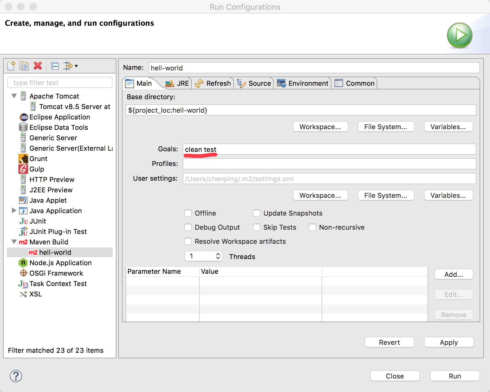
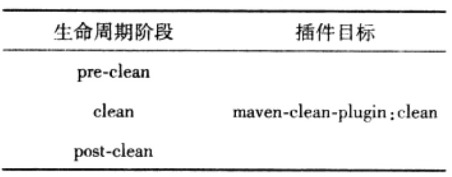
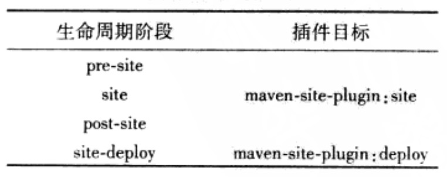
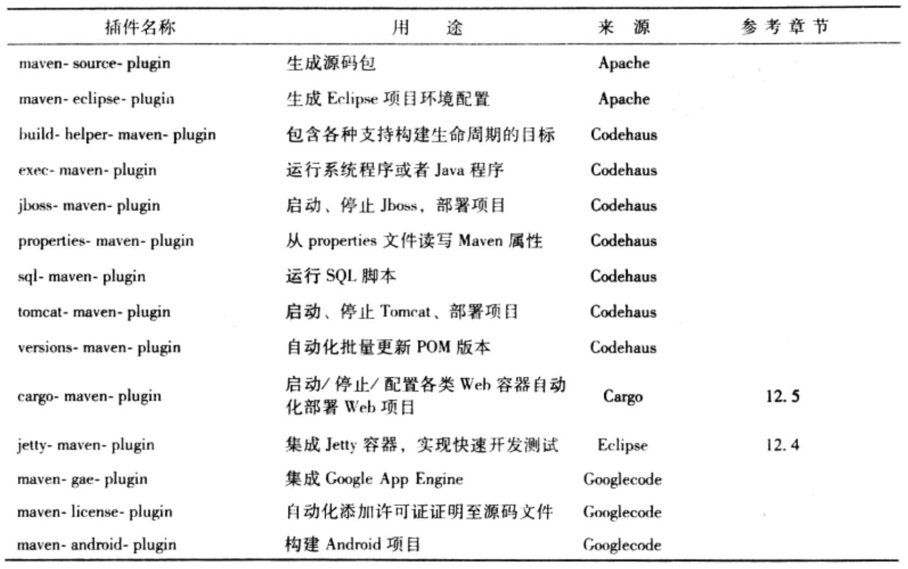
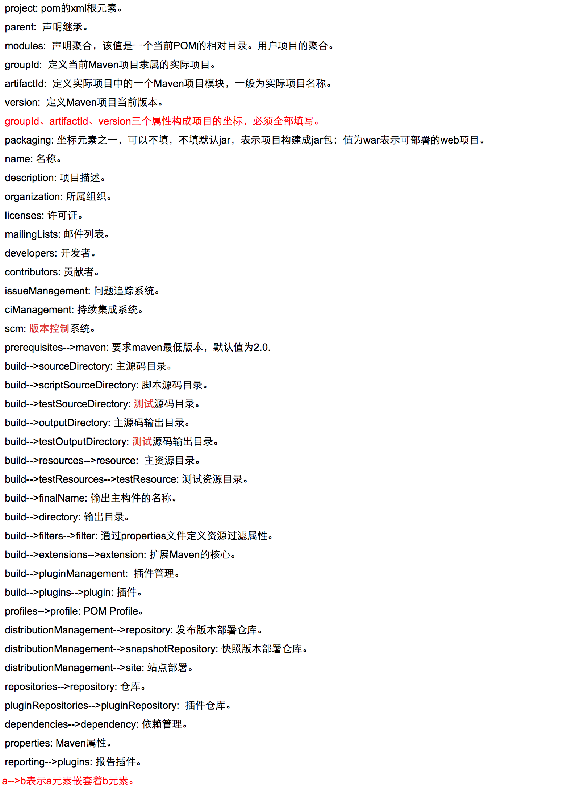

# 1、Maven介绍
> * Maven项目对象模型(POM)，可以通过一小段描述信息来管理项目的构建，报告和文档的软件项目管理工具。
> * Maven 除了以程序构建能力为特色之外，还提供高级项目管理工具。由于 Maven 的缺省构建规则有较高的可重用性，所以常常用两三行 Maven 构建脚本就可以构建简单的项目。由于 Maven 的面向项目的方法，许多 Apache Jakarta 项目发文时使用 Maven，而且公司项目采用 Maven 的比例在持续增长。

# 2、Maven安装(基于Mac系统)

## 2.1 下载压缩包
> * [官网](http://maven.apache.org/ "官网")

## 2.2 配置环境变量
> 推荐：在安装目录旁平行的创建一个符号链接
> * 1.创建符号链接，如使用以下命令：ln -s apache-maven-3.0 apache-maven;
> * 2.配置环境变量：M2_HOME，并指向apache-maven，这样可以方便以后更新Maven软件;

## 2.3 升级Maven
> * 1.删除原来的符号链接
> * 2.创建指向新的Maven安装包的符号链接

## 2.4 Maven目录分析
> * 1.在安装目录下的conf中有setting.xml文件。一般情况下我们会将该文件复制到 ~/.m2/目录中(〜 表示当前用户目录)，然后修改该文件，在用户范围定制Maven的行为。
> * 2.~/.m2目录下的repository文件夹中放置了Maven本地仓库，所有的Maven都被存储在该仓库中。

## 2.5 设置http代理
> * 如果需要通过代理访问Maven服务器，则可以在~/.m2中的setting.xml中的<proxies>节点中进行修改。

## 2.6 安装m2eclipse
> * 1.在eclipse中安装m2eclipse插件，location: http://m2eclipse.sonatype.org/site3/m2e
> * 2.最新版的eclipse已经集成了m2eclipse插件
> * 3.除了核心组件外，m2eclipse还提供了一些额外组件，主要是为了和其他工具进行集成，location : http:m2eclipse.sonatype.org/sites/m2e-extras

## 2.7 Maven安装最佳实践
> * 1.设置MAVEN_OPTS环境变量，修改Java默认的最大可用内存。通常MAVEN_OPTS的值为：-Xms128m -Xmx512m。
> * 2.配置用户范围setting.xml，可以避免影响系统中的其他用户，并且方便Maven升级。
> * 3.不要使用IDE内嵌的Maven,修改eclipse中内嵌的Maven.

# 3、Maven使用入门
## 3.1 编写POM(Project Object Model)
> * 在pom文件中，由groupId、artifactId和version定义一个项目的基本坐标。

## 3.2 编写代码
> * 默认src/main/java为项目的主目录(Maven约定)，默认的src/test/java目录为测试代码目录；默认的Maven构建输出都在target/目录中，默认在项目的根目录下放置pom.xml。

## 3.3 使用archetype生成项目骨架
> * 使用mvn archetype:generate创建项目骨干;输入该命令后会输出很多的archetype供选择，默认使用maven-archetype-quickstart的archetype,接着maven会提示输入要创建项目的groupId、artifactId、version以及包名package；然后就会自动生成Maven项目结构。

## 3.4 m2eclipse简单使用
> * 1.使用很简单，导入及创建项目的时候只要选择Maven Project就行。
> * 2.如果想运行类似mvn clean test命令，而m2eclipse中没有相应的操作，所以可以在pom.xml文件上Run As->Run Configurations，在Goals中配置clean test即可，如下图：

# 4、Maven坐标和依赖
## 4.1 Maven坐标
> * 1.Maven的坐标元素包括：groupId(必须)、artifactId(必须)、version(必须)、package(可选)、classifier(不能直接定义).
> * 2.Maven中央仓库地址：http://repo1.maven.org/maven2
> * 3.Maven中央仓库镜像地址：http://maven.net.cn/content/groups/public

## 4.2 依赖范围
> * <scope>定义依赖范围，用来控制依赖与classpath(编译classpath，测试classpath，运行classpath)的关系。具体取值：compile,test,provided,runtime,system,import。如下图：

## 4.3 依赖性传递
> * 依赖范围不仅可以控制依赖与三种classpath关系，还对传递性依赖产生影响。第一直接依赖(最左边)的范围和第二直接依赖(第上面)的范围决定了依赖的范围。
>   

## 4.4 依赖调解原则
> * 第一原则：路径最近者优先。
> * 第二原则：第一声明者优先。

## 4.5 最佳实践
> * 1.排除依赖：对于不想使用的依赖版本可以通过配置<exclusions>进行排除，然后再依赖需要使用的版本。
> * 2.归类依赖：统一依赖的版本等，可以在pom文件中定义<properties>规定依赖的版本等，然后在使用的地方通过${}取值即可。
> * 3.优化依赖：
    * 查看项目已解析依赖：mvn dependency:list
    * 查看项目依赖树：mvn dependency:tree
    * 查看依赖分析：mvn dependency:analyze

# 5、仓库(本地仓库和远程仓库)
## 5.1 仓库分类


## 5.2 修改本地仓库的存储地址：
> * 修改~/.m2/setting.xml中的如下：
      <settings>
        <localRepository>"repositorypath"</localRepository>
      </settings>

## 5.3 远程仓库配置、认证配置及发布配置
> * 1.远程仓库配置在pom.xml中进行配置
> * 2.远程仓库(私服)在settings.xml中配置
> * 3.发布配置在pom.xml中的distributionManagement中配置

## 5.4 仓库搜索服务
> * 1.Sonatype Nexus : https://repository.sonatype.org
> * 2.Jarvana : http://www.jarvana.com/jarvana
> * 3.MVNbrowser : http://www.mvnbrowser.com
> * 4.MVNrepository : http://mvnrepository.com

# 6、生命周期和插件
## 6.1 Maven拥有三套相互独立的生命周期
> * 1.clean：清理项目，与插件目标的绑定关系：
>   
> * 2.default：构建项目，与插件目标的绑定关系：
>   
> * 3.site：建立项目站点，与插件目标的绑定关系：
>   

## 6.2 自定义绑定
> * 在pom.xml的<plugins>中配置

## 6.3 插件配置
> * 1.命令行插件配置：在Maven命令中可以使用-D参数，并伴随一个参数键=参数值的形式，来配置插件目标的参数。
> * 2.POM中插件全局配置
> * 3.POM中插件任务配置

## 6.4 获取插件
> * 1.官方插件列表：http://maven.apache.org/plugins/index.html
> * 2.官方插件下载：http://repo1.maven.org/maven2/org/apache/maven/plugins
> * 3.常用插件：
>   
>   

## 6.5 使用maven-help-plugin描述插件
> * mvn help:describe-Dplugin=groupId:artifactId:version

# 7、聚合(多模块)和继承
## 7.1 聚合
> * 1.对于聚合模块来说，其打包方式packaging必须为pom，否则无法构建。
> * 2.聚合配置，在pom中:
        <modules>
          <module>...(相对目录名)</module>
          <module>...(相对目录名)</module>
        </modules>

## 7.2 继承
> * 1.定义一个父模块，将所有模块中相同的配置放在一块。
> * 2.在需要继承父模块配置的pom中配置:
      <parent>
        <groupId>...</groupId>
        <artifactId>...</artifactId>
        <version>...</version>
        <!-- 默认值：../pom.xml -->
        <relativePath>父模块pom相对路径</relativePath>
      </parent>
      // 如果子模块需要使用和父模块不一样的groupId或者version的情况，那么用户完全可以在子模块中显式声明。
> * 3.依赖继承(推荐)
    * 在父pom文件的dependencyManagement节点配置全部的项目依赖
    * 在子pom中只需要声明依赖的groupId和artifactId即可。

> * 4.可继承的pom元素
>   
>   

## 7.3 裁剪反应堆
> * Maven提供很多的命令行选项支持裁剪反应堆，输入mvn -h可以看到这些选项：
>   

# 8、使用Nexus创建私服
## 8.1 下载压缩包
> * [官网]("http://www.sonatype.org/nexus/" "下载")，选择DOWNLOAD->NEXUS OSS,有2.x版本和3.x版本.

## 8.2 仓库
> * 1.分类
>   * group(仓库组)
>   * hosted(宿主)
>   * proxy(代理)
>   * virtual(虚拟,maven1)
>     ​    

> * 2.仓库的策略分为：发布版本仓库和快照版本仓库

## 8.3 配置Maven从Nexus下载构件
> * 1.在当前项目的pom文件中配置
      <project>
        ...
        <repositories>
          <repository>
            <id>...</id>
            <name>...</name>
            <url>私服他库地址</url>
            <releases><enabled>true</releases></enabled>
            <snapshots><enabled>true</snapshots></enabled>
          </repository>
        </repositories>
        <pluginRepositories>
          <pluginRepository>
            <id>...</id>
            <name>...</name>
            <url>私服他库地址</url>
            <releases><enabled>true</releases></enabled>
            <snapshots><enabled>true</snapshots></enabled>
          </pluginRepository>
        </pluginRepositories>
      </project>
> * 2.在〜／.m2中的settings.xml中配置(配置所有maven项目)
      <settings>
        ...
        <profiles>
          <profile>
            <id>nexus</id>
            <repositories>
              <repository>
                <id>...</id>
                <name>...</name>
                <url>私服他库地址</url>
                <releases><enabled>true</releases></enabled>
                <snapshots><enabled>true</snapshots></enabled>
              </repository>
            </repositories>
            <pluginRepositories>
              <pluginRepository>
                <id>...</id>
                <name>...</name>
                <url>私服他库地址</url>
                <releases><enabled>true</releases></enabled>
                <snapshots><enabled>true</snapshots></enabled>
              </pluginRepository>
            </pluginRepositories>
          </profile>
        </profiles>
        <activeProfiles>
          <activeProfile>nexus</activeProfile>
        </activeProfiles>
      </settings>
> * 3.配置所有的Maven下载请求都从Nexus下载，以全面发挥私服的作用。仓库及插件仓库的的id都是central，覆盖了超级pom中央仓库的配置。
      <settings>
        ...
        <mirrors>
          <mirror>
            <id>...</id>
            <!-- 匹配任何仓库的镜像 -->
            <mirrorOf>* </mirorOf>
            <url>私服他库地址</url>
          </mirror>
        </mirrors>
        <profiles>
          <profile>
            <id>nexus</id>
            <repositories>
              <repository>
                <id>central</id>
                <name>...</name>
                <url>私服他库地址</url>
                <releases><enabled>true</releases></enabled>
                <snapshots><enabled>true</snapshots></enabled>
              </repository>
            </repositories>
            <pluginRepositories>
              <pluginRepository>
                <id>central</id>
                <name>...</name>
                <url>私服他库地址</url>
                <releases><enabled>true</releases></enabled>
                <snapshots><enabled>true</snapshots></enabled>
              </pluginRepository>
            </pluginRepositories>
          </profile>
        </profiles>
        <activeProfiles>
          <activeProfile>nexus</activeProfile>
        </activeProfiles>
      </settings>

## 8.4 部署构件至Nexus

> - 1.日常开发生成的快照版本构本可以直接部署到Nexus中策略为Snapshot的宿主仓库中，项目正式发布的构件则应该部署到Nexus中策略为Release的宿主仓库中。

```
  <project>
    ...
    <distributionManagement>
      <repository>
        <id>nexus-releases</id>
        <name>Nexus Release Repository</name>
        <url>http://localhost:8081/nexus/content/repositories/releases/</url>
      </repository>
      <snapshotRepository>
        <id>nexus-snapshots</id>
        <name>Nexus Snapshot Repository</name>
        <url>http://localhost:8081/nexus/content/repositories/snapshots/</url>
      </snapshotRepository>
    </distributionManagement>
    ...
  </project>
```

> - 2.Nexus的仓库对于匿名用户是只读的，为了能够部署构件，还需要在settings.xml中配置认证信息：

```
  <settings>
    ...
    <servers>
      <server>
        <id>nexus-releases</id>
        <username>admin</username>
        <password>******</password>
      </server>
      <server>
        <id>nexus-snapshots</id>
        <username>admin</username>
        <password>******</password>
      </server>
    </servers>
    ...
  </settings>
```

> - 3.手动部署第三方构件至Nexus：首先选择一个宿主仓库如3rd party，然后在页面的下方选择Artifact Upload选择卡。如果该构件是通过Maven构建的，那么就选择From POM，否则就选GAV Parameters。

##  8.5 Nexus权限管理

> * 1.Nexus的三个预定义账户：
>   * admin：拥有对Nexus服务的完全控制，默认密码：admin123.
>   * deployment：能够访问Nexus，浏览仓库内容，搜索，并且上传部署构件，但是无法对Nexus进行任何配置，默认密码：deployment123.
>   * anonymous：对应所有未登录的匿名用户，可以浏览仓库并进行搜索。

> * 2.添加用户：选择Users的tab，然后add -> Nexus User
> * 3.为项目分配独立的仓库：创建发布和快照版本的宿主仓库->创建基于仓库的增、删、改、查权限->为仓库建立权限->创建一个包含建立的权限的角色->将角色分配给需要的用户。

# 9､版本管理

> * 版本管理：指项目整体版本的演变过程管理，如从1.0->1.2->2.0...。
> * 版本控制：指借助版本控制工具(如：svn)追踪代码的每一个变更。

## 9.1 Maven的版本号定义约定

> * 约定：<主版本>.<次版本>.<增量版本>-<里程碑版本>，例：1.3.8-beta-2
> * 主版本：项目的重大架构调整。
> * 次版本：较大范围的功能增加和变化。
> * 增量版本：一般表示重大的Bug修复。
> * 里程碑版本：指某一个版本的里程碑。

## 9.2 主干(trunk)、标签(tag)与分支(branch)

> * 主干：项目开发代码的主体，是从项目开始直到当前都处于活动的状态。
> * 分支：从主干的某个点分离出来的代码拷贝，通常可以在不影响主干的前提下进行重大Bug的修复，或者做一些实验性质的开发。如果分支达到了预期的目的，通常发生在这里的变更会被合并(merge)到主干中。
> * 标签：用来标识主干或者分支的某个点的状态，以代表项目的某个稳定状态，这通常就是版本发布时的状态。


# 附录A：pom.xml



# 附录B：settings.xml


# 附录C：Maven内置属性


