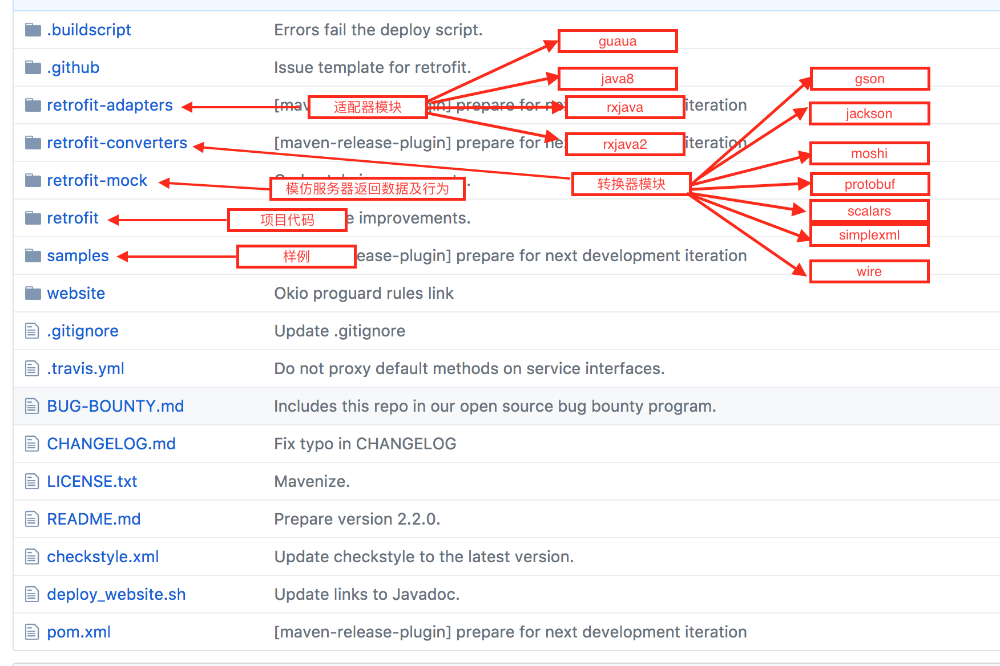

## 基本介绍

### [官网](http://square.github.io/retrofit/)及[Github](https://github.com/square/retrofit)：

Retrofit是一个Android和Java上的类型安全的HTTP客户端(`其实Retrofit只是一个基于OkHttp的网络请求框架，真正进行网络操作的是OkHttp`)。

基本使用可以看[官网](http://square.github.io/retrofit/)就可以。

### 项目说明及如何使用：

```java
compile 'com.squareup.retrofit2:retrofit:2.2.0' // retrofit
compile 'io.reactivex.rxjava2:rxjava:2.0.7'  // rxjava
compile 'io.reactivex.rxjava2:rxandroid:2.0.1' // rxandroid
compile 'com.squareup.retrofit2:converter-gson:2.2.0' // converter
compile 'com.squareup.retrofit2:adapter-rxjava2:2.2.0' // adapter
compile 'com.squareup.okhttp3:logging-interceptor:3.6.0' // loginterceptor
```



## Retrofit注解：

### Http请求方法：

|   名称    |       说明       |
| :-----: | :------------: |
|   GET   |     GET请求      |
|  POST   |     POST请求     |
|   PUT   |     PUT请求      |
| DELETE  |    DELETE请求    |
|  PATCH  |    PATCH请求     |
|  HEAD   |     HEAD请求     |
| OPTIONS |   OPTIONS请求    |
|  HTTP   | 自定义请求，也可以是以上请求 |

### 标记类：

|       名称       |                    说明                    |
| :------------: | :--------------------------------------: |
| FormUrlEncoded | 表示请求体使用 `form URL encoding`， Fields应该被声明为参数，并且用  [`@Field`](http://square.github.io/retrofit/2.x/retrofit/retrofit2/http/Field.html)注解修饰。使用这个注解的请求将被当做 `application/x-www-form-urlencoded` MIME类型。根据  [RFC-3986](http://tools.ietf.org/html/rfc3986)，在 URI-encoded之前字段名和字段值将被UTF-8编码。 |
|   Multipart    | 表示请求体是 multi-part， Parts应该当做参数声明，并且使用  [`@Part`](http://square.github.io/retrofit/2.x/retrofit/retrofit2/http/Part.html)注解修饰。(Content-Type:multipart/form-data) |
|   Streaming    | 表示响应体的返回数据将会用流的形式返回。(如果没有使用该注解，默认会把数据全部载入内存) |

### 参数类：

|    名称     |                    说明                    |
| :-------: | :--------------------------------------: |
|  Header   | 替换Header相应的目标为指定的值。传递列表或者数组将导致多个同名header且值为列表或者数组中的每一个非空数据。 |
| HeaderMap |            在指定的Map中添加Headers             |
|  Headers  | 在方法上使用，会逐条的添加提供的 headers。**注意： Headers不会重写，相同名字的header将会被包含在请求中。** |
|   Body    | 当你想直接控制一个POST/PUT请求的请求体的时候，使用这个注解在接口方法上(替代被当做请求参数或者表格样式的请求体)。这个对象将会使用Retrofit的Converter实例序列化同时结果将会直接被设置成请求体。不能为空。 |
|   Field   | 用于表单编码请求的命名对。值使用[`String.valueOf(Object)`](http://docs.oracle.com/javase/7/docs/api/java/lang/String.html?is-external=true#valueOf-java.lang.Object-)被转成字符串 ，然后用表单url编码。null值将会被忽略。如果传List或数组将导致多个字段且值为所有List或数组中的非空值。查看**说明1**. |
| FieldMap  |             用于表单编码请求的命名键/值对。             |
|   Part    |       表示一个 `multi-part` 请示的一个part。       |
|  PartMap  |   如果一个参数使用这个注解修饰，将会有以下三种方式处理:**说明2**:    |
|   Path    | URL段中的占位符。值将会通过  [`String.valueOf(Object)`](http://docs.oracle.com/javase/7/docs/api/java/lang/String.html?is-external=true#valueOf-java.lang.Object-) 转成字符串并且 URL编码。**说明3:** |
|   Query   | Query参数将会被添加到URL之后。值使用[`String.valueOf(Object)`](http://docs.oracle.com/javase/7/docs/api/java/lang/String.html?is-external=true#valueOf-java.lang.Object-)被转成字符串 ，然后用表单url编码。null值将会被忽略。如果传List或数组将导致多个字段且值为所有List或数组中的非空值。**说明4:** |
| QueryMap  |    Query参数的所有键和值都会被添加到URL的后面。**说明5:**    |
| QueryName |        用来修饰没有值的请求参数，将会被添加到URL的后面。        |
|    Url    | 设置URL，和  [base URL](http://square.github.io/retrofit/2.x/retrofit/retrofit2/Retrofit.html#baseUrl--)相对立。**baseUrl说明：** |

* **说明1**:

```java
@FormUrlEncoded
@POST("/list")
Call<ResponseBody> example(@Field("name") String... names);
```

​	调用`foo.example("Bob Smith", "Jane Doe")` 会产生一个请求体：name=Bob+Smith&name=Jane+Doe。


* **说明2**:

  * 如果是`MultipartBody.Part`类型将会直接使用内容，并省去注解名(例：`@Part MultipartBody.Part part`)。
  * 如果类型是`RequestBody`参数的值将会和它的内容类型直接被拿来使用。提供part名在注解中(`@Part("foo") RequestBody foo`)。
  * 其他的对象类型将会使用 [converter](http://square.github.io/retrofit/2.x/retrofit/retrofit2/Converter.html)转成合适的形式。提供part名在注解中(`@Part("foo") Image photo`)。

  如果值为空，则在请求体中省略相应的参数。

```java
@Multipart
@POST("/")
Call<ResponseBody> example(
    @Part("description") String description,
    @Part(value = "image", encoding = "8-bit") RequestBody image);
```


* **说明3:**

```java
@GET("/image/{id}")
Call<ResponseBody> example(@Path("id") int id);

// 调用foo.example(1)产生yields /image/1。
// 值默认URL编码。不使用URL编码则设置encoded=true。

@GET("/user/{name}")
Call<ResponseBody> encoded(@Path("name") String name);
@GET("/user/{name}")
Call<ResponseBody> notEncoded(@Path(value="name", encoded=true) String name);

// 调用foo.encoded("John+Doe")产生/user/John%2BDoe
// 反之，调用foo.notEncoded("John+Doe")产生/user/John+Doe。

// Path参数不能为null。
```


* **说明4:**

```java
@GET("/list")
Call<ResponseBody> list(@Query("page") int page);
 
// 调用foo.list(1) 产生 /list?page=1

@GET("/list")
Call<ResponseBody> list(@Query("category") String category);
 
// 调用foo.list(null) 产生 /list.

@GET("/list")
Call<ResponseBody> list(@Query("category") String... categories);
 
// 调用foo.list("bar", "baz") 产生 /list?category=bar&category=baz
Calling with foo.list("bar", "baz") yields /list?category=bar&category=baz.

@GET("/search")
Call<ResponseBody> list(@Query(value="foo", encoded=true) String foo);
 
// foo.list("foo+bar")) 产生 /search?foo=foo+bar.
```


* **说明5:**

```java
@GET("/search")
Call<ResponseBody> list(@QueryMap Map<String, String> filters);

// foo.list(ImmutableMap.of("foo", "bar", "kit", "kat")) 产生 /search?foo=bar&kit=kat.

@GET("/search")
Call<ResponseBody> list(@QueryMap(encoded=true) Map<String, String> filters);
 
// foo.list(ImmutableMap.of("foo", "foo+bar")) 产生 /search?foo=foo+bar.
// Map中的键或者值都不能为空
```


* **baseUrl说明：**

```java
// 指定的端点的值(例：@GET中设置的值)和通过HttpUrl.resolve(String)得来的baseUrl的值对立。baseUrl的值和网站当前URL的<a href="">链接相似。

// Base URLs 应该总是以 /结尾。

// 以 ／ 结尾保证端点的值是以相对的路径正确的添加到baseUrl的后面。
// 推荐这种写法
// 正确:
Base URL: http://example.com/api/
Endpoint: foo/bar/
Result: http://example.com/api/foo/bar/

// 错误:
Base URL: http://example.com/api
Endpoint: foo/bar/
Result: http://example.com/foo/bar/

// 端点的值如果以/开头，则是绝对路径
// 绝对路径只保留baseUrl中的主机路径，而忽视任何指定的子路径。

Base URL: http://example.com/api/
Endpoint: /foo/bar/
Result: http://example.com/foo/bar/

Base URL: http://example.com/
Endpoint: /foo/bar/
Result: http://example.com/foo/bar/

Endpoint values may be a full URL.
// 端点的值也可以是一个全路径的URL
// 如果端点的值有一个主机地址则替换baseUrl的主机地址；如果端点的值包含scheme则替换baseUrl的scheme。

Base URL: http://example.com/
Endpoint: https://github.com/square/retrofit/
Result: https://github.com/square/retrofit/

Base URL: http://example.com
Endpoint: //github.com/square/retrofit/
Result: http://github.com/square/retrofit/ (note the scheme stays 'http')
```


## Converter解析:

### Converter源码：

```java
// 转变HTTP中所描述的对象to 和 from。通过一个工作来创建实例，然后把它配置到Retrofit实例中。
public interface Converter<F, T> {
  T convert(F value) throws IOException;

  // 创建Converter实例，需要一个类型和一个使用的目标。
  abstract class Factory {
    
    // 返回一个Converter用来转变ResponseBody到某一个类型，如果不能处理则返回null。这个方法被用来创建converters为了返回类型，例如：Call<SimpleResponse>声明中的SimpleResponse。
    public Converter<ResponseBody, ?> responseBodyConverter(Type type, Annotation[] annotations,
        Retrofit retrofit) {
      return null;
    }

    // 返回一个Converter用来转变某一个类型到RequestBody，如果不能处理则返回null。这个方法创建的converters用来获取@Body, @Part, 和 @PartMap所指定的类型的值。
    public Converter<?, RequestBody> requestBodyConverter(Type type,
        Annotation[] parameterAnnotations, Annotation[] methodAnnotations, Retrofit retrofit) {
      return null;
    }

    // 返回一个Converter用来转变某一个类型到String，如果不能处理则返回null。这个方法创建的converters用来获取由 @Field, @FieldMap 的值, @Header, @HeaderMap, @Path, @Query, 和 @QueryMap 所指定的值。
    public Converter<?, String> stringConverter(Type type, Annotation[] annotations,
        Retrofit retrofit) {
      return null;
    }
  }
}

```

### 自定义Converter：

* 以`GsonConverterFactory`为例说明：
* **GsonConverterFactory.java**

```java
// 一个converter，使用Gson来处理JSON数据
// 因为Gson支持的类型非常灵活，所以这个converter假设可以处理所有的精英。如果你还混合使用了Converter(比如：protocol buffers)，那么你最好添加这个converter在最后，以给其他的converters一个机会可以看到他们的类型。
public final class GsonConverterFactory extends Converter.Factory {
 
  // 使用一个默认的Gson实例创建一个conversion实例。转成JSON或者从JSON转变(如果header没有指定编码)都使用UTDF-8编码。
  public static GsonConverterFactory create() {
    return create(new Gson());
  }

  // 使用一个传入的Gson实例创建一个conversion实例。转成JSON或者从JSON转变(如果header没有指定编码)都使用UTDF-8编码。
  public static GsonConverterFactory create(Gson gson) {
    return new GsonConverterFactory(gson);
  }

  // 定义一个gson实例
  private final Gson gson;

  // 构造方法，通过传入的GSON对象
  private GsonConverterFactory(Gson gson) {
    if (gson == null) throw new NullPointerException("gson == null");
    this.gson = gson;
  }

  // 将服务器返回的JSON数据转变成JavaBean，具体的转变过程在GsonResponseBodyConverter中。
  @Override
  public Converter<ResponseBody, ?> responseBodyConverter(Type type, Annotation[] annotations,
      Retrofit retrofit) {
    TypeAdapter<?> adapter = gson.getAdapter(TypeToken.get(type));
    return new GsonResponseBodyConverter<>(gson, adapter);
  }

  // 将请求参数转变成JSON串发，具体的转变过程在GsonRequestBodyConverter中。
  @Override
  public Converter<?, RequestBody> requestBodyConverter(Type type,
      Annotation[] parameterAnnotations, Annotation[] methodAnnotations, Retrofit retrofit) {
    TypeAdapter<?> adapter = gson.getAdapter(TypeToken.get(type));
    return new GsonRequestBodyConverter<>(gson, adapter);
  }
}
```

* **GsonRequestBodyConverter.java**

```java
final class GsonRequestBodyConverter<T> implements Converter<T, RequestBody> {
  private static final MediaType MEDIA_TYPE = MediaType.parse("application/json; charset=UTF-8");
  private static final Charset UTF_8 = Charset.forName("UTF-8");

  private final Gson gson;
  private final TypeAdapter<T> adapter;

  GsonRequestBodyConverter(Gson gson, TypeAdapter<T> adapter) {
    this.gson = gson;
    this.adapter = adapter;
  }

  // 通过GSON将对象值value写到buffer中，然后生成使用buffer中的数据RequestBody
  @Override public RequestBody convert(T value) throws IOException {
    Buffer buffer = new Buffer();
    Writer writer = new OutputStreamWriter(buffer.outputStream(), UTF_8);
    JsonWriter jsonWriter = gson.newJsonWriter(writer);
    adapter.write(jsonWriter, value);
    jsonWriter.close();
    // 生成RequestBody
    return RequestBody.create(MEDIA_TYPE, buffer.readByteString());
  }
}
```

* **GsonResponseBodyConverter.java**

```java
final class GsonResponseBodyConverter<T> implements Converter<ResponseBody, T> {
  private final Gson gson;
  private final TypeAdapter<T> adapter;

  GsonResponseBodyConverter(Gson gson, TypeAdapter<T> adapter) {
    this.gson = gson;
    this.adapter = adapter;
  }

  // 将ResponseBody的数据转变成实体类
  @Override public T convert(ResponseBody value) throws IOException {
  	JsonReader jsonReader = gson.newJsonReader(value.charStream());
    try {
      // 通过GSON解析出具体的实体类
      return adapter.read(jsonReader);
    } finally {
      value.close();
    }
  }
}
```


## CallAdapter解析：

### CallAdapter源码：

```java
// 适配一个Call将返回的类型R转成类型T。对过一个工厂创建实例，在创建Retrofit的时候来配置。
public interface CallAdapter<R, T> {
  
  // 返回这个适配器从HTTP返回数据所转换的Java对象。例如：Call<Repo>的返回类型是Repo。这个类型用来准备传递给适配器的Call
  // 注意：很明显这和适配器调用者的工厂所提供的返回类型不一样
  Type responseType();

 // 返回一个T的实例，它是一个Call的代理
 // 例如：一个假设的功能，Async，这个实例将会在运行的时候调用call方法然后返回一个Async<R>
 /**
     @Override
     public <R> Async<R> adapt(final Call<R> call) {
       return Async.create(new Callable<Response<R>>() {
         @Override
         public Response<R> call() throws Exception {
           return call.execute();
         }
       });
     }
  */
  T adapt(Call<R> call);

  // 基于一个服务接口方法创建一个CallAdapter实例
  abstract class Factory {
    
    // 返回一个服务接口方法返回returnType的调用适配器，如果不能处理则返回null
    public abstract CallAdapter<?, ?> get(Type returnType, Annotation[] annotations,
        Retrofit retrofit);
    
	// 获取在index的类型的泛型参数的上限
    // 例如：Map<String, ? extends Runnable>的在index为1返回Runnable
    protected static Type getParameterUpperBound(int index, ParameterizedType type) {
      return Utils.getParameterUpperBound(index, type);
    }

    // 获取参数的原来的类型
    // 例如：List<? extends Runnable>返回List.class
    protected static Class<?> getRawType(Type type) {
      return Utils.getRawType(type);
    }
  }
}
```


### 自定义CallAdapter：

* 以`RxJavaCallAdapter`为例说明：
* **RxJavaCallAdapter.java**

```java
final class RxJavaCallAdapter<R> implements CallAdapter<R, Object> {
  private final Type responseType;
  private final Scheduler scheduler;
  private final boolean isAsync;
  private final boolean isResult;
  private final boolean isBody;
  private final boolean isSingle;
  private final boolean isCompletable;
	
  // 根据RxJava的相关属性创建一个RxJavaCallAdapter
  RxJavaCallAdapter(Type responseType, Scheduler scheduler, boolean isAsync, boolean isResult,
      boolean isBody, boolean isSingle, boolean isCompletable) {
    this.responseType = responseType;
    this.scheduler = scheduler;
    this.isAsync = isAsync;
    this.isResult = isResult;
    this.isBody = isBody;
    this.isSingle = isSingle;
    this.isCompletable = isCompletable;
  }

  @Override public Type responseType() {
    return responseType;
  }

  @Override public Object adapt(Call<R> call) {
    OnSubscribe<Response<R>> callFunc = isAsync
        ? new CallEnqueueOnSubscribe<>(call)
        : new CallExecuteOnSubscribe<>(call);

    OnSubscribe<?> func;
    if (isResult) {
      func = new ResultOnSubscribe<>(callFunc);
    } else if (isBody) {
      func = new BodyOnSubscribe<>(callFunc);
    } else {
      func = callFunc;
    }
    Observable<?> observable = Observable.create(func);

    if (scheduler != null) {
      observable = observable.subscribeOn(scheduler);
    }

    if (isSingle) {
      return observable.toSingle();
    }
    if (isCompletable) {
      return CompletableHelper.toCompletable(observable);
    }
    return observable;
  }
  
  // 分离这个静态类提供一个类加载和字节码验证即使Completable不是RxJava的稳定API。
  private static final class CompletableHelper {
    static Object toCompletable(Observable<?> observable) {
      return observable.toCompletable();
    }
  }
}
```

* **RxJavaCallAdapterFactory.java**

```java
/**
一个用RxJava创建observables的调用适配器
添加这个调用适配器到Retrofit中，允许从服务接口方法返回Observable、Single或Completable
interface MyService {
 @GET("user/me")
 Observable<User> getUser()
}
对于Observable和Single类型的参数有三种配置
1.直接body(例：Observable<User>)调用onNext和反序列化的body，并且返回2XX的返回数据；调用onError和HttpException对于非2XX的返回数据，网络错误会抛出IOException。
2.用Response包装的body(Observable<Response<User>>)调用onNext和一个表示HTTP返回数据的Response对象;调用onError和IOException在网络错误的时候。
3.用Result包装的body(Observable<Result<User>>)调用onNext和一个表示所有HTTP返回数据和错误信息的Result对象。
注意：Single和Completable的支持是实验性的，向后兼容可能会影响,RxJava认为它们是不稳定的。
*/
public final class RxJavaCallAdapterFactory extends CallAdapter.Factory {
  
  // 返回默认的一个实例，它可以创建一个不会在任何scheduler上操作的同步的observables
  public static RxJavaCallAdapterFactory create() {
    return new RxJavaCallAdapterFactory(null, false);
  }

  // 返回一个可以创建异步observables的实例。这个工厂创建的适用在Observable.subscribeOn对流类型没有影响。
  public static RxJavaCallAdapterFactory createAsync() {
    return new RxJavaCallAdapterFactory(null, true);
  }

  // 创建一个同步的observables，它默认订阅在scheduler上
  public static RxJavaCallAdapterFactory createWithScheduler(Scheduler scheduler) {
    if (scheduler == null) throw new NullPointerException("scheduler == null");
    return new RxJavaCallAdapterFactory(scheduler, false);
  }

  private final Scheduler scheduler;
  private final boolean isAsync;

  private RxJavaCallAdapterFactory(Scheduler scheduler, boolean isAsync) {
    this.scheduler = scheduler;
    this.isAsync = isAsync;
  }

  @Override
  public CallAdapter<?, ?> get(Type returnType, Annotation[] annotations, Retrofit retrofit) {
    Class<?> rawType = getRawType(returnType);
    boolean isSingle = rawType == Single.class;
    boolean isCompletable = "rx.Completable".equals(rawType.getCanonicalName());
    if (rawType != Observable.class && !isSingle && !isCompletable) {
      return null;
    }

    if (isCompletable) {
      return new RxJavaCallAdapter(Void.class, scheduler, isAsync, false, true, false, true);
    }

    boolean isResult = false;
    boolean isBody = false;
    Type responseType;
    if (!(returnType instanceof ParameterizedType)) {
      String name = isSingle ? "Single" : "Observable";
      throw new IllegalStateException(name + " return type must be parameterized"
          + " as " + name + "<Foo> or " + name + "<? extends Foo>");
    }

    Type observableType = getParameterUpperBound(0, (ParameterizedType) returnType);
    Class<?> rawObservableType = getRawType(observableType);
    if (rawObservableType == Response.class) {
      if (!(observableType instanceof ParameterizedType)) {
        throw new IllegalStateException("Response must be parameterized"
            + " as Response<Foo> or Response<? extends Foo>");
      }
      responseType = getParameterUpperBound(0, (ParameterizedType) observableType);
    } else if (rawObservableType == Result.class) {
      if (!(observableType instanceof ParameterizedType)) {
        throw new IllegalStateException("Result must be parameterized"
            + " as Result<Foo> or Result<? extends Foo>");
      }
      responseType = getParameterUpperBound(0, (ParameterizedType) observableType);
      isResult = true;
    } else {
      responseType = observableType;
      isBody = true;
    }

    return new RxJavaCallAdapter(responseType, scheduler, isAsync, isResult, isBody, isSingle,
        false);
  }
}
```


## 整体流程分析：

### 代码定义：

```java
public class Test1 {
    public interface GitHubService {
      	// 步骤1：API接口方法定义
        @GET("users/{user}/repos")
        Observable<List<Repo>> listRepos(@Path("user") String user);
    }

    public static void main(String[] args){
      	// 步骤2:创建Retrofit
        Retrofit retrofit = new Retrofit.Builder()
                .baseUrl("https://api.github.com/")
                .addConverterFactory(GsonConverterFactory.create())
                .addCallAdapterFactory(RxJavaCallAdapterFactory.create())
                .build();
      	// 步骤3:创建GitHubService
        GitHubService reposService = retrofit.create(GitHubService.class);
      	// 步骤4:执行请求并接收返回结果
        reposService.listRepos("XXX")
                .observeOn(Schedulers.io())
                .subscribe(new Subscriber<List<Repo>>() {
                    @Override
                    public void onCompleted() {
                     	// 访问完成   
                    }

                    @Override
                    public void onError(Throwable e) {
                        // 访问出错
                    }

                    @Override
                    public void onNext(List<Repo> repos) {
                        // 返回数据
                    }
                });
    }
}
```

### API接口方法定义：

1. 给接口服务方法添加相应的方法注解和参数注解：这些注解会在ServiceMethod类中获取。

### 创建Retrofit：

1. Retrofit是在Retrofit的静态内部类Builder的build()方法中创建的。

````java
public Retrofit build() {
  	  // baseUrl不能为空
      if (baseUrl == null) {
        throw new IllegalStateException("Base URL required.");
      }
	  // 如果没有OkHttpClient，则直接生成一个.
  	  // 这里可以根据需求自定义OkHttpClient。
      okhttp3.Call.Factory callFactory = this.callFactory;
      if (callFactory == null) {
        callFactory = new OkHttpClient();
      }
	  // platform代表Java或者Android环境
      Executor callbackExecutor = this.callbackExecutor;
      if (callbackExecutor == null) {
        // Android环境返回主线程
        callbackExecutor = platform.defaultCallbackExecutor();
      }

      // 所有的适配器及默认的回调适配器，默认的回调适配器工厂类，并在执行的时候调用Callback接口的相关方法
      List<CallAdapter.Factory> adapterFactories = new ArrayList<>(this.adapterFactories);
      adapterFactories.add(platform.defaultCallAdapterFactory(callbackExecutor));

      // 所有的转换器
      List<Converter.Factory> converterFactories = new ArrayList<>(this.converterFactories);
	  // 返回Retrofit对象
      return new Retrofit(callFactory, baseUrl, converterFactories, adapterFactories,
          callbackExecutor, validateEagerly);
}
````


2. **Platfrom相关代码**：

```java
class Platform {
  	....
	// 面对不同的运行环境生成不同的具体类环境
	private static Platform findPlatform() {
      try {
        Class.forName("android.os.Build");
        if (Build.VERSION.SDK_INT != 0) {
          return new Android();
        }
      } catch (ClassNotFoundException ignored) {
      }
      try {
        Class.forName("java.util.Optional");
        return new Java8();
      } catch (ClassNotFoundException ignored) {
      }
      return new Platform();
    }
	....
    // 因为是Android环境，所以返回ExecutorCallAdapterFactory
  	CallAdapter.Factory defaultCallAdapterFactory(Executor callbackExecutor) {
      if (callbackExecutor != null) {
        return new ExecutorCallAdapterFactory(callbackExecutor);
      }
      return DefaultCallAdapterFactory.INSTANCE;
    }
  	....
    // Android环境
    static class Android extends Platform {
      @Override public Executor defaultCallbackExecutor() {
        return new MainThreadExecutor();
      }

      @Override CallAdapter.Factory defaultCallAdapterFactory(Executor callbackExecutor) {
        return new ExecutorCallAdapterFactory(callbackExecutor);
      }

      static class MainThreadExecutor implements Executor {
        private final Handler handler = new Handler(Looper.getMainLooper());

        @Override public void execute(Runnable r) {
          handler.post(r);
        }
      }
    }
}
```

3. **ExecutorCallAdapterFactory相关代码：**

```java
final class ExecutorCallAdapterFactory extends CallAdapter.Factory {
  final Executor callbackExecutor;

  ExecutorCallAdapterFactory(Executor callbackExecutor) {
    this.callbackExecutor = callbackExecutor;
  }

  // 返回CallAdapter
  @Override
  public CallAdapter<?, ?> get(Type returnType, Annotation[] annotations, Retrofit retrofit) {
    if (getRawType(returnType) != Call.class) {
      return null;
    }
    final Type responseType = Utils.getCallResponseType(returnType);
    return new CallAdapter<Object, Call<?>>() {
      @Override public Type responseType() {
        return responseType;
      }

      @Override public Call<Object> adapt(Call<Object> call) {
        return new ExecutorCallbackCall<>(callbackExecutor, call);
      }
    };
  }

  static final class ExecutorCallbackCall<T> implements Call<T> {
    final Executor callbackExecutor;
    final Call<T> delegate;

    ExecutorCallbackCall(Executor callbackExecutor, Call<T> delegate) {
      this.callbackExecutor = callbackExecutor;
      this.delegate = delegate;
    }

    @Override public void enqueue(final Callback<T> callback) {
      if (callback == null) throw new NullPointerException("callback == null");

      delegate.enqueue(new Callback<T>() {
        @Override public void onResponse(Call<T> call, final Response<T> response) {
          callbackExecutor.execute(new Runnable() {
            @Override public void run() {
              if (delegate.isCanceled()) {
                // Emulate OkHttp's behavior of throwing/delivering an IOException on cancellation.
                callback.onFailure(ExecutorCallbackCall.this, new IOException("Canceled"));
              } else {
                callback.onResponse(ExecutorCallbackCall.this, response);
              }
            }
          });
        }

        @Override public void onFailure(Call<T> call, final Throwable t) {
          callbackExecutor.execute(new Runnable() {
            @Override public void run() {
              callback.onFailure(ExecutorCallbackCall.this, t);
            }
          });
        }
      });
    }
}
```


### 创建GitHubService：

1. 调用Retrofit的create方法，并传入服务接口类的类型

```java
public <T> T create(final Class<T> service) {
  	// 校验服务接口，必须是接口，且不能实现其他接口
    Utils.validateServiceInterface(service);
  	// 这里将所有的服务接口中的方法缓存起来，并解析方法上的相关注解
    if (validateEagerly) {
      eagerlyValidateMethods(service);
    }
  	// 通过Java的动态代理生成service的一个代理类，并最终通过这个代理类调用相应的接口中方法
    return (T) Proxy.newProxyInstance(service.getClassLoader(), new Class<?>[] { service },
        new InvocationHandler() {
          private final Platform platform = Platform.get();

          @Override public Object invoke(Object proxy, Method method, Object[] args)
              throws Throwable {
            if (method.getDeclaringClass() == Object.class) {
              return method.invoke(this, args);
            }
            // Android的isDefaultMethod返回false
            if (platform.isDefaultMethod(method)) {
              return platform.invokeDefaultMethod(method, service, proxy, args);
            }
            // 从缓存中找到相关的方法
            ServiceMethod<Object, Object> serviceMethod =
                (ServiceMethod<Object, Object>) loadServiceMethod(method);
            // 用serviceMethod和参数生成OkHttpCall对象，在该对象中调用OkHttp做相应的网络请求
            OkHttpCall<Object> okHttpCall = new OkHttpCall<>(serviceMethod, args);
            // 调用相应的接口方法的callAdapter的adapt方法
            return serviceMethod.callAdapter.adapt(okHttpCall);
          }
        });
}
```

2. **调用RxJavaCallAdapter的adapt方法：**

```java
// 这里的call就是一个OkHttpCall，在其中做相应的网络操作，并对返回结果进行解析
@Override public Object adapt(Call<R> call) {
    OnSubscribe<Response<R>> callFunc = isAsync
        ? new CallEnqueueOnSubscribe<>(call)
        : new CallExecuteOnSubscribe<>(call);

    OnSubscribe<?> func;
    if (isResult) {
      func = new ResultOnSubscribe<>(callFunc);
    } else if (isBody) {
      func = new BodyOnSubscribe<>(callFunc);
    } else {
      func = callFunc;
    }
    Observable<?> observable = Observable.create(func);

    if (scheduler != null) {
      observable = observable.subscribeOn(scheduler);
    }

    if (isSingle) {
      return observable.toSingle();
    }
    if (isCompletable) {
      return CompletableHelper.toCompletable(observable);
    }
    return observable;
}
```

3. **ServiceMethod中保存了请求和返回的Converter类型**

### 执行请求并接收返回结果：

1. **调用动态代理类的相应方法：**

   **上面已经讲解**

## Retrofit独立封装：

不贴代码了，直接上[Github地址](https://github.com/qjbagugit/retrofit)。

## Retrofit和RxJava2封装：

==正在研究中，还没搞定==

## Retrofit和RxJava2封装：

==计划中==

# 参考：

1. [Retrofit](http://square.github.io/retrofit/)
2. [用 Retrofit 2 简化 HTTP 请求](https://realm.io/cn/news/droidcon-jake-wharton-simple-http-retrofit-2/)
3. [RxJava 与 Retrofit 结合的最佳实践](http://gank.io/post/56e80c2c677659311bed9841)
4. [深入浅出 Retrofit，这么牛逼的框架你们还不来看看？](http://bugly.qq.com/bbs/forum.php?mod=viewthread&tid=1117)
5. [你真的会用Retrofit2吗?Retrofit2完全教程](http://www.jianshu.com/p/308f3c54abdd)
6. [Handling API calls using Retrofit 2 and RxJava 2](https://medium.com/3xplore/handling-api-calls-using-retrofit-2-and-rxjava-2-1871c891b6ae#.icwgydntg)

