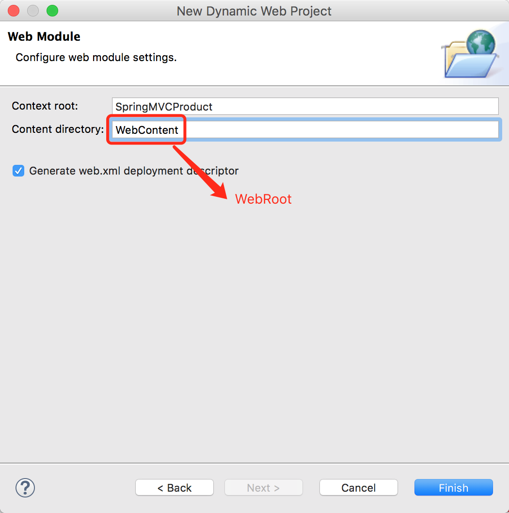

# 一、SpringMVC介绍

## 1.SpringMVC框架：


## 2.SpringMVC架构：

### 2.1  架构图：


### 2.2 架构说明：

* 1.用户发送请求至前端控制器`DispatchServlet`
* 2.`DispatchServlet`收到请求调用处理器映射器`HandlerMapping`
* 3.处理器映射器根据请求url找到具体的处理器，生成处理器对象及处理器拦截器(如果有则生成)一并返回给`DispatcherServlet`。
* 4.`DispatcherServlet`通过`HandlerAdapter`处理器适配器调用处理器
* 5.执行处理器(Controller，也叫后端控制器)
* 6.Controller执行完成返回`ModelAndView`
* 7.`HandlerAdapter`将controller执行结果`ModelAndView`返回给`DispatcherServlet`
* 8.`DispatcherServlet`将`ModelAndView`传给`ViewReslover`视图解析器
* 9.`ViewReslover`解析后返回具体View
* 10.`DispatcherServlet`对View进行渲染视图(即将模型数据填充至视图中)
* 11.`DispatcherServlet`响应用户

### 2.3 组件说明：

​	以下组件通常使用框架提供的实现：

* DispatcherServlet：前端控制器

  用户请求到达前端控制器，它就相当于mvc模式中的c，dispatcherServlet是整个流程控制的中心，由它调用其它组件处理用户的请求，dispatcherServlet的存在降低了组件之间的耦合性。

* HandlerMapping：处理器映射器

  HandlerMapping负责根据用户请求找到Handler即处理器，springmvc提供了不同的映射器实现不同的映射方式，例如：配置文件方式，实现接口方式，注解方式等。

* Handler：处理器

  Handler是继DispatcherServlet前端控制器的后端控制器，在DispatcherServlet的控制下Handler对具体的用户请求进行处理。

  **==由于Handler涉及到具体的用户业务请求，所以一般情况需要程序员根据业务需求开发Handler==**

* HandlAdapter：处理器适配器

  通过HandlerAdapter对处理器进行执行，这是适配器模式的应用，通过扩展适配器可以对更多类型的处理器进行执行

* View Resolver：视图解析器

  [View Resolver](undefined)负责将处理结果生成View视图，View Resolver首先根据逻辑视图名解析成物理视图名即具体的页面地址，再生成View视图对象，最后对View进行渲染将处理结果通过页面展示给用户。 springmvc框架提供了很多的View视图类型，包括：jstlView、freemarkerView、pdfView等

  **==一般情况下需要通过页面标签或页面模版技术将模型数据通过页面展示给用户，需要由程序员根据业务需求开发具体的页面==**

  ​


# 二、入门程序

## 1.项目介绍：

### 1.1 需求：==实现商品查询列表功能==

* [数据库表：](/downloads/code/SpringMVC学习笔记/sql.zip)


* [最终代码](/downloads/code/SpringMVC学习笔记/SpringMVCProduct.zip)

### 1.2 开发环境装备：Eclipse+tomcat

### 1.3 建立一个WEB项目

* 为了让在Eclipse中建立的项目能够在MyEclipse中也可以导入，做以下修改：

  

  ​

* 

### 1.4 导入相关jar包：

* 需要导入的包(项目最终所有的jar包)：

  


## 2.配置前端控制器

```xml
  <display-name>SpringMVCProduct</display-name>
  <!-- springmvc前端控制器 -->
  <servlet>
  	<servlet-name>springmvc</servlet-name>
  	<servlet-class>org.springframework.web.servlet.DispatcherServlet</servlet-class>
  	<!-- 
  	contextConfigLocation配置springmvc加载的配置文件，配置处理器映射器、适配器等等
  	如果不配置，默认加载/WEB-INF/servlet名称-servlet.xml(SpringMVCProduct-servlet.xml)
  	 -->
  	<init-param>
  		<param-name>contextConfigLocation</param-name>
  		<param-value>classpath:springmvc.xml</param-value>
  	</init-param>
  </servlet>
  <servlet-mapping>
  	<servlet-name>springmvc</servlet-name>
  	<!-- 
  		1、*.action: 访问.action结尾的DispatcherServlet进行解析
  		2、/ 所有访问的地址都由DispatcherServlet进行解析，对于静态文件的解析需要配置不让DispatcherServlet进行解析，使用此方式可以实现RESTful风格的url
  		3、/* 这种配置不对,使用这种配置，最终转发到一个jsp页面时，仍然会由DispatcherServlet解析jsp，不能根据jsp页面来找到Handler，会报错。
  	 -->
  	<url-pattern>*.action</url-pattern>
  </servlet-mapping>
```

## 3.配置处理器适配器

### 3.1 在springmvc.xml中进行如下配置：

```xml
<!-- 处理器适配器 -->
<bean class="org.springframework.web.servlet.mvc.SimpleControllerHandlerAdapter" />
```

### 3.2 编写Handler(Controller)：

* 因为处理器适配器使用的是`SimpleControllerHandlerAdapter`，所以Handler必须实现Controller接口。

  ```java
  public class ItemsController1 implements Controller{
  	@Override
  	public ModelAndView handleRequest(HttpServletRequest arg0, HttpServletResponse arg1) throws Exception {
  		// 创建静态数据
  		List<Items> itemsList = new ArrayList<>();
  		Items item1 = new Items();
  		item1.setName("联想笔记本");
  		item1.setPrice(6000f);
  		item1.setDetail("ThinkPad T430 联想笔记本电脑");
  		Items item2 = new Items();
  		item2.setName("苹果手机");
  		item2.setPrice(5000f);
  		item2.setDetail("IPhone6 64G 黑色");
  		itemsList.add(item1);
  		itemsList.add(item2);
  		// 返回ModelAndView
  		ModelAndView modelAndView = new ModelAndView();
  		// 相当于request的setAttribute方法
  		modelAndView.addObject("itemsList",itemsList);
  		// 指定视图
  		modelAndView.setViewName("/WEB-INF/jsp/items/itemsList.jsp");
  		return modelAndView;
  	}
  }
  ```

* 视图编写：

  [itemsList.jsp](/downloads/code/SpringMVC学习笔记/1_itemsList.jsp)

  

## 4.配置处理器映射器

### 4.1 在springmvc.xml中进行如下配置：

```xml
<!-- 处理器映射器 -->
<!-- 将bean的name作为url进行查找，需要在配置Handler时指定beanname(就是url) -->
<bean class="org.springframework.web.servlet.handler.BeanNameUrlHandlerMapping" />
```

### 4.2 配置Handler：

```xml
<!-- 配置Handler -->
<bean name="/queryItems.action" class="com.ssm.controller.ItemsController1"/>
```

## 5.配置视图解析器

### 5.1 在springmvc.xml中进行如下配置：

```xml
<!-- 视图解析器 -->
<!-- jsp视图解析器,默认使用jstl标签，classpath下需要有jstl的包 -->
<bean class="org.springframework.web.servlet.view.InternalResourceViewResolver" />
```

### 5.2 访问Url：

`http://localhost:8088/SpringMVCProduct/queryItems.action`


# 三、非注解的处理器映射器和适配器

## 1.映射器

### 1.1 BeanNameUrlHandlerMapping

```xml
<!-- 将bean的name作为url进行查找，需要在配置Handler时指定beanname(就是url) -->
<bean class="org.springframework.web.servlet.handler.BeanNameUrlHandlerMapping" />
<bean id="itemsController1" name="/queryItems.action" class="com.ssm.controller.ItemsController1"/>
```

### 1.2 SimpleUrlHandlerMapping

```xml
<bean id="itemsController1" class="com.ssm.controller.ItemsController1"/>
<!-- 简单url映射 -->
<bean class="org.springframework.web.servlet.handler.SimpleUrlHandlerMapping">
	<property name="mappings">
		<props>
			<prop key="/queryItems1.action">itemsController1</prop>
			<prop key="/queryItems2.action">itemsController1</prop>
		</props>
	</property>
</bean>
```

==多个映射器可以共存==

## 2.适配器

### 2.1 SimpleControllerHandlerAdapter

* 要求编写的Handler实现Controller接口(`前面已经示例`)

### 2.2 HttpRequestHandlerAdapter

* 配置：

  ```xml
  <bean id="itemsController2" class="com.ssm.controller.ItemsController2"/>
  <bean class="org.springframework.web.servlet.mvc.HttpRequestHandlerAdapter"/>
  ```


* 要求编写的Handler实现HttpRequestHandler接口

* 具体实现：

  ```java
  public class ItemsController2 implements HttpRequestHandler{
  	@Override
  	public void handleRequest(HttpServletRequest request, HttpServletResponse response) throws ServletException, IOException {
  		// 创建静态数据
  		List<Items> itemsList = new ArrayList<>();
  		Items item1 = new Items();
  		item1.setName("联想笔记本");
  		item1.setPrice(6000f);
  		item1.setDetail("ThinkPad T430 联想笔记本电脑");
  		Items item2 = new Items();
  		item2.setName("苹果手机");
  		item2.setPrice(5000f);
  		item2.setDetail("IPhone6 64G 黑色");
  		itemsList.add(item1);
  		itemsList.add(item2);
  		// 设置模型数据
  		request.setAttribute("itemsList",itemsList);
  		// 设置转发的视图
  		request.getRequestDispatcher("/WEB-INF/jsp/items/itemsList.jsp").forward(request, response);
  	}
  }
  ```

  ==多个适配器可以共存，也可以不写，因为springmvc提供了一些默认的配置==

  ==在spring-webmvc的jar包的org.springframework.web.servlet包中DispatcherServlet.properties中提供了系统的一些默认配置。==

# 四、注解的处理器映射器和适配器

> * spring3.1之前：
>
>   映射器：
>
>   `org.springframework.web.servlet.mvc.annotation.DefaultAnnotationHandlerMapping`
>
>   适配器：
>
>   `org.springframework.web.servlet.mvc.annotation.AnnotationMethodHandlerAdapter`
>
> * spring3.1之后：
>
>   映射器：
>
>   `org.springframework.web.servlet.mvc.method.annotation.RequestMappingHandlerMapping`
>
>   适配器：
>
>   `org.springframework.web.servlet.mvc.method.annotation.RequestMappingHandlerAdapter`

## 1.配置注解映射器和注解适配器

```xml
<!-- 注解映射器 -->
<!-- <bean class="org.springframework.web.servlet.mvc.method.annotation.RequestMappingHandlerMapping"/> -->
<!-- 注解适配器 -->
<!-- <bean class="org.springframework.web.servlet.mvc.method.annotation.RequestMappingHandlerAdapter"/> -->
<!-- 可以代替上面两个配置,并且默认加载了很多的参数绑定方法 -->
<mvc:annotation-driven></mvc:annotation-driven>
```

## 2.Handler开发

```java
// 使用@Controller标识它是一个控制器
@Controller
public class ItemsController3{
	// 商品查询列表
	// @RequestMapping将方法和url进行匹配，一般建议方法名和url一样，可以不加请求后缀(.action等)
	@RequestMapping("/queryItems")
	public ModelAndView queryItems() throws Exception{
		// 创建静态数据
		List<Items> itemsList = new ArrayList<>();
		Items item1 = new Items();
		item1.setName("联想笔记本");
		item1.setPrice(6000f);
		item1.setDetail("ThinkPad T430 联想笔记本电脑");
		Items item2 = new Items();
		item2.setName("苹果手机");
		item2.setPrice(5000f);
		item2.setDetail("IPhone6 64G 黑色");
		itemsList.add(item1);
		itemsList.add(item2);
		// 返回ModelAndView
		ModelAndView modelAndView = new ModelAndView();
		// 相当于request的setAttribute方法
		modelAndView.addObject("itemsList",itemsList);
		// 指定视图
		modelAndView.setViewName("/WEB-INF/jsp/items/itemsList.jsp");
		return modelAndView;
	}
}
```

3.配置Handler Bean：

```xml
<!-- 单个配置 -->
<!-- <bean class="com.ssm.controller.ItemsController3"/> -->
<!-- 组件扫描配置 -->
<context:component-scan base-package="com.ssm.controller"></context:component-scan>
```

# 五、视图解析器配置前缀和后缀

## 1.配置

```xml
<bean class="org.springframework.web.servlet.view.InternalResourceViewResolver">
	<property name="prefix" value="/WEB-INF/jsp/"/>
	<property name="suffix" value=".jsp"/>
</bean>
```

## 2.指定视图

```java
//modelAndView.setViewName("/WEB-INF/jsp/items/itemsList.jsp");
modelAndView.setViewName("items/itemsList");
```

# 六、SpringMVC和MyBatis整合：

## 1.需求：==使用SpringMVC和MyBatis完成商品列表查询==：

## 2.整合思路：

### 2.1 整合Dao层：

* mybatis和spring整合，通过spring管理mapper接口
* 使用mapper的扫描器自动扫描mapper接口在spring中进行注册

### 2.2 整合service层：

* 通过spring管理service接口
* 使用配置方式将service接口配置在spring配置文件中
* 实现事务控制

### 2.3 整合springmvc

* 由于springmvc是spring的模块，不需要整合

## 3.搭建环境

### 3.1 所需要的jar包

* 数据库驱动包、mybatis的jar包、mybatis和spring整合包、log4j包、dbcp数据库连接池包、spring的jar包、jstl包

### 3.2 工程结构：


### 3.3 [最终代码](/downloads/code/SpringMVC学习笔记/SSM.zip)

## 4.整合dao

mybatis和spring整合：

### 4.1 sqlMapConfig.xml：

```xml
<!DOCTYPE configuration
PUBLIC "-//mybatis.org//DTD Config 3.0//EN"
"http://mybatis.org/dtd/mybatis-3-config.dtd">
<configuration>
	<!-- 全局setting配置，根据需要添加 -->
	<!-- 配置别名 -->
	<typeAliases>
		<!-- 批量扫描别名 -->
		<package name="com.ssm.po"/>
	</typeAliases>
	<!-- 配置mapper
	由于使用spring和mybatis的整合包进行mapper扫描，这里不需要配置了。
	必须遵循：mapper.xml和mapper.java文件同名且在一个目录 
	 -->
	<!-- <mappers>	</mappers> -->
</configuration>
```

### 4.2 applicationContext-dao.xml

配置：数据源、SqlSessionFactory、mapper扫描器

```xml
<beans>
	<!-- 加载db.properties文件中的内容，db.properties文件中key命名要有一定的特殊规则 -->
	<context:property-placeholder location="classpath:db.properties" />
	<!-- 配置数据源(dbcp) -->	
	<bean id="dataSource" class="org.apache.commons.dbcp.BasicDataSource"
		destroy-method="close">
		<property name="driverClassName" value="${jdbc.driver}" />
		<property name="url" value="${jdbc.url}" />
		<property name="username" value="${jdbc.username}" />
		<property name="password" value="${jdbc.password}" />
		<property name="maxActive" value="30" />
		<property name="maxIdle" value="5" />
	</bean>
	<!-- sqlSessionFactory -->
	<bean id="sqlSessionFactory" class="org.mybatis.spring.SqlSessionFactoryBean">
		<!-- 数据库连接池 -->
		<property name="dataSource" ref="dataSource" />
		<!-- 加载mybatis的全局配置文件 -->
		<property name="configLocation" value="classpath:mybatis/sqlMapConfig.xml" />
	</bean>
	<!-- mapper扫描器 -->
	<bean class="org.mybatis.spring.mapper.MapperScannerConfigurer">
		<!-- 扫描包路径，如果需要扫描多个包，中间使用半角逗号隔开 -->
		<property name="basePackage" value="com.ssm.mapper"></property>
		<property name="sqlSessionFactoryBeanName" value="sqlSessionFactory" />
	</bean>
</beans>
```

### 4.3 逆向工程生成po类及mapper(单表CRUD)

* **过程如附录一**

### 4.4 手动定义商品查询mapper

针对综合查询mapper，一般情况会有关联查询，建议自定义mapper

* ItemsMapperCustom.java

  ```java
  public interface ItemsMapperCustom {
  	public List<ItemsCustom> findItemsList(ItemsQueryVo itemsQueryVo) throws Exception;
  }
  ```

* ItemsMapperCustom.xml

  ```xml
  <!DOCTYPE mapper PUBLIC "-//mybatis.org//DTD Mapper 3.0//EN" "http://mybatis.org/dtd/mybatis-3-mapper.dtd">
  <mapper namespace="com.ssm.mapper.ItemsMapperCustom">
  	<sql id="query_items_where">
  		<!-- 使用动态sql,通过if判断，满足条件进行sql拼接 -->
  		<if test="itemsCustom!=null">
  			<if test="itemsCustom.name!=null and itemsCustom.name!=''">
  				items.name LIKE '%${itemsCustom.name}%'
  			</if>
  		</if>
  	</sql>
    <!-- 商品列表查询 -->
    <select id="findItemsList" parameterType="com.ssm.po.ItemsQueryVo" resultType="com.ssm.po.ItemsCustom">
    	SELECT * FROM items
    	<where>
    		<include refid="query_items_where"></include>
    	</where>
    </select>
  </mapper>
  ```

* ItemsCustom.java—商品的扩展类(不要在mybatis生成的po类中扩展)

* ItemsQueryVo.java—商品的包装类

## 5.整合service

让spring管理service接口

### 5.1 定义service接口

```java
public interface ItemsService {
	// 商品查询列表
	public List<ItemsCustom> findItemsList(ItemsQueryVo itemsQueryVo) throws Exception;
}
```

实现接口：

```java
public class ItemsServiceImpl implements ItemsService {
	@Autowired
	private ItemsMapperCustom itemsMapperCustom;
	@Override
	public List<ItemsCustom> findItemsList(ItemsQueryVo itemsQueryVo) throws Exception {
		// 通过itemsMapperCustom查询数据库
		return itemsMapperCustom.findItemsList(itemsQueryVo);
	}
}
```

### 5.2 在Spring容器中配置Service

* 创建applicationContext-service.xml，并配置service接口

  ```xml
  <!-- 定义商品管理的service -->
  <bean id="itemsService" class="com.ssm.service.ItemsService"></bean>
  ```

### 5.3 事务控制—applicationContext-transaction.xml

* 在applicationContext-transaction.xml中使用spring的声明式方法进行配置

  ```xml
  <beans>
  	<!-- 事务管理器，对mybatis操作数据库事务控制，spring使用jdbc的事务控制类 -->
  	<bean id="transactionManager" class="org.springframework.jdbc.datasource.DataSourceTransactionManager">
  		<!-- 数据源 -->
  		<property name="dataSource" ref="dataSource"></property>
  	</bean>
  	<!-- 通知 -->
  	<tx:advice id="txAdvice" transaction-manager="transactionManager">
  		<tx:attributes>
  			<!-- 传播行为 -->
  			<tx:method name="save*" propagation="REQUIRED"/>
  			<tx:method name="delete*" propagation="REQUIRED"/>
  			<tx:method name="insert*" propagation="REQUIRED"/>
  			<tx:method name="update*" propagation="REQUIRED"/>
  			<tx:method name="find*" propagation="SUPPORTS" read-only="true"/>
  			<tx:method name="get*" propagation="SUPPORTS" read-only="true"/>
  			<tx:method name="select*" propagation="SUPPORTS" read-only="true"/>
  		</tx:attributes>
  	</tx:advice>
  	<!-- aop -->
  	<aop:config>
  		<aop:advisor advice-ref="txAdvice" pointcut="execution(* com.ssm.service.impl.*.*(..))"/>
  	</aop:config>
  </beans>
  ```

## 6.整合springmvc

### 6.1 创建springmvc.xml文件，配置处理器映射器、适配器、视图解析器

```xml
<beans>
	<!-- 组件扫描配置 -->
	<context:component-scan base-package="com.ssm.controller"></context:component-scan>
    <!-- 注解映射器、注解适配器 -->
	<mvc:annotation-driven></mvc:annotation-driven>
	<!-- 视图解析器 -->
	<!-- jsp视图解析器,默认使用jstl标签，classpath下需要有jstl的包 -->
	<bean
		class="org.springframework.web.servlet.view.InternalResourceViewResolver">
		<property name="prefix" value="/WEB-INF/jsp/" />
		<property name="suffix" value=".jsp" />
	</bean>
</beans>
```

### 6.2 配置前端控制器

* 参考入门程序中的配置

### 6.3 开发controller

```java
@Controller
public class ItemsController {
	@Autowired
	private ItemsService itemService;
	@RequestMapping("/queryItems")
	public ModelAndView queryItems() throws Exception{
		List<ItemsCustom> itemsList = itemService.findItemsList(null);
		ModelAndView modelAndView = new ModelAndView();
		modelAndView.addObject("itemsList",itemsList);
		modelAndView.setViewName("items/itemsList");
		return modelAndView;
	}
}
```

### 6.4 编写jsp：[itemsList.jsp](/downloads/code/SpringMVC学习笔记/2_itemsList.jsp)

## 7.加载spring容器

* 将mapper、service、controller加载到spring容器中

  

* 建议使用通配符加载上面的配置文件

  在web.xml中，添加spring容器监听器，加载spring容器

  ```xml
  <!-- 加载spring容器 -->
  <context-param>
  	<param-name>contextConfigLocation</param-name>
  	<param-value>/WEB-INF/classes/spring/applicationContext-*.xml</param-value>
  </context-param>
  <listener>
  	<listener-class>org.springframework.web.context.ContextLoaderListener</listener-class>
  </listener>
  ```

# 七、商品修改功能的开发

## 1.分析：

* 进入商品查询列表界面
* 点击修改，进入商品修改页面(商品详细信息根据id从数据库查询)
* 在商品修改页面，修改商品信息后，点击提交

## 2.开发mapper

* mapper：

  ​	根据id查询商品信息

  ​	根据id更新items表的数据

* 不用开发，使用逆向工程生成的

## 3.开发service

* 接口功能：

  ​	根据id查询商品信息

  ​	修改商品信息

  ```java
  public interface ItemsService {
  	// 商品查询列表
  	public List<ItemsCustom> findItemsList(ItemsQueryVo itemsQueryVo) throws Exception;
  	// 根据id查询商品信息
  	public ItemsCustom findItemsById(int id) throws Exception;
  	// 修改商品信息
  	public void updateItems(int id, ItemsCustom itemsCustom);
  }
  ```

* 接口实现：

  ```java
  public class ItemsServiceImpl implements ItemsService {
  	@Autowired
  	private ItemsMapperCustom itemsMapperCustom;
  	@Autowired
  	private ItemsMapper itemsMapper;
  	@Override
  	public List<ItemsCustom> findItemsList(ItemsQueryVo itemsQueryVo)throws Exception{
  		// 通过itemsMapperCustom查询数据库
  		return itemsMapperCustom.findItemsList(itemsQueryVo);
  	}
  	@Override
  	public ItemsCustom findItemsById(Integer id) throws Exception {
  		Items items = itemsMapper.selectByPrimaryKey(id);
  		// 中间对商品信息进行业务处理...
  		ItemsCustom itemsCustom = new ItemsCustom();
  		// 将items的值拷贝到itemsCustom
  		BeanUtils.copyProperties(items, itemsCustom);
  		return itemsCustom;
  	}
  	@Override
  	public void updateItems(Integer id, ItemsCustom itemsCustom) throws Exception {
  		// 添加业务校验，通常在service接口对关键数据进行校验
  		itemsCustom.setId(id);
  		itemsMapper.updateByPrimaryKeyWithBLOBs(itemsCustom);
  	}
  }
  ```

  ​

## 4.开发controller

方法：

​	商品详细信息展示

```java
@RequestMapping("/editItems")
public ModelAndView editItems() throws Exception{
	// 这里先用静态数据id
	ItemsCustom itemsCustom = itemService.findItemsById(2);
	ModelAndView modelAndView = new ModelAndView();
	modelAndView.addObject("itemsCustom",itemsCustom);
	modelAndView.setViewName("items/editItems");
	return modelAndView;
}
```

​	商品详细信息修改提交

```java
@RequestMapping("/editItemsSubmit")
public ModelAndView editItemsSubmit() throws Exception{
	// todo：后面再具体业务实现
	ModelAndView modelAndView = new ModelAndView();
	modelAndView.setViewName("success");
	return modelAndView;
}
```

# 八、@RequestMapping

* 定义controller方法对应的url，进行处理器映射使用。

## 1.URL路径映射：

* `@RequestMapping(value="/item")或@RequestMapping("/item)`
* value的值是数组，可以将多个url映射到同一个方法

## 2.窄化请求映射：

* 在class上添加@RequestMapping(url)指定通用请求前缀，限制此类下的所有方法请求url必须以请求前缀开头，通过此方法对url进行分类管理。

* 例如：

  ```java
  // @RequestMapping放在类名上边，设置请求前缀 
  @Controller
  @RequestMapping("/item")

  // @RequestMapping放在方法名上边，如下：
  @RequestMapping("/queryItem ")

  // 最终访问地址为：/item/queryItem
  ```

## 3.限制请求方法：

* `@RequestMapping(method = RequestMethod.GET)`
* `@RequestMapping(method={RequestMethod.GET,RequestMethod.POST})`

# 九、Controller方法的返回值：

## 1.返回ModelAndView:

* controller方法中定义ModelAndView对象并返回，对象中可添加model数据、指定view。

```java
@RequestMapping("/editItems")
public ModelAndView editItems() throws Exception{
	// 这里先用静态数据id
	ItemsCustom itemsCustom = itemService.findItemsById(2);
	ModelAndView modelAndView = new ModelAndView();
	modelAndView.addObject("itemsCustom",itemsCustom);
	modelAndView.setViewName("items/editItems");
	return modelAndView;
}
```

## 2.返回String：

### 2.1 逻辑视图名:

```java
@RequestMapping("/editItems")
public String editItems(Model model) throws Exception{
	// 相当于ModelAndView的addObject方法
	ItemsCustom itemsCustom = itemService.findItemsById(2);
	model.addAttribute("itemsCustom",itemsCustom);
	return "items/editItems";
}
```

### 2.2  Redirect重定向:

* Contrller方法返回结果重定向到一个url地址，如下商品修改提交后重定向到商品查询方法，参数无法带到商品查询方法中。

```java
//重定向到queryItem.action地址,request无法带过去
return "redirect:queryItem.action";
```

* redirect方式相当于“response.sendRedirect()”，转发后浏览器的地址栏变为转发后的地址，因为转发即执行了一个新的request和response。由于新发起一个request原来的参数在转发时就不能传递到下一个url，如果要传参数可以`/item/queryItem.action`后边加参数，如:`/item/queryItem?key&value`

### 2.3 forward转发:

* controller方法执行后继续执行另一个controller方法，如下商品修改提交后转向到商品修改页面，修改商品的id参数可以带到商品修改方法中。

```java
//结果转发到editItem.action，request可以带过去
return "forward:editItem.action";
```

* forward方式相当于“request.getRequestDispatcher().forward(request,response)”，转发后浏览器地址栏还是原来的地址。转发并没有执行新的request和response，而是和转发前的请求共用一个request和response。所以转发前请求的参数在转发后仍然可以读取到。

## 3.返回void：

* 在controller方法形参上可以定义request和response，使用request或response指定响应结果：

  ```java
  public void editItemsSubmit(HttpServletRequest request, HttpServletResponse response) throws Exception
  ```

### 3.1 使用request转向页面：

```java
request.getRequestDispatcher("页面路径").forward(request, response);
```

### 3.2 通过response页面重定向：

```java
response.sendRedirect("url")
```

### 3.3 通过response指定响应结果，例如响应json数据如下：

```java
response.setCharacterEncoding("utf-8");
response.setContentType("application/json;charset=utf-8");
response.getWriter().write("json串");
```

# 十、参数绑定：

* 处理器适配器在执行Handler之前需要把http请求的key/value数据绑定到Handler方法形参数上。

## 1.  默认支持的参数类型

* 处理器形参中添加如下类型的参数处理适配器会默认识别并进行赋值。

### 1.1  HttpServletRequest

* 通过request对象获取请求信息

### 1.2 HttpServletResponse

* 通过response处理响应信息

### 1.3 HttpSession

* 通过session对象得到session中存放的对象

### 1.4 Model/ModelMap

* ModelMap是Model接口的实现类，通过Model或ModelMap向页面传递数据

## 2. 参数绑定介绍

* 注解适配器对RequestMapping标记的方法进行适配，对方法中的形参会进行参数绑定，早期springmvc采用PropertyEditor（属性编辑器）进行参数绑定将request请求的参数绑定到方法形参上，3.X之后springmvc就开始使用Converter进行参数绑定。

### 2.1 简单类型：

* 当请求的参数名称和处理器形参名称一致时会将请求参数与形参进行绑定。

* 使用@RequestParam常用于处理简单类型的绑定

  ```java
  // value:请求参数名，required:是否必须，默认true,defaultValue:默认值
  public String editItem(@RequestParam(value="item_id",required=true) String id) {}
  ```

### 2.2 pojo类型：

* 简单pojo：将pojo对象中的属性名于传递进来的属性名对应，如果传进来的参数名称和对象中的属性名称一致则将参数值设置在pojo对象中

  ```java
  // 页面定义如下;
  <input type="text" name="name"/>
  <input type="text" name="price"/>
  // Contrller方法定义如下：
  @RequestMapping("/editItemSubmit")
  public String editItemSubmit(Items items)throws Exception{}
  // 请求的参数名称和pojo的属性名称一致，会自动将请求参数赋值给pojo的属性。
  ```

* 包装pojo：

  ```java
  // 包装对象定义如下：
  Public class QueryVo {
  	private Items items;
  }
  // 页面定义：
  <input type="text" name="items.name" />
  <input type="text" name="items.price" />
  // Controller方法定义如下：
  public String useraddsubmit(Model model,QueryVo queryVo)throws Exception{}
  ```

### 2.3 自定义参数绑定：

* 需求：根据业务需求自定义日期格式进行参数绑定。将日期字符串转成java.util.Date。

* 自定义参数Converter

  ```java
  public class CustomDateConverter implements Converter<String, Date> {
  	@Override
  	public Date convert(String source) {
  		try {
  			SimpleDateFormat simpleDateFormat = new SimpleDateFormat("yyyy-MM-dd HH:mm:ss");
  			return simpleDateFormat.parse(source);
  		} catch (Exception e) {
  			e.printStackTrace();
  		}
  		return null;
  	}
  }
  ```

* 注入配置：

  ```xml
  <mvc:annotation-driven conversion-service="conversionService"></mvc:annotation-driven>
  <bean id="conversionService"		class="org.springframework.format.support.FormattingConversionServiceFactoryBean">
  	<!-- 转换器 -->
  	<property name="converters">
  		<list>
  			<bean class="com.ssm.controller.converter.CustomDateConverter"/>
  		</list>
  	</property>
  </bean>
  ```


### 2.4 集合类型：

* 字符串数组：

  ```java
  // 页面定义如下：
  <input type="checkbox" name="item_id" value="001"/>
  <input type="checkbox" name="item_id" value="002"/>
  <input type="checkbox" name="item_id" value="002"/>
  // 传递到controller方法中的格式是：001,002,003
  // Controller方法中可以用String[]接收，定义如下：
  public String deleteitem(String[] item_id)throws Exception
  ```

* List：

  ```java
  // List中存放对象，并将定义的List放在包装类中，action使用包装对象接收。
  Public class QueryVo {
     	Private List<Items> itemList;//商品列表
   	//get/set方法..
  }
  // 页面定义如下：
  <tr>
  <td><input type="text" name=" itemsList[0].id" value="${item.id}"/></td>
  <td><input type="text" name=" itemsList[0].name" value="${item.name }"/></td>
  <td><input type="text" name=" itemsList[0].price" value="${item.price}"/></td>
  </tr>
  <tr>
  <td><input type="text" name=" itemsList[1].id" value="${item.id}"/></td>
  <td><input type="text" name=" itemsList[1].name" value="${item.name }"/></td>
  <td><input type="text" name=" itemsList[1].price" value="${item.price}"/></td>
  </tr>
  // 动态jsp代码如下：
  <c:forEach items="${itemsList }" var="item" varStatus="s">
  <tr>
  <td><input type="text" name="itemsList[${s.index }].name" value="${item.name }"/></td>
  <td><input type="text" name="itemsList[${s.index }].price" value="${item.price }"/></td>
  	.....
  	.....
  </tr>
  </c:forEach>
  // Contrller方法定义如下：
  public String useraddsubmit(Model model,QueryVo queryVo)throws Exception;
  ```

* Map：

  ```java
  // 在包装类中定义Map对象，并添加get/set方法，action使用包装对象接收。
  Public class QueryVo {
  	private Map<String, Object> itemInfo = new HashMap<String, Object>();
    	//get/set方法..
  }
  // 页面定义如下：
  <tr>
  <td>学生信息：</td>
  <td>
  姓名：<inputtype="text"name="itemInfo['name']"/>
  年龄：<inputtype="text"name="itemInfo['price']"/>
  .. .. ..
  </td>
  </tr>
  // Contrller方法定义如下：
  public String useraddsubmit(Model model,QueryVo queryVo)throws Exception;
  ```


# 十一、校验：

## 1.校验说明：

* b/s系统中对http请求数据的校验多数在客户端进行，这也是出于简单及用户体验性上考虑，但是在一些安全性要求高的系统中服务端校验是不可缺少的，本节主要学习springmvc实现控制层添加校验。
* 控制层Controller：校验页面请求参数的合法性。
* 业务层Service：主要校验关键业务参数，仅限于service接口中使用的参数。
* 持久层Dao：一般不校验。

## 2.SpringMVC校验：

* Spring3支持JSR-303验证框架，JSR-303 是JAVA EE 6 中的一项子规范，叫做Bean Validation，官方参考实现是Hibernate Validator（与Hibernate ORM 没有关系），JSR 303 用于对Java Bean 中的字段的值进行验证。

### 2.1 需求：

* 在商品信息修改提交时对商品信息内容进行校验，例如商品名称必须输入，价格合法性校验。

### 2.2 加入相关的jar包：


### 2.3 配置validator:

```xml
<!-- 校验器 -->
<bean id="validator"
	class="org.springframework.validation.beanvalidation.LocalValidatorFactoryBean">
	<!-- hibernate校验器 -->
	<property name="providerClass" value="org.hibernate.validator.HibernateValidator" />
	<!-- 指定校验使用的资源文件,在文件中配置校验错误信息，如果不指定则默认使用classpath下的ValidationMessages.properties -->
	<property name="validationMessageSource" ref="messageSource" />
</bean>
<!-- 校验错误信息配置文件 -->
<bean id="messageSource"
	class="org.springframework.context.support.ReloadableResourceBundleMessageSource">
	<!-- 资源文件名 -->
	<property name="basenames">
		<list>
			<value>classpath:CustomValidationMessages</value>
		</list>
	</property>
	<!-- 资源文件编码格式 -->
	<property name="fileEncodings" value="utf-8" />
	<!-- 对资源文件内容缓存时间，单位秒 -->
	<property name="cacheSeconds" value="120" />
</bean>
```

### 2.4 将validator加到处理器适配器

```xml
<mvc:annotation-driven validator="validator"></mvc:annotation-driven>
```

### 2.5 添加校验规则：

```java
public class Items {
    private Integer id;
    @Size(min=1,max=10,message="{items.name.length.error}")
    private String name;
    @NotNull(message="{items.createtime.isnull}")
    private Date createtime;
  	......
}
```

### 2.6 错误消息文件CustomValidationMessages.properties

```properties
items.name.length.error=商品名称的长度为1-30
items.createtime.isnull=商品时间不能为空
```

* 如果在eclipse中编辑properties文件无法看到中文则添加propedit插件。

### 2.7 捕获错误：

```java
// 控制器
// 在需要校验的pojo参数前添加@Validated，并在其后添加BindingResult bindingResult参数接收校验出错信息
// 注意@Validated和BindingResult成对出现，并且顺序不变
@RequestMapping("/editItemsSubmit")
public String editItemsSubmit(Model model, HttpServletRequest request,Integer id,@Validated ItemsCustom itemsCustom, BindingResult bindingResult) throws Exception{
	if(bindingResult.hasErrors()){
		List<ObjectError> allErrors = bindingResult.getAllErrors();
		for(ObjectError error : allErrors){
			System.out.println(error.getCode()+"-->"+error.getDefaultMessage());
		}
      	// 将错误信息传到页面
		model.addAttribute("allErrors", allErrors);
	}
	itemService.updateItems(id, itemsCustom);
	return "forward:queryItems.action";
}
// jsp页面
<c:if test="${allErrors!=null }">
<c:forEach items="${allErrors }" var="error">
	${error.defaultMessage }<br>
</c:forEach>
</c:if>
```

### 2.8 分组校验：

* 如果两处校验使用同一个Items类则可以设定校验分组，通过分组校验可以对每处的校验个性化。

* 实际需求：商品修改只校验商品名称长度

* 定义分组：

  ```java
  public interface ValidGroup1 {
  }
  public interface ValidGroup2 {
  }
  ```

* pojo类指定分组校验：

  ```java
  @Size(min=1,max=10,message="{items.name.length.error}",groups={ValidGroup1.class})
  private String name;
  ```

* controller方法修改：

  ```java
  @RequestMapping("/editItemsSubmit")
  public String editItemsSubmit(Model model, HttpServletRequest request,Integer id,@Validated(value=ValidGroup1.class) ItemsCustom itemsCustom, BindingResult bindingResult) throws Exception
  ```

* 在@Validated中添加value={ValidGroup1.class}表示商品修改使用了ValidGroup1分组校验规则，也可以指定多个分组中间用逗号分隔:

  ```java
  @Validated(value={ValidGroup1.class，ValidGroup2.class })
  ```

### 2.9 校验注解：

```
@Null   被注释的元素必须为 null   
@NotNull    被注释的元素必须不为 null   
@AssertTrue     被注释的元素必须为 true   
@AssertFalse    被注释的元素必须为 false   
@Min(value)     被注释的元素必须是一个数字，其值必须大于等于指定的最小值   
@Max(value)     被注释的元素必须是一个数字，其值必须小于等于指定的最大值   
@DecimalMin(value)  被注释的元素必须是一个数字，其值必须大于等于指定的最小值   
@DecimalMax(value)  被注释的元素必须是一个数字，其值必须小于等于指定的最大值   
@Size(max=, min=)   被注释的元素的大小必须在指定的范围内   
@Digits (integer, fraction)     被注释的元素必须是一个数字，其值必须在可接受的范围内   
@Past   被注释的元素必须是一个过去的日期   
@Future     被注释的元素必须是一个将来的日期   
@Pattern(regex=,flag=)  被注释的元素必须符合指定的正则表达式   
Hibernate Validator 附加的 constraint   
@NotBlank(message =)   验证字符串非null，且长度必须大于0   
@Email  被注释的元素必须是电子邮箱地址   
@Length(min=,max=)  被注释的字符串的大小必须在指定的范围内   
@NotEmpty   被注释的字符串的必须非空   
@Range(min=,max=,message=)  被注释的元素必须在合适的范围内
```

# 十二、数据回显：

## 1.需求：

* 表单提交失败需要再回到表单页面重新填写，原来提交的数据需要重新在页面上显示。

## 2. 简单数据类型：

* 对于简单数据类型，如：Integer、String、Float等使用Model将传入的参数再放到request域实现数据回显。

  `model.addAttribute("id", id)`

## 3.pojo类型：

* springmvc默认支持pojo数据回显，springmvc自动将形参中的pojo重新放回request域中，request的key为pojo的类名（首字母小写），如下：

```java
// controller方法：
// springmvc自动将itemsCustom放回request，相当于调用下边的代码：
// model.addAttribute("itemsCustom", itemsCustom);
@RequestMapping("/editItemsSubmit")
public String editItemsSubmit(Model model,Integer id,@Validated(value=ValidGroup1.class) ItemsCustom itemsCustom, BindingResult bindingResult) throws Exception{
	if(bindingResult.hasErrors()){
		List<ObjectError> allErrors = bindingResult.getAllErrors();
		model.addAttribute("allErrors", allErrors);
		return "items/editItems";
	}
	itemService.updateItems(id, itemsCustom);
	return "forward:queryItems.action";
}
// jsp页面
<tr>
	<td>商品名称</td>
	<td><input type="text" name="name" value="${itemsCustom.name }"/></td>
</tr>
<tr>
	<td>商品价格</td>
	<td><input type="text" name="price" value="${itemsCustom.price }"/></td>
</tr>
```

## 4.@ModelAttribute作用

* 对于页面key和controller中方法的pojo形参名不一致的情况,可以使用@ModelAttribute完成数据回显。此作用可实现数据回显效果。

  ```java
  @RequestMapping("/editItemsSubmit")
  public String editItemsSubmit(Model model,Integer id,@ModelAttribute("items") @Validated(value=ValidGroup1.class) ItemsCustom itemsCustom, BindingResult bindingResult) throws Exception{
  	if(bindingResult.hasErrors()){
  		List<ObjectError> allErrors = bindingResult.getAllErrors();
  		model.addAttribute("allErrors", allErrors);
  		return "items/editItems";
  	}
  	itemService.updateItems(id, itemsCustom);
  	return "forward:queryItems.action";
  }
  // jsp页面
  <tr>
  	<td>商品名称</td>
  	<td><input type="text" name="name" value="${items.name }"/></td>
  </tr>
  <tr>
  	<td>商品价格</td>
  	<td><input type="text" name="price" value="${items.price }"/></td>
  </tr>
  // 如果不用@ModelAttribute也可以使用model.addAttribute("item", itemsCustom)完成数据回显。
  ```

* 将方法返回值暴露为模型数据传到视图页面

  ```java
  // Controller方法：
  //商品分类
  @ModelAttribute("itemtypes")
  public Map<String, String> getItemTypes(){		
  	Map<String, String> itemTypes = new HashMap<String,String>();
  	itemTypes.put("101", "数码");
  	itemTypes.put("102", "母婴");		
  	return itemTypes;
  }
  // 页面：
  <select name="itemtype">
  	<c:forEach items="${itemtypes }" var="itemtype">
  		<option value="${itemtype.key }">${itemtype.value }</option>		
  	</c:forEach>
  </select>
  ```

# 十三、异常处理器

* springmvc在处理请求过程中出现异常信息交由异常处理器进行处理，自定义异常处理器可以实现一个系统的异常处理逻辑。

## 1.异常处理思路：

* 系统中异常包括两类：预期异常和运行时异常RuntimeException，前者通过捕获异常从而获取异常信息，后者主要通过规范代码开发、测试通过手段减少运行时异常的发生。

* 系统的dao、service、controller出现都通过throws Exception向上抛出，最后由springmvc前端控制器交由异常处理器进行异常处理，如下图：

  

## 2.自定义异常类：

### 2.1自定义异常类：

```java
public class CustomException extends Exception {
	private static final long serialVersionUID = 1L;
	private String message;
	public CustomException(String message) {
		super();
		this.message = message;
	}
	public String getMessage() {
		return message;
	}
	public void setMessage(String message) {
		this.message = message;
	}
}
```

### 2.2自定义异常处理类：

```java
public class CustomExceptionResolver implements HandlerExceptionResolver {
	@Override
	public ModelAndView resolveException(HttpServletRequest request, HttpServletResponse response, Object obj,Exception ex) {
		ex.printStackTrace();
		CustomException customException = null;
		if(ex instanceof CustomException){
			customException = (CustomException) ex;
		}else{
			customException = new CustomException("未知错误，请与系统管理 员联系！");
		}
		ModelAndView model = new ModelAndView();
		model.addObject("message", customException.getMessage());
		model.setViewName("error");
		return model;
	}
}
```

## 3.将异常处理类添加到spring容器：

```xml
<!-- 全局异常处理 -->
<bean class="com.ssm.exception.CustomExceptionResolver"></bean>
```

## 4.Controller方法抛出异常：

```java
@RequestMapping("/editItems")
public String editItems(Model model, Integer id) throws Exception{
	ItemsCustom itemsCustom = itemService.findItemsById(id);
	if(itemsCustom == null){
		throw new CustomException("商品信息不能为空！");
	}
	model.addAttribute("items",itemsCustom);
	return "items/editItems";
}
```

## 5.异常显示页面：

```html
<title>错误提示</title>
</head>
<body>
${message }
</body>
</html>
```

# 十四、图片上传

## 1.需求

* 在修改商品页面，添加上传商品图片功能。

## 2.配置虚拟路径：

### 2.1 Tomcat配置：

* 在tomcat下conf/server.xml中添加：

```xml
<Context docBase="F:\develop\upload\temp" path="/pic" reloadable="false"/>
```

* 访问http://localhost:8080/pic即可访问F:\develop\upload\temp下的图片

### 2.2 Eclipse配置：


* ==实际项目中一般会采用独立的图片服务器，且图片目录最好按日期建立，可以提高io性能==

## 2.配置springmvc对多部件类型的解析

```xml
<!-- 文件上传 -->
<bean id="multipartResolver"
	class="org.springframework.web.multipart.commons.CommonsMultipartResolver">
	<!-- 设置上传文件的最大尺寸为5MB -->
	<property name="maxUploadSize">
		<value>5242880</value>
	</property>
</bean>
```

## 3.相关的Jar包

```
commons-fileupload-1.3.2.jar
commons-io-2.5.jar
```

## 4.图片上传：

* Controller方法：

```java
@RequestMapping("/editItemsSubmit")
public String editItemsSubmit(Model model, HttpServletRequest request,Integer id,
		@ModelAttribute("items") @Validated(value=ValidGroup1.class) ItemsCustom itemsCustom, BindingResult bindingResult,
		MultipartFile items_pic) throws Exception{
	...//其他操作
	if(items_pic!=null){
		String originFileName = items_pic.getOriginalFilename();
		if(originFileName!=null && originFileName.length()>0){
			String pic_path = "/Users/chenping/Documents/workspace/uploads/";
			String newFileName = UUID.randomUUID() + originFileName.substring(originFileName.indexOf("."));
			File newFile = new File(pic_path+newFileName);
          	//向磁盘写文件
			items_pic.transferTo(newFile);
			itemsCustom.setPic(newFileName);
		}
	}
	itemService.updateItems(id, itemsCustom);
	return "forward:queryItems.action";
}
```

* jsp页面：

```html
<form id="itemForm" action="${pageContext.request.contextPath }/item/editItemsSubmit.action" method="post" enctype="multipart/form-data">
<!-- 注意这行代码 -->
...
<input type="hidden" name="pic" value="${items.pic }" />
...
<tr>
	<td>商品图片</td>
	<td>
		<c:if test="${items.pic !=null}">
			
			<br/>
		</c:if>
		<input type="file"  name="items_pic" value="/pic/${items.pic}"/> 
	</td>
</tr>
...
```

* 为了防止重复提交时，因为未选择图片，而将原来的图片信息删除，可以添加如下代码：

  ```html
  <input type="hidden" name="pic" value="${items.pic }" />
  ```

# 十五、Json数据交互：

## 1.注解说明：

### 1.1  @RequestBody：

* @RequestBody注解用于读取http请求的内容(字符串)，通过springmvc提供的HttpMessageConverter接口将读到的内容转换为json、xml等格式的数据并绑定到controller方法的参数上。
* 本例子应用：@RequestBody注解实现接收http请求的json数据，将json数据转换为java对象

### 1.2  @ResponseBody

* 用于将Controller的方法返回的对象，通过HttpMessageConverter接口转换为指定格式的数据如：json,xml等，通过Response响应给客户端
* 本例子应用：@ResponseBody注解实现将controller方法返回对象转换为json响应给客户端

## 2.准备环境：

### 2.1 添加相关的Jar包：


### 2.2 springmvc配置：

```xml
<!--注解适配器 -->
<bean class="org.springframework.web.servlet.mvc.method.annotation.RequestMappingHandlerAdapter">
	<property name="messageConverters">
	<list>
	<bean class="org.springframework.http.converter.json.MappingJacksonHttpMessageConverter"></bean>
	</list>
	</property>
</bean>
```

* ==注意：如果使用 则不用定义上边的内容。==

## 3.请求json响应json：

```java
// @RequestBody 将请求的json串转换成java对象
// @ResponseBody 将java对象转成json串
@RequestMapping("/requestJson")
public @ResponseBody ItemsCustom requestJson(@RequestBody ItemsCustom itemsCustom) throws Exception{
	itemsCustom = itemsService.findItemsById(itemsCustom.getId());
	return itemsCustom;
}
```


## 4.请求key/value响应json：

```java
@RequestMapping("/responseJson")
public @ResponseBody ItemsCustom responseJson(ItemsCustom itemsCustom) throws Exception{
	itemsCustom = itemsService.findItemsById(itemsCustom.getId());
	return itemsCustom;
}
```


* jsonTest.jsp

```jsp
<title>json交互测试</title>
<script type="text/javascript" src="${pageContext.request.contextPath }/js/jquery-1.4.4.min.js"></script>
<script type="text/javascript">
	function requestJson(){
		$.ajax({
			type:'post',
			url:'${pageContext.request.contextPath }/requestJson.action',
          	// 以json格式请求
			contentType:'application/json;charset=utf-8',
			data:'{"id":1, "name":"手机", "price":666}',
			success:function(data){
				alert(data.name);
			}
		});
	}
	function responseJson(){
		$.ajax({
			type:'post',
			url:'${pageContext.request.contextPath }/responseJson.action',
			// 请求key/value，不需要指定contentType，默认就是key/value
			//contentType:'application/json;charset=utf-8',
			data:'id=2&price=666',
			success:function(data){
				alert(data.name);
			}
		});
	}
</script>
</head>
<body>
	<input type="button" onclick="requestJson()" value="请求json，输出json"/>
	<input type="button" onclick="responseJson()" value="请求KV，输出json"/>
</body>
</html>
```

# 十六、RESTful支持

## 1.什么是RESTful

* RESTful（即Representational State Transfer的缩写）其实是一个开发理念，是对http的很好的诠释。

### 1.1 对Url进行规范，写RESTful格式的Url

> * 非REST的url：http://....../queryItems.action?id=001&type=T01
>
> * REST的url风格：http://....../items/001
>
>   **特点：url简洁，将参数通过url传到服务端**

### 1.2 对http的方法规范

* 不管是删除、添加、更新。。使用url是一致的，如果进行删除，需要设置http的方法为delete，同理添加......
* 后台controller方法：判断http方法，如果是delete执行删除，如果是post执行添加。

### 1.3 对http的contentType规范

* 请求时指定contentType，要json数据，设置成json格式的type.....

==注意：实现项目只是对Url进行规范==

## 2.使用示例：

### 2.1 需求：

* 查询商品信息，返回json数据。

### 2.2 Controller方法：

* 定义方法，进行url映射使用REST风格的url，将查询商品信息的id传入controller 。输出json使用@ResponseBody将java对象输出json。

```java
// /itemsview/{id}里面的{id}表示占位符，通过@PathVariable获取占位符中的参数
// 如果占位符中的名称和形参名一样，在@PathVariable可以不指定名称
@RequestMapping("/itemsview/{id}")
public @ResponseBody ItemsCustom itemsview(@PathVariable("id") Integer id) throws Exception{
	ItemsCustom itemsCustom = itemService.findItemsById(id);
	return itemsCustom;
}
```

* @RequestMapping(value="/ itemsView/{id}")：{×××}占位符，请求的URL可以是“/viewItems/1”或“/viewItems/2”，通过在方法中使用@PathVariable获取{×××}中的×××变量
* @PathVariable用于将请求URL中的模板变量映射到功能处理方法的参数上。如果RequestMapping中表示为"/ itemsView /{id}"，id和形参名称一致，@PathVariable**不用指定名称**。

### 2.3 前端控制器配置：

* 因为REST风格的url没有.action后缀，所以需要重新配置前端控制器；可以和原来配置的前端控制器共存。

```xml
<!-- RESTful前端控制器 -->
<servlet>
	<servlet-name>springmvc_rest</servlet-name>
	<servlet-class>org.springframework.web.servlet.DispatcherServlet</servlet-class>
	<init-param>
		<param-name>contextConfigLocation</param-name>
		<param-value>classpath:spring/springmvc.xml</param-value>
	</init-param>
</servlet>
<servlet-mapping>
	<servlet-name>springmvc_rest</servlet-name>
	<url-pattern>/</url-pattern>
</servlet-mapping>
```

### 2.4 静态资源解析：

* 同样REST风格的url也会影响到静态资源的获取，可以在springmvc.xml中通过以下配置解决：

```xml
<!-- 静态资源解析，包括：js、css、img -->
<mvc:resources location="/js/" mapping="/js/**"></mvc:resources>
<mvc:resources location="/img/" mapping="/img/**"></mvc:resources>
```

# 十七、拦截器：

## 1.定义：

* Spring Web MVC 的处理器拦截器类似于Servlet开发中的过滤器Filter，用于对处理器进行预处理和后处理。

## 2.拦截器实现：

```java
public class HandlerInterceptor1 implements HandlerInterceptor {
	/**
	 * controller执行前调用此方法
	 * 返回true表示继续执行，返回false中止执行
	 * 这里可以加入登录校验、权限拦截等
	 */
	@Override
	public boolean preHandle(HttpServletRequest request, HttpServletResponse response, Object obj) throws Exception {
		return true;
	}
	/**
	 * controller执行后但未返回视图前调用此方法
	 * 这里可在返回用户前对模型数据进行加工处理，比如这里加入公用信息以便页面显示
	 */
	@Override
	public void postHandle(HttpServletRequest request, HttpServletResponse response, Object obj,ModelAndView modelAndView) throws Exception {
	}
	/**
	 * controller执行后且视图返回后调用此方法
	 * 这里可得到执行controller时的异常信息
	 * 这里可记录操作日志，资源清理等
	 */
	@Override
	public void afterCompletion(HttpServletRequest request, HttpServletResponse response, Object obj,Exception exception) throws Exception {
	}
}
```

## 3.拦截器配置：

### 3.1 针对某种mapping配置拦截器

```xml
<!-- 不常用 -->
<bean
	class="org.springframework.web.servlet.handler.BeanNameUrlHandlerMapping">
	<property name="interceptors">
		<list>
			<ref bean="handlerInterceptor1"/>
			<ref bean="handlerInterceptor2"/>
		</list>
	</property>
</bean>
<bean id="handlerInterceptor1" class="springmvc.intercapter.HandlerInterceptor1"/>
<bean id="handlerInterceptor2" class="springmvc.intercapter.HandlerInterceptor2"/>
```

### 3.2 针对所有mapping配置全局拦截器

```xml
<!--拦截器 -->
<mvc:interceptors>
	<!--多个拦截器,顺序执行 -->
	<mvc:interceptor>
		<mvc:mapping path="/**"/>
		<bean class="cn.itcast.springmvc.filter.HandlerInterceptor1"></bean>
	</mvc:interceptor>
	<mvc:interceptor>
		<mvc:mapping path="/**"/>
		<bean class="cn.itcast.springmvc.filter.HandlerInterceptor2"></bean>
	</mvc:interceptor>
</mvc:interceptors>
```

## 4.拦截流程测试：

* HandlerInterceptor1和HandlerInterceptor2配置如上

### 4.1 正常流程测试：

* 定义两个拦截器分别为：HandlerInterceptor1和HandlerInteptor2，每个拦截器的preHandler方法都返回true(即不拦截)。

* 运行流程：

  ```java
  HandlerInterceptor1..preHandle..
  HandlerInterceptor2..preHandle..

  HandlerInterceptor2..postHandle..
  HandlerInterceptor1..postHandle..

  HandlerInterceptor2..afterCompletion..
  HandlerInterceptor1..afterCompletion..
  ```

* 总结：**preHandle方法按顺序执行，postHandle和afterCompletion按拦截器配置的逆向顺序执行。**

### 4.2 中断流程测试：

* 定义两个拦截器分别为：HandlerInterceptor1和HandlerInteptor2。

* 运行流程：

  (1). HandlerInterceptor1的preHandler方法返回false，HandlerInterceptor2返回true，运行流程如下：

  `HandlerInterceptor1..preHandle..`

  从日志看出第一个拦截器的preHandler方法返回false后第一个拦截器只执行了preHandler方法，其它两个方法没有执行，第二个拦截器的所有方法不执行，且controller也不执行了。

  (2).HandlerInterceptor1的preHandler方法返回true，HandlerInterceptor2返回false，运行流程如下：

  `HandlerInterceptor1..preHandle..`

  `HandlerInterceptor2..preHandle..`

  `HandlerInterceptor1..afterCompletion..`

  从日志看出第二个拦截器的preHandler方法返回false后第一个拦截器的postHandler没有执行，第二个拦截器的postHandler和afterCompletion没有执行，且controller也不执行了。

* 总结：

  **preHandle按拦截器定义顺序调用**

  **postHandler按拦截器定义逆序调用**

  **afterCompletion按拦截器定义逆序调用**

  **postHandler在拦截器链内所有拦截器返成功调用**

  **afterCompletion只有preHandle返回true才调用**

## 5.拦截器应用：

### 5.1 需求：

* 用户请求url
* 拦截器进行拦截校验
  * 如果请求的url是公开地址(无需登陆即可访问的url),则放行。
  * 如果用户session 不存在跳转到登陆页面。
  * 如果用户session存在则放行，继续操作。

### 5.2 登录Controller实现：

```java
@Controller
public class LoginConroller {
	// 登录
	@RequestMapping("/login")
	public String login(HttpSession session,String username, String password) throws Exception{
		session.setAttribute("username", username);
		return "redirect:/item/queryItems.action";
	}
	// 退出
	@RequestMapping("/logout")
	public String logout(HttpSession session) throws Exception{
		session.invalidate();
		return "redirect:/item/queryItems.action";
	}
}
```

### 5.3 登录认证拦截实现：

* 拦截器：

```java
public class LoginInterceptor implements HandlerInterceptor {
	@Override
	public boolean preHandle(HttpServletRequest request, HttpServletResponse response, Object obj) throws Exception {
		String uri = request.getRequestURI();
		// 判断是否为公开地址(不需要进行拦截的地址)
		if(uri.indexOf("login.action")>0){
			return true;
		}
		// 判断session，校验用户是否登录
		HttpSession session = request.getSession();
		String username = (String) session.getAttribute("username");
		if(username!=null && username.length()>0){
			return true;
		}
		// 用户未登录，跳到登录界面
		request.getRequestDispatcher("/WEB-INF/jsp/login.jsp").forward(request, response);
		return false;
	}
	@Override
	public void postHandle(HttpServletRequest request, HttpServletResponse response, Object obj,ModelAndView modelAndView) throws Exception {
	}
	@Override
	public void afterCompletion(HttpServletRequest request, HttpServletResponse response, Object obj,Exception exception) throws Exception {
	}

}
```

* 配置：

```xml
<mvc:interceptors>
	<mvc:interceptor>
		<mvc:mapping path="/**" />
		<bean class="com.ssm.interceptor.LoginInterceptor"></bean>
	</mvc:interceptor>
</mvc:interceptors>
```

* login.jsp

```html
<html>
<head>
<meta http-equiv="Content-Type" content="text/html; charset=UTF-8">
<title>系统登录</title>
</head>
<body>
<form action="${pageContext.request.contextPath }/login.action" method="post">
	用户账号：<input type="text" name="username" />
	用户密码：<input type="password" name="password" />
	<input type="submit" value="登录" />
</form>
</body>
</html>
```

* itemsList.jsp中添加：

```html
<c:if test="${username!=null }">
	当前用户：${username }   <a href="${pageContext.request.contextPath}/logout.action">退出</a>
</c:if>
```

## 6.[项目整体代码](/downloads/code/SpringMVC学习笔记/SSM.zip)

# 附录一：MyBatis逆向工程：

1. `db.properties`文件：

   ```xml
   # 数据库驱动jar 路径
   drive.class.path=/Users/***/Documents/libs/mysql-connector-java-5.1.40/mysql-connector-java-5.1.40-bin.jar
   # 数据库连接参数
   jdbc.driver=com.mysql.jdbc.Driver
   jdbc.url=jdbc:mysql://localhost:3306/ssm1?useUnicode=true&characterEncoding=utf-8&useSSL=false
   jdbc.username=root
   jdbc.password=root
   # 包路径配置
   model.package=com.ssm.po
   dao.package=com.ssm.mapper
   xml.mapper.package=com.ssm.mapper
   target.project=/Users/***/Documents/workspace/j2eespace/SpringMVCProduct/src
   ```

   ​

2. `DBGenerator.xml`文件：

   具体配置：http://www.mybatis.org/generator/configreference/xmlconfig.html

   ```xml
   <!DOCTYPE generatorConfiguration
     PUBLIC "-//mybatis.org//DTD MyBatis Generator Configuration 1.0//EN"
     "http://mybatis.org/dtd/mybatis-generator-config_1_0.dtd">
   <generatorConfiguration>
   	<!-- 配置文件路径 -->
       <properties resource="db.properties"/>
   	<classPathEntry location="${drive.class.path}" />
   	<context id="DB2Tables" targetRuntime="MyBatis3">
   		<commentGenerator >  
               <property name="suppressAllComments" value="false"/><!-- 是否取消注释 -->  
               <property name="suppressDate" value="true" /> <!-- 是否生成注释代时间戳-->  
           </commentGenerator>
   		<jdbcConnection driverClass="${jdbc.driver}"
   			connectionURL="${jdbc.url}" userId="${jdbc.username}"
   			password="${jdbc.password}">
   		</jdbcConnection>
   		<javaTypeResolver>
   			<property name="forceBigDecimals" value="false" />
   		</javaTypeResolver>
   		<javaModelGenerator targetPackage="${model.package}"
   			targetProject="${target.project}">
   			<property name="enableSubPackages" value="false" />
   			<property name="trimStrings" value="true" />
   		</javaModelGenerator>
   		<sqlMapGenerator targetPackage="${xml.mapper.package}"
   			targetProject="${target.project}">
   			<property name="enableSubPackages" value="false" />
   		</sqlMapGenerator>
   		<javaClientGenerator type="XMLMAPPER"
   			targetPackage="${dao.package}" targetProject="${target.project}">
   			<property name="enableSubPackages" value="false" />
   		</javaClientGenerator>
   		<table tableName="items"></table>
   		<table tableName="orders"></table>
   		<table tableName="orderdetail"></table>
   		<table tableName="user"></table>
   	</context>
   </generatorConfiguration>
   ```

3. `DBGenerator.java`文件：

   ```java
   public class DBGenerator {
   	public static void main(String[] args) throws Exception{
   		List<String> warnings = new ArrayList<String>();
   		   boolean overwrite = true;
   		   File configFile = new File("db/DBGenerator.xml");
   		   ConfigurationParser cp = new ConfigurationParser(warnings);
   		   Configuration config = cp.parseConfiguration(configFile);
   		   DefaultShellCallback callback = new DefaultShellCallback(overwrite);
   		   MyBatisGenerator myBatisGenerator = new MyBatisGenerator(config, callback, warnings);
   		   myBatisGenerator.generate(null);
   	}
   }
   ```


# 附录二：请求乱码问题：

1. POST请求乱码：

   ```xml
   <!-- 在web.xml中配置以下 -->
   <filter>
   	<filter-name>CharacterEncodingFilter</filter-name>
   	<filter-class>org.springframework.web.filter.CharacterEncodingFilter</filter-class>
   <init-param>
   	<param-name>encoding</param-name>
   	<param-value>utf-8</param-value>
   </init-param>
   </filter>
   <filter-mapping>
   	<filter-name>CharacterEncodingFilter</filter-name>
   	<url-pattern>/*</url-pattern>
   </filter-mapping>
   ```

2. GET请求乱码：

   * 方法1:修改tomcat配置文件添加编码与工程编码一致：

     ```xml
     <Connector URIEncoding="utf-8" connectionTimeout="20000" port="8080" protocol="HTTP/1.1" redirectPort="8443"/>
     ```

   * 方法2:对参数进行重新编码：

     ```java
     String userName = new String(request.getParamter("userName").getBytes("ISO8859-1"),"utf-8")
     ```

     ​	ISO8859-1是tomcat默认编码，需要将tomcat编码后的内容按utf-8编码。

