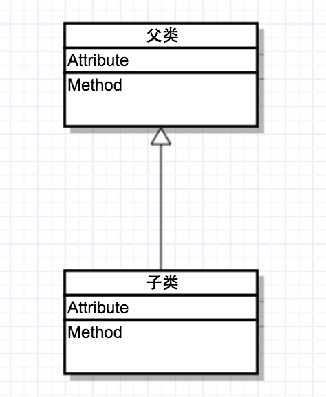
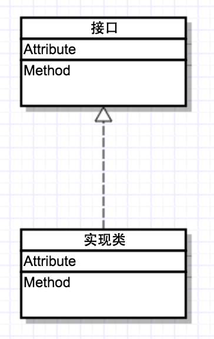
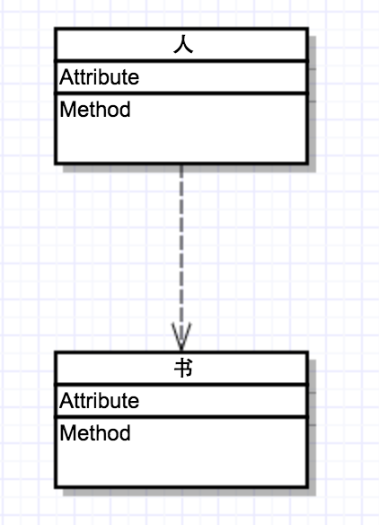
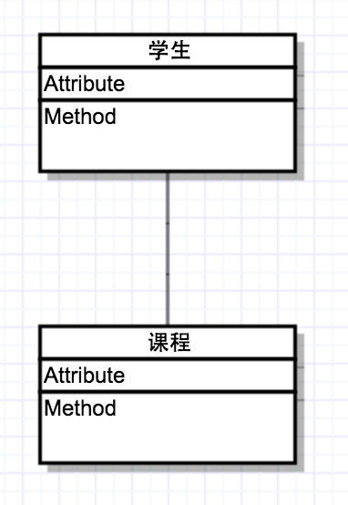
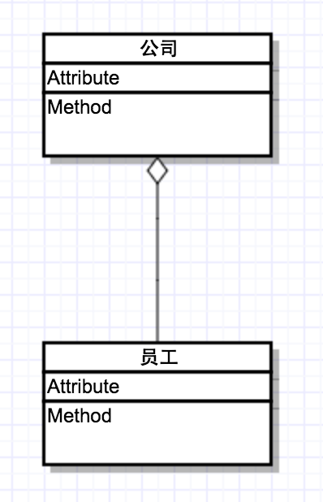
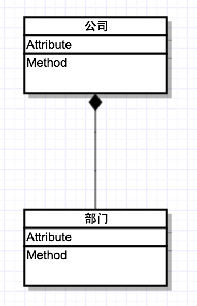

# 1､简介：

> * 在UML类图中，常见的类图关系有以下几种：泛化(Generalization)，实现(Realization)，关联(Alsociation)，聚合(Aggregation)，组合(Composition)，依赖(Dependency)。
> * 类图的三个基本组件：类名、属性、方法。

# 2､泛化：

## 2.1 概念：

> 泛化：表示is-a的关系，是对象之间耦合度最大的一种关系；是一种一般与特殊、一般与具体之间的描述，具体描述建立在一般描述之上，并对其进行扩展。在程序中是通过继承关系来体现的。

## 2.2 表示：

> 空心三角形箭头的实现，箭头指向父类。

# 3､实现：

## 3.1 概念：

> 实现：是一种类与接口的关系，表示类是接口所有特征和行为的实现，在程序中一般类实现接口来描述。

## 3.2 表示：

> 空心三角箭头的虚线，实现类指向接口。

# 4､依赖：

## 4.1 概念：

> 依赖：是一种使用的关系，即一个类的实现需要另一个类的协助，所以要尽量不使用双向的互相依赖。在程序中一般表示为：局部变量、方法的参数或者对静态方法的调用。

## 4.2 表示：

> 带箭头的虚线，指向被使用者。

# 5､ 关联

## 5.1 概念：

> 是一种拥有的关系，它使一个类知道另一个类的属性和方法，这种关系比依赖更强，不存在依赖关系的偶然性，关系也不是临时性的，一般是长期性的。在程序中一般表示为：成员变量。

## 5.2 表示：

> 带普通箭头的实心线`(我使用的uml工具是不带箭头)`，指向被拥有者。

# 6､聚合

## 6.1 概念：

> 聚合：是关联关系的一种，是强的关联关系，聚合是整体与个体的关系，即`has-a`的关系，整体与个体可以具有各自的生命周期，个体可以属于多个整体对象，也可以为多个整体对象共享。关联和聚合在语法上无法区分，必须考察具体的逻辑关系。

## 6.2 表示：

> 带空心菱形的实心线，菱形指向整体。

# 7､组合

## 7.1 概念

> 组合：也是关联关系的一种，组合是一种整体与部分的关系，即`contains-a`的关系，比聚合更强。部分与整体的生命周期一致，整体的生命周期的结束意味着部分的生命周期的结束，组合关系不能共享。关联和组合在语法上无法区分，必须考察具体的逻辑关系。

## 7.2 表示

> 带实心菱形的实线，菱形指向整体。

