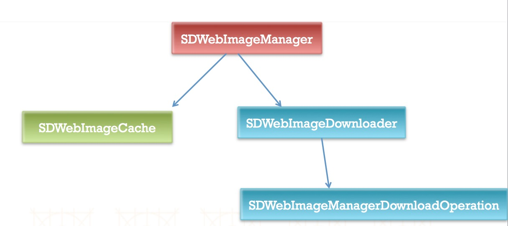

## 一、加载图片的方式：

> 1. imageNamed:
>
>    可以从项目中直接加载，也可以从Assets.xcassets中加载
>
>    `self.imageview.image = [UIImage imageNamed:@"图片名"];`
>
> 2. imageWithContentsOfFile:
>
>    只能从项目中加载
>
>    ` NSString *path = [[NSBundle mainBundle] pathForResource:@"图片名" ofType:@"后缀"];`
>
>    `self.imageview.image = [UIImage imageWithContentsOfFile:path]; `

## 二、pch文件：

> 1. pch文件里的内容可以被项目中的所有文件共有。
>
> 2. 注意事项：
>
>    1. pch文件使用前需要先编译。
>    2. 需要做一些判断，例如：判断是否有c文件，如果有，则不导入oc文件及语法。
>    3. pch文件名称和项目名称一致。
>
> 3. 使用步骤：
>
>    (1). 在项目中创建pch文件。
>
>    (2). 在target的`Apple LLVM-Language`中设置Precompile Prefix Header为Yes。
>
>    (3). 在target的`Apple LLVM-Language`中配置相应的pch文件地址。
>
>    
>
> 4. 作用：
>
>    1. 存放公用的宏。
>    2. 存放公用的头文件。
>    3. 自定义Log输出日志。

## 三、info.plist文件：

> * 从info.plist文件获取应用版本的方式一：
```objective-c
  NSString *path = [[NSBundle mainBundle] pathForResource:@"Info.plist" ofType:nil];
  NSDictionary *dic = [NSDictionary dictionaryWithContentsOfFile:path];
  NSString *version = dic[@"CFBundleShortVersionString"];
```
> * 从info.plist文件获取应用版本的方式二：
```objective-c
  NSString *version = [NSBundle mainBundle].infoDictionary[@"CFBundleShortVersionString"];
```
## 四、从代码加载指定的storyboard文件：

> * 在AppDelegate.m文件的(BOOL)application:(UIApplication *)application didFinishLaunchingWithOptions:方法中(注意：取消Targets->Deployment Info中所指定的storyboard文件)：
```objective-c
  self.window = [[UIWindow alloc] initWithFrame:[UIScreen mainScreen].bounds];
  UIStoryboard *storyboard = [UIStoryboard storyboardWithName:@"Main" bundle:nil];
  UIViewController *vc = [storyboard instantiateInitialViewController];
  self.window.rootViewController = vc;
  [self.window makeKeyAndVisible];
```

## 五、ViewController中loadView方法：

> * 作用：加载控制器的View。
> * 调用时间：当控制器的view第一次使用的时候就会调用。
> * 具体使用：
>   * 不会再调用[supper loadView]
>   * 只要想自定义控制器的view就调用这个方法(如下代码，其中MyView为自定义的view)
```objective-c
  MyView *myview = [[MyView alloc] initWithFrame:[UIScreen mainScreen].bounds];
  self.view = myview;
  self.view.backgroundColor = [UIColor redColor];
```

## 六、背景图片的拉伸：

> 控件背景在拉伸的情况下可能会出现失真的效果(锯齿)，如下：
>
> 
>
> 可以用代码进行处理
>
> 方式一：
>
> ```objective-c
> UIImage *image = [UIImage imageNamed:@"lumaqq"];
> CGFloat width = image.size.width;
> CGFloat height = image.size.height;
> //UIImage * resizeImage = [image resizableImageWithCapInsets:UIEdgeInsetsMake(height/2, width/2, height/2-1, width/2-1)];
> UIImage *resizeImage = [image resizableImageWithCapInsets:UIEdgeInsetsMake(height/2, 5, height/2-1, width/2-1) resizingMode:UIImageResizingModeStretch];
> [self.mButton setBackgroundImage:resizeImage forState:UIControlStateNormal];
> ```
>
> 其中第5行代码的上、右、下、左分别代表被保护不被拉伸的区域，具体如下：
>
> 
>
> 进行代码拉伸后的效果如下：
>
> 
>
> 方式二：
>
> ```objective-c
> UIImage *resizeImage = [image stretchableImageWithLeftCapWidth:width/2 topCapHeight:height/2];
> [self.mButton setBackgroundImage:resizeImage forState:UIControlStateNormal];
> ```
>
> 这种方式只需要提供左边和上边的被保护区域，然后就可以计算出另两个被保护区域：
>
> * 右边被保护的区域 = 图片的宽度 - 左边的被保护区域 - 1
> * 下边被保护的区域 = 图片的高度 - 上边的被保护区域 - 1
>
> 这样主可以在中心形成一个1x1的拉伸区域。
>
> 方式三：
>
> 直接选择图片，然后在右边的Slicing中选择拉伸模式即可自动进行拉伸(也可自行调整相应的保护值)，如下图：
>
> 

## 七、KVC：key value coding(键值编码)

> 1. 应用场景：简单的字典转模型。—>框架：MJExtension
>
> 2. 设置值：
>
>    ```objective-c
>    [person setValue:@"旺财" forKeyPath:@"dog.name"];
>    ```
>
> 3. 取值：
>
>    ```objective-c
>    [person valueForKeyPath:@"name"]
>    ```
>
> 4. 字典转模型：
>
>    ```objective-c
>    [person setValuesForKeysWithDictionary:dictionary];
>    ```
>
> 5. 模型转字典：
>
>    ```objective-c
>    NSDictionary *dict = [person dictionaryWithValuesForKeys:@[@"name", @"money"]];
>    ```
>
> 6. 取出数组中所有模型的某个属性值
>
>    ```objective-c
>    NSArray *allPersons = @[person1, person2, person3];
>    NSArray *allPersonName = [allPersons valueForKeyPath:@"name"];
>    ```

## 八、KVO：key value observing(键值监听)

> 1. 当某个对象的属性发生改变的时候用KVO进行监听
> 2. 使用如下：
>
> ```objective-c
> Person *person = [[Person alloc] init];
> person.name = @"zhangsam";
> /*
>  作用:给对象绑定一个监听器(观察者)
>  - Observer 观察者
>  - KeyPath 要监听的属性
>  - options 选项(方法方法中拿到属性值)
>  */
> [person addObserver:self forKeyPath:@"name" options:NSKeyValueObservingOptionNew|NSKeyValueObservingOptionOld context:nil]; 
> person.name = @"lisi"; 
> [person removeObserver:self forKeyPath:@"name"];
> ```
>
> 并使用以下方法进行临听：
>
> ```objective-c
> /**
>  *  当监听的属性值发生改变
>  *
>  *  @param keyPath 要改变的属性
>  *  @param object  要改变的属性所属的对象
>  *  @param change  改变的内容
>  *  @param context 上下文
>  */
> - (void)observeValueForKeyPath:(NSString *)keyPath ofObject:(id)object change:(NSDictionary<NSKeyValueChangeKey,id> *)change context:(void *)context
> ```

## 九、适配

> 1. 系统适配-不同的系统版本适配
>
> 2. 屏幕适配-不同的屏幕尺寸适配
>
>    * iPhone的尺寸：3.5､4.0､4.7､5.5
>    * iPad的尺寸：7.9､9.7､12.9
>    * 屏幕方向：横屏、竖屏
>
>    
>
> 3. 屏幕适配技术
>
>    1. Autoresizing：解决子控件和父控件之间的相对关系问题
>
>       在代码中实现如下：
>
>       ```
>       myView.autoresizingMask = UIViewAutoresizingFlexibleLeftMargin | UIViewAutoresizingFlexibleTopMargin;
>       ```
>
>       给view设置需要拉伸的方向或者宽高即可。
>
>       或者在xcode中对需要拉伸的界面进行如下设置：
>
>       
>
>    2. AutoLayout：
>
>       自动布局的核心公式：
>
>       ```
>       obj1.property1 = (obj2.property2 * multiplier) + constant value
>       ```
>
>       界面实现：
>
>       代码实现：很少用，太麻烦。注意使用代码方式需要禁止将Autoresizing转为AutoLayout约束，使用以下代码禁止：
>
>       ```
>       myview.translatesAutoresizingMaskIntoConstraints = NO;
>       ```
>
>       VFL实现：Visual Format Language，可视化格式语言:
>
>       
>
>    3. Masonry框架实现：https://github.com/SnapKit/Masonry

## 十、UITableView

> 1. 注意点：
>
>    * 若UITableView的数据不够一页，剩余的界面部分会出现分隔线，解决方法：
>
>      (1).将tableview的样式必成Grouped的。
>
>      (2).给tableview设置一个footer view。
>
>      ```objective-c
>      [self.tableView setTableFooterView:[[UIView alloc] init]];
>      ```
>
> 2. 性能优化：
>
>    - 方式1:
>
>      在(UITableViewCell *)tableView:(UITableView *)tableView cellForRowAtIndexPath:(NSIndexPath *)indexPath方法中：
>
>      ```objective-c
>      static NSString *ID = @"flag";
>      UITableViewCell * cell = [tableView dequeueReusableCellWithIdentifier:ID];
>          if (cell == nil) {
>              cell = [[UITableViewCell alloc] initWithStyle:UITableViewCellStyleDefault reuseIdentifier:ID];
>          }
>      ```
>
>    - 方式2:常用于自定义Cell
>
>      定义flag：`NSString *ID = @"flag";`
>
>      在viewDidLoad方法中进行注册
>
>      ```objective-c
>      [self.tableView registerClass:[UITableViewCell class] forCellReuseIdentifier:ID];
>      // 如果Cell使用xib显示，必须使用registerNib，否则无法显示
>      // [self.tableView registerNib:[UINib nibWithNibName:@"CPSubTagCell" bundle:nil] forCellReuseIdentifier:ID];
>      ```
>
>      在(UITableViewCell *)tableView:(UITableView *)tableView cellForRowAtIndexPath:(NSIndexPath *)indexPath方法中：
>
>      ```objective-c
>      UITableViewCell * cell = [tableView dequeueReusableCellWithIdentifier:ID];
>      ```
>
>
> 3. 数据刷新：
>
>    * 全局刷新：`[self.tableview reloadData]`
>
>    * 局部刷新：
>
>      ```objective-c
>      NSArray *indexPaths = @[
>                             [NSIndexPath indexPathForRow:0 inSection:0],
>                             [NSIndexPath indexPathForRow:1 inSection:0]
>                             ];
>      // 更新数据
>      [self.tableView reloadRowsAtIndexPaths:indexPaths withRowAnimation:UITableViewRowAnimationNone];
>      // 添加数据
>      [self.tableView insertRowsAtIndexPaths:indexPaths withRowAnimation:UITableViewRowAnimationNone];
>      // 删除数据
>      [self.tableView deleteRowsAtIndexPaths:indexPaths withRowAnimation:UITableViewRowAnimationNone];
>      ```
>
> 4. 左滑添加多个操作按钮：
>
>    ```objective-c
>    - (NSArray<UITableViewRowAction *> *)tableView:(UITableView *)tableView editActionsForRowAtIndexPath:(NSIndexPath *)indexPath{
>    UITableViewRowAction *deleteAction = [UITableViewRowAction rowActionWithStyle:UITableViewRowActionStyleDefault title:@"删除" handler:^(UITableViewRowAction * _Nonnull action, NSIndexPath * _Nonnull indexPath) {
>        [self.datas removeObjectAtIndex:indexPath.row];
>        [self.tableView deleteRowsAtIndexPaths:@[indexPath] withRowAnimation:UITableViewRowAnimationAutomatic];
>     }];
>     UITableViewRowAction *concernAction = [UITableViewRowAction rowActionWithStyle:UITableViewRowActionStyleNormal title:@"关注" handler:^(UITableViewRowAction * _Nonnull action, NSIndexPath * _Nonnull indexPath) {
>     	// 设置tableView的编辑模式为NO
>        self.tableView.editing = NO;
>      }];
>      return @[deleteAction, concernAction];
>    }
>    ```
>
> 5. 编辑模式：
>
>    单选模式：
>
>    ```
>    self.tableView.editing = YES;
>    ```
>
>    多选模式：
>
>    ```
>    self.tableView.editing = YES;
>    self.tableView.allowsMultipleSelectionDuringEditing = YES;
>    ```
>
>    ​

## 十一、UIApplication

> 1. UIApplication的常用属性：
>
>    * applicationIconBadgeNumber：应用程序图标右上角的红色提醒数字.
>    * networkActivityIndicatorVisible：状态栏的网络加载图标(小菊花)
>
> 2. UIApplication的代理事件：
>
>    * 当应用程序启动完毕时调用
>
>      ```
>      (BOOL)application:(UIApplication *)application didFinishLaunchingWithOptions:(NSDictionary *)launchOptions
>      ```
>
>    * 当应用程序将要失去焦点时调用
>
>      ```
>      (void)applicationWillResignActive:(UIApplication *)application
>      ```
>
>    * 当应用程序进入后台时调用
>
>      ```
>      (void)applicationDidEnterBackground:(UIApplication *)application
>      ```
>
>    * 当应用程序进入前台时调用
>
>      ```
>      (void)applicationWillEnterForeground:(UIApplication *)application
>      ```
>
>    * 当应用程序获取焦点时调用
>
>      ```
>      (void)applicationDidBecomeActive:(UIApplication *)application
>      ```
>
>    * 当应用程序退出时调用
>
>      ```
>      (void)applicationWillTerminate:(UIApplication *)application
>      ```
>
>    * 当应用程序收到内存警告时调用
>
>      ```
>      (void)applicationDidReceiveMemoryWarning:(UIApplication *)application
>      ```
>
>      ​
>
> 3. 应用程序启动流程：
>
>    * 执行main函数
>
>    * 执行UIApplicationMain，创建UIApplication对象，并设置UIApplication它的对象
>
>    * 开启一个事件循环(主运行循环，死循环：保证应用程序不退出)
>
>    * 加载info.plist(判断info.plist中有没有Main，如果有，加载Main.storyBoard)
>
>    * 应用程序启动完毕(通知代理应用程序启动完毕)
>
>      

## 十二、UIWindow

> 1. 代码创建Window及ViewController：
>
>    在(BOOL)application:(UIApplication *)application didFinishLaunchingWithOptions:方法
>
>    ```objective-c
>    // 1.创建窗口
>    self.window = [[UIWindow alloc] initWithFrame:[UIScreen mainScreen].bounds];
>    // 2.设置窗口的根控制器
>    UIViewController *vc = [[UIViewController alloc] init];
>    vc.view.backgroundColor = [UIColor redColor];
>    self.window.rootViewController = vc;
>    // 3.显示窗口
>    [self.window makeKeyAndVisible];
>    ```
>
> 2. 通过StoryBoard加载控制器：
>
>    ```objective-c
>    self.window = [[UIWindow alloc] initWithFrame:[UIScreen mainScreen].bounds];
>    UIStoryboard *board = [UIStoryboard storyboardWithName:@"Main" bundle:nil];
>    // 加载初始化的控制器
>    // UIViewController *vc = [board instantiateInitialViewController];
>    // 加载指定的控制器
>    UIViewController *vc = [board instantiateViewControllerWithIdentifier:@"mvc"];
>    self.window.rootViewController = vc;
>    ```
>
> 3. 通过xib文件加载控制器：
>
>    ```objective-c
>    self.window = [[UIWindow alloc] initWithFrame:[UIScreen mainScreen].bounds];
>    // initWithNibName如果指定为nil，首先会加载和控制器名字相同的xib文件；如果没有则去查找和控制器名字相同但是去掉Controller的xib文件。
>    // 并且可以直接使用：[[UIViewController alloc] init]
>    UIViewController *vc = [[UIViewController alloc] initWithNibName:@"CPView" bundle:nil];
>    self.window.rootViewController = vc;
>    [self.window makeKeyAndVisible];
>    ```
>
>    注意，如果UIViewController和xib文件单独创建，需要做以下操作：
>
>    ​		1. 需要设置xib中的UIView的File`s Owner为UIViewController
>
>    ​	       2.右击File`s Owner，将其中的view和UIView控件关联

## 十三、多控制器：UINavigationController

> 1. 使用步骤：
>
>    * 1.初始化UINavigationController
>    * 2.设置UIWindow的rootViewController为UINavigationController
>    * 3.根据具体情况，通过push方法添加对应的子控制器
>
> 2. UINavigationController常见属性：
>
>    
>
> 3. UINavigationController标题属性：
>
>    

## 十四、控制器生命周期：

> 1. 当控制器加载完毕时调用
>
>    ```
>    (void)viewDidLoad
>    ```
>
> 2. 当控制器的view即将显示的时候调用
>
>    ```
>    (void)viewWillAppear:(BOOL)animated
>    ```
>
> 3. 当控制器的view显示完毕时调用
>
>    ```
>    (void)viewDidAppear:(BOOL)animated
>    ```
>
> 4. 当控制器的view将要布局子控件的时候调用
>
>    ```
>    (void)viewWillLayoutSubviews
>    ```
>
> 5. 当控制器的view布局子控件完毕的时候调用
>
>    ```
>    (void)viewDidLayoutSubviews
>    ```
>
> 6. 当控制器的view即将消失的时候调用
>
>    ```
>    (void)viewWillDisappear:(BOOL)animated
>    ```
>
> 7. 当控制器的view消失完毕的时候调用
>
>    ```
>    (void)viewDidDisappear:(BOOL)animated
>    ```

## 十五、OC中BOOL和bool的区别：

> 1. BOOL是一种带符号的字符类型(`signed char`)的类型定义(`typedef`)，它使用8位的存储空间。通过#define命令把YES定义为1,NO定义为0。
>
>    注意：OC并不会将BOOL作为仅能保存YES或NO值的真正布尔类型来处理。编译器仍将BOOL认作8位二进制数，YES 和 NO 值只是在习惯上的一种理解。`例：如果不小心将一个大于1字节的整型值（比如short或int）赋给一个BOOL变量，那么只有低位字节会用作BOOL值。如果该低位字节刚好为0（比如8960，写成十六进制为0x2300），BOOL值将会被认作是0，即NO值。`
>
> 2. bool只有true和false的区别，即0为false，非0为true。

## 十六、initialize和load方法的区别：

> 1. initialize方法：在 第一次初始化这个类之前 被调用，我们用它来初始化静态变量。先调用类中的，再调用类别中的(类别中如果有重写)；如果该类只是引用，没有调用，则不会执行initialize方法。
> 2. load方法：会在加载类的时候就被调用，也就是 ios 应用启动的时候，就会加载所有的类，就会调用每个类的 + load 方法。且在main函数之前，先调用类中的，再调用类别中的(类别中如果有重写)。

## 十七、instancetype和id的区别：

> 1. instancetype用来在编译期确定实例的类型,而使用id的话,编译器不检查类型, 运行时检查。
> 2. id可以作为方法的参数,但instancetype不可以；instancetype只适用于初始化方法和便利构造器的返回值类型。

## 十八、OC访问修饰符：

> 1. 属性访问符：
>
>    @private: 私有 被@private修饰的属性只能在本类的内部访问。只能在本类的方法实现中访问。
>
>    @protected: 受保护的(默认) 被@protected修饰的属性只能在本类和本类的子类中访问.。只能在本类和子类的方法实现中访问。
>
>    @package: 被@package修饰的属性 可以在当前框架中访问。
>
>    @public: 公共的。被@public修饰的属性 可以在任意的地方访问。
>
> 2. 说明：
>
>    在interface中声明的成员变量默认是protected。
>
>    在implementation中声明的成员变量，默认是private（在没被import的情况下，即使加@public仍然无法被他人引用）。
>
>    @property  用于生成getter与setter的声明，只能用于interface中。

## 十九、OC属性修饰符：

>1. 修饰符分类：
>
>   * 自定义getter | setter方法名修饰符 : getter和setter
>   * 原子性修饰符:atomic | nonatomic
>   * 读写性修饰符：readwrite | readonly
>   * setter相关修饰符：assign | retain | copy
>
>2. 方法名修饰符：
>
>   ` getter=<getMethodName>,setter=<setMethodName>:指定该属性所使用的getter和setter方法的名称`
>
>   一般用来修改BOOL类型的getter方法。
>
>3. 原子修饰符：
>
>   * atomic：原子属性(默认),为setter方法加锁，线程安全，但比较耗性能。
>   * nonatomic：非原子属性,不为setter方法加锁，非线程安全,适合内存小的移动设备。
>
>4. 读写性修饰符：
>
>   * readwrite：表明这个属性是可读可写的，系统为我们生成这个属性的setter和getter方法以及下划线开头的成员变量。
>   * readonly：表明这个属性只能读不能写，系统只为我们生成一个getter方法及下划线开头的成员变量，不会创建setter方法。
>   * 注意：如果手动实现了setter和getter方法则不会再生成下划线开头的成员变量。
>
>5. setter相关修饰符：
>
>   * retain：针对对象类型进行内存管理(非ARC)。当给对象类型使用此修饰符时，setter方法会先将旧的对象属性release掉，再对新的对象进行一次赋值并进行一次retain操作。
>
>   * assign：表示直接赋值， 基本数据类型、枚举、结构体(非OC对象) class类型。当一个对象被销毁时，指针不会被清空(所以修饰对象时容易造成坏内存 (非ARC下会用这个修饰对象)。
>
>   * copy：以前主要用在NSString类型和Block，建立一个索引计数为1的对象，然后释放旧对象。
>
>   * strong：除NSString\block以外(注意!这是以前的说法)的OC对象 , 强引用以保证属性作用域结束后不被销毁。
>
>   * weak：当一个对象被销毁时，指针被清空。一般用在已经添加到父控件中的控件,因为父控件会对子控件进行引用,也就是retain,所以自己的作用域结束之后不会被释放
>
>   * 注意：
>
>     ​	(1).系统默认属性是assign。retain是指针的复制，copy是内容的复制。
>
>     ​	(2).用copy修饰字符串时：在setter方法中会判断 传入的字符串 是否是可变的  如果是可变的就分配新的内存再赋值  如果是不可变的就直接赋值地址  而实际上开发中其实大量使用的是不可变的字符串   所以最好使用 strong 修饰字符串,可以提升性能(减少一次判断)
>
>     ​	(3).用copy修饰Block时:
>
>     ​	非ARC环境下：
>
>     ```
>     block访问外部局部变量,block存放栈里面
>     只要block访问变量,而且是整个app都存在的变量,那么肯定在全局区
>     在非ARC中.不能使用retain引用block,因为不会放在堆里面,在非ARC中只能使用copy,才会把block放在堆里面
>     ```
>
>     ​	ARC环境下：
>
>     ```
>     只要block访问了外部局部变量,block就会存放到堆里面
>     可以使用strong去引用  因为本身就已经是存放在堆区了
>     也可以用copy，但是用stong性能更好
>     ```
>
>   * 总结(ARC环境)：
>
>     ```
>     用strong修饰OC对象以及NSString和Block , 没添加到父控件上的控件
>     用weak修饰已经被添加到父控件上的控件 以及 代理对象
>     用assign基本数据类型、枚举、结构体(非OC对象)   class类型
>     用copy修饰一种情况下的NSString-->不确定赋值过程中用的是可变还是不可变字符串
>     ```
>

## 二十、iOS文件系统	

> 
>
> 1. iOS程序为沙盒机制,APP只能访问自己目录下的文件,不能直接访问其他目录内容，每个APP默认都会创建以下目录结构Documents、Library、tmp。
>    * NSBundle：包含所有的资源文件和可执行文件，并且是只读文件目录。
>
>
> *    Documents：存放应用程序产生的数据，会被itunes备份同步；
>
> * Library：包含两个子目录：Caches 和 Preferences：
>      * Preferences：包含应用程序的偏好设置文件。您不应该直接创建偏好设置文件，而是应该使用NSUserDefaults类来取得和设置应用程序的偏好,会被itunes备份同步。
>      * Caches：用于存放应用程序专用的支持文件，保存应用程序再次启动过程中需要的信息,不会被itunes备份同步。
>
> * tmp：存放临时数据,当不在用时应该删除掉临时文件,系统也有可能在程序不运行时删除该文件夹下内容。
>
>          
>
> 2. 获取方式：
>
>    * NSBundle：`NSString *path = [[NSBundle mainBundle] pathForResource: ofType: ]];`
>
>      `注意：NSBundle中的文件只能进行读取不能进行更改，即使对NSBundle中的文件进行更改，其实是更改内存中其所对应的文件，实际的文件是没有被更改过的；`
>
>
> *  Home目录：`NSHomeDirectory()`
>
> * Documents目录：
>
>    * 方式1: `NSHomeDirectory().stringByAppendingPathComponent("Documents")`
>
>    * 方式2: 
>
>      ```objective-c
>      NSArray *paths = NSSearchPathForDirectoriesInDomains(NSDocumentDirectory,NSUserDomainMask, YES);
>      NSString *document_path = [paths objectAtIndex:0]
>      ```
>
> * Library目录：
>
>    * 方式1: `NSHomeDirectory().stringByAppendingPathComponent("Library")`
>
>    * 方式2:
>
>      ```objective-c
>      NSArray *paths = NSSearchPathForDirectoriesInDomains(NSLibraryDirectory, NSUserDomainMask, YES);
>      NSString *libPath = [paths objectAtIndex:0];
>      ```
>
> * Caches目录：
>
>    ```objective-c
>            NSArray *paths = NSSearchPathForDirectoriesInDomains(NSCachesDirectory, NSUserDomainMask, YES);
>            NSString *libPath = [paths objectAtIndex:0]; 
>    ```
>
> * tmp目录：`NSTemporaryDirectory()`

## 二十一、iOS文件操作：

> 1. 获得NSFileManager：
>
>    `NSFileManager *fileManager = [NSFileManager defaultManager];`
>
> 2. 判断文件夹/文件是否存在：
>
>    `[fileManager fileExistsAtPath: ];`
>
> 3. 创建文件夹：
>
>    ```objective-c
>    //参数createIntermediates为是否创建新建文件目录里不存在的中间目录，详见文档，根据error判断是否成功创建
>    [fileManager createDirectoryAtPath: withIntermediateDirectories: createIntermediates attributes: error: ]
>    ```
>
> 4. 创建文件的方法：
>
>    ```objective-c
>    //成功创建和文件已经存在都会返回YES，所以有时需要让程序更清晰，需要在创建文件前先判断文件是否已经存在，存在则不进行创建
>    [fileManager createFileAtPath: contents: attributes: ];
>    ```
>
> 5. 删除文件或文件夹：
>
>    `[fileManager removeItemAtPath:* *error: ];`
>
> 6. 注意：
>
>    * Path为文件夹/文件的路径全名

## 二十二、iOS归档：

> 1. 自定义归档对象需要实现NSCoding协议。
>
> 2. 自定义归档对象重写(void)encodeWithCoder:(NSCoder *)aCoder方法指定将那些属性进行归档。
>
>    重写(instancetype)initWithCoder:(NSCoder *)coder指定如何读写归档的对象属性。
>
>    ```objective-c
>    - (void)encodeWithCoder:(NSCoder *)aCoder{
>        [aCoder encodeObject:self.name forKey:@"name"];
>        [aCoder encodeInt:self.age forKey:@"age"];
>    }
>    - (instancetype)initWithCoder:(NSCoder *)coder{
>        if (self = [super init]) {
>            self.name = [coder decodeObjectForKey:@"name"];
>            self.age = [coder decodeIntForKey:@"age"];
>        }
>        return self;
>    }
>    ```
>
> 3. 读写操作：
>
>    ```objective-c
>    // 写操作
>    Person *person = [[Person alloc] init];
>    person.name = @"name";
>    person.age = 20;
>    NSString *savePath = [NSSearchPathForDirectoriesInDomains(NSCachesDirectory, NSUserDomainMask, YES) objectAtIndex:0];
>    NSString *saveFile = [savePath stringByAppendingPathComponent:@"person.data"];
>    [NSKeyedArchiver archiveRootObject:person toFile:saveFile];
>    // 读操作    
>    person = [NSKeyedUnarchiver unarchiveObjectWithFile:saveFile];
>    NSLog(@"%@", person);
>    ```

## 二十三、自定义UITableViewCell：

> 自定义等高Cell：
>
> 1. 代码：
>
>    frame方式：
>
>    * 第1步：在自定义的UITableViewCell类的`(instancetype)initWithStyle:(UITableViewCellStyle) reuseIdentifier:(NSString *)`方法中添加所有的子控件；
>
>    * 第2步：在`layoutSubviews`方法中设置所有子控件的frame(进行子控件的位置布局)；
>
>    * 第3步：添加一个数据模型属性，当有模型数据设置进来的时候，进行数据绑定。例如：
>
>      ```objective-c
>      - (void)setStatus:(StatusItem *)item{
>      	self.iconImageView.image = [UIImage imageNamed:item.icon];
>      	self.titleLabel.text = item.title;
>      }
>      ```
>
>      注意：在UITableViewController类中的`(UITableViewCell *)tableView:(UITableView *) cellForRowAtIndexPath:(NSIndexPath *)`设置模型数据，将数据和控件绑定。
>
>    autolayout方式：
>
>    * 使用Masonry在`initWithStyle`或`layoutSubviews`对相关的控件添加约束。
>
> 2. xib：
>
>    * 第1步：创建xib文件，并和自定义的UITableViewCell类绑定，并设置复用的ID。(或者直接在viewDidLoad方法通过`[self.tableView registerNib:[UINib nibWithNibName:@"StatusCell" bundle:nil] forCellReuseIdentifier:ID1]`方式进行利用优化)
>
>      
>
>    * 第2步：在自定义的UITableViewCell中设置模型数据时进行数据绑定。
>
>    * 第3步：在UITableViewController的(UITableViewCell *)tableView:(UITableView *) cellForRowAtIndexPath:(NSIndexPath *)方法中从xib创建自定义的UITableViewCell。
>
>      ```objective-c
>      static NSString *ID = @"ID";
>      StatusTableViewCell *cell = [tableView dequeueReusableCellWithIdentifier:ID];
>      if (cell == nil) {
>          cell = [[[NSBundle mainBundle] loadNibNamed:@"StatusCell" owner:nil options:nil] lastObject];
>      }
>      ```
>
> 3. storyboard：
>
>    * 第1步：在StoryBoard中添加UITableViewController，并在其上设置UITableViewCell的相应控件。
>    * 第2步：在StoryBoard中设置UITableViewCell的复用ID。
>    * 第3步：在自定义的UITableViewCell类中提供数据模型属性，并在设置方法中将模型和控件进行绑定。
>    * 第4步：在UITableViewController中使用传统方式或者注册类方式进行复用优化。
>
> 自定义不等高Cell：
>
> 1. 代码：
>
>    frame方式：
>
>    ​	主要步骤和等高Cell的计算方式一样，主要是在计算一些具有动态宽高的控件时需要注意，同时在UITableViewController的`(CGFloat)tableView:(UITableView *) heightForRowAtIndexPath:(NSIndexPath *)`中计算根据每行的不同的数据模型计算cell的高度。
>
>    ​	例如：计算宽度为距离屏幕左右各10,高度不固定的UILabel的高度：
>
>    ```objective-c
>    NSDictionary *contentArrt = @{NSFontAttributeName: [UIFont systemFontOfSize:14]};
>    CGSize textSize = CGSizeMake([UIScreen mainScreen].bounds.size.width-2*space, MAXFLOAT);
>    CGFloat contentHeight = [item.text boundingRectWithSize:textSize options:NSStringDrawingUsesLineFragmentOrigin attributes:contentArrt context:nil].size.height;
>    ```
>
>    ​	计算某个使用某字体的单行的UILable的宽高：
>
>    ```objective-c
>    NSDictionary *nickAtt = @{NSFontAttributeName : [UIFont systemFontOfSize:14]};
>    CGSize nickSize = [self.item.name sizeWithAttributes:nickAtt];
>    CGFloat nickW = nickSize.width;
>    CGFloat nickH = nickSize.height;
>    ```
>
>    autolayout方式：
>
> 2. xib：
>
> 3. storyboard：
>
>    * 在storyboard设置好UITableViewCell的各控件的约束后，需要在UITableViewController中添加以下代码：
>
>      ```objective-c
>      self-sizing(iOS8以后)
>      // 设置tableview的cell高度是自动计算的。
>      self.tableView.rowHeight = UITableViewAutomaticDimension;
>      // 设置估算高度
>      self.tableView.estimatedRowHeight = 44;
>      ```

## 二十四、代理的使用步骤：

> 1. 代理的定义：
>
>    * 协议名字的格式一般是：类名 + Delegate，例：UITableViewDelegate
>
>    * 设计细节：
>
>      ​	(1).一般都是@optional(让代理可以有选择性去实现一些代理方法)
>
>      ​	(2).方法名一般都以类名开头，例：`- (void)scrollViewDidScroll:`
>
>      ​	(3).一般都需要将对象本身传出去，例：tableView的代理方法都会把tableView本身传出去
>
>    * 必须要遵守NSObject协议(基协议)，例：`@protocol MyCellDelegate <NSObject>`
>
> 2. 代理的声明：
>
>    * 代理的类型格式：id<协议> delegate
>
>      ```objective-c
>      @property (nonatomic, weak) id<XMGWineCellDelegate> delegate;
>      ```
>
> 3. 设置代理对象：
>
> 4. 代理对象遵守协议，并实现协议里的方法：
>
> 5. 代理方法的调用：
>
>    ```objective-c
>    // 如果代理方法是@optional，那么需要判断方法是否有实现,直接调用可能会报错
>    if ([self.delegate respondsToSelector:@selector(wineCellDidClickPlusButton:)]) {
>        [self.delegate wineCellDidClickPlusButton:self];
>    }
>    ```
>
>    ​

## 二十五、iOS监听事件的方法比较

> 1. 通知（NSNotificationCenter\NSNotification）
>    * 任何对象之间都可以传递消息
>    * 使用范围
>      * 1个对象可以发通知给多个对象
>      * 1个对象可以接受多个对象发出的通知
>    * 要求:必须得保证通知的名字在发出和监听时是一致的
> 2. KVO
>    * 仅仅是能监听对象属性的改变（灵活度不如通知和代理）
> 3. 代理
>    * 使用范围
>      * 1个对象只能设置一个代理(假设这个对象只有1个代理属性)
>      * 1个对象能成为多个对象的代理
> 4. 如何选择?
>    * `代理`比`通知`规范
>    * 建议使用`代理`多于`通知`,能使用代理尽量使用代理

## 二十六、UIView形变:

> 1. 位移形变：
>
>    ```objective-c
>    [UIView animateWithDuration:0.5 animations:^{
>    // 将当前的动画x和y属性进行修改移动，可多次移动
>    //  self.transView.transform = CGAffineTransformTranslate(self.transView.transform, 100, 100);
>      	// 将原有的动画的x和y属性进行修改移动，只能移动一次
>        self.transView.transform = CGAffineTransformMakeTranslation(100, 100);
>    }];
>    ```
>
> 2. 旋转形变：
>
>    ```objective-c
>    [UIView animateWithDuration:0.5 animations:^{
>    //   self.transView.transform = CGAffineTransformRotate(self.transView.transform, M_PI_4);
>         self.transView.transform = CGAffineTransformMakeRotation(M_PI_4);
>    }];
>    ```
>
> 3. 缩放形变：
>
>    ```objective-c
>    [UIView animateWithDuration:0.5 animations:^{
>    //   self.transView.transform = CGAffineTransformScale(self.transView.transform, 0.5, 0.5);
>         self.transView.transform = CGAffineTransformMakeScale(0.5, 0.5);
>    }];
>    ```
>
> 4. 透明度形变：
>
>    ```objective-c
>    [UIView animateWithDuration:0.5 animations:^{
>       self.transView.alpha = 0.5;
>    }];
>    ```

## 二十七：hitTest与pointInside方法：

> 1. hitTest方法：-(UIView *)hitTest:(CGPoint)point withEvent:(UIEvent *)event
>    * 作用：寻找响应点击事件最合适的view
>    * 参数：当前手指所在的点，产生的事件
>    * 返回值：最合适的view，如果当前view不是最合适的view，则返回nil
>    * 调用时机：当事件传递给当前控件时就会调用这个控件的hitTest方法
> 2. pointInside方法：-(BOOL)pointInside:(CGPoint)point withEvent:(UIEvent *)event
>    * 作用：判断事件point在不在方法调用View上
>    * 参数：当前手指所在的点，产生的事件
>    * 返回值：是否在调用View上
>    * 调用时机：hitTest底层会调用用这个方法

## 二十八、事件传递过程：

> 1. 事件传递完整过程：
>
>    在产生一个事件时,系统会将该事件加入到一个由UIApplication管理的事件队列中,
>    UIApplication会从事件队列中取出最前面的事件,将它传递给先发送事件给应用程序的主窗口.
>    主窗口会调用hitTest方法寻找最适合的视图控件,找到后就会调用视图控件的touches方法来做具体的事情.
>    当调用touches方法,它的默认做法, 就会将事件顺着响应者链条往上传递，
>    传递给上一个响应者,接着就会调用上一个响应者的touches方法
>
> 2. 如何寻找上一个响应者：
>
>    * 如果当前的View是控制器的View,那么控制器就是上一个响应者.
>    * 如果当前的View不是控制器的View,那么它的父控件就是上一个响应者.
>    * 在视图层次结构的最顶级视图，如果也不能处理收到的事件或消息，则其将事件或消息传递给window对象进行处理.
>    * 如果window对象也不处理，则其将事件或消息传递给UIApplication对象.
>    * 如果UIApplication也不能处理该事件或消息，则将其丢弃.

## 二十九、Quartz2D：

> 1. Quartz2D是一个二维的绘图引擎,同时支持iOS和Mac系统，可以画基本线条,绘制文字,图片,截图,自定义UIView。
>
> 2. 图形上下文：
>
>    * 图形上下文是用来保存用户绘制的内容状态,并决定绘制到哪个地方的.用户把绘制好的内容先保存到图形上下文,然后根据选择的图形上下文的不同,绘制的内容显示到地方也不相同,即输出目标也不相同.
>
> 3. 分类：
>
>    * Bitmap Graphics Context(位图上下文)
>    * PDF Graphics Context
>    * Window Graphics Context 
>    * Layer Graphics Context(图层上下文,自定义UIView取得上下文就是图层上下文.UIView之所以能够显示就是因为他内部有一个图层)
>    * Printer Graphics Context
>
> 4. 自定义UIView的步骤：
>
>    * 首先得要有上下文,有了上下文才能决定把绘制的东西显示到哪个地方去.其次就是这个上下文必须得和View相关联.才能将内容绘制到View上面.
>
>    * 具体步骤：
>
>      ​	1.要先自定定UIView
>      ​	2.实现DrawRect方法
>      ​	3.在DrawRect方法中取得跟View相关联的上下文.
>      ​	4.绘制路径(描述路径长什么样).
>      ​	5.把描述好的路径保存到上下文(即:添加路径到上下文)
>      ​	6.把上下文的内容渲染到View

## 三十、CALayer：

> 1. CALayer和UIView的区别：
>
>    * CALayer和UIView都能实现相同的显示效果。
>    * 对比CALayer，UIView多了一个事件处理的功能。CALayer不能处理用户的触摸事件，而UIView可以。
>    * 所以，如果显示出来的东西需要跟用户进行交互的话，用UIView；如果不需要跟用户进行交互，用UIView或者CALayer都可以。
>    * 当然，CALayer的性能会高一些，因为它少了事件处理的功能，更加轻量级。
>
> 2. position和anchorPoint：
>
>    position：
>
>    * 用来设置CALayer在父层中的位置
>    * 以父层的左上角为原点(0, 0)
>
>    anchorPoint：
>
>    * 称为“定位点”、“锚点”
>    * `决定着CALayer身上的哪个点会是position属性所指的位置`
>    * 以自己的左上角为原点(0, 0)
>    * 它的x、y取值范围都是0~1，默认值为（0.5, 0.5）

## 三十一、frame、bounds和center：

> 
>
> * origin：起点位置
>
> * frame：该view在父view坐标系统中的位置和大小。（参照点是父坐标系统）
>
> * bounds：该view在本地坐标系统中的位置和大小。（参照点是本地坐标系统，就相当于ViewB自己的坐标系统，以0,0点为起点）
>
> * center：该view的中心点在父view坐标系统中的位置。（参照点是父坐标系统）
>
>   参考：http://blog.csdn.net/pucker/article/details/7634479
>
>   ​	    http://blog.csdn.net/mad1989/article/details/8711697

## 三十二、Core Animation：

> 1. Core Animation的动画执行过程都是在后台操作的，不会阻塞主线程。
>
> 2. Core Animation是直接作用在CALayer上的，并非UIView。
>
> 3. 核心动画继承结构：
>
>    
>
> 4. CABasicAnimation示例：
>
>    * 单独动画：
>
>    ```objective-c
>    CABasicAnimation *anim = [CABasicAnimation animation];
>    anim.keyPath = @"position.y";
>    anim.toValue = @400;
>    // 以下两行设置动画不回复原始状态
>    anim.removedOnCompletion = NO;
>    anim.fillMode = kCAFillModeForwards;  
>    [self.redView.layer addAnimation:anim forKey:nil];
>    ```
>
>    ​
>
>    * 组动画：
>
>    ```objective-c
>    CABasicAnimation *anim = [CABasicAnimation animation];
>    anim.keyPath = @"position.y";
>    anim.toValue = @400;
>    CABasicAnimation *anim2 = [CABasicAnimation animation];
>    anim2.keyPath = @"transform.scale";
>    anim2.toValue = @0.5;
>    CAAnimationGroup *group = [CAAnimationGroup animation];
>    //会自动执行animations数组当中所有的动画对象
>    group.animations = @[anim,anim2];   
>    group.removedOnCompletion = NO;
>    group.fillMode = kCAFillModeForwards;
>    [self.redView.layer addAnimation:group forKey:nil];
>    ```
>
> 5. 转场动画：CATransition
>
>    * 动画属性：
>
>      ​	type：动画过渡类型
>
>      ​	subtype：动画过渡方向
>
>      ​	startProgress：动画起点(在整体动画的百分比)
>
>      ​	endProgress：动画终点(在整体动画的百分比)
>
>    * 转场动画过渡效果：
>
>      

## 三十三、UIAppearance

> * UIAppearance是一个协议
>
>   ```objective-c
>   @protocol UIAppearance <NSObject>
>   ```
>
> * UIView默认已经遵守了这个协议
>
>   ```objective-c
>   @interface UIView : UIResponder <NSCoding, UIAppearance, UIAppearanceContainer, UIDynamicItem, UITraitEnvironment, UICoordinateSpace, UIFocusEnvironment>
>   ```
>
> * UIAppearance都有什么方法
>
>   ```objective-c
>   + (instancetype)appearance;
>   + (instancetype)appearanceWhenContainedIn:(nullable Class <UIAppearanceContainer>)ContainerClass, ... NS_REQUIRES_NIL_TERMINATION NS_DEPRECATED_IOS(5_0, 9_0, "Use +appearanceWhenContainedInInstancesOfClasses: instead") __TVOS_PROHIBITED;
>   + (instancetype)appearanceWhenContainedInInstancesOfClasses:(NSArray<Class <UIAppearanceContainer>> *)containerTypes NS_AVAILABLE_IOS(9_0);
>   + (instancetype)appearanceForTraitCollection:(UITraitCollection *)trait NS_AVAILABLE_IOS(8_0);
>   + (instancetype)appearanceForTraitCollection:(UITraitCollection *)trait whenContainedIn:(nullable Class <UIAppearanceContainer>)ContainerClass, ... NS_REQUIRES_NIL_TERMINATION NS_DEPRECATED_IOS(8_0, 9_0, "Use +appearanceForTraitCollection:whenContainedInInstancesOfClasses: instead") __TVOS_PROHIBITED;
>   + (instancetype)appearanceForTraitCollection:(UITraitCollection *)trait whenContainedInInstancesOfClasses:(NSArray<Class <UIAppearanceContainer>> *)containerTypes  NS_AVAILABLE_IOS(9_0);
>   ```
>
> * 让某一类控件同时表现某种属性
>
>   ```objective-c
>   [[UIButton appearance] setBackgroundColor:[UIColor blackColor]];
>   [[UIButton appearance] setTitle:@"呵呵哒" forState:UIControlStateNormal];
>   ```
>
> * 让某一类控件在另一种控件中同时变现某种属性
>
>   ```
>   // 使UIView上面的UIButton的titleColor都变成灰色的效果
>   [[UIButton appearanceWhenContainedInInstancesOfClasses:@[[UIView class]]] setTitleColor:[UIColor grayColor] forState:UIControlStateNormal];
>   ```
>
> * 注意：
>
>   * appearance只有在控件显示之前设置，才有效果。
>   * 只有被宏UI_APPEARANCE_SELECTOR修饰才能使用appearance进行修改。
>   * 字体只有在Normal状态可以正常设置，否则无效。

## 三十四、layoutSubviews的调用时机：

> * 1.直接调用[self setNeedsLayout];
> * 2.addSubview的时候。
> * 3.当view的size发生改变的时候。
> * 4.滑动UIScrollView的时候。
> * 5.旋转Screen会触发父UIView上的layoutSubviews事件。
>
> **注意：当view的size的值为0的时候，addSubview也不会调用自定义view的layoutSubviews。当要给这个自定义view添加子控件的时候不管他的size有没有值都会调用**。

## 三十五、Block详解：

> 1. 定义方式：
>
>    * 本地变量：
>
>      ```objective-c
>      returnType (^blockName)(parameterTypes) = ^returnType(parameters) {...};
>      ```
>
>    * 属性：
>
>      ```objective-c
>      @property (nonatomic, copy, nullability) returnType (^blockName)(parameterTypes);
>      ```
>
>    * 方法定义形参：
>
>      ```objective-c
>      - (void)someMethodThatTakesABlock:(returnType (^nullability)(parameterTypes))blockName;
>      ```
>
>    * 方法调用实参：
>
>      ```objective-c
>      [someObject someMethodThatTakesABlock:^returnType (parameters) {...}];
>      ```
>
>    * 别名(**typedef**)：
>
>      ```objective-c
>      typedef returnType (^TypeName)(parameterTypes);
>      TypeName blockName = ^returnType(parameters) {...};
>      ```
>
> 2. 注意事项：
>
>    * 对于希望在block中修改的外界局部对象，我们可以给这些变量加上__block关键字修饰，这样就能在block中修改这些变量。
>    * block在捕获变量的时候只会保存变量被捕获时的状态（对象变量除外），之后即便变量再次改变，block中的值也不会发生改变。
>    * 系统提供给我们__weak的关键字用来修饰对象变量，声明这是一个弱引用的对象，从而解决了循环引用的问题。

## 三十六、多线程

> 1. iOS中多线程的实现方案：
>
>    
>
> 2. NSThread:
>
>    * 创建、启动：
>
>      ```objective-c
>      // 线程一启动，就会在线程thread中执行self的run方法
>      NSThread *thread = [[NSThread alloc] initWithTarget:self selector:@selector(run) object:nil];
>      [thread start];
>      ```
>
>    * 主线程相关方法：
>
>      ```objective-c
>      + (NSThread *)mainThread; // 获得主线程
>      - (BOOL)isMainThread; // 是否为主线程
>      + (BOOL)isMainThread; // 是否为主线程
>      ```
>
>    * 获取当前线程：
>
>      ```objective-c
>      NSThread *current = [NSThread currentThread];
>      ```
>
>    * 线程的名字:
>
>      ```objective-c
>      - (void)setName:(NSString *)name;
>      - (NSString *)name;
>      ```
>
>    * 其他创建线程方式:
>
>      ```objective-c
>      // 创建线程后自动启动线程
>      [NSThread detachNewThreadSelector:@selector(run) toTarget:self withObject:nil];
>      // 隐式创建并启动线程
>      [self performSelectorInBackground:@selector(run) withObject:nil];
>      ```
>
>    * 控制线程状态：
>
>      ```objective-c
>      // 启动线程
>      - (void)start;
>      // 阻塞（暂停）线程
>      + (void)sleepUntilDate:(NSDate *)date;
>      + (void)sleepForTimeInterval:(NSTimeInterval)ti;
>      // 强制停止线程
>      + (void)exit;
>      ```
>
>    * 互斥锁使用格式:
>
>      ```objective-c
>      @synchronized(锁对象) { // 需要锁定的代码  }
>      ```
>
>    * 线程间通信:
>
>      ```objective-c
>      - (void)performSelectorOnMainThread:(SEL)aSelector withObject:(id)arg waitUntilDone:(BOOL)wait;
>      - (void)performSelector:(SEL)aSelector onThread:(NSThread *)thr withObject:(id)arg waitUntilDone:(BOOL)wait;
>      ```
>
>    * 实例：
>
>      ```objective-c
>      - (void)touchesBegan:(NSSet<UITouch *> *)touches withEvent:(UIEvent *)event{
>        	// 开启子线程
>          NSThread *thread = [[NSThread alloc] initWithTarget:self selector:@selector(downloadImage:) object:@"http://images.csdn.net/20170112/1.jpg"];
>          [thread start];
>      }
>      - (void)downloadImage:(NSString *)url{
>          NSURL *nsurl = [NSURL URLWithString:url];
>          NSData *data = [NSData dataWithContentsOfURL:nsurl];
>          UIImage *image = [UIImage imageWithData:data];
>        	// 主线程刷新UI
>        	// self performSelectorOnMainThread:@selector(showImage:) withObject:image waitUntilDone:YES];
>          [self.mImage performSelector:@selector(setImage:) onThread:[NSThread mainThread] withObject:image waitUntilDone:YES];
>      }
>      ```
>
> 3. GCD(Grand Central Dispatch):
>
>    * GCD使用步骤：
>
>      a.定制任务
>
>      b.将任务添加到队列中
>
>    * 执行任务：
>
>      a.用同步的方式执行任务：
>
>      ```objective-c
>      dispatch_sync(dispatch_queue_t queue, dispatch_block_t block);
>      ```
>
>      b.用异步的方式执行任务：
>
>      ```objective-c
>      dispatch_async(dispatch_queue_t queue, dispatch_block_t block);
>      ```
>
>    * dispatch_barrier_async函数:
>
>      ```objective-c
>      dispatch_barrier_async(dispatch_queue_t queue, dispatch_block_t block);
>      ```
>
>      注意：a.在前面的任务队列执行结束后它才执行，而且它后面的任务队列必须等它执行完成之后才会执行
>
>      ​	    b.这个queue不能是全局的并发队列
>
>    * 创建队列：
>
>      ```objective-c
>      // label队列名，attr队列类型
>      dispatch_queue_create(const char *label,dispatch_queue_attr_t attr);
>      ```
>
>    * 创建并发队列：
>
>      ```objective-c
>      // 创建并发队列
>      dispatch_queue_t queue = dispatch_queue_create("queue",DISPATCH_QUEUE_CONCURRENT);
>      // 获取全局的并发队列，其中priority是队列优先级，flags暂时无用，用0即可
>      // GCD默认已经提供了全局的并发队列，供整个应用使用，可以无需手动创建
>      dispatch_queue_t queue =  dispatch_get_global_queue(dispatch_queue_priority_t priority, unsigned long flags);
>      ```
>
>    * 创建串行队列：
>
>      ```objective-c
>      // 创建串行队列（队列类型传递NULL或者DISPATCH_QUEUE_SERIAL）
>      dispatch_queue_t queue = dispatch_queue_create("queue", NULL); 
>      // 使用主队列（跟主线程相关联的队列）主队列是GCD自带的一种特殊的串行队列
>      dispatch_queue_t queue = dispatch_get_main_queue();
>      ```
>
>    * 线程间通信示例：
>
>      ```objective-c
>      // 从子线程回到主线程
>      dispatch_async( dispatch_get_global_queue(DISPATCH_QUEUE_PRIORITY_DEFAULT, 0), ^{
>          // 执行耗时的异步操作...
>           dispatch_async(dispatch_get_main_queue(), ^{
>              // 回到主线程，执行UI刷新操作
>            });
>      });
>      ```
>
>    * 延时执行：
>
>      ```objective-c
>      // 调用NSObject的方法
>      [self performSelector:@selector(run) withObject:nil afterDelay:2.0];
>      // 使用GCD函数
>      dispatch_after(dispatch_time(DISPATCH_TIME_NOW, (int64_t)(2.0 * NSEC_PER_SEC)), dispatch_get_main_queue(), ^{
>          // 2秒后执行这里的代码...
>      });
>      // 使用NSTimer
>      [NSTimer scheduledTimerWithTimeInterval:2.0 target:self selector:@selector(test) userInfo:nil repeats:NO];
>      ```
>
>    * 一次性代码：
>
>      ```objective-c
>      // 使用dispatch_once函数能保证某段代码在程序运行过程中只被执行1次
>      static dispatch_once_t onceToken;
>      dispatch_once(&onceToken, ^{
>          // 只执行1次的代码(这里面默认是线程安全的)
>      });
>      ```
>
>    * 快速迭代：
>
>      ```objective-c
>      // 使用dispatch_apply函数能进行快速迭代遍历
>      dispatch_apply(10, dispatch_get_global_queue(0, 0), ^(size_t index){
>          // 执行10次代码，index顺序不确定
>      });
>      ```
>
>    * 队列组：
>
>      ```objective-c
>      // 需求：首先：分别异步执行2个耗时的操作；其次：等2个异步操作都执行完毕后，再回到主线程执行操作
>      dispatch_group_t group =  dispatch_group_create();
>      dispatch_group_async(group, dispatch_get_global_queue(DISPATCH_QUEUE_PRIORITY_DEFAULT, 0), ^{
>          // 执行1个耗时的异步操作
>      });
>      dispatch_group_async(group, dispatch_get_global_queue(DISPATCH_QUEUE_PRIORITY_DEFAULT, 0), ^{
>          // 执行1个耗时的异步操作
>      });
>      dispatch_group_notify(group, dispatch_get_main_queue(), ^{
>          // 等前面的异步操作都执行完毕后，回到主线程...
>      });
>      ```
>
>    * 实例：
>
>      ```objective-c
>      //0.获取一个全局的队列
>      dispatch_queue_t queue = dispatch_get_global_queue(0, 0);
>      //1.先开启一个线程，把下载图片的操作放在子线程中处理
>      dispatch_async(queue, ^{
>         //2.下载图片
>          NSURL *url = [NSURL URLWithString:@"http://images.csdn.net/20170112/1.jpg"];
>          NSData *data = [NSData dataWithContentsOfURL:url];
>          UIImage *image = [UIImage imageWithData:data];
>          //3.回到主线程刷新UI
>          dispatch_async(dispatch_get_main_queue(), ^{
>             self.imageView.image = image;
>          });
>      });
>      ```
>
> 4. NSOperation：
>
>    * NSOperation实现多线程的具体步骤：
>
>      ​	a.先将需要执行的操作封装到一个NSOperation对象中
>
>      ​	b.然后将NSOperation对象添加到NSOperationQueue中
>
>      ​	c.系统会自动将NSOperationQueue中的NSOperation取出来
>
>      ​	d.将取出的NSOperation封装的操作放到一条新线程中执行
>
>    * 使用NSOperation子类的方式有3种(`NSOperation是个抽象类，并不具备封装操作的能力，必须使用它的子类`)
>
>      ​	a.NSInvocationOperation
>
>      ```objective-c
>      - (void)callInvocationOperation{
>        	// 创建队列，默认运行在主队列
>      	NSOperationQueue *queue = [[NSOperationQueue alloc] init];
>      //    NSOperationQueue *queue = [NSOperationQueue mainQueue];
>          NSInvocationOperation *operation = [[NSInvocationOperation alloc] initWithTarget:self selector:@selector(download) object:nil];
>          [operation setCompletionBlock:^{
>            	// 子线程运行
>              NSLog(@"completion--->%@", [NSThread currentThread]);
>          }];
>          [queue addOperation:operation];
>        	// 不添加到队列中需要调用此方法
>      //    [operation start];
>      }
>      - (void)download{
>        	// 默认主线程，加入到创建队列，则运行在子线程
>          NSLog(@"download--->%@", [NSThread currentThread]);
>      }
>      ```
>
>      ​	b.NSBlockOperation
>
>      ```objective-c
>      /*
>      NSBlockOperation提供了一个类方法，在该类方法中封装操作
>      */
>      NSBlockOperation *operation = [NSBlockOperation blockOperationWithBlock:^{
>         //在主线程中执行
>         NSLog(@"---download1--%@",[NSThread currentThread]);
>      }];
>      //2.追加操作，追加的操作在子线程中执行
>      [operation addExecutionBlock:^{
>          NSLog(@"---download2--%@",[NSThread currentThread]);
>      }];
>      [operation addExecutionBlock:^{
>           NSLog(@"---download3--%@",[NSThread currentThread]);
>      }];
>      //3.启动执行操作
>      [operation start];
>      ```
>
>      ​	c.自定义子类继承NSOperation，实现内部相应的方法
>
>      ```objective-c
>      //自定义的NSOperation,通过重写内部的main方法实现封装操作
>      -(void)main{
>          NSLog(@"--main--%@",[NSThread currentThread]);
>      }
>      //1.实例化一个自定义操作对象
>      MyOperation *op = [[MyOperation alloc]init];
>      //2.执行操作
>      [op start];
>      ```
>
>    * 最大并发数:
>
>      ```objective-c
>      - (NSInteger)maxConcurrentOperationCount;
>      - (void)setMaxConcurrentOperationCount:(NSInteger)cnt;
>      ```
>
>    * 队列的取消、暂停、恢复:
>
>      ```objective-c
>      // 取消队列的所有操作,也可以调用NSOperation的- (void)cancel方法取消单个操作
>      - (void)cancelAllOperations;
>      // 暂停和恢复队列
>      - (void)setSuspended:(BOOL)b; // YES代表暂停队列，NO代表恢复队列
>      - (BOOL)isSuspended;
>      ```
>
>    * 操作依赖：NSOperation之间可以设置依赖来保证执行顺序
>
>      ```objective-c
>      // 比如一定要让操作A执行完后，才能执行操作B，可以这么写
>      [operationB addDependency:operationA]; // 操作B依赖于操作A
>      // 可以在不同queue的NSOperation之间创建依赖关系
>      // 不能相互依赖
>      ```
>
>    * 操作的监听
>
>      ```objective-c
>      // 可以监听一个操作的执行完毕
>      - (void (^)(void))completionBlock;
>      - (void)setCompletionBlock:(void (^)(void))block;
>      ```
>
>    * 自定义NSOperation
>
>      ​	a.实现步骤：
>
>      ​		重写-(void)main方法，在里面实现需要执行的任务
>
>      ​	b.注意点：
>
>      ​		自己创建自动释放池（因为如果是异步操作，无法访问主线程的自动释放池）
>
>      ​		经常通过-(BOOL)isCancelled方法检测操作是否被取消，对取消做出响应
>
>    * 实例：
>
>      ```objective-c
>      // 1.创建队列
>      NSOperationQueue *queue = [[NSOperationQueue alloc]init];
>      //2.使用简便方法封装操作并添加到队列中
>      [queue addOperationWithBlock:^{
>          //3.在该block中下载图片
>          NSURL *url = [NSURL URLWithString:@"http://images.csdn.net/20170112/1.jpg"];
>          NSData *data = [NSData dataWithContentsOfURL:url];
>          UIImage *image = [UIImage imageWithData:data];
>          NSLog(@"下载图片操作--%@",[NSThread currentThread]);
>          //4.回到主线程刷新UI
>          [[NSOperationQueue mainQueue] addOperationWithBlock:^{
>              self.imageView.image = image;
>              NSLog(@"刷新UI操作---%@",[NSThread currentThread]);
>          }];
>      }];
>      ```
>
>      ​

## 三十七、SDWebImage使用：

> 1. 设置imageView的图片
>
>    ```objective-c
>    [cell.imageView sd_setImageWithURL:[NSURL URLWithString:app.icon] placeholderImage:[UIImage imageNamed:@"placehoder"]];
>    ```
>
> 2. 设置图片并计算下载进度
>
>    ```objective-c
>    /*
>     第一个参数：要下载图片的url地址
>     第二个参数：设置该imageView的占位图片
>     第三个参数：传一个枚举值，告诉程序你下载图片的策略是什么
>     第一个block块：获取当前图片数据的下载进度
>     receivedSize：已经下载完成的数据大小
>     expectedSize：该文件的数据总大小
>     第二个block块：当图片下载完成之后执行该block中的代码
>     image:下载得到的图片数据
>     error:下载出现的错误信息
>     SDImageCacheType：图片的缓存策略（不缓存，内存缓存，沙盒缓存）
>     imageURL：下载的图片的url地址
>     */
>    [cell.imageView sd_setImageWithURL:[NSURL URLWithString:app.icon] placeholderImage:[UIImage imageNamed:@"placehoder"] options:SDWebImageRetryFailed progress:^(NSInteger receivedSize, NSInteger expectedSize) {
>        //计算当前图片的下载进度
>        NSLog(@"%.2f",1.0 *receivedSize / expectedSize);
>    } completed:^(UIImage *image, NSError *error, SDImageCacheType cacheType, NSURL *imageURL) {  
>    }];
>    ```
>
> 3. 系统级内存警告如何处理
>
>    ```objective-c
>    //取消当前正在进行的所有下载操作
>    [[SDWebImageManager sharedManager] cancelAll];
>    //清除缓存数据
>    //cleanDisk：删除过期的文件数据，计算当前未过期的已经下载的文件数据的大小，如果发现该数据大小大于我们设置的最大缓存数据大小，那么程序内部会按照按文件数据缓存的时间从远到近删除，知道小于最大缓存数据为止。
>    //clearMemory:直接删除文件，重新创建新的文件夹
>    //[[SDWebImageManager sharedManager].imageCache cleanDisk];
>    [[SDWebImageManager sharedManager].imageCache clearMemory];
>    ```
>
> 4. 判断图片类型
>
>    ```objective-c
>    + (NSString *)sd_contentTypeForImageData:(NSData *)data;
>    ```
>
> 5. SDWebImage内部结构
>
>    
>
> 6. 其他说明：
>
>    * SDWebImage默认的缓存时间是1周
>    * SDWebImage做沙盒缓存时图片的命名机制是拿到图片的URL后直接对URL进行MD5加密
>    * SDWebImage图片的下载顺序，默认是先进先出的
>    * SDWebImage当接收到内存警告之后，内部会自动清理内存缓存
>    * SDWebImage队列最大并发数为6
>    * SDWebImage内部设置下载图片超时时间为15m
>    * SDWebImage图片下载操作使用了NSURLConnection类发送网络请求实现
>    * SDWebImage内部使用NSCache类来进行缓存处理

## 三十八、单例模式：

> 1. 单例演示：
>
>    * SingleInstance.h
>
>    ```objective-c
>    @interface SingleInstance : NSObject
>    + (instancetype)shareInstance;
>    @end
>    ```
>
>    * SingleInstance.m
>
>    ```objective-c
>    @implementation SingleInstance
>    // 提供全局变量
>    static SingleInstance *_instance;
>    // alloc->allocWithZone
>    + (instancetype)allocWithZone:(struct _NSZone *)zone{
>        // 第一种方式：加互斥锁解决多线程访问安全问题
>    //    @synchronized (self) {
>    //        if (_instance == nil) {
>    //            _instance = [super allocWithZone:zone];
>    //        }
>    //    }
>        
>        // 第二种方式：本身线程安全
>        static dispatch_once_t onceToken;
>        dispatch_once(&onceToken, ^{
>            _instance = [super allocWithZone:zone];
>        });
>        return _instance;
>    }
>    // 提供类方法
>    + (instancetype)shareInstance{
>        return [[self alloc] init];
>    }
>    // 其他的初始化方法
>    - (id)copyWithZone:(NSZone *)zone{
>        return _instance;
>    }
>    - (id)mutableCopyWithZone:(NSZone *)zone{
>        return _instance;
>    }
>    @end
>    ```
>
> 2. 单例宏：
>
>    * 代码：
>
>    ```objective-c
>    // 创建一个.h头文件，并将内容替换成以下内容：
>    #define singleH(name) +(instancetype)share##name;
>     
>    #if __has_feature(objc_arc)
>     
>    #define singleM(name) static id _instance;\
>    +(instancetype)allocWithZone:(struct _NSZone *)zone\
>    {\
>        static dispatch_once_t onceToken;\
>        dispatch_once(&onceToken, ^{\
>            _instance = [super allocWithZone:zone];\
>        });\
>        return _instance;\
>    }\
>    \
>    +(instancetype)share##name\
>    {\
>        return [[self alloc]init];\
>    }\
>    -(id)copyWithZone:(NSZone *)zone\
>    {\
>        return _instance;\
>    }\
>    \
>    -(id)mutableCopyWithZone:(NSZone *)zone\
>    {\
>        return _instance;\
>    }
>    #else
>    #define singleM static id _instance;\
>    +(instancetype)allocWithZone:(struct _NSZone *)zone\
>    {\
>    static dispatch_once_t onceToken;\
>    dispatch_once(&onceToken, ^{\
>    _instance = [super allocWithZone:zone];\
>    });\
>    return _instance;\
>    }\
>    \
>    +(instancetype)shareTools\
>    {\
>    return [[self alloc]init];\
>    }\
>    -(id)copyWithZone:(NSZone *)zone\
>    {\
>    return _instance;\
>    }\
>    -(id)mutableCopyWithZone:(NSZone *)zone\
>    {\
>    return _instance;\
>    }\
>    -(oneway void)release\
>    {\
>    }\
>    \
>    -(instancetype)retain\
>    {\
>        return _instance;\
>    }\
>    \
>    -(NSUInteger)retainCount\
>    {\
>        return MAXFLOAT;\
>    }
>    #endif
>    ```
>
>    * 使用：
>
>    ```objective-c
>    // .h文件
>    @interface SingleInstance : NSObject
>    singleH(Instance)
>    @end
>    // .m文件
>    @implementation SingleInstance
>    singleM(Instance)
>    @end
>    // 使用：
>    SingleInstance *s1 = [SingleInstance shareInstance];
>    ```

## 三十九、常见响应状态码：

> | 状态码  |         英文名称         |        中文描述        |
> | :--: | :------------------: | :----------------: |
> | 200  |          OK          |        请求成功        |
> | 400  |     Bad Request      | 客户端请求的语法错误，服务器无法解析 |
> | 404  |      Not Found       | 服务器无法根据客户端的请求找到资源  |
> | 500  | InternalServer Error |   服务器内部错误，无法完成请求   |

## 四十、RunLoop：

> 1. RunLoop对象
>
>    iOS中有2套API来访问和使用RunLoop
>
>    * Foundation：NSRunLoop
>    * Core Foundation：CFRunLoopRef
>
>    NSRunLoop和CFRunLoopRef都代表着RunLoop对象。
>
>    NSRunLoop是基于CFRunLoopRef的一层OC包装，所以要了解RunLoop内部结构，需要多研究CFRunLoopRef层面的API（Core Foundation层面）。
>
> 2. RunLoop与线程
>
>    - 每条线程都有唯一的一个与之对应的RunLoop对象
>    - 主线程的RunLoop已经自动创建好了，子线程的RunLoop需要主动创建
>    - RunLoop在第一次获取时创建，在线程结束时销毁
>
> 3. 获得RunLoop对象
>
>    * Foundation：
>
>      ```objective-c
>      [NSRunLoop currentRunLoop]; // 获得当前线程的RunLoop对象
>      [NSRunLoop mainRunLoop]; // 获得主线程的RunLoop对象
>      ```
>
>    * Core Foundation：
>
>      ```objective-c
>      CFRunLoopGetCurrent(); // 获得当前线程的RunLoop对象
>      CFRunLoopGetMain(); // 获得主线程的RunLoop对象
>      ```
>
> 4. Runloop运行原理图
>
>    
>
> 5. 五个相关的类
>
>    ```
>    a.CFRunloopRef
>    b.CFRunloopModeRef【Runloop的运行模式】
>    c.CFRunloopSourceRef【Runloop要处理的事件源】
>    d.CFRunloopTimerRef【Timer事件】
>    e.CFRunloopObserverRef【Runloop的观察者（监听者）】
>    ```
>
> 6. Runloop和相关类之间的关系图
>
>    * 在Runloop中有多种运行模式，但Runloop只能选择一种模式运行； Mode里面至少有一个Timer或者Source，Observer用来监听Runloop的状态。
>
>    
>
> 7. CFRunloopModeRef
>
>    ```
>    CFRunloopModeRef代表着Runloop的运行模式
>    一个Runloop中可以有多个mode,一个mode里面又可以有多个source\observer\timer等等
>    每次runloop启动的时候，只能指定一个mode,这个mode被称为该Runloop的当前mode
>    如果需要切换mode,只能先退出当前Runloop,再重新指定一个mode进入
>    这样做主要是为了分割不同组的定时器等，让他们相互之间不受影响
>    系统默认注册了5个mode
>      a.kCFRunLoopDefaultMode：App的默认Mode，通常主线程是在这个Mode下运行
>      b.UITrackingRunLoopMode：界面跟踪 Mode，用于 crollView 追踪触摸滑动，保证界面滑动时不受其他 Mode 影响
>      c.UIInitializationRunLoopMode: 在刚启动 App时第进入的第一个 Mode,启动完成后就不再使用
>      d.GSEventReceiveRunLoopMode: 接受系统事件的内部 Mode，通常用不到
>      e.kCFRunLoopCommonModes: 这是一个占位用的Mode，不是一种真正的Mode
>    ```
>
> 8. CFRunloopTimerRef
>
>    (1) NSTimer两种使用方式的相关代码：
>
>    ```objective-c
>    /*
>    （1）runloop一启动就会选中一种模式，当选中了一种模式之后其它的模式就都不鸟。一个mode里面可以添加多个NSTimer,也就是说以后当创建NSTimer的时候，可以指定它是在什么模式下运行的。
>    （2）它是基于时间的触发器，说直白点那就是时间到了我就触发一个事件，触发一个操作。基本上说的就是NSTimer
>    */
>    - (void)timer2{
>     	//NSTimer 调用了scheduledTimer方法，那么会自动添加到当前的runloop里面去，而且runloop的运行模式kCFRunLoopDefaultMode(默认模式)
>        NSTimer *timer = [NSTimer scheduledTimerWithTimeInterval:2.0 target:self selector:@selector(run) userInfo:nil repeats:YES];
>        //更改模式
>        [[NSRunLoop currentRunLoop] addTimer:timer forMode:NSRunLoopCommonModes];
>    }
>    - (void)timer1{
>        NSTimer *timer = [NSTimer timerWithTimeInterval:2.0 target:self selector:@selector(run) userInfo:nil repeats:YES];
>        //定时器添加到UITrackingRunLoopMode模式，一旦runloop切换模式，那么定时器就不工作
>      	//例：当界面滑动时为UITrackingRunLoopMode模式，如果滑动结束，则模式切换，定时器不工作
>    //    [[NSRunLoop currentRunLoop] addTimer:timer forMode:UITrackingRunLoopMode];
>        //定时器添加到NSDefaultRunLoopMode模式，一旦runloop切换模式，那么定时器就不工作
>       	//例：如果界面滑动开始，则模式切换，从NSDefaultRunLoopMode变成UITrackingRunLoopMode，定时器不工作
>    //    [[NSRunLoop currentRunLoop] addTimer:timer forMode:NSDefaultRunLoopMode];
>        //占位模式：common modes标记，此时无论界面是否滑动定时器都工作
>        //被标记为common modes的模式 kCFRunLoopDefaultMode  UITrackingRunLoopMode
>        [[NSRunLoop currentRunLoop] addTimer:timer forMode:NSRunLoopCommonModes];
>    }
>    - (void)run{
>        NSLog(@"---run---%@",[NSRunLoop currentRunLoop].currentMode);
>    }
>    ```
>
>    * 如果从子线程启动NSTimer，则需要手动启动中NSRunLoop，主线程如上，不用手动启动NSRunLoop
>
>    ```objective-c
>    [NSThread detachNewThreadSelector:@selector(timer3) toTarget:self withObject:nil];
>    // 子线程运行方法：
>    - (void)timer3{
>        // 获取NSRunLoop
>        NSRunLoop *runLoop = [NSRunLoop currentRunLoop];
>        // 该方法内部自动添加到NSRunLoop中，并且设置成默认的运行模式
>        [NSTimer scheduledTimerWithTimeInterval:2.0 target:self selector:@selector(run) userInfo:nil repeats:YES];
>        // 启动NSRunLoop
>        [runLoop run];
>    }
>    ```
>
>    * GCD中的定时器
>
>    ```objective-c
>    - (void)gcdTimer{
>        dispatch_queue_t queue = dispatch_get_global_queue(DISPATCH_QUEUE_PRIORITY_DEFAULT, 0);
>        // 第一个参数：说明这是一个定时器
>        // 第四个参数：GCD的回调任务添加到那个队列中执行，如果是主队列则在主线程执行
>        dispatch_source_t timer = dispatch_source_create(DISPATCH_SOURCE_TYPE_TIMER, 0, 0, queue);
>        // 设置定时器的开始时间，间隔时间以及精准度:三秒钟之后调用
>        dispatch_time_t start = dispatch_time(DISPATCH_TIME_NOW, 3.0*NSEC_PER_SEC);
>        uint64_t interval = 1.0 * NSEC_PER_SEC;
>        // 第四个参数：定时器的精准度，如果传0则表示采用最精准的方式计算
>        // 该参数的意义：可以适当的提高程序的性能,GCD定时器中的时间以纳秒为单位（
>        dispatch_source_set_timer(timer, start, interval, 0 * NSEC_PER_SEC);
>        // 设置定时器开启后回调的方法
>        dispatch_source_set_event_handler(timer, ^{
>           NSLog(@"------%@",[NSThread currentThread]);
>        });
>        // 执行定时器
>        dispatch_resume(timer);
>        //注意：dispatch_source_t本质上是OC类，在这里是个局部变量，需要强引用
>        self.timer = timer;
>    }
>    ```
>
>    * GCD定时器补充
>
>    ```objective-c
>    DISPATCH_SOURCE_TYPE_TIMER         定时响应（定时器事件）
>    DISPATCH_SOURCE_TYPE_SIGNAL        接收到UNIX信号时响应
>
>    DISPATCH_SOURCE_TYPE_READ          IO操作，如对文件的操作、socket操作的读响应
>    DISPATCH_SOURCE_TYPE_WRITE         IO操作，如对文件的操作、socket操作的写响应
>    DISPATCH_SOURCE_TYPE_VNODE         文件状态监听，文件被删除、移动、重命名
>    DISPATCH_SOURCE_TYPE_PROC          进程监听,如进程的退出、创建一个或更多的子线程、进程收到UNIX信号
>
>    下面两个都属于Mach相关事件响应
>    DISPATCH_SOURCE_TYPE_MACH_SEND
>    DISPATCH_SOURCE_TYPE_MACH_RECV
>    下面两个都属于自定义的事件，并且也是有自己来触发
>    DISPATCH_SOURCE_TYPE_DATA_ADD
>    DISPATCH_SOURCE_TYPE_DATA_OR
>    ```
>
> 9. CFRunloopSourceRef
>
>    * 是事件源也就是输入源，有两种分类模式： 一种是按照苹果官方文档进行划分的    另一种是基于函数的调用栈来进行划分的（source0和source1）。
>    * Source0：非基于Port的，Source1：基于Port的
>    * 可以通过打断点的方式查看一个方法的函数调用栈
>
> 10. CFRunLoopObserverRef
>
> *  CFRunLoopObserverRef是观察者，能够监听RunLoop的状态改变
>
> * 监听实现：
>
>    ```objective-c
>       //创建一个runloop监听者
>       CFRunLoopObserverRef observer = CFRunLoopObserverCreateWithHandler(CFAllocatorGetDefault(),kCFRunLoopAllActivities, YES, 0, ^(CFRunLoopObserverRef observer, CFRunLoopActivity activity) {
>           NSLog(@"监听runloop状态改变---%zd",activity);
>       });
>       //为runloop添加一个监听者
>       CFRunLoopAddObserver(CFRunLoopGetCurrent(), observer, kCFRunLoopDefaultMode);
>       CFRelease(observer);
>    ```
>
>    * 监听的状态
>
>      ```objective-c
>      typedef CF_OPTIONS(CFOptionFlags, CFRunLoopActivity) {
>          kCFRunLoopEntry = (1UL << 0),   //即将进入Runloop
>          kCFRunLoopBeforeTimers = (1UL << 1),    //即将处理NSTimer
>          kCFRunLoopBeforeSources = (1UL << 2),   //即将处理Sources
>          kCFRunLoopBeforeWaiting = (1UL << 5),   //即将进入休眠
>          kCFRunLoopAfterWaiting = (1UL << 6),    //刚从休眠中唤醒
>          kCFRunLoopExit = (1UL << 7),            //即将退出runloop
>          kCFRunLoopAllActivities = 0x0FFFFFFFU   //所有状态改变
>      };
>      ```
>
>    * Runloop运行逻辑
>
>      
>
>      
>
>    * Runloop应用：
>
>      ```
>      1）NSTimer
>      2）ImageView显示：控制方法在特定的模式下可用  ？
>      3）PerformSelector  ？
>      4）常驻线程：在子线程中开启一个runloop
>      5）自动释放池
>          第一次创建：进入runloop的时候
>          最后一次释放：runloop退出的时候
>          其它创建和释放：当runloop即将休眠的时候会把之前的自动释放池释放，然后重新创建一个新的释放池
>      ```

## 四十一、Json和Xml数据解析：

> 1. Json数据解析：
>
>    * 常用解析方案：
>
>      * 第三方框架：JSONKit、SBJson、TouchJSON(性能从左到右，越差)
>      * 苹果原生(自带)：NSJSONSerialization(性能最好)
>
>    * NSJSONSerialization的常见方法
>
>      * JSON数据--->OC对象
>
>      ```objective-c
>      + (id)JSONObjectWithData:(NSData *)data options:(NSJSONReadingOptions)opt error:(NSError **)error;
>      ```
>
>      * OC对象—>JSON数据 
>
>      ```objective-c
>      + (NSData *)dataWithJSONObject:(id)obj options:(NSJSONWritingOptions)opt error:(NSError **)error;
>      ```
>
> 2. Xml数据解析：
>
>    * 常用解析方案：
>      * 苹果原生：NSXMLParser，SAX方式解析，使用简单
>    * NSXMLParser使用：
>
>    ```objective-c
>    // 传入XML数据，创建解析器
>    NSXMLParser *parser = [[NSXMLParser alloc] initWithData:data];
>    // 设置代理，监听解析过程
>    parser.delegate = self;
>    // 开始解析
>    [parser parse];
>    ```
>
>    * NSXMLParserDelegate：
>
>    ```objective-c
>    // 当扫描到文档的开始时调用（开始解析）
>    - (void)parserDidStartDocument:(NSXMLParser *)parser
>    // 当扫描到文档的结束时调用（解析完毕）
>    - (void)parserDidEndDocument:(NSXMLParser *)parser
>    // 当扫描到元素的开始时调用（attributeDict存放着元素的属性）
>    - (void)parser:(NSXMLParser *)parser didStartElement:(NSString *)elementName namespaceURI:(NSString *)namespaceURI qualifiedName:(NSString *)qName attributes:(NSDictionary *)attributeDict
>    // 当扫描到元素的结束时调用
>    - (void)parser:(NSXMLParser *)parser didEndElement:(NSString *)elementName namespaceURI:(NSString *)namespaceURI qualifiedName:(NSString *)qName
>    ```

## 四十二、NSURLSession

> 1. 使用介绍：
>
>    * 使用步骤：
>
>      使用NSURLSession创建task,然后执行task
>
>    * Task介绍：
>
>      a.NSURLSessionTask是一个抽象类，本身不能使用，只能使用它的子类
>
>      b.NSURLSessionDataTask\NSURLSessionUploadTask\NSURLSessionDownloadTask
>
> 2. NSURLSession的基本使用
>
>    * 发送get请求
>
>    ```objective-c
>    //1.创建NSURLSession对象（可以获取单例对象）
>    NSURLSession *session = [NSURLSession sharedSession];
>    //2.根据NSURLSession对象创建一个Task
>    NSURL *url = [NSURL URLWithString:@"http://ip.taobao.com/service/getIpInfo.php?ip=63.223.108.42"];
>    NSURLRequest *request = [NSURLRequest requestWithURL:url];
>    // 注意：该block是在子线程中调用的，如果拿到数据之后要做一些UI刷新操作，那么需要回到主线程刷新
>    // block-NSURLResponse:存放本次请求的响应信息，响应头，真实类型为NSHTTPURLResponse
>    NSURLSessionDataTask *dataTask = [session dataTaskWithRequest:request completionHandler:^(NSData * _Nullable data, NSURLResponse * _Nullable response, NSError * _Nullable error) {
>        NSHTTPURLResponse *res = (NSHTTPURLResponse *)response;
>        NSLog(@"%@\n%@",[[NSString alloc] initWithData:data encoding:NSUTF8StringEncoding],res.allHeaderFields);
>    }];
>    //3.执行Task 注意：刚创建出来的task默认是挂起状态的，需要调用该方法来启动任务（执行任务）
>    [dataTask resume];
>
>    // 发送get请求的第二种方式
>    - (nullable NSURLSessionDataTask *)dataTaskWithURL:(NSURL *)url completionHandler:(void (^)(NSData * __nullable data, NSURLResponse * __nullable response, NSError * __nullable error))completionHandler
>    ```
>
>    * 发送post请求
>
>    ```objective-c
>    NSURLSession *session = [NSURLSession sharedSession];
>    NSURL *url = [NSURL URLWithString:@"http://ip.taobao.com/service/getIpInfo.php?ip=63.223.108.42"];
>    //创建一个请求对象，并且设置请求方法为POST，把参数放在请求体中传递
>    NSMutableURLRequest *request = [NSMutableURLRequest requestWithURL:url];
>    request.HTTPMethod = @"POST";
>    request.HTTPBody = [@"username=520it&pwd=520it&type=JSON" dataUsingEncoding:NSUTF8StringEncoding];
>    NSURLSessionDataTask *dataTask = [session dataTaskWithRequest:request completionHandler:^(NSData * _Nullable data, NSURLResponse * _Nullable response, NSError * _Nullable error) {
>        NSHTTPURLResponse *res = (NSHTTPURLResponse *)response;
>        NSLog(@"%@\n%@",[[NSString alloc]initWithData:data encoding:NSUTF8StringEncoding],res.allHeaderFields);
>    }];
>    [dataTask resume];
>    ```
>
> 3. NSURLSession下载文件-代理(NSURLSessionDataDelegate)
>
> ````objective-c
> - (void)download1{
>     // 创建NSURLSession对象，设置代理（默认配置）
>     // 第三个参数：代理方法在哪个队列中执行（在哪个线程中调用）,如果是主队列那么在主线程中执行，如果是非主队列，那么在子线程中执行
>     NSURLSession *session = [NSURLSession sessionWithConfiguration:[NSURLSessionConfiguration defaultSessionConfiguration] delegate:self delegateQueue:[NSOperationQueue mainQueue]];
>     NSURL *url = [NSURL URLWithString:@"http://120.25.226.186:32812/resources/images/minion_01.png"];
>     //注意：如果要发送POST请求，那么请使用dataTaskWithRequest,设置一些请求头信息
>     NSURLSessionDataTask *dataTask = [session dataTaskWithURL:url];
>     [dataTask resume]; //启动task
> //    [dataTask cancel]; //取消任务
> //    [dataTask suspend]; //暂停任务
> }
> // 当接收到服务器响应的时候调用
> // completionHandler：通过该block回调，告诉服务器端是否接收返回的数据
> - (void)URLSession:(NSURLSession *)session dataTask:(NSURLSessionDataTask *)dataTask didReceiveResponse:(NSURLResponse *)response completionHandler:(void (^)(NSURLSessionResponseDisposition))completionHandler{
>     completionHandler(NSURLSessionResponseAllow);
> }
> // 当接收到服务器返回的数据时调用,该方法可能会被调用多次
> - (void)URLSession:(NSURLSession *)session dataTask:(NSURLSessionDataTask *)dataTask didReceiveData:(NSData *)data{
> }
> // 当请求完成之后调用该方法,如果请求失败，那么error对象有值，否则那么error对象为空
> - (void)URLSession:(NSURLSession *)session task:(NSURLSessionTask *)task didCompleteWithError:(NSError *)error{
> }
>
> //默认情况下，当接收到服务器响应之后，服务器认为客户端不需要接收数据，所以后面的代理方法不会调用
> //如果需要继续接收服务器返回的数据，那么需要调用block,并传入对应的策略
> /*
>  NSURLSessionResponseCancel = 0, 取消任务
>  NSURLSessionResponseAllow = 1,  接收任务
>  NSURLSessionResponseBecomeDownload = 2, 转变成下载
>  NSURLSessionResponseBecomeStream NS_ENUM_AVAILABLE(10_11, 9_0) = 3, 转变成流
>  */
> completionHandler(NSURLSessionResponseAllow);
> ````
>
> 4. 使用NSURLSessionDownloadTask实现大文件下载-监听下载进度
>
> ```objective-c
> - (void)download2{
>     // 创建NSURLSession并设置代理，通过NSURLSessionDownloadTask并以代理的方式来完成大文件的下载
>     self.session = [NSURLSession sessionWithConfiguration:[NSURLSessionConfiguration defaultSessionConfiguration] delegate:self delegateQueue:[NSOperationQueue mainQueue]];
>     self.downloadTask = [self.session downloadTaskWithURL:[NSURL URLWithString:@"http://120.25.226.186:32812/resources/videos/minion_01.mp4"]];
>     [self.downloadTask resume];
> }
> // 常用代理方法的说明
> /*
>  1.当接收到下载数据的时候调用,可以在该方法中监听文件下载的进度
>  该方法会被调用多次
>  totalBytesWritten:已经写入到文件中的数据大小
>  totalBytesExpectedToWrite:目前文件的总大小
>  bytesWritten:本次下载的文件数据大小
>  */
> -(void)URLSession:(nonnull NSURLSession *)session downloadTask:(nonnull NSURLSessionDownloadTask *)downloadTask didWriteData:(int64_t)bytesWritten totalBytesWritten:(int64_t)totalBytesWritten totalBytesExpectedToWrite:(int64_t)totalBytesExpectedToWrite
> /*
>  2.恢复下载的时候调用该方法
>  fileOffset:恢复之后，要从文件的什么地方开发下载
>  expectedTotalBytes：该文件数据的总大小
>  */
> -(void)URLSession:(nonnull NSURLSession *)session downloadTask:(nonnull NSURLSessionDownloadTask *)downloadTask didResumeAtOffset:(int64_t)fileOffset expectedTotalBytes:(int64_t)expectedTotalBytes
> /*
>  3.下载完成之后调用该方法
>  */
> -(void)URLSession:(nonnull NSURLSession *)session downloadTask:(nonnull NSURLSessionDownloadTask *)downloadTask didFinishDownloadingToURL:(nonnull NSURL *)location
> /*
>  4.请求完成之后调用
>  如果请求失败，那么error有值
>  */
> -(void)URLSession:(nonnull NSURLSession *)session task:(nonnull NSURLSessionTask *)task didCompleteWithError:(nullable NSError *)error
> ```
>
> *    实现断点下载相关代码
>
>      ```objective-c
>      //  [self.downloadTask cancel]; ---> 如果任务取消了那么以后就不能恢复了
>      //如果采取这种方式来取消任务，那么该方法会通过resumeData保存当前文件的下载信息
>      //只要有了这份信息，以后就可以通过这些信息来恢复下载
>      [self.downloadTask cancelByProducingResumeData:^(NSData * __nullable resumeData) {
>          self.resumeData = resumeData;
>      }];
>      -----------
>      //继续下载 : 首先通过之前保存的resumeData信息，创建一个下载任务
>      self.downloadTask = [self.session downloadTaskWithResumeData:self.resumeData];
>      [self.downloadTask resume];
>      ```
>
> * 计算当前下载进度
>
>      ```objective-c
>      //获取文件下载进度
>      self.progress.progress = 1.0 * totalBytesWritten/totalBytesExpectedToWrite;
>      ```
>
> * 注意点:
>
>      ​	a. 将已下载的追加写到本地文件中
>
>      ​	b. 下次请求数据时指定从哪个地方开始下载文件数据
>
>      ```objective-c
>      NSString *range = [NSString stringWithFormat:@"bytes=%zd-",self.currentContentLength];
>      [request setValue:range forHTTPHeaderField:@"Range"];
>      ```
>
> * NSURLSession对象的释放
>
>      ```objective-c
>      -(void)dealloc{
>          //在最后的时候应该把session释放，以免造成内存泄露
>          //    NSURLSession设置过代理后，需要在最后（比如控制器销毁的时候）调用session的invalidateAndCancel或者resetWithCompletionHandler，才不会有内存泄露
>      //    [self.session invalidateAndCancel];
>          [self.session resetWithCompletionHandler:^{
>              NSLog(@"释放---");
>          }];
>      }
>      ```
>
> 5. NSURLSession实现文件上传
>
> * 实现文件上传的方法
>
>   ```objective-c
>   // 第二个参数：请求体（要上传的文件数据）
>   NSURLSessionUploadTask *uploadTask =  [session uploadTaskWithRequest:request fromData:data completionHandler:^(NSData * __nullable data, NSURLResponse * __nullable response, NSError * __nullable error)
>   ```
>
> * 设置代理，在代理方法中监听文件上传进度
>
>   ```objective-c
>   -(void)URLSession:(nonnull NSURLSession *)session task:(nonnull NSURLSessionTask *)task didSendBodyData:(int64_t)bytesSent totalBytesSent:(int64_t)totalBytesSent totalBytesExpectedToSend:(int64_t)totalBytesExpectedToSend{
>       NSLog(@"%.2f",1.0 * totalBytesSent/totalBytesExpectedToSend);
>   }
>   ```
>
> 6. 关于NSURLSessionConfiguration相关
>
> ```objective-c
> //创建配置的三种方式
> // 默认配置，使用硬盘来存储缓存数据
> + (NSURLSessionConfiguration *)defaultSessionConfiguration;
> // 临时session配置，与默认配置相比，这个配置不会将缓存、cookie等存在本地，只会存在内存里，所以当程序退出时，所有的数据都会消失
> + (NSURLSessionConfiguration *)ephemeralSessionConfiguration;
> // 后台session配置，与默认配置类似，不同的是会在后台开启另一个线程来处理网络数据.注意: 这里如果设置了超时限制的话，可能会导致一直下载失败。因为后台下载会根据设备的负载程度决定分配下载的资源。
> + (NSURLSessionConfiguration *)backgroundSessionConfigurationWithIdentifier:(NSString *)identifier NS_AVAILABLE(10_10, 8_0);
>
> //统一配置NSURLSession
> -(NSURLSession *)session{
>     if (_session == nil) {      
>         //创建NSURLSessionConfiguration
>         NSURLSessionConfiguration *config = [NSURLSessionConfiguration defaultSessionConfiguration];    
>         //设置请求超时为10秒钟
>         config.timeoutIntervalForRequest = 10;
>         //在蜂窝网络情况下是否继续请求（上传或下载）
>         config.allowsCellularAccess = NO;
>         _session = [NSURLSession sessionWithConfiguration:config delegate:self delegateQueue:[NSOperationQueue mainQueue]];
>     }
>     return _session;
> }
> ```

## 四十三、Reachability

> 1. 使用步骤：
>    * 添加框架 SystemConfiguration.framework
>    * 添加源代码：Reachability.h、Reachability.m
>    * 包含头文件：import "Reachability.h"
> 2. 常见用法：
>
> ```objective-c
> // 是否WIFI
> + (BOOL) IsEnableWIFI {
>     return ([[Reachability reachabilityForLocalWiFi] currentReachabilityStatus] != NotReachable);
> }
> // 是否3G
> + (BOOL) IsEnable3G {
>     return ([[Reachability reachabilityForInternetConnection] currentReachabilityStatus] != NotReachable);
> }
> ```
>
> 3. 网络监控：
>
>
> ```objective-c
> [[NSNotificationCenter defaultCenter] addObserver:self
>  selector:@selector(reachabilityChanged:) name: kReachabilityChangedNotification object: nil];
> self.netReachability = [Reachability reachabilityForInternetConnection];
> [self.netReachability startNotifier];
>
> - (void)dealloc
> {
>     [self.netReachability stopNotifier];
>     [[NSNotificationCenter defaultCenter] removeObserver:self name:kReachabilityChangedNotification object:nil];
> }
> ```

## 四十四、AFNetworking

> 1. [网络请求工具类](/downloads/code/iOS学习笔记/HttpRequest.zip)：
>
> ```objective-c
> #import "AFNetworking.h"
>
> @interface YYHttpTool : NSObject
> /**
>  *  发送一个GET请求
>  *
>  *  @param url     请求路径
>  *  @param params  请求参数
>  *  @param success 请求成功后的回调（请将请求成功后想做的事情写到这个block中）
>  *  @param failure 请求失败后的回调（请将请求失败后想做的事情写到这个block中）
>  */
> + (void)get:(NSString *)url params:(NSDictionary *)params success:(void(^)(id responseObj))success failure:(void(^)(NSError *error))failure;
>
> /**
>  *  发送一个POST请求
>  *
>  *  @param url     请求路径
>  *  @param params  请求参数
>  *  @param success 请求成功后的回调（请将请求成功后想做的事情写到这个block中）
>  *  @param failure 请求失败后的回调（请将请求失败后想做的事情写到这个block中）
>  */
> + (NSURLSessionDataTask *)post:(NSString *)url params:(NSDictionary *)params success:(void(^)(id responseObj))success failure:(void(^)(NSError *error))failure;
> @end
> /********************************************************************************/
>   @implementation YYHttpTool
> +(void)get:(NSString *)url params:(NSDictionary *)params success:(void (^)(id))success failure:(void (^)(NSError *))failure{
>     //1.获得请求管理者
>     AFHTTPSessionManager *mgr = [AFHTTPSessionManager manager];
>     //2.发送Get请求
>     [mgr GET:url parameters:params progress:nil success:^(NSURLSessionDataTask * _Nonnull task, id  _Nullable responseObject) {
>         if (success) {
>             success(responseObject);
>         }
>     } failure:^(NSURLSessionDataTask * _Nullable task, NSError * _Nonnull error) {
>         if (failure) {
>             failure(error);
>         }
>     }];
> }
>
> +(NSURLSessionDataTask *)post:(NSString *)url params:(NSDictionary *)params success:(void (^)(id))success failure:(void (^)(NSError *))failure{
>     //1.获得请求管理者
>     AFHTTPSessionManager *mgr = [AFHTTPSessionManager manager];  
>    NSURLSessionDataTask *dataTask = [mgr POST:url parameters:params progress:nil success:^(NSURLSessionDataTask * _Nonnull task, id  _Nullable responseObject) {
>        if (success) {
>            success(responseObject);
>        }
>    } failure:^(NSURLSessionDataTask * _Nullable task, NSError * _Nonnull error) {
>        if (failure) {
>            failure(error);
>        }
>    }];
>     return dataTask;
> }
> @end
> ```
>
> 2. [文件上传分类](/downloads/code/iOS学习笔记/MyUpload.zip)
>
> ```objective-c
> -(void)upload1{
>     AFHTTPSessionManager *manager = [AFHTTPSessionManager manager];//2.处理参数(非文件参数)
>     NSDictionary *dict = @{@"username":@"123"};
>     // constructingBodyWithBlock 在该回调中拼接文件参数
>     [manager POST:@"http://120.25.226.186:32812/upload" parameters:dict constructingBodyWithBlock:^(id<AFMultipartFormData>  _Nonnull formData) {
>         UIImage *image = [UIImage imageNamed:@"Snip20160117_1"];
>         NSData *imageData = UIImagePNGRepresentation(image);
>         // 在该block中拼接要上传的文件参数
>         // 第二个参数：文件参数对应的参数名称，此处为file是该台服务器规定的（通常会在接口文档中提供）
>         // 第三个参数：该文件上传到服务后以什么名称保存
>         [formData appendPartWithFileData:imageData name:@"file" fileName:@"123.png" mimeType:@"image/png"];
>     } progress:^(NSProgress * _Nonnull uploadProgress) {
>         NSLog(@"%f",1.0 * uploadProgress.completedUnitCount / uploadProgress.totalUnitCount);
>     } success:^(NSURLSessionDataTask * _Nonnull task, id  _Nullable responseObject) {
>         NSLog(@"请求成功----%@",responseObject);
>     } failure:^(NSURLSessionDataTask * _Nullable task, NSError * _Nonnull error) {
>         NSLog(@"请求失败----%@",error);
>     }];
> }
>
> -(void)upload2{
>     AFHTTPSessionManager *manager = [AFHTTPSessionManager manager];
>     NSDictionary *dict = @{@"username":@"123"};
>     [manager POST:@"http://120.25.226.186:32812/upload" parameters:dict constructingBodyWithBlock:^(id<AFMultipartFormData>  _Nonnull formData) {
>         NSURL *fileUrl = [NSURL fileURLWithPath:@"/Users/***/***.png"];
>         // 说明：AFN内部自动获得路径URL地址的最后一个节点作为文件的名称，内部调用C语言的API获得文件的类型
>         [formData appendPartWithFileURL:fileUrl name:@"file" error:nil];
>     } progress:^(NSProgress * _Nonnull uploadProgress) {
>         NSLog(@"%f",1.0 * uploadProgress.completedUnitCount / uploadProgress.totalUnitCount);
>     } success:^(NSURLSessionDataTask * _Nonnull task, id  _Nullable responseObject) {
>         NSLog(@"请求成功----%@",responseObject);
>     } failure:^(NSURLSessionDataTask * _Nullable task, NSError * _Nonnull error) {
>         NSLog(@"请求失败----%@",error);
>     }];
> }
> ```

## 四十五、设置应用使用HTTP访问：

> * 打开 工程主目录下info.plist->增加属性字典 App Transport Security Settings->在这个属性下增加节点 Allow Arbitrary Loads, value 为 YES
>
> 

## 四十六、NSInvocation的基本使用

>1. 简介：
>
>   * 在 iOS中可以直接调用某个对象的消息方式有两种：
>     * 一种是 performSelector:withObject
>     * 一种就是 NSInvocation
>
>   ```objective-c
>   //1.创建一个MethodSignature，签名中保存了方法的名称，参数和返回值
>   //这个方法属于谁，那么就用谁来进行创建
>   //注意：签名一般是用来设置参数和获得返回值的，和方法的调用没有太大的关系
>   NSMethodSignature *signature = [ViewController instanceMethodSignatureForSelector:@selector(callWithNumber:andContext:withStatus:)];
>
>   //2.通过MethodSignature来创建一个NSInvocation
>   //NSInvocation中保存了方法所属于的对象|方法名称|参数|返回值等等
>   NSInvocation *invocation = [NSInvocation invocationWithMethodSignature:signature];
>
>   //3.设置invocation
>   invocation.target = self;
>   invocation.selector = @selector(callWithNumber:andContext:withStatus:);
>
>   NSString *number = @"10086";
>   NSString *context = @"下课了";
>   NSString *status = @"睡觉的时候";
>
>   //注意：
>   //1.自定义的参数索引从2开始，0和1已经被self and _cmd占用了
>   //2.方法签名中保存的方法名称必须和调用的名称一致
>   [invocation setArgument:&number atIndex:2];
>   [invocation setArgument:&context atIndex:3];
>   [invocation setArgument:&status atIndex:4];
>
>   //4.调用invok方法来执行
>   [invocation invoke];
>   ```
>
>2. [分类封装](/downloads/code/iOS学习笔记/Invocation.zip)

## 四十七、NSInputStream、NSOutputStream的简单使用：

> ```objective-c
> - (void)viewDidLoad {
>     [super viewDidLoad];
>     [self createTestFile];
> }
>
> // 创建一个测试文件。
> - (void)createTestFile{
>     _filePath = NSHomeDirectory();
>     _filePath = [_filePath stringByAppendingPathComponent:@"Documents/test_data.txt"];
>     NSError *error;
>     NSString *msg = @"测试数据，需要的测试数据，测试数据显示。";
>     bool  isSuccess = [msg writeToFile:_filePath atomically:true encoding:NSUTF8StringEncoding error:&error];
>     if (isSuccess) {
>         NSLog(@"数据写入成功了");
>     }else{
>         NSLog(@"error is %@",error.description);
>     }
>     // 追加数据
>     NSFileHandle *handle = [NSFileHandle fileHandleForWritingAtPath:_filePath];
>     [handle seekToEndOfFile];
>     NSString *newMsg = @".....我将添加到末尾你处";
>     NSData *data = [newMsg dataUsingEncoding:NSUTF8StringEncoding];
>     [handle writeData:data];
>     [handle closeFile];
> }
>
> // NSOutPutStream 处理  写
> - (IBAction)outPutStramAction:(id)sender {
>     NSString *path = @"/Users/yubo/Desktop/stream_ios.txt";
>     NSOutputStream *writeStream = [[NSOutputStream alloc]initToFileAtPath:path append:true];
>     // 手动创建文件， 如果是系统创建的话， 格式编码不一样。
>     bool flag = [@"Ios----->" writeToFile:path atomically:true encoding:NSUTF8StringEncoding error:nil];
>     if (flag) {
>         NSLog(@"创建成功");
>     }
>     writeStream.delegate = self;
>     [writeStream scheduleInRunLoop:[NSRunLoop currentRunLoop] forMode:NSRunLoopCommonModes];
>     [writeStream open];
> }
>
> // NSInPutStream 处理   读
> - (IBAction)inPutStreamAction:(id)sender {
>     NSInputStream *readStream = [[NSInputStream alloc]initWithFileAtPath:_filePath];
>     [readStream setDelegate:self];
>     // 这个runLoop就相当于死循环，一直会对这个流进行操作。
>     [readStream scheduleInRunLoop:[NSRunLoop currentRunLoop] forMode:NSRunLoopCommonModes];
>     [readStream open];
> }
>
> #pragma mark  NSStreamDelegate代理
> - (void)stream:(NSStream *)aStream handleEvent:(NSStreamEvent)eventCode{
>     switch (eventCode) {
>         case NSStreamEventHasSpaceAvailable:{ // 写
>             NSString *content = [NSString stringWithContentsOfFile:_filePath encoding:NSUTF8StringEncoding error:nil];
>             NSData *data = [content dataUsingEncoding:NSUTF8StringEncoding];
>             NSOutputStream *writeStream = (NSOutputStream *)aStream;
>             [writeStream write:data.bytes maxLength:data.length];
>             [aStream close];
>             break;
>         }
>         case NSStreamEventHasBytesAvailable:{ // 读
>             uint8_t buf[1024];
>             NSInputStream *reads = (NSInputStream *)aStream;
>             NSInteger blength = [reads read:buf maxLength:sizeof(buf)];
>             if (blength != 0) {
>                 NSData *data = [NSData dataWithBytes:(voidvoid *)buf length:blength];
>                 NSString *msg = [[NSString alloc]initWithData:data encoding:NSUTF8StringEncoding];
>                 NSLog(@"文件内容如下：----->%@",msg);
>             }else{
>                 [aStream close];
>             }
>             break;
>         }
>         case NSStreamEventErrorOccurred:{// 错误处理
>             NSLog(@"错误处理");
>             break;
>         }
>         case NSStreamEventEndEncountered: {
>             [aStream close];
>             break;
>         }
>         case NSStreamEventNone:{// 无事件处理
>             NSLog(@"无事件处理");
>             break;
>         }
>         case  NSStreamEventOpenCompleted:{// 打开完成
>             NSLog(@"打开文件");
>             break;
>         }
>         default:
>             break;
>     }
> }
>
> @end
> ```

## 四十八、类扩展、分类、协议：

>1. 类扩展：
>
>   * 作用：
>
>     * 能为某个类附加额外的属性，成员变量，方法声明
>     * 一般的类扩展写到.m文件中
>     * 一般的私有属性写到类扩展
>
>   * 使用格式：
>
>     ```objective-c
>     @interface Mitchell()
>     //属性
>     //方法
>     @end
>     ```
>
>2. 分类：
>
>   * 与类扩展的区另：
>
>     * 分类的小括号中必须有名字
>     * 分类只能扩充方法,不能扩展属性和成员变量(如果包含成员变量会直接报错)
>     * 如果分类中声明了一个属性，**那么分类只会生成这个属性的set、get方法声明**，也就是不会有实现
>
>   * 使用格式：
>
>     ```objective-c
>     @interface 类名（分类名字）
>     /*方法声明*/
>     @end
>     @implementation类名（分类名字）
>     /*方法实现*/
>     @end
>     ```
>
>3. 协议：
>
>   * 作用：
>
>     * 定义一套公用的接口(Public)
>
>     ```objective-c
>     @required：必须实现的方法
>     @optional：可选 实现的方法（可以全部都不实现）
>     ```
>
>     * 委托代理（Delegate）传值
>
>   * 定义格式：
>
>   ```objective-c
>   //定义一个协议
>   @protocol MyDelegate <NSObject>
>   //必须实现的方法
>   @required
>   - (void) methodA;
>   - (void) methodB;
>   //可选实现的方法
>   @optional
>   - (void) methodC;
>   - (void) methodD;
>   @end
>   ```

## 附录一：常用第三方框架

1. [Masonry](https://github.com/SnapKit/Masonry/ "github" )：是iOS控件布局中经常使用的一个轻量级AutoLayout框架。
2. [MBProgressHUD](https://github.com/jdg/MBProgressHUD/ github)：是一个表示进度的loading视图和两个可选的文本提示的HUD窗口。
3. [MJExtension](https://github.com/CoderMJLee/MJExtension/ github)：是一个字典转模型框架。
4. [SDWebImage](https://github.com/rs/SDWebImage)：是一个带缓存的异步的图片下载的UIImageView的分类。
5. [ZipArchive](https://github.com/ZipArchive/ZipArchive)：是一个解压缩框架。
6. [AFNetworking](https://github.com/AFNetworking/AFNetworking)：是一个网络框架。
7. [FMDB](https://github.com/ccgus/fmdb)：是一个对Sqlite操作进行封装的框架。
8. [FLAnimatedImage](https://github.com/liric28/FLAnimatedImage)：是一个iOS的gif动画库。
9. [LocationManager](https://github.com/intuit/LocationManager)：是一个简单的iOS定位库。
10. [ijkplayer](https://github.com/Bilibili/ijkplayer)：B站开源的视频播放器，支持Android和iOS。
11. [CocoaLumberjack](https://github.com/CocoaLumberjack/CocoaLumberjack)：是一个iOS的日志框架。

参考：[iOS超全开源框架、项目和学习资料汇总](http://www.cocoachina.com/ios/20170215/18692.html)

## 附录二：常用宏

1. 获取屏幕宽度与高度:

   ```c
   #if __IPHONE_OS_VERSION_MAX_ALLOWED >= 80000 // 当前Xcode支持iOS8及以上
   #define SCREEN_WIDTH ([[UIScreen mainScreen] respondsToSelector:@selector(nativeBounds)]?[UIScreen mainScreen].nativeBounds.size.width/[UIScreen mainScreen].nativeScale:[UIScreen mainScreen].bounds.size.width)
   #define SCREENH_HEIGHT ([[UIScreen mainScreen] respondsToSelector:@selector(nativeBounds)]?[UIScreen mainScreen].nativeBounds.size.height/[UIScreen mainScreen].nativeScale:[UIScreen mainScreen].bounds.size.height)
   #define SCREEN_SIZE ([[UIScreen mainScreen] respondsToSelector:@selector(nativeBounds)]?CGSizeMake([UIScreen mainScreen].nativeBounds.size.width/[UIScreen mainScreen].nativeScale,[UIScreen mainScreen].nativeBounds.size.height/[UIScreen mainScreen].nativeScale):[UIScreen mainScreen].bounds.size)
   #else
   #define SCREEN_WIDTH [UIScreen mainScreen].bounds.size.width
   #define SCREENH_HEIGHT [UIScreen mainScreen].bounds.size.height
   #define SCREEN_SIZE [UIScreen mainScreen].bounds.size
   #endif
   ```

2. 空值判断宏：

   ```c
   #define kStringIsEmpty(str) ([str isKindOfClass:[NSNull class]] || str == nil || [str length] < 1 ? YES : NO )
   #define kArrayIsEmpty(array) (array == nil || [array isKindOfClass:[NSNull class]] || array.count == 0)
   #define kDictIsEmpty(dic) (dic == nil || [dic isKindOfClass:[NSNull class]] || dic.allKeys == 0)
   #define kObjectIsEmpty(_object) (_object == nil \
     || [_object isKindOfClass:[NSNull class]] \
     || ([_object respondsToSelector:@selector(length)] && [(NSData *)_object length] == 0) \
     || ([_object respondsToSelector:@selector(count)] && [(NSArray *)_object count] == 0))
   ```

3. 常用缩写：

   ```c
   #define kApplication        [UIApplication sharedApplication]
   #define kKeyWindow          [UIApplication sharedApplication].keyWindow
   #define kAppDelegate        [UIApplication sharedApplication].delegate
   #define kUserDefaults      [NSUserDefaults standardUserDefaults]
   #define kNotificationCenter [NSNotificationCenter defaultCenter]
   ```

4. 尺寸宏：

   ```c
   #define StatusBar_HEIGHT 20
   #define NavigationBar_HEIGHT 44
   #define NavigationBarIcon 20
   #define TabBar_HEIGHT 49
   #define TabBarIcon 30
   ```

5. 打印宏：

   ```c
   #ifdef DEBUG
   #define kLog(...) NSLog(@"%s 第%d行 \n %@\n\n",__func__,__LINE__,[NSString stringWithFormat:__VA_ARGS__])
   #else
   #define kLog(...)
   #endif
   ```

6. 系统宏：

   ```c
   //获取版本
   #define IOS_VERSION [[[UIDevice currentDevice] systemVersion] floatValue]
   #define CurrentSystemVersion [[UIDevice currentDevice] systemVersion]
   //获取当前语言
   #define CurrentLanguage ([[NSLocale preferredLanguages] objectAtIndex:0])
   //判断是真机还是模拟器  
   #if TARGET_OS_IPHONE  
   	//iPhone Device  
   #endif   
   #if TARGET_IPHONE_SIMULATOR  
   	//iPhone Simulator  
   #endif
   //检查系统版本
   #define SYSTEM_VERSION_EQUAL_TO(v)                  ([[[UIDevice currentDevice] systemVersion] compare:v options:NSNumericSearch] == NSOrderedSame)
   #define SYSTEM_VERSION_GREATER_THAN(v)              ([[[UIDevice currentDevice] systemVersion] compare:v options:NSNumericSearch] == NSOrderedDescending)
   #define SYSTEM_VERSION_GREATER_THAN_OR_EQUAL_TO(v)  ([[[UIDevice currentDevice] systemVersion] compare:v options:NSNumericSearch] != NSOrderedAscending)
   #define SYSTEM_VERSION_LESS_THAN(v)                 ([[[UIDevice currentDevice] systemVersion] compare:v options:NSNumericSearch] == NSOrderedAscending)
   #define SYSTEM_VERSION_LESS_THAN_OR_EQUAL_TO(v)     ([[[UIDevice currentDevice] systemVersion] compare:v options:NSNumericSearch] != NSOrderedDescending)
   ```

7. 内存宏：

   ```c
   //使用ARC和不使用ARC
   #if __has_feature(objc_arc)
   //compiling with ARC
   #else
   // compiling without ARC
   #endif
   ```

8. 图片宏：

   ```c
   //读取本地图片
   #define LOADIMAGE(file,ext) [UIImage imageWithContentsOfFile:[[NSBundle mainBundle]pathForResource:file ofType:ext]]
   //定义UIImage对象
   #define IMAGE(A) [UIImage imageWithContentsOfFile:[[NSBundle mainBundle] pathForResource:A ofType:nil]]
   //设置view圆角和边框
   #define LRViewBorderRadius(View, Radius, Width, Color)\
   [View.layer setCornerRadius:(Radius)];\
   [View.layer setMasksToBounds:YES];\
   [View.layer setBorderWidth:(Width)];\
   [View.layer setBorderColor:[Color CGColor]]
   ```

9. 颜色宏：

   ```c
   // rgb颜色转换（16进制->10进制）
   #define UIColorFromRGB(rgbValue) [UIColor colorWithRed:((float)((rgbValue & 0xFF0000) >> 16))/255.0 green:((float)((rgbValue & 0xFF00) >> 8))/255.0 blue:((float)(rgbValue & 0xFF))/255.0 alpha:1.0]
   //带有RGBA的颜色设置
   #define COLOR(R, G, B, A) [UIColor colorWithRed:R/255.0 green:G/255.0 blue:B/255.0 alpha:A]
   // 获取RGB颜色
   #define RGBA(r,g,b,a) [UIColor colorWithRed:r/255.0f green:g/255.0f blue:b/255.0f alpha:a]
   #define RGB(r,g,b) RGBA(r,g,b,1.0f)
   //背景色
   #define BACKGROUND_COLOR [UIColor colorWithRed:242.0/255.0 green:236.0/255.0 blue:231.0/255.0 alpha:1.0]
   //清除背景色
   #define CLEARCOLOR [UIColor clearColor]
   #pragma mark - color functions
   #define RGBCOLOR(r,g,b) [UIColor colorWithRed:(r)/255.0f green:(g)/255.0f blue:(b)/255.0f alpha:1]
   #define RGBACOLOR(r,g,b,a) [UIColor colorWithRed:(r)/255.0f green:(g)/255.0f blue:(b)/255.0f alpha:(a)]
   ```

10. 其他宏：

```c
   //方正黑体简体字体定义
   #define FONT(F) [UIFont fontWithName:@"FZHTJW--GB1-0" size:F]
   //定义一个API
   #define APIURL                @"http://xxxxx/"
   //登陆API
   #define APILogin              [APIURL stringByAppendingString:@"Login"]
   //设置View的tag属性
   #define VIEWWITHTAG(_OBJECT, _TAG)    [_OBJECT viewWithTag : _TAG]
   //程序的本地化,引用国际化的文件
   #define MyLocal(x, ...) NSLocalizedString(x, nil)
   //G－C－D
   #define BACK(block) dispatch_async(dispatch_get_global_queue(DISPATCH_QUEUE_PRIORITY_DEFAULT, 0), block)
   #define MAIN(block) dispatch_async(dispatch_get_main_queue(),block)
   //NSUserDefaults 实例化
   #define USER_DEFAULT [NSUserDefaults standardUserDefaults]
   //由角度获取弧度 有弧度获取角度
   #define degreesToRadian(x) (M_PI * (x) / 180.0)
   #define radianToDegrees(radian) (radian*180.0)/(M_PI)
   //获取temp
   #define kPathTemp NSTemporaryDirectory()
   //获取沙盒 Document
   #define kPathDocument [NSSearchPathForDirectoriesInDomains(NSDocumentDirectory, NSUserDomainMask, YES) firstObject]
   //获取沙盒 Cache
   #define kPathCache [NSSearchPathForDirectoriesInDomains(NSCachesDirectory, NSUserDomainMask, YES) firstObject]
   //弱引用和强引用
   #define LRWeakSelf(type)  __weak typeof(type) weak##type = type;
   #define LRStrongSelf(type)  __strong typeof(type) type = weak##type;
```

   ​